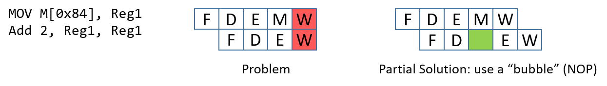
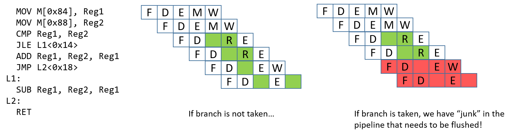
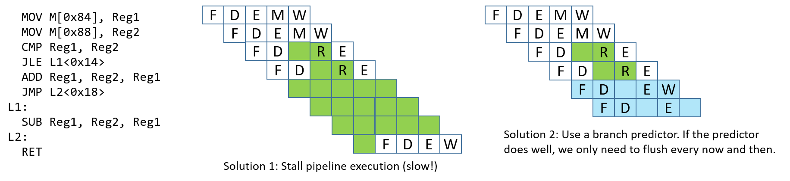

## 5.8. Các vấn đề nâng cao trong thực thi lệnh kiểu pipeline

Hãy nhớ rằng [pipelining](pipelining.html#_pipelining_making_the_cpu_faster) giúp cải thiện hiệu năng của bộ xử lý bằng cách chồng lấn quá trình thực thi của nhiều lệnh. Trong [phần thảo luận trước](pipelining.html#_pipelining_making_the_cpu_faster) về pipelining, ta đã mô tả một pipeline đơn giản gồm bốn giai đoạn cơ bản: Fetch (F), Decode (D), Execute (E) và WriteBack (W). Trong phần thảo luận tiếp theo, ta sẽ bổ sung thêm giai đoạn thứ năm là Memory (M), đại diện cho việc truy cập bộ nhớ dữ liệu. Do đó, pipeline năm giai đoạn của chúng ta bao gồm:

- **Fetch (F):** đọc một lệnh từ bộ nhớ (được chỉ định bởi program counter).
- **Decode (D):** đọc các thanh ghi nguồn và thiết lập logic điều khiển.
- **Execute (E):** thực thi lệnh.
- **Memory (M):** đọc hoặc ghi dữ liệu từ/đến bộ nhớ.
- **WriteBack (W):** ghi kết quả vào thanh ghi đích.

Hãy nhớ rằng trình biên dịch sẽ chuyển các dòng mã nguồn thành chuỗi lệnh mã máy để CPU thực thi. Mã assembly là phiên bản dễ đọc của mã máy. Đoạn mã dưới đây minh họa một chuỗi lệnh assembly giả định:

```asm
MOV M[0x84], Reg1     # chuyển giá trị tại địa chỉ bộ nhớ 0x84 vào thanh ghi Reg1
ADD 2, Reg1, Reg1     # cộng 2 vào giá trị trong Reg1 và lưu kết quả vào Reg1
MOV 4, Reg2           # sao chép giá trị 4 vào thanh ghi Reg2
ADD Reg2, Reg2, Reg2  # tính Reg2 + Reg2, lưu kết quả vào Reg2
JMP L1<0x14>          # nhảy đến đoạn mã tại L1 (địa chỉ mã 0x14)
```

Đừng lo nếu bạn chưa hiểu rõ đoạn mã trên — ta sẽ tìm hiểu chi tiết về assembly trong [các chương sau](../C7-x86_64/index.html#_assembly_chapter). Hiện tại, bạn chỉ cần nắm các điểm sau:

- Mỗi ISA định nghĩa một tập hợp lệnh.
- Mỗi lệnh hoạt động trên một hoặc nhiều toán hạng (ví dụ: thanh ghi, bộ nhớ hoặc hằng số).
- Không phải lệnh nào cũng cần cùng số giai đoạn pipeline để thực thi.

Trong phần thảo luận trước, ta giả định rằng mọi lệnh đều mất cùng số chu kỳ để thực thi; tuy nhiên, thực tế không phải vậy. Ví dụ, lệnh `MOV` đầu tiên cần cả năm giai đoạn vì nó di chuyển dữ liệu từ bộ nhớ vào thanh ghi. Ngược lại, ba lệnh tiếp theo chỉ cần bốn giai đoạn (F, D, E, W) vì chúng chỉ thao tác trên thanh ghi, không truy cập bộ nhớ. Lệnh cuối cùng (`JMP`) là một loại lệnh *nhảy* hoặc *rẽ nhánh có điều kiện*. Mục đích của nó là chuyển luồng điều khiển sang một phần khác của mã. Cụ thể, các địa chỉ trong vùng mã của bộ nhớ tham chiếu đến các *lệnh* khác trong tệp thực thi. Vì lệnh `JMP` không cập nhật thanh ghi đa dụng nào, giai đoạn WriteBack được bỏ qua, nên chỉ cần ba giai đoạn (F, D, E). Ta sẽ tìm hiểu chi tiết về lệnh điều kiện trong [các chương sau](../C7-x86_64/conditional_control_loops.html#_conditional_control_and_loops) về assembly.

Một **pipeline stall** (đình trệ pipeline) xảy ra khi một lệnh buộc phải chờ lệnh khác hoàn tất trước khi có thể tiếp tục. Trình biên dịch và bộ xử lý sẽ cố gắng hết sức để tránh các pipeline stall nhằm tối đa hóa hiệu năng.

### 5.8.1. Vấn đề trong pipeline: Data Hazards

**Data hazard** (xung đột dữ liệu) xảy ra khi hai lệnh cố gắng truy cập cùng một dữ liệu trong pipeline. Ví dụ, hãy xem cặp lệnh đầu tiên trong đoạn mã ở trên:

```asm
MOV M[0x84], Reg1     # chuyển giá trị tại địa chỉ bộ nhớ 0x84 vào thanh ghi Reg1
ADD 2, Reg1, Reg1     # cộng 2 vào giá trị trong Reg1 và lưu kết quả vào Reg1
```



**Hình 1. Ví dụ về xung đột pipeline khi hai lệnh đồng thời đến cùng một giai đoạn.**

Lệnh `MOV` cần năm giai đoạn (vì có truy cập bộ nhớ), trong khi lệnh `ADD` chỉ cần bốn. Trong trường hợp này, cả hai lệnh sẽ cố gắng ghi vào thanh ghi `Reg1` cùng lúc (xem Hình 1).

Bộ xử lý ngăn tình huống này bằng cách buộc mọi lệnh đều phải đi qua năm giai đoạn pipeline. Với các lệnh vốn chỉ cần ít hơn năm giai đoạn, CPU sẽ thêm một lệnh “không thao tác” (`NOP`) — còn gọi là “bubble” trong pipeline — để thay thế cho giai đoạn bị thiếu.

Tuy nhiên, vấn đề vẫn chưa được giải quyết hoàn toàn. Vì mục tiêu của lệnh thứ hai là cộng `2` vào giá trị trong `Reg1`, nên lệnh `MOV` cần hoàn tất việc *ghi* vào `Reg1` trước khi lệnh `ADD` có thể thực thi chính xác. Một vấn đề tương tự cũng xảy ra với hai lệnh tiếp theo:

```asm
MOV 4, Reg2           # sao chép giá trị 4 vào thanh ghi Reg2
ADD Reg2, Reg2, Reg2  # tính Reg2 + Reg2, lưu kết quả vào Reg2
```


**Hình 2. Bộ xử lý có thể giảm thiệt hại do xung đột pipeline bằng cách chuyển tiếp toán hạng giữa các lệnh.**

Hai lệnh này nạp giá trị `4` vào thanh ghi `Reg2`, sau đó nhân đôi nó (bằng cách cộng với chính nó). Một lần nữa, các bubble được thêm vào để đảm bảo mỗi lệnh đi qua đủ năm giai đoạn. Tuy nhiên, trong trường hợp này, giai đoạn thực thi của lệnh thứ hai xảy ra *trước* khi lệnh đầu tiên hoàn tất việc ghi giá trị `4` vào `Reg2`.

Việc thêm nhiều bubble là một giải pháp không tối ưu, vì nó làm pipeline bị đình trệ. Thay vào đó, bộ xử lý sử dụng kỹ thuật gọi là **operand forwarding** ("chuyển tiếp toán hạng"), trong đó pipeline sẽ đọc kết quả từ phép toán trước đó. Nhìn vào Hình 2, khi lệnh `MOV 4, Reg2` đang thực thi, nó sẽ chuyển tiếp kết quả cho lệnh `ADD Reg2, Reg2, Reg2`. Như vậy, trong khi lệnh `MOV` đang ghi vào `Reg2`, lệnh `ADD` vẫn có thể sử dụng giá trị mới của `Reg2` mà nó nhận được từ lệnh `MOV`.


### 5.8.2. Các vấn đề trong pipeline: Control Hazards

Pipeline được tối ưu hóa cho các lệnh xảy ra liên tiếp. Tuy nhiên, sự thay đổi luồng điều khiển trong chương trình — phát sinh từ các cấu trúc điều kiện như câu lệnh `if` hoặc vòng lặp — có thể ảnh hưởng nghiêm trọng đến hiệu năng của pipeline. Hãy cùng xem một đoạn mã ví dụ khác, viết bằng C:

```c
int result = *x; // x là con trỏ đến một số nguyên
int temp = *y;   // y là con trỏ đến một số nguyên khác

if (result <= temp) {
    result = result - temp;
}
else {
    result = result + temp;
}
return result;
```

Đoạn mã này đơn giản chỉ đọc dữ liệu kiểu số nguyên từ hai con trỏ khác nhau, so sánh giá trị, rồi thực hiện phép toán khác nhau tùy theo kết quả. Dưới đây là cách đoạn mã trên có thể được chuyển thành lệnh assembly:

```asm
MOV M[0x84], Reg1     # chuyển giá trị tại địa chỉ bộ nhớ 0x84 vào thanh ghi Reg1
MOV M[0x88], Reg2     # chuyển giá trị tại địa chỉ bộ nhớ 0x88 vào thanh ghi Reg2
CMP Reg1, Reg2        # so sánh giá trị trong Reg1 với Reg2
JLE L1<0x14>          # nhảy đến L1 nếu Reg1 nhỏ hơn hoặc bằng Reg2
ADD Reg1, Reg2, Reg1  # tính Reg1 + Reg2, lưu kết quả vào Reg1
JMP L2<0x20>          # nhảy đến L2 (địa chỉ mã 0x20)
L1:
SUB Reg1, Reg2, Reg1  # tính Reg1 - Reg2, lưu kết quả vào Reg1
L2:
RET                   # trả về từ hàm
```

Chuỗi lệnh này nạp dữ liệu từ bộ nhớ vào hai thanh ghi riêng biệt, so sánh giá trị, rồi thực hiện phép toán khác nhau tùy theo việc giá trị trong thanh ghi đầu tiên có nhỏ hơn giá trị trong thanh ghi thứ hai hay không. Câu lệnh `if` trong ví dụ trên được biểu diễn bằng hai lệnh: lệnh so sánh (`CMP`) và lệnh nhảy có điều kiện nhỏ hơn hoặc bằng (`JLE`). Ta sẽ tìm hiểu chi tiết hơn về các lệnh điều kiện trong [các chương assembly sau](../C7-x86_64/conditional_control_loops.html#_conditional_control_and_loops); hiện tại bạn chỉ cần hiểu rằng lệnh `CMP` dùng để *so sánh* hai thanh ghi, còn lệnh `JLE` là một loại lệnh nhánh đặc biệt, chuyển luồng thực thi sang phần khác của chương trình *chỉ khi* điều kiện (trong trường hợp này là “nhỏ hơn hoặc bằng”) đúng.

> Nhìn vào assembly lần đầu có thể khiến bạn thấy choáng ngợp — điều đó hoàn toàn bình thường!  
> Nếu bạn cảm thấy như vậy, đừng lo lắng. Ta sẽ tìm hiểu chi tiết về assembly trong [các chương sau](../C7-x86_64/index.html#_assembly_chapter).  
> Điều quan trọng cần ghi nhớ là: mã chứa câu lệnh điều kiện cũng được dịch thành chuỗi lệnh assembly giống như bất kỳ đoạn mã nào khác.  
> Tuy nhiên, khác với các đoạn mã khác, câu lệnh điều kiện *không* đảm bảo sẽ thực thi theo một cách cụ thể.  
> Sự không chắc chắn trong cách thực thi của câu lệnh điều kiện có ảnh hưởng lớn đến pipeline.



**Hình 3. Ví dụ về control hazard phát sinh từ một lệnh nhánh có điều kiện.**

**Control hazard** (xung đột điều khiển) xảy ra khi pipeline gặp một lệnh nhánh (hoặc điều kiện). Khi điều này xảy ra, pipeline phải “đoán” xem nhánh có được thực hiện hay không. Nếu nhánh không được thực hiện, quá trình sẽ tiếp tục thực thi các lệnh tiếp theo trong chuỗi. Hãy xem ví dụ trong Hình 3. Nếu nhánh được thực hiện, lệnh tiếp theo cần thực thi sẽ là `SUB`. Tuy nhiên, ta không thể biết liệu nhánh có được thực hiện hay không cho đến khi lệnh `JLE` hoàn tất. Tại thời điểm đó, các lệnh `ADD` và `JMP` đã được nạp vào pipeline. Nếu nhánh *được* thực hiện, các lệnh “rác” này trong pipeline cần được loại bỏ — hay còn gọi là **flush** — trước khi pipeline có thể được nạp lại với các lệnh mới. Việc flush pipeline là rất tốn kém.

Có một số giải pháp mà các kỹ sư phần cứng có thể lựa chọn để giúp bộ xử lý xử lý control hazard:

- **Stall pipeline**: Là giải pháp đơn giản nhất — mỗi khi gặp lệnh nhánh, thêm nhiều lệnh `NOP` (bubble) và tạm dừng pipeline cho đến khi bộ xử lý chắc chắn nhánh có được thực hiện hay không. Mặc dù cách này giải quyết được vấn đề, nhưng nó gây ảnh hưởng lớn đến hiệu năng (xem Hình 4).

- **Branch prediction**: Giải pháp phổ biến nhất là sử dụng **branch predictor** (bộ dự đoán nhánh), dự đoán hướng đi của nhánh dựa trên các lần thực thi trước đó. Các bộ dự đoán nhánh hiện đại rất chính xác. Tuy nhiên, cách tiếp cận này gần đây đã gây ra một số lỗ hổng bảo mật (ví dụ: Spectre[^1]). Hình 4 minh họa cách bộ dự đoán nhánh xử lý control hazard.

- **Eager execution**: Trong eager execution, CPU sẽ thực thi cả hai nhánh và thực hiện chuyển dữ liệu có điều kiện thay vì chuyển luồng điều khiển (được triển khai thông qua lệnh `cmov` trong x86 và `csel` trong ARMv8-A). Việc chuyển dữ liệu có điều kiện cho phép bộ xử lý tiếp tục thực thi mà không làm gián đoạn pipeline. Tuy nhiên, không phải đoạn mã nào cũng có thể tận dụng eager execution, và nó có thể nguy hiểm trong trường hợp truy cập con trỏ hoặc có hiệu ứng phụ.



**Hình 4. Các giải pháp tiềm năng để xử lý control hazard.**

### References


1.  Peter Bright. [Google: Software is never going to be able to fix
    Spectre-type
    bugs](https://arstechnica.com/gadgets/2019/02/google-software-is-never-going-to-be-able-to-fix-spectre-type-bugs/)
    *Ars Technica* 2019.


