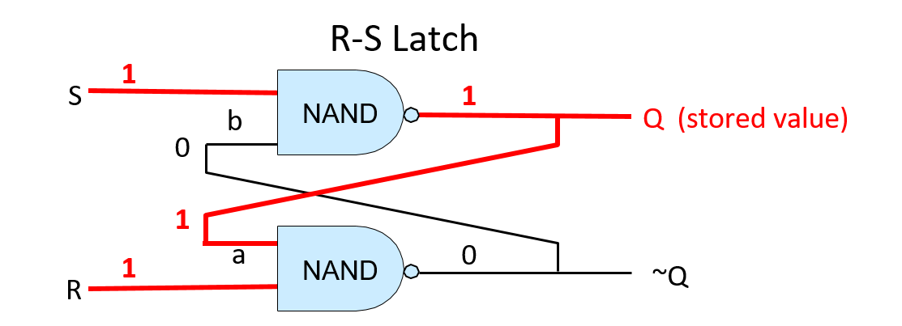
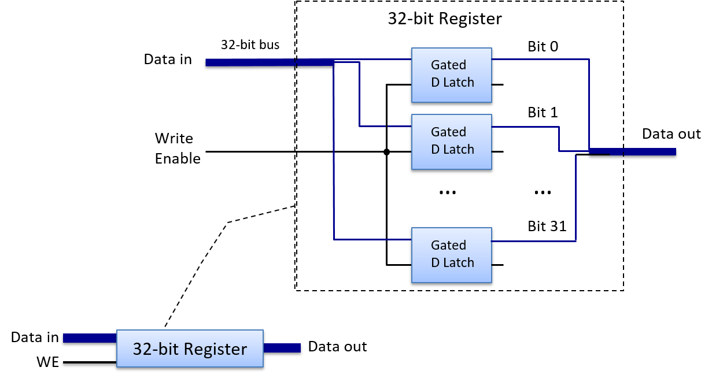

Dưới đây là bản dịch tiếng Việt của mục **5.4.3. Storage Circuits**, tuân thủ đầy đủ các quy tắc bạn đã đề ra:

---

### 5.4.3. Mạch lưu trữ (Storage Circuits)

**Storage circuits** (mạch lưu trữ) được sử dụng để xây dựng bộ nhớ máy tính nhằm lưu trữ các giá trị nhị phân. Loại bộ nhớ máy tính được xây dựng từ các mạch lưu trữ này được gọi là **static RAM** (SRAM – "RAM tĩnh"). SRAM được dùng để xây dựng bộ lưu trữ thanh ghi của CPU và bộ nhớ đệm (cache) trên chip. Các hệ thống thường sử dụng **dynamic RAM** (DRAM – "RAM động") cho bộ nhớ chính (RAM). Thiết kế dựa trên tụ điện của DRAM yêu cầu phải được làm mới định kỳ với giá trị mà nó lưu trữ, do đó có tên gọi “động”. SRAM là bộ lưu trữ dựa trên mạch, không cần làm mới giá trị, vì vậy được gọi là RAM tĩnh. Bộ nhớ dựa trên mạch nhanh hơn nhưng đắt hơn bộ nhớ dựa trên tụ điện. Do đó, SRAM thường được sử dụng cho các tầng cao trong [hệ phân cấp bộ nhớ](../C11-MemHierarchy/mem_hierarchy.html#_the_memory_hierarchy) (các thanh ghi CPU và bộ nhớ đệm trên chip), còn DRAM được dùng cho bộ nhớ chính (RAM). Trong chương này, ta sẽ tập trung vào bộ nhớ dựa trên mạch như SRAM.

Để lưu trữ một giá trị, mạch phải có vòng phản hồi (feedback loop) để giữ lại giá trị đó. Nói cách khác, giá trị của mạch lưu trữ phụ thuộc vào các giá trị đầu vào và cả giá trị hiện đang được lưu trữ. Khi mạch lưu trữ một giá trị, giá trị hiện tại và các đầu vào của nó cùng tạo ra đầu ra khớp với giá trị đang lưu (tức là mạch tiếp tục lưu cùng một giá trị). Khi một giá trị mới được ghi vào mạch lưu trữ, các đầu vào của mạch sẽ thay đổi tạm thời để điều chỉnh hành vi của mạch, dẫn đến việc ghi và lưu trữ giá trị mới. Sau khi ghi xong, mạch sẽ trở lại trạng thái ổn định để lưu giá trị mới cho đến khi có lần ghi tiếp theo.

---

#### RS Latch

Một latch là một mạch số dùng để lưu trữ (hoặc ghi nhớ) một giá trị 1-bit. Một ví dụ là **reset-set latch** (RS latch – "mạch chốt đặt–xóa"). RS latch có hai đầu vào, S và R, và một đầu ra Q, cũng chính là giá trị được lưu trong latch. RS latch cũng có thể xuất ra NOT(Q), tức là phủ định của giá trị đang lưu. Hình 1 minh họa một mạch RS latch dùng để lưu trữ một bit.

**Hình 1. Mạch RS latch lưu trữ một giá trị 1-bit.**

Điểm đầu tiên cần lưu ý về RS latch là vòng phản hồi từ đầu ra về đầu vào: đầu ra của cổng NAND phía trên (Q) là đầu vào (a) của cổng NAND phía dưới, và đầu ra của cổng NAND phía dưới (~Q) là đầu vào (b) của cổng NAND phía trên. Khi cả hai đầu vào S và R đều bằng 1, RS latch sẽ lưu giá trị Q. Nói cách khác, khi S và R đều bằng 1, giá trị đầu ra Q của RS latch sẽ ổn định. Để thấy rõ hành vi này, hãy xem Hình 2; hình này minh họa một RS latch đang lưu giá trị 1 (Q = 1). Khi R và S đều bằng 1, giá trị phản hồi đầu vào (a) của cổng NAND phía dưới là giá trị Q, tức là 1, nên đầu ra của cổng NAND phía dưới là 0 (1 NAND 1 = 0). Giá trị phản hồi đầu vào (b) của cổng NAND phía trên là đầu ra của cổng NAND phía dưới, tức là 0. Đầu vào còn lại của cổng NAND phía trên là 1, tức là giá trị của S. Đầu ra của cổng phía trên là 1 (1 NAND 0 = 1). Do đó, khi S và R đều bằng 1, mạch này liên tục lưu giá trị Q (trong ví dụ này là 1).

**Hình 2. Một RS latch lưu trữ giá trị 1-bit.**  
R và S đều bằng 1 khi latch lưu một giá trị. Giá trị được lưu sẽ xuất ra tại Q.

Để thay đổi giá trị được lưu trong RS latch, ta đặt đúng một trong hai đầu vào R hoặc S bằng 0. Khi latch lưu giá trị mới, R và S sẽ được đặt lại về 1. Mạch điều khiển bao quanh RS latch đảm bảo rằng R và S không bao giờ đồng thời bằng 0: tối đa chỉ một trong hai có giá trị 0, và việc một trong hai đầu vào bằng 0 nghĩa là đang ghi một giá trị mới vào RS latch. Để lưu giá trị 0 vào RS latch, ta đặt đầu vào R bằng 0 (giá trị của S giữ nguyên bằng 1). Để lưu giá trị 1, ta đặt đầu vào S bằng 0 (giá trị của R giữ nguyên bằng 1).

Ví dụ, giả sử RS latch hiện đang lưu giá trị 1. Để ghi giá trị 0 vào latch, ta đặt R bằng 0. Điều này có nghĩa là các giá trị 0 và 1 được đưa vào cổng NAND phía dưới, tính toán (0 NAND 1) cho kết quả là 1. Giá trị đầu ra này (1) cũng là đầu vào b của cổng NAND phía trên (xem Hình 3B). Với đầu vào b mới là 1 và đầu vào S là 1, cổng NAND phía trên tính toán đầu ra mới là 0 cho Q, giá trị này cũng được đưa làm đầu vào a cho cổng NAND phía dưới (xem [Hình 3](#Figwrite0)C). Với a = 0 và b = 1, latch giờ lưu giá trị 0. Khi R được đặt lại bằng 1, RS latch tiếp tục lưu giá trị 0 (xem Hình 3D).

**Hình 3. Để ghi giá trị 0 vào RS latch, tạm thời đặt R bằng 0.**

---

#### Gated D Latch

**Gated D latch** là một phiên bản mở rộng của RS latch, bổ sung mạch điều khiển để đảm bảo rằng R và S không bao giờ đồng thời nhận giá trị 0. [Hình 4](#FiggatedD) minh họa cấu trúc của một gated D latch.

**Hình 4. Gated D latch lưu trữ một giá trị 1-bit.**  
Cặp cổng NAND đầu tiên điều khiển việc ghi vào RS latch và đảm bảo rằng R và S không bao giờ đồng thời bằng 0.

Đầu vào dữ liệu (D) của gated D latch là giá trị cần lưu vào mạch (0 hoặc 1). Đầu vào Write Enable (WE) điều khiển việc ghi giá trị vào RS latch. Khi WE = 0, đầu ra của cả hai cổng NAND đều là 1, dẫn đến đầu vào S và R của RS latch đều bằng 1 (RS latch giữ nguyên giá trị đang lưu). Gated D latch chỉ ghi giá trị D vào RS latch khi WE = 1.

Vì giá trị D được đảo trước khi đưa vào cổng NAND phía dưới, nên chỉ một trong hai cổng NAND (trên hoặc dưới) có đầu vào là 1. Điều này đảm bảo rằng khi WE = 1, chính xác một trong hai đầu vào R hoặc S sẽ bằng 0. Ví dụ, khi D = 1 và WE = 1, cổng NAND phía trên tính (1 NAND 1), cổng phía dưới tính (0 NAND 1). Kết quả là đầu vào S từ cổng NAND phía trên bằng 0, đầu vào R từ cổng NAND phía dưới bằng 1 — tức là ghi giá trị 1 vào RS latch.

Khi WE = 0, cả hai cổng NAND đều xuất ra 1, giữ R và S ở mức 1. Nói cách khác, khi WE = 0, giá trị D không ảnh hưởng đến giá trị đang lưu trong RS latch; chỉ khi WE = 1 thì giá trị D mới được ghi vào latch. Để ghi một giá trị khác vào gated D latch, ta đặt D bằng giá trị cần lưu và WE bằng 1.

---

#### CPU Register

Mạch lưu trữ nhiều bit được xây dựng bằng cách liên kết nhiều mạch lưu trữ 1-bit lại với nhau. Ví dụ, kết hợp 32 latch D 1-bit sẽ tạo thành một mạch lưu trữ 32-bit, có thể dùng làm thanh ghi CPU 32-bit như minh họa trong Hình 5.

Mạch thanh ghi có hai đầu vào: một giá trị dữ liệu 32-bit và một tín hiệu Write Enable 1-bit. Bên trong, mỗi latch D 1-bit nhận một bit từ đầu vào *Data in* 32-bit của thanh ghi làm đầu vào D, và nhận tín hiệu WE của thanh ghi làm đầu vào WE. Đầu ra của thanh ghi là giá trị 32-bit được lưu trong 32 latch D 1-bit cấu thành mạch thanh ghi.

**Hình 5. Một thanh ghi CPU được xây dựng từ nhiều gated D latch (32 latch cho thanh ghi 32-bit).**  
Khi đầu vào WE bằng 1, dữ liệu đầu vào sẽ được ghi vào thanh ghi. Đầu ra dữ liệu là giá trị đang được lưu.