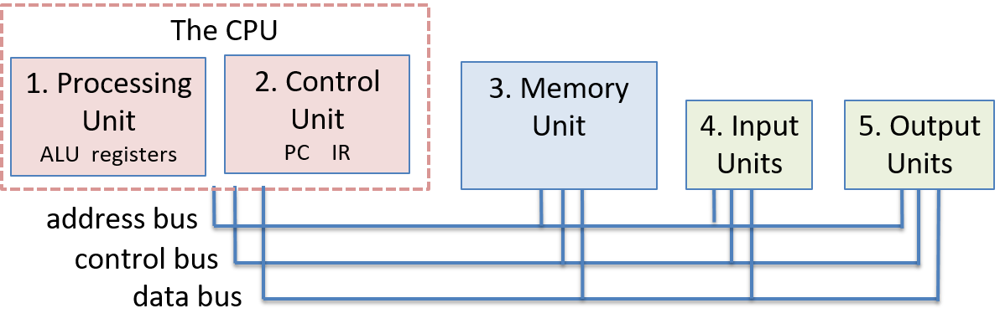
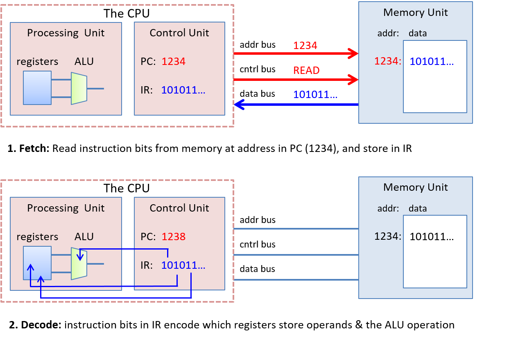
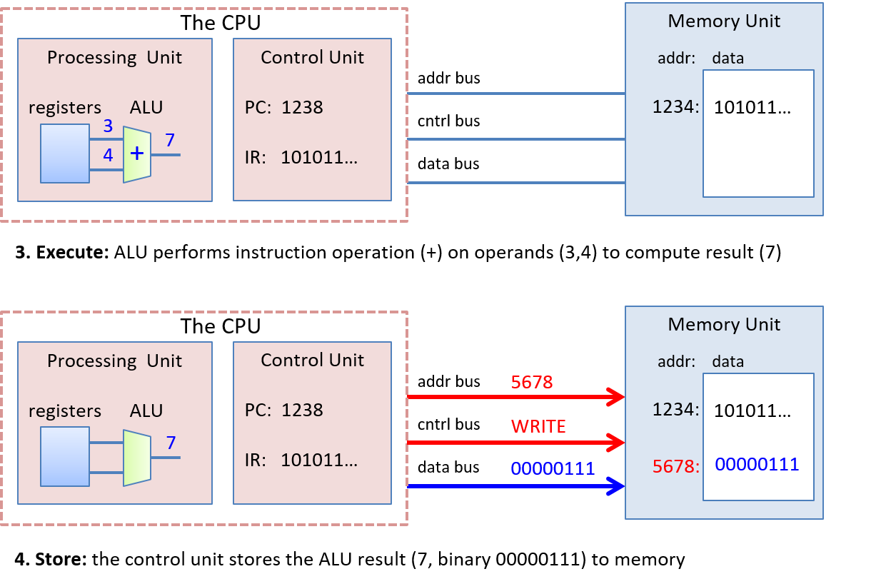

## 5.2. Kiến trúc von Neumann

Kiến trúc von Neumann là nền tảng của hầu hết các máy tính hiện đại. Trong phần này, chúng ta sẽ mô tả ngắn gọn các thành phần chính của kiến trúc này.

Kiến trúc von Neumann (minh họa trong Hình 1) bao gồm năm thành phần chính:

1. **Processing unit** (đơn vị xử lý): thực thi các lệnh chương trình.

2. **Control unit** (đơn vị điều khiển): điều phối việc thực thi lệnh chương trình trên đơn vị xử lý. Hai đơn vị này kết hợp lại tạo thành CPU.

3. **Memory unit** (đơn vị bộ nhớ): lưu trữ dữ liệu và lệnh chương trình.

4. **Input unit(s)** (đơn vị vào): nạp dữ liệu và lệnh chương trình vào máy tính, khởi động quá trình thực thi chương trình.

5. **Output unit(s)** (đơn vị ra): lưu trữ hoặc nhận kết quả chương trình.

Các đơn vị được kết nối với nhau thông qua các bus, dùng để truyền thông tin điều khiển và dữ liệu giữa các đơn vị. Một **bus** là kênh truyền thông dùng để chuyển các giá trị nhị phân giữa các điểm đầu cuối truyền thông (bên gửi và bên nhận). Ví dụ, một data bus kết nối đơn vị bộ nhớ và CPU có thể được triển khai dưới dạng 32 dây song song, cùng nhau truyền một giá trị 4 byte, mỗi dây truyền 1 bit. Thông thường, kiến trúc máy tính có các bus riêng biệt để truyền dữ liệu, địa chỉ bộ nhớ và tín hiệu điều khiển giữa các đơn vị. Các đơn vị sử dụng control bus để gửi tín hiệu điều khiển nhằm yêu cầu hoặc thông báo hành động cho đơn vị khác, sử dụng address bus để gửi địa chỉ bộ nhớ của yêu cầu đọc hoặc ghi đến đơn vị bộ nhớ, và sử dụng data bus để truyền dữ liệu giữa các đơn vị.

**Hình 1. Kiến trúc von Neumann bao gồm các đơn vị xử lý, điều khiển, bộ nhớ, vào và ra.**  
Đơn vị điều khiển và đơn vị xử lý tạo thành CPU, bao gồm ALU, các thanh ghi đa dụng của CPU, và một số thanh ghi chuyên dụng (IR và PC). Các đơn vị được kết nối với nhau bằng các bus dùng để truyền dữ liệu và giao tiếp giữa các đơn vị.

### 5.2.1. CPU

Đơn vị điều khiển và đơn vị xử lý cùng nhau triển khai CPU — phần của máy tính thực thi các lệnh chương trình trên dữ liệu chương trình.

### 5.2.2. Đơn vị xử lý (Processing Unit)

**Processing unit** của máy von Neumann gồm hai phần. Phần đầu tiên là **arithmetic/logic unit** (ALU – "đơn vị số học/logic"), thực hiện các phép toán như cộng, trừ, hoặc logic, v.v. Các ALU hiện đại thường thực hiện được một tập hợp lớn các phép toán số học. Phần thứ hai của đơn vị xử lý là tập hợp các thanh ghi. Một **register** (thanh ghi) là một đơn vị lưu trữ nhỏ và nhanh, dùng để giữ dữ liệu chương trình và các lệnh đang được ALU thực thi.

Điểm quan trọng là trong kiến trúc von Neumann, không có sự phân biệt giữa lệnh và dữ liệu. Về mặt bản chất, lệnh *chính là* dữ liệu. Do đó, mỗi thanh ghi có thể lưu một từ dữ liệu (data word).

### 5.2.3. Đơn vị điều khiển (Control Unit)

**Control unit** điều phối việc thực thi các lệnh chương trình bằng cách nạp chúng từ bộ nhớ và truyền toán hạng cùng phép toán đến đơn vị xử lý. Đơn vị điều khiển cũng bao gồm một số phần lưu trữ để theo dõi trạng thái thực thi và xác định hành động tiếp theo cần thực hiện:

- **Program counter** (PC – "bộ đếm chương trình"): lưu địa chỉ bộ nhớ của lệnh tiếp theo cần thực thi.
- **Instruction register** (IR – "thanh ghi lệnh"): lưu lệnh được nạp từ bộ nhớ, đang được thực thi.

### 5.2.4. Đơn vị bộ nhớ (Memory Unit)

Bộ nhớ trong là một cải tiến quan trọng của kiến trúc von Neumann. Nó cung cấp khả năng lưu trữ dữ liệu chương trình gần với đơn vị xử lý, giúp giảm đáng kể thời gian thực hiện tính toán. **Memory unit** lưu trữ cả dữ liệu chương trình và lệnh chương trình — việc lưu trữ lệnh chương trình là một phần cốt lõi của mô hình chương trình lưu trữ (stored-program model) trong kiến trúc von Neumann.

Dung lượng bộ nhớ thay đổi tùy theo hệ thống. Tuy nhiên, ISA của hệ thống sẽ giới hạn phạm vi địa chỉ mà nó có thể biểu diễn. Trong các hệ thống hiện đại, đơn vị nhỏ nhất có thể định địa chỉ trong bộ nhớ là một byte (8 bit), do đó mỗi địa chỉ tương ứng với một vị trí bộ nhớ duy nhất lưu một byte. Vì vậy, các kiến trúc 32-bit thường hỗ trợ không gian địa chỉ tối đa là 2³², tương ứng với 4 gigabyte (GiB) bộ nhớ có thể định địa chỉ.

Thuật ngữ **memory** đôi khi được dùng để chỉ toàn bộ hệ phân cấp lưu trữ trong hệ thống. Nó có thể bao gồm các thanh ghi trong đơn vị xử lý cũng như các thiết bị lưu trữ thứ cấp như ổ cứng HDD hoặc ổ SSD. Trong [Chương Bộ nhớ và Hệ phân cấp lưu trữ](../C11-MemHierarchy/index.html#_storage_and_the_memory_hierarchy), ta sẽ thảo luận chi tiết về hệ phân cấp bộ nhớ. Hiện tại, ta sử dụng thuật ngữ "memory" để chỉ bộ nhớ trong **random access memory** (RAM – "bộ nhớ truy cập ngẫu nhiên") — loại bộ nhớ có thể được truy cập trực tiếp bởi CPU. RAM được gọi là truy cập ngẫu nhiên vì mọi vị trí lưu trữ trong RAM (địa chỉ) đều có thể được truy cập trực tiếp. Có thể hình dung RAM như một mảng tuyến tính các địa chỉ, trong đó mỗi địa chỉ tương ứng với một byte bộ nhớ.

> Kích thước từ qua các thời kỳ  
> **Word size** (kích thước từ), được định nghĩa bởi ISA, là số bit của kích thước dữ liệu chuẩn mà bộ xử lý xử lý như một đơn vị duy nhất. Kích thước từ chuẩn đã thay đổi theo thời gian. Với EDVAC, kích thước từ được đề xuất là 30 bit. Trong thập niên 1950, kích thước từ 36 bit khá phổ biến. Với sự ra đời của IBM 360 vào thập niên 1960, kích thước từ bắt đầu được chuẩn hóa, và dần mở rộng từ 16 bit, đến 32 bit, và đến 64 bit như ngày nay. Nếu bạn xem xét kiến trúc Intel kỹ hơn, bạn có thể nhận thấy dấu vết của một số quyết định cũ, vì kiến trúc 32-bit và 64-bit được thêm vào như phần mở rộng của kiến trúc gốc 16-bit.

### 5.2.5. Đơn vị vào/ra (Input and Output – I/O Units)

Trong khi các đơn vị điều khiển, xử lý và bộ nhớ tạo thành nền tảng của máy tính, thì các đơn vị vào và ra cho phép máy tính tương tác với thế giới bên ngoài. Cụ thể, chúng cung cấp cơ chế để nạp lệnh và dữ liệu chương trình vào bộ nhớ, lưu dữ liệu ra bên ngoài bộ nhớ, và hiển thị kết quả cho người dùng.

**Input unit** (đơn vị vào) bao gồm tập hợp các thiết bị cho phép người dùng hoặc chương trình đưa dữ liệu từ thế giới bên ngoài vào máy tính. Các thiết bị vào phổ biến nhất hiện nay là bàn phím và chuột. Camera và micro cũng là những ví dụ khác.

**Output unit** (đơn vị ra) bao gồm tập hợp các thiết bị truyền kết quả tính toán từ máy tính ra thế giới bên ngoài hoặc lưu kết quả ra ngoài bộ nhớ trong. Ví dụ, màn hình là một thiết bị ra phổ biến. Các thiết bị ra khác bao gồm loa và thiết bị phản hồi xúc giác (haptics).

Một số thiết bị hiện đại, như màn hình cảm ứng, hoạt động như cả thiết bị vào và ra, cho phép người dùng vừa nhập dữ liệu vừa nhận phản hồi từ cùng một thiết bị tích hợp.

Ổ cứng thể rắn (SSD) và ổ cứng cơ học (HDD) cũng là ví dụ về thiết bị vừa vào vừa ra. Các thiết bị lưu trữ này hoạt động như thiết bị vào khi lưu trữ các tệp thực thi chương trình mà hệ điều hành nạp vào bộ nhớ để chạy, và hoạt động như thiết bị ra khi lưu trữ các tệp chứa kết quả chương trình.

### 5.2.6. Máy von Neumann hoạt động: Thực thi một chương trình

Năm đơn vị cấu thành kiến trúc von Neumann phối hợp với nhau để triển khai chu trình **fetch–decode–execute–store** (nạp–giải mã–thực thi–lưu trữ) nhằm thực thi các lệnh chương trình. Chu trình này bắt đầu với lệnh đầu tiên của chương trình và lặp lại cho đến khi chương trình kết thúc:

1. **Đơn vị điều khiển *nạp* lệnh tiếp theo từ bộ nhớ**.  
   Đơn vị điều khiển có một thanh ghi đặc biệt gọi là program counter (PC – "bộ đếm chương trình"), chứa địa chỉ của lệnh tiếp theo cần nạp. Nó đặt địa chỉ này lên *address bus* và gửi lệnh *read* lên *control bus* đến đơn vị bộ nhớ. Đơn vị bộ nhớ đọc các byte tại địa chỉ được chỉ định và gửi chúng đến đơn vị điều khiển qua *data bus*. Instruction register (IR – "thanh ghi lệnh") lưu các byte của lệnh nhận được từ đơn vị bộ nhớ. Đơn vị điều khiển cũng tăng giá trị của PC để lưu địa chỉ của lệnh tiếp theo cần nạp.

2. **Đơn vị điều khiển *giải mã* lệnh được lưu trong IR**.  
   Nó giải mã các bit lệnh để xác định phép toán cần thực hiện và vị trí của các toán hạng. Các bit lệnh được giải mã dựa trên định nghĩa mã hóa của ISA. Đơn vị điều khiển cũng nạp giá trị toán hạng từ các vị trí của chúng (từ thanh ghi CPU, bộ nhớ, hoặc được mã hóa trong lệnh), làm đầu vào cho đơn vị xử lý.

3. **Đơn vị xử lý *thực thi* lệnh**.  
   ALU thực hiện phép toán của lệnh trên các toán hạng dữ liệu.

4. **Đơn vị điều khiển *lưu trữ* kết quả vào bộ nhớ**.  
   Kết quả của việc thực thi lệnh bởi đơn vị xử lý được lưu vào bộ nhớ. Đơn vị điều khiển ghi kết quả vào bộ nhớ bằng cách đặt giá trị kết quả lên *data bus*, đặt địa chỉ vị trí lưu trữ lên *address bus*, và gửi lệnh *write* lên *control bus*. Khi nhận được, đơn vị bộ nhớ ghi giá trị vào địa chỉ bộ nhớ được chỉ định.

Các đơn vị vào và ra không tham gia trực tiếp vào việc thực thi lệnh chương trình. Thay vào đó, chúng hỗ trợ quá trình thực thi bằng cách nạp lệnh và dữ liệu chương trình, và lưu trữ hoặc hiển thị kết quả tính toán của chương trình.

Hình 2 và Hình 3 minh họa bốn pha thực thi lệnh trong kiến trúc von Neumann với ví dụ lệnh cộng, trong đó các toán hạng được lưu trong các thanh ghi CPU. Trong pha *fetch*, đơn vị điều khiển đọc lệnh tại địa chỉ bộ nhớ được lưu trong PC (1234). Nó gửi địa chỉ lên address bus và lệnh READ lên control bus. Đơn vị bộ nhớ nhận yêu cầu, đọc giá trị tại địa chỉ 1234, và gửi đến đơn vị điều khiển qua data bus. Đơn vị điều khiển lưu các byte lệnh vào thanh ghi IR và cập nhật PC với địa chỉ của lệnh tiếp theo (1238 trong ví dụ này).

Trong pha *decode*, đơn vị điều khiển truyền các bit lệnh chỉ định phép toán đến ALU của đơn vị xử lý, và sử dụng các bit lệnh chỉ định thanh ghi chứa toán hạng để đọc giá trị toán hạng từ các thanh ghi vào ALU (giá trị toán hạng là 3 và 4 trong ví dụ này).

Trong pha *execute*, ALU thực hiện phép toán trên các toán hạng để tạo ra kết quả (3 + 4 = 7).

Cuối cùng, trong pha *store*, đơn vị điều khiển ghi kết quả (7) từ đơn vị xử lý vào đơn vị bộ nhớ. Địa chỉ bộ nhớ (5678) được gửi lên address bus, lệnh WRITE được gửi lên control bus, và giá trị dữ liệu cần lưu (7) được gửi lên data bus. Đơn vị bộ nhớ nhận yêu cầu và lưu giá trị 7 vào địa chỉ bộ nhớ 5678. Trong ví dụ này, ta giả định rằng địa chỉ bộ nhớ để lưu kết quả được mã hóa trong các bit của lệnh.

**Hình 2. Các pha nạp và giải mã trong quá trình thực thi lệnh cộng của kiến trúc von Neumann.**  
Toán hạng, kết quả và địa chỉ bộ nhớ được biểu diễn dưới dạng giá trị thập phân, nội dung bộ nhớ được biểu diễn dưới dạng nhị phân.

**Hình 3. Các pha thực thi và lưu trữ trong quá trình thực thi lệnh cộng của kiến trúc von Neumann.**  
Toán hạng, kết quả và địa chỉ bộ nhớ được biểu diễn dưới dạng giá trị thập phân, nội dung bộ nhớ được biểu diễn dưới dạng nhị phân.
