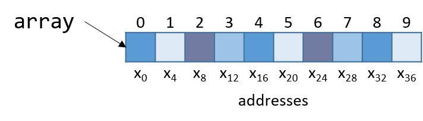

Dưới đây là bản dịch tiếng Việt của đoạn bạn cung cấp, tuân thủ đầy đủ các quy ước đã nêu:

---

## 7.7. Mảng (Arrays)

Hãy nhớ rằng [arrays](../C1-C_intro/arrays_strings.html#_introduction_to_arrays) (mảng) là tập hợp có thứ tự của các phần tử dữ liệu cùng kiểu, được lưu trữ liên tiếp trong bộ nhớ. Các [single-dimension arrays](../C2-C_depth/arrays.html#_single_dimensional_arrays) (mảng một chiều) được cấp phát tĩnh có dạng `Type arr[N]`, trong đó `Type` là kiểu dữ liệu, `arr` là tên định danh của mảng, và `N` là số phần tử dữ liệu. Khai báo mảng tĩnh như `Type arr[N]` hoặc cấp phát động như `arr = malloc(N * sizeof(Type))` sẽ chiếm tổng cộng *N* × sizeof(*Type*) byte bộ nhớ.

Để truy cập phần tử tại chỉ số *i* trong mảng `arr`, sử dụng cú pháp `arr[i]`. **Compiler** thường chuyển đổi các truy cập mảng thành [pointer arithmetic](../C2-C_depth/pointers.html#_pointer_variables) (tính toán con trỏ) trước khi dịch sang assembly. Do đó, `arr + i` tương đương với `&arr[i]`, và `*(arr + i)` tương đương với `arr[i]`. Vì mỗi phần tử trong `arr` có kiểu `Type`, nên `arr + i` ngụ ý rằng phần tử *i* được lưu tại địa chỉ `arr + sizeof(Type) * i`.

**Bảng 1** dưới đây tóm tắt một số thao tác mảng phổ biến và lệnh assembly tương ứng. Trong các ví dụ sau, giả sử ta khai báo một mảng `int` có độ dài 10 (`int arr[10]`). Giả sử thanh ghi `%rdx` lưu địa chỉ của `arr`, thanh ghi `%rcx` lưu giá trị `int` là `i`, và thanh ghi `%rax` biểu diễn một biến `x` (cũng có kiểu `int`). Hãy nhớ rằng biến `int` chiếm 4 byte, trong khi biến `int *` chiếm 8 byte.

| Operation       | Type     | Assembly Representation         |
|-----------------|----------|---------------------------------|
| `x = arr`       | `int *`  | `mov %rdx, %rax`                |
| `x = arr[0]`    | `int`    | `mov (%rdx), %eax`              |
| `x = arr[i]`    | `int`    | `mov (%rdx, %rcx,4), %eax`      |
| `x = &arr[3]`   | `int *`  | `lea 0xc(%rdx), %rax`           |
| `x = arr+3`     | `int *`  | `lea 0xc(%rdx), %rax`           |
| `x = *(arr+5)`  | `int`    | `mov 0x14(%rdx), %eax`          |

**Bảng 1.** Các thao tác mảng phổ biến và lệnh assembly tương ứng.

Hãy chú ý đến *type* (kiểu dữ liệu) của từng biểu thức trong [Bảng 1](#ArrayOps). Nói chung, compiler sử dụng lệnh `mov` để **dereference** (giải tham chiếu) con trỏ và lệnh `lea` để tính toán địa chỉ.

Lưu ý rằng để truy cập phần tử `arr[3]` (hoặc `*(arr+3)` khi dùng pointer arithmetic), compiler thực hiện truy xuất bộ nhớ tại địa chỉ `arr + 3*4` thay vì `arr + 3`. Để hiểu tại sao, hãy nhớ rằng bất kỳ phần tử nào tại chỉ số *i* trong mảng được lưu tại địa chỉ `arr + sizeof(Type) * i`. Do đó, compiler phải nhân chỉ số với kích thước của kiểu dữ liệu (trong trường hợp này là 4, vì `sizeof(int) = 4`) để tính toán đúng **offset** (độ lệch). Cũng cần nhớ rằng bộ nhớ được **byte-addressable** (địa chỉ hóa theo byte); việc dịch chuyển đúng số byte tương đương với việc tính toán địa chỉ. Cuối cùng, vì giá trị `int` chỉ cần 4 byte, nên chúng được lưu trong **component register** `%eax` của thanh ghi `%rax`.

Ví dụ, xét một mảng (`array`) gồm 10 phần tử kiểu `int` (Hình 1):



**Hình 1.** Cách bố trí một mảng 10 số nguyên trong bộ nhớ. Mỗi ô được gắn nhãn x~i~ biểu diễn 4 byte.

Vì `array` là mảng số nguyên, mỗi phần tử chiếm đúng 4 byte. Do đó, một mảng `int` gồm 10 phần tử chiếm 40 byte bộ nhớ liên tiếp.

Để tính địa chỉ của phần tử thứ 3, compiler nhân chỉ số 3 với kích thước dữ liệu của kiểu `int` (4) để được offset là 12 (hay 0xc). Quả thật, phần tử thứ 3 trong Hình 1 nằm tại byte offset x~12~.

Hãy xem một hàm C đơn giản `sumArray` tính tổng tất cả các phần tử trong mảng:

```c
int sumArray(int *array, int length) {
    int i, total = 0;
    for (i = 0; i < length; i++) {
        total += array[i];
    }
    return total;
}
```

Hàm `sumArray` nhận địa chỉ của một mảng và độ dài tương ứng, sau đó cộng dồn tất cả các phần tử trong mảng. Bây giờ, hãy xem đoạn mã assembly tương ứng của hàm `sumArray`:

---

```
0x400686 <+0>:   push %rbp                   # save %rbp
0x400687 <+1>:    mov  %rsp,%rbp              # update %rbp (new stack frame)
0x40068a <+4>:    mov  %rdi,-0x18(%rbp)       # copy array to %rbp-0x18
0x40068e <+8>:    mov  %esi,-0x1c(%rbp)       # copy length to %rbp-0x1c
0x400691 <+11>:   movl $0x0,-0x4(%rbp)        # copy 0 to %rbp-0x4 (total)
0x400698 <+18>:   movl $0x0,-0x8(%rbp)        # copy 0 to %rbp-0x8 (i)
0x40069f <+25>:   jmp  0x4006be <sumArray+56> # goto <sumArray+56>
0x4006a1 <+27>:   mov  -0x8(%rbp),%eax        # copy i to %eax
0x4006a4 <+30>:   cltq                        # convert i to a 64-bit integer
0x4006a6 <+32>:   lea  0x0(,%rax,4),%rdx      # copy i*4 to %rdx
0x4006ae <+40>:   mov  -0x18(%rbp),%rax       # copy array to %rax
0x4006b2 <+44>:   add  %rdx,%rax              # compute array+i*4, store in %rax
0x4006b5 <+47>:   mov  (%rax),%eax            # copy array[i] to %eax
0x4006b7 <+49>:   add  %eax,-0x4(%rbp)        # add %eax to total
0x4006ba <+52>:   addl $0x1,-0x8(%rbp)        # add 1 to i (i+=1)
0x4006be <+56>:   mov  -0x8(%rbp),%eax        # copy i to %eax
0x4006c1 <+59>:   cmp  -0x1c(%rbp),%eax       # compare i to length
0x4006c4 <+62>:   jl   0x4006a1 <sumArray+27> # if i<length goto <sumArray+27>
0x4006c6 <+64>:   mov  -0x4(%rbp),%eax        # copy total to %eax
0x4006c9 <+67>:   pop  %rbp                   # prepare to leave the function
0x4006ca <+68>:   retq                        # return total
```


Khi lần theo đoạn mã assembly này, hãy xem xét liệu dữ liệu được truy cập là một **địa chỉ** hay một **giá trị**. Ví dụ, lệnh tại `<sumArray+11>` khiến vị trí `%rbp-0x4` chứa một biến kiểu `int`, ban đầu được gán giá trị 0. Ngược lại, đối số được lưu tại `%rbp-0x18` là đối số thứ nhất của hàm (`array`), có kiểu `int *` và tương ứng với địa chỉ gốc (base address) của mảng. Một biến khác (mà ta gọi là `i`) được lưu tại vị trí `%rbp-0x8`. Cuối cùng, lưu ý rằng **size suffix** (hậu tố kích thước) chỉ được thêm vào cuối các lệnh như `add` và `mov` khi cần thiết. Trong các trường hợp liên quan đến hằng số, compiler cần chỉ rõ số byte của hằng số sẽ được di chuyển.

Người đọc tinh ý sẽ nhận thấy một lệnh chưa từng thấy trước đây tại dòng `<sumArray+30>` có tên `cltq`. Lệnh `cltq` là viết tắt của *convert long to quad* (chuyển từ long sang quad) và chuyển giá trị `int` 32-bit được lưu trong `%eax` thành giá trị số nguyên 64-bit được lưu trong `%rax`. Thao tác này là cần thiết vì các lệnh tiếp theo sẽ thực hiện **pointer arithmetic** (tính toán trên con trỏ). Hãy nhớ rằng trên hệ thống 64-bit, con trỏ chiếm 8 byte. Việc compiler sử dụng `cltq` giúp đơn giản hóa quá trình bằng cách đảm bảo tất cả dữ liệu được lưu trong các thanh ghi 64-bit thay vì các thành phần 32-bit.

Hãy cùng xem kỹ hơn năm lệnh nằm giữa các vị trí `<sumArray+32>` và `<sumArray+49>`:

```
<+32>: lea 0x0(,%rax,4),%rdx       # copy i*4 to %rdx
<+40>: mov -0x18(%rbp),%rax        # copy array to %rax
<+44>: add %rdx,%rax               # add i*4 to array (i.e. array+i) to %rax
<+47>: mov (%rax),%eax             # dereference array+i*4, place in %eax
<+49>: add %eax,-0x4(%rbp)         # add %eax to total (i.e. total+=array[i])
```

Hãy nhớ rằng compiler thường dùng `lea` để thực hiện các phép toán số học đơn giản trên toán hạng. Toán hạng `0x0(,%rax,4)` được dịch thành `%rax*4 + 0x0`. Vì `%rax` giữ giá trị của `i`, thao tác này sao chép giá trị `i*4` vào `%rdx`. Tại thời điểm này, `%rdx` chứa số byte cần thiết để tính đúng **offset** (độ lệch) của `array[i]` (hãy nhớ rằng `sizeof(int) = 4`).

Lệnh tiếp theo (`mov -0x18(%rbp), %rax`) sao chép đối số thứ nhất của hàm (địa chỉ gốc của `array`) vào thanh ghi `%rax`. Việc cộng `%rdx` vào `%rax` ở lệnh tiếp theo khiến `%rax` chứa `array + i*4`. Hãy nhớ rằng phần tử tại chỉ số *i* trong `array` được lưu tại địa chỉ `array + sizeof(T) * i`. Do đó, `%rax` hiện chứa kết quả tính toán ở mức assembly của địa chỉ `&array[i]`.

Lệnh tại `<sumArray+47>` **dereference** (giải tham chiếu) giá trị tại địa chỉ `%rax`, đặt giá trị của `array[i]` vào `%eax`. Lưu ý việc sử dụng **component register** `%eax`, vì `array[i]` chứa giá trị `int` 32-bit! Ngược lại, biến `i` đã được chuyển thành **quad-word** ở dòng `<sumArray+30>` vì `i` sắp được dùng cho *address computation* (tính toán địa chỉ). Một lần nữa, địa chỉ được lưu dưới dạng từ 64-bit.

Cuối cùng, `%eax` được cộng vào giá trị tại `%rbp-0x4`, tức là biến `total`. Do đó, năm lệnh nằm giữa các vị trí `<sumArray+32>` và `<sumArray+49>` tương ứng với dòng `total += array[i]` trong hàm `sumArray`.

