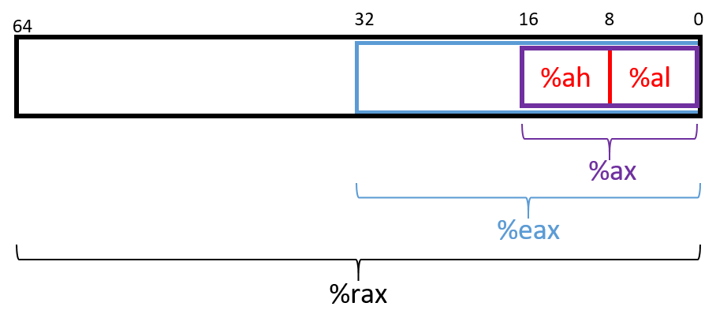

## 7.1. Bắt đầu với Assembly: Những điều cơ bản

Để có cái nhìn đầu tiên về **x64 assembly**, chúng ta sẽ chỉnh sửa hàm `adder` từ [Chương 6](index.html#_assembly_chapter) để đơn giản hóa hành vi của nó. Phiên bản đã chỉnh sửa (`adder2`) được hiển thị bên dưới:

```c
#include <stdio.h>

// adds two to an integer and returns the result
int adder2(int a) {
    return a + 2;
}

int main(void){
    int x = 40;
    x = adder2(x);
    printf("x is: %d\n", x);
    return 0;
}
```

Để biên dịch đoạn code này, sử dụng lệnh sau:

```
$ gcc -o adder adder.c
```

Tiếp theo, hãy xem code assembly tương ứng của chương trình này bằng cách sử dụng lệnh `objdump`:

```
$ objdump -d adder > output
$ less output
```

Tìm đoạn code liên quan đến hàm `adder2` bằng cách gõ `/adder2` khi đang xem tệp `output` với `less`. Phần liên quan đến `adder2` sẽ trông tương tự như sau:

**Kết quả assembly cho hàm `adder2`**

```
0000000000400526 <adder2>:
  400526:       55                      push   %rbp
  400527:       48 89 e5                mov    %rsp,%rbp
  40052a:       89 7d fc                mov    %edi,-0x4(%rbp)
  40052d:       8b 45 fc                mov    -0x4(%rbp),%eax
  400530:       83 c0 02                add    $0x2,%eax
  400533:       5d                      pop    %rbp
  400534:       c3                      retq
```

Đừng lo nếu bạn chưa hiểu chuyện gì đang xảy ra. Chúng ta sẽ tìm hiểu chi tiết hơn về assembly trong các phần sau. Hiện tại, hãy nghiên cứu cấu trúc của từng lệnh riêng lẻ.

Mỗi dòng trong ví dụ trên chứa **địa chỉ 64-bit** của lệnh trong bộ nhớ chương trình, **các byte** tương ứng với lệnh đó, và **dạng văn bản** (plaintext) của chính lệnh. Ví dụ, `55` là dạng **machine code** (code máy) của lệnh `push %rbp`, và lệnh này nằm tại địa chỉ `0x400526` trong bộ nhớ chương trình. Lưu ý rằng `0x400526` là dạng rút gọn của địa chỉ 64-bit đầy đủ của lệnh `push %rbp`; các số 0 ở đầu bị lược bỏ để dễ đọc hơn.

Điều quan trọng cần lưu ý là một dòng code C thường được dịch thành nhiều lệnh assembly. Chẳng hạn, phép toán `a + 2` được biểu diễn bằng hai lệnh: `mov -0x4(%rbp), %eax` và `add $0x2, %eax`.

> **Assembly của bạn có thể trông khác!**  
> Nếu bạn đang biên dịch code của mình cùng với chúng tôi, bạn có thể nhận thấy rằng một số ví dụ assembly của bạn trông khác so với những gì được hiển thị trong sách này. Các lệnh assembly chính xác mà compiler xuất ra phụ thuộc vào phiên bản compiler và hệ điều hành bên dưới. Hầu hết các ví dụ assembly trong sách này được tạo ra trên các hệ thống chạy Ubuntu hoặc Red Hat Enterprise Linux (RHEL).  
>  
> Trong các ví dụ tiếp theo, chúng tôi **không** sử dụng bất kỳ optimization flag hóa nào. Ví dụ, chúng tôi biên dịch bất kỳ tệp ví dụ nào (`example.c`) bằng lệnh:  
> `gcc -o example example.c`  
> Do đó, sẽ có nhiều lệnh trông như dư thừa trong các ví dụ. Hãy nhớ rằng compiler không “thông minh” — nó chỉ đơn giản tuân theo một loạt quy tắc để dịch code dễ đọc của con người sang ngôn ngữ máy. Trong quá trình dịch này, việc xuất hiện một số lệnh dư thừa là điều bình thường. Các compiler tối ưu hóa sẽ loại bỏ nhiều lệnh dư thừa này trong quá trình tối ưu hóa, nội dung sẽ được đề cập trong [một chương sau](../C12-CodeOpt/index.html#_code_optimization).


### 7.1.1. Thanh ghi (Registers)

Hãy nhớ rằng **register** (thanh ghi) là một đơn vị lưu trữ có kích thước bằng một từ (word-sized) nằm trực tiếp trên CPU. Có thể có các thanh ghi riêng cho dữ liệu, lệnh và địa chỉ. Ví dụ, CPU Intel có tổng cộng 16 thanh ghi để lưu trữ dữ liệu 64-bit:

`%rax`, `%rbx`, `%rcx`, `%rdx`, `%rdi`, `%rsi`, `%rsp`, `%rbp`, và `%r8`–`%r15`. Tất cả các thanh ghi này, trừ `%rsp` và `%rbp`, đều chứa dữ liệu 64-bit đa dụng (general-purpose). Mặc dù một chương trình có thể diễn giải nội dung của một thanh ghi như một số nguyên hoặc một địa chỉ, bản thân thanh ghi không phân biệt điều đó. Chương trình có thể đọc hoặc ghi vào cả 16 thanh ghi này.

Thanh ghi `%rsp` và `%rbp` lần lượt được gọi là **stack pointer** (con trỏ stack) và **frame pointer** (hoặc **base pointer**). Compiler dành riêng các thanh ghi này cho các thao tác duy trì cấu trúc của **program stack** (ngăn xếp chương trình). Ví dụ, `%rsp` luôn trỏ tới đỉnh của stack. Trong các hệ thống x86 trước đây (ví dụ IA32), frame pointer thường theo dõi đáy của **stack frame** đang hoạt động và hỗ trợ tham chiếu các tham số. Tuy nhiên, trong các hệ thống x86-64, base pointer ít được sử dụng hơn. Compiler thường lưu 6 tham số đầu tiên của hàm vào các thanh ghi `%rdi`, `%rsi`, `%rdx`, `%rcx`, `%r8` và `%r9`. Thanh ghi `%rax` lưu giá trị trả về từ một hàm.

Thanh ghi cuối cùng đáng nhắc đến là `%rip` hay **instruction pointer** (đôi khi gọi là **program counter** — PC). Nó trỏ tới lệnh tiếp theo mà CPU sẽ thực thi. Không giống như 16 thanh ghi đã đề cập ở trên, chương trình không thể ghi trực tiếp vào `%rip`.

### 7.1.2. Cú pháp nâng cao của thanh ghi (Advanced Register Notation)

Vì **x86-64** là phần mở rộng của kiến trúc x86 32-bit (vốn là phần mở rộng của phiên bản 16-bit trước đó), **ISA** (Instruction Set Architecture — kiến trúc tập lệnh) cung cấp cơ chế truy cập 32 bit thấp, 16 bit thấp và các byte thấp của mỗi thanh ghi. **Bảng 1** liệt kê 16 thanh ghi và ký hiệu trong ISA để truy cập các phần byte thành phần của chúng.

| 64-bit Register | 32-bit Register | Lower 16 Bits | Lower 8 Bits |
|-----------------|-----------------|---------------|--------------|
| `%rax`          | `%eax`          | `%ax`         | `%al`        |
| `%rbx`          | `%ebx`          | `%bx`         | `%bl`        |
| `%rcx`          | `%ecx`          | `%cx`         | `%cl`        |
| `%rdx`          | `%edx`          | `%dx`         | `%dl`        |
| `%rdi`          | `%edi`          | `%di`         | `%dil`       |
| `%rsi`          | `%esi`          | `%si`         | `%sil`       |
| `%rsp`          | `%esp`          | `%sp`         | `%spl`       |
| `%rbp`          | `%ebp`          | `%bp`         | `%bpl`       |
| `%r8`           | `%r8d`          | `%r8w`        | `%r8b`       |
| `%r9`           | `%r9d`          | `%r9w`        | `%r9b`       |
| `%r10`          | `%r10d`         | `%r10w`       | `%r10b`      |
| `%r11`          | `%r11d`         | `%r11w`       | `%r11b`      |
| `%r12`          | `%r12d`         | `%r12w`       | `%r12b`      |
| `%r13`          | `%r13d`         | `%r13w`       | `%r13b`      |
| `%r14`          | `%r14d`         | `%r14w`       | `%r14b`      |
| `%r15`          | `%r15d`         | `%r15w`       | `%r15b`      |

**Bảng 1.** Các thanh ghi x86-64 và cơ chế truy cập các byte thấp.

Tám thanh ghi đầu tiên (`%rax`, `%rbx`, `%rcx`, `%rdx`, `%rdi`, `%rsi`, `%rsp`, và `%rbp`) là phần mở rộng 64-bit của các thanh ghi 32-bit trong x86 và có cơ chế chung để truy cập 32 bit thấp, 16 bit thấp và byte ít quan trọng nhất (least-significant byte). Để truy cập 32 bit thấp của tám thanh ghi này, chỉ cần thay chữ `r` trong tên thanh ghi bằng `e`. Ví dụ, thanh ghi tương ứng với 32 bit thấp của `%rax` là `%eax`. Để truy cập 16 bit thấp, sử dụng hai chữ cái cuối của tên thanh ghi. Do đó, cơ chế để truy cập hai byte thấp của `%rax` là `%ax`.



**Hình 1.** Các tên gọi tham chiếu đến các phần của thanh ghi `%rax`.

ISA cung cấp một cơ chế riêng để truy cập các thành phần 8-bit bên trong 16 bit thấp của bốn thanh ghi đầu tiên. [Hình 1](#Register) minh họa cơ chế truy cập cho `%rax`. **Higher byte** (byte cao) và **lower byte** (byte thấp) trong 16 bit thấp của bốn thanh ghi đầu tiên có thể được truy cập bằng cách lấy hai chữ cái cuối của tên thanh ghi và thay chữ cái cuối bằng `h` (cho *higher*) hoặc `l` (cho *lower*), tùy thuộc vào byte muốn truy cập. Ví dụ, `%al` tham chiếu đến 8 bit thấp của `%ax`, trong khi `%ah` tham chiếu đến 8 bit cao của `%ax`. Các thanh ghi 8-bit này thường được dùng để lưu trữ giá trị 1 byte cho một số thao tác nhất định, chẳng hạn như **bitwise shift** (dịch bit), vì một thanh ghi 32-bit không thể dịch quá 32 vị trí, và số 32 chỉ cần 1 byte để lưu trữ.


> **Compiler có thể chọn component register tùy thuộc vào kiểu dữ liệu**  
> Khi đọc code assembly, hãy nhớ rằng compiler thường sử dụng các thanh ghi 64-bit khi làm việc với giá trị 64-bit (ví dụ: con trỏ hoặc kiểu `long`) và sử dụng các **component register** 32-bit khi làm việc với giá trị 32-bit (ví dụ: kiểu `int`). Trong x86-64, việc thấy các component register 32-bit xen kẽ với các thanh ghi 64-bit đầy đủ là rất phổ biến.  
> Ví dụ, trong hàm `adder2` ở ví dụ trước, compiler tham chiếu đến component register `%eax` thay vì `%rax` vì kiểu `int` thường chiếm 32 bit (4 byte) trên hệ thống 64-bit. Nếu hàm `adder2` có tham số kiểu `long` thay vì `int`, compiler sẽ lưu `a` trong thanh ghi `%rax` thay vì `%eax`.

Tám thanh ghi cuối (`%r8`–`%r15`) không thuộc **IA32 ISA**. Tuy nhiên, chúng cũng có cơ chế để truy cập các thành phần byte khác nhau. Để truy cập 32 bit thấp, 16 bit thấp hoặc byte thấp nhất của tám thanh ghi này, lần lượt thêm các hậu tố `d`, `w` hoặc `b` vào cuối tên thanh ghi. Ví dụ, `%r9d` truy cập 32 bit thấp của `%r9`, `%r9w` truy cập 16 bit thấp, và `%r9b` truy cập byte thấp nhất của `%r9`.

### 7.1.3. Cấu trúc lệnh (Instruction Structure)

Mỗi **instruction** (lệnh) bao gồm một **operation code** hay **opcode** (code thao tác) xác định lệnh đó làm gì, và một hoặc nhiều **operand** (toán hạng) cho biết lệnh sẽ thực hiện như thế nào.  
Ví dụ, lệnh `add $0x2, %eax` có opcode là `add` và các operand là `$0x2` và `%eax`.

Mỗi operand tương ứng với một vị trí nguồn hoặc đích cho một thao tác cụ thể. Các lệnh có hai toán hạng thường tuân theo định dạng **source, destination** (`S`, `D`), trong đó toán hạng đầu tiên chỉ nguồn (source register) và toán hạng thứ hai chỉ đích (destination).

Có nhiều loại operand:

- **Constant (literal)**: giá trị hằng, được đặt trước dấu `$`. Ví dụ, trong lệnh `add $0x2, %eax`, `$0x2` là một giá trị hằng, tương ứng với giá trị hexa 0x2.
- **Register**: tham chiếu trực tiếp đến một thanh ghi. Ví dụ, lệnh `mov %rsp, %rbp` chỉ định rằng giá trị trong thanh ghi nguồn `%rsp` sẽ được sao chép vào thanh ghi đích `%rbp`.
- **Memory**: tham chiếu đến một giá trị trong bộ nhớ chính (RAM) và thường được dùng để tra cứu địa chỉ. Dạng địa chỉ bộ nhớ có thể chứa sự kết hợp giữa thanh ghi và giá trị hằng. Ví dụ, trong lệnh `mov -0x4(%rbp), %eax`, toán hạng `-0x4(%rbp)` là một dạng địa chỉ bộ nhớ. Nó có thể hiểu nôm na là “cộng -0x4 vào giá trị trong thanh ghi `%rbp` (tức là trừ 0x4 khỏi `%rbp`), sau đó thực hiện truy xuất bộ nhớ”. Nếu điều này nghe giống như **pointer dereference** (giải tham chiếu con trỏ), thì đúng là như vậy.

### 7.1.4. Ví dụ với các toán hạng (An Example with Operands)

Cách tốt nhất để giải thích chi tiết về operand là đưa ra một ví dụ nhanh.  
Giả sử bộ nhớ chứa các giá trị sau:

| Address | Value |
|---------|-------|
| 0x804   | 0xCA  |
| 0x808   | 0xFD  |
| 0x80c   | 0x12  |
| 0x810   | 0x1E  |

Giả sử thêm rằng các thanh ghi sau chứa các giá trị như sau:

| Register | Value |
|----------|-------|
| %rax     | 0x804 |
| %rbx     | 0x10  |
| %rcx     | 0x4   |
| %rdx     | 0x1   |

Khi đó, các operand trong **Bảng 2** sẽ được đánh giá thành các giá trị tương ứng. Mỗi hàng trong bảng khớp một operand với dạng của nó (ví dụ: constant, register, memory), cách nó được dịch, và giá trị của nó.  
Lưu ý rằng ký hiệu `M[x]` trong ngữ cảnh này biểu thị giá trị tại vị trí bộ nhớ có địa chỉ `x`.


| Operand         | Form       | Translation                  | Value   |
|-----------------|------------|------------------------------|---------|
| `%rcx`          | Register   | `%rcx`                       | 0x4     |
| `(%rax)`        | Memory     | M[`%rax`] hoặc M[0x804]       | 0xCA    |
| `$0x808`        | Constant   | 0x808                         | 0x808   |
| `0x808`         | Memory     | M[0x808]                      | 0xFD    |
| `0x8(%rax)`     | Memory     | M[`%rax` + 8] hoặc M[0x80c]   | 0x12    |
| `(%rax, %rcx)`  | Memory     | M[`%rax` + `%rcx`] hoặc M[0x808] | 0xFD |
| `0x4(%rax, %rcx)` | Memory   | M[`%rax` + `%rcx` + 4] hoặc M[0x80c] | 0x12 |
| `0x800(,%rdx,4)` | Memory    | M[0x800 + `%rdx`×4] hoặc M[0x804] | 0xCA |
| `(%rax, %rdx, 8)` | Memory   | M[`%rax` + `%rdx`×8] hoặc M[0x80c] | 0x12 |

**Bảng 2.** Ví dụ về các toán hạng (operands).

Trong **Bảng 2**, ký hiệu `%rcx` biểu thị giá trị được lưu trong thanh ghi `%rcx`. Ngược lại, M[`%rax`] biểu thị rằng giá trị bên trong `%rax` được coi là một địa chỉ, và cần **dereference** (giải tham chiếu) để lấy giá trị tại địa chỉ đó. Do đó, toán hạng `(%rax)` tương ứng với M[0x804], và giá trị tại địa chỉ này là 0xCA.

Một vài lưu ý quan trọng trước khi tiếp tục: mặc dù **Bảng 2** cho thấy nhiều dạng toán hạng hợp lệ, nhưng không phải tất cả các dạng đều có thể dùng thay thế cho nhau trong mọi trường hợp. Cụ thể:

- Dạng **constant** không thể được dùng làm toán hạng đích (destination operand).
- Dạng **memory** không thể đồng thời là cả nguồn (source) và đích (destination) trong cùng một lệnh.
- Trong các phép toán có **scaling** (tỉ lệ nhân — xem hai toán hạng cuối trong [Bảng 2](#Operands)), hệ số nhân là tham số thứ ba trong dấu ngoặc. Hệ số nhân có thể là 1, 2, 4 hoặc 8.

**Bảng 2** được cung cấp để tham khảo; tuy nhiên, việc hiểu rõ các dạng toán hạng chính sẽ giúp người đọc tăng tốc độ phân tích code assembly.

### 7.1.5. Hậu tố của lệnh (Instruction Suffixes)

Trong một số trường hợp ở các ví dụ tiếp theo, các lệnh thông dụng và lệnh số học có một **suffix** (hậu tố) cho biết *kích thước* (gắn liền với *kiểu dữ liệu*) của dữ liệu được thao tác ở mức code lệnh. Compiler sẽ tự động dịch code sang các lệnh có hậu tố phù hợp. **Bảng 3** cho thấy các hậu tố thông dụng của lệnh trong x86-64.

| Suffix | C Type                         | Size (bytes) |
|--------|--------------------------------|--------------|
| b      | `char`                         | 1            |
| w      | `short`                        | 2            |
| l      | `int` hoặc `unsigned`          | 4            |
| s      | `float`                        | 4            |
| q      | `long`, `unsigned long`, tất cả con trỏ | 8 |
| d      | `double`                       | 8            |

**Bảng 3.** Ví dụ về hậu tố của lệnh.

Lưu ý rằng các lệnh liên quan đến **conditional execution** (thực thi có điều kiện) sẽ có hậu tố khác nhau tùy thuộc vào điều kiện được đánh giá. Chúng ta sẽ tìm hiểu các lệnh liên quan đến thực thi có điều kiện trong [một phần sau](conditional_control_loops.html#_conditional_control_and_loops).