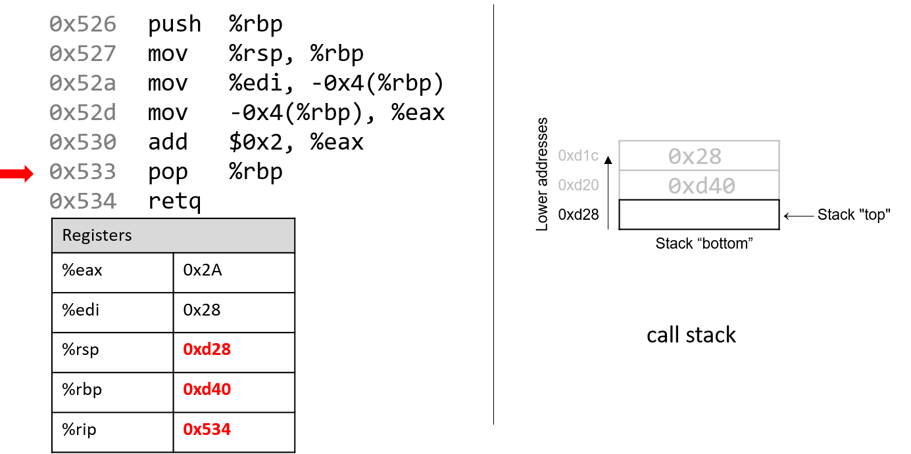

## 7.2. Các lệnh thông dụng (Common Instructions)

Trong phần này, chúng ta sẽ thảo luận về một số **assembly instruction** (lệnh assembly) thường gặp. [Bảng 1](#Basic) liệt kê những lệnh nền tảng nhất trong assembly x86 (và do đó cả x64).

| Instruction  | Translation |
|--------------|-------------|
| `mov S, D`   | S → D (sao chép giá trị của S vào D) |
| `add S, D`   | S + D → D (cộng S vào D và lưu kết quả vào D) |
| `sub S, D`   | D - S → D (trừ S *khỏi* D và lưu kết quả vào D) |

**Bảng 1.** Các lệnh thông dụng nhất

Do đó, chuỗi lệnh:

```
mov    -0x4(%rbp),%eax
add    $0x2,%eax
```

được dịch như sau:

- Sao chép giá trị tại vị trí `%rbp` + (-0x4) trong **memory** (M[`%rbp` - 0x4]) vào thanh ghi `%eax`.
- Cộng giá trị `0x2` vào thanh ghi `%eax` và lưu kết quả vào `%eax`.

Ba lệnh trong **Bảng 1** cũng tạo thành nền tảng cho các lệnh duy trì tổ chức của **program stack** (ngăn xếp chương trình, hay **call stack**). Hãy nhớ rằng các thanh ghi `%rbp` và `%rsp` lần lượt là **frame pointer** và **stack pointer**, được compiler dành riêng cho việc quản lý call stack. Như đã đề cập trong phần trước về [program memory](../C2-C_depth/scope_memory.html#_parts_of_program_memory_and_scope), call stack thường lưu trữ các biến cục bộ và tham số, đồng thời giúp chương trình theo dõi quá trình thực thi của chính nó (xem [Hình 1](#ProgramMemory)). Trên hệ thống x86-64, **execution stack** phát triển về phía các địa chỉ *thấp hơn*. Giống như mọi cấu trúc dữ liệu stack, các thao tác diễn ra ở “đỉnh” của stack.


**Hình 1.** Các phần của không gian địa chỉ của một chương trình

**x86-64 ISA** cung cấp hai lệnh (Bảng 2) để đơn giản hóa việc quản lý call stack.

| Instruction | Translation |
|-------------|-------------|
| `push S`    | Đẩy một bản sao của S lên đỉnh stack. Tương đương với:  `sub $0x8, %rsp` và `mov S, (%rsp)` |
| `pop D`     | Lấy phần tử ở đỉnh stack ra và đặt vào vị trí D. Tương đương với: `mov (%rsp), D` và `add $0x8, %rsp` |

**Bảng 2.** Các lệnh quản lý stack

Lưu ý rằng trong khi ba lệnh ở **Bảng 1** yêu cầu hai toán hạng, thì `push` và `pop` trong **Bảng 2** chỉ yêu cầu một toán hạng.

---

### 7.2.1. Kết hợp tất cả: Một ví dụ cụ thể hơn

Hãy xem kỹ hơn hàm `adder2`:

```c
// adds two to an integer and returns the result
int adder2(int a) {
    return a + 2;
}
```

và mã assembly tương ứng của nó:

```
0000000000400526 <adder2>:
    400526:       55                      push   %rbp
    400527:       48 89 e5                mov    %rsp,%rbp
    40052a:       89 7d fc                mov    %edi,-0x4(%rbp)
    40052d:       8b 45 fc                mov    -0x4(%rbp),%eax
    400530:       83 c0 02                add    $0x2,%eax
    400533:       5d                      pop    %rbp
    400534:       c3                      retq
```

Dưới đây là bản dịch tiếng Việt của đoạn bạn cung cấp, tuân thủ đầy đủ các quy ước đã nêu và giữ nguyên toàn bộ phần code:

---

Mã assembly bao gồm một lệnh `push`, tiếp theo là ba lệnh `mov`, một lệnh `add`, một lệnh `pop` và cuối cùng là một lệnh `retq`.  
Để hiểu CPU thực thi tập lệnh này như thế nào, chúng ta cần xem lại cấu trúc của [program memory](../C2-C_depth/scope_memory.html#_parts_of_program_memory_and_scope).  
Hãy nhớ rằng mỗi khi một chương trình được thực thi, hệ điều hành sẽ cấp phát **address space** (không gian địa chỉ) mới cho chương trình đó (còn gọi là **virtual memory** — bộ nhớ ảo).  
Virtual memory và khái niệm liên quan là [processes](../C13-OS/processes.html#_processes) sẽ được trình bày chi tiết hơn ở Chương 13; hiện tại, bạn chỉ cần hiểu rằng **process** là sự trừu tượng hóa của một chương trình đang chạy, và virtual memory là vùng bộ nhớ được cấp phát cho một process.  
Mỗi process có một vùng bộ nhớ riêng gọi là **call stack**. Lưu ý rằng call stack nằm trong process/virtual memory, khác với các thanh ghi (registers) vốn nằm trên CPU.

**Hình 2** minh họa trạng thái mẫu của call stack và các thanh ghi trước khi thực thi hàm `adder2`.


**Hình 2.** Execution stack trước khi thực thi

Lưu ý rằng stack phát triển về phía các địa chỉ *thấp hơn*. Thanh ghi `%eax` chứa một giá trị rác. Tham số duy nhất của hàm `adder2` (`a`) theo quy ước được lưu trong thanh ghi `%rdi`. Vì `a` có kiểu `int`, nó được lưu trong **component register** `%edi` (như thể hiện trong Hình 2). Tương tự, vì hàm `adder2` trả về một giá trị `int`, nên **component register** `%eax` được dùng để chứa giá trị trả về thay vì `%rax`.

Các địa chỉ gắn với các lệnh trong **code segment** của program memory (0x400526–0x400534) đã được rút gọn thành (0x526–0x534) để hình minh họa dễ đọc hơn. Tương tự, các địa chỉ gắn với **call stack segment** đã được rút gọn thành 0xd28–0xd1c từ 0x7fffffffdd28 – 0x7fffffffdd1c. Thực tế, địa chỉ của call stack nằm ở vùng địa chỉ cao hơn nhiều so với địa chỉ của code segment.

Hãy chú ý đến giá trị ban đầu của các thanh ghi `%rsp` và `%rbp`: lần lượt là 0xd28 và 0xd40. Mũi tên đỏ (góc trên bên trái) trong các hình tiếp theo biểu thị trực quan lệnh đang được thực thi. Thanh ghi `%rip` (hay instruction pointer) cho biết lệnh tiếp theo sẽ được thực hiện. Ban đầu, `%rip` chứa địa chỉ 0x526, tương ứng với lệnh đầu tiên trong hàm `adder2`.


Lệnh đầu tiên (`push %rbp`) đặt một bản sao giá trị trong `%rbp` (0xd40) lên đỉnh stack. Sau khi thực thi, `%rip` trỏ tới địa chỉ của lệnh tiếp theo (0x527). Lệnh `push` giảm giá trị stack pointer đi 8 (tức “mở rộng” stack thêm 8 byte), dẫn đến `%rsp` mới là 0xd20. Hãy nhớ rằng `push %rbp` tương đương với:

```
sub $8, %rsp
mov %rbp, (%rsp)
```

Nói cách khác, trừ 8 khỏi stack pointer và đặt bản sao nội dung của `%rbp` vào vị trí được trỏ bởi `(%rsp)`.


Hãy nhớ rằng cấu trúc của lệnh `mov` là `mov S, D`, trong đó S là nguồn (source) và D là đích (destination). Do đó, lệnh tiếp theo (`mov %rsp, %rbp`) cập nhật giá trị của `%rbp` thành 0xd20. `%rip` tăng lên để trỏ tới lệnh tiếp theo, 0x52a.


Tiếp theo, `mov %edi, -0x4(%rbp)` được thực thi. Lệnh này phức tạp hơn một chút so với lệnh `mov` trước. Trước hết, hãy nhớ rằng tham số đầu tiên của một hàm được lưu trong `%rdi`. Vì `a` có kiểu `int`, compiler lưu nó trong **component register** `%edi`. Toán hạng `-0x4(%rbp)` tương ứng với M[`%rbp` - 0x4]. Vì `%rbp` chứa 0xd20, trừ đi 4 sẽ ra 0xd1c. Do đó, lệnh `mov` này sao chép giá trị của `%edi` (0x28) vào vị trí 0xd1c trên stack. `%rip` tăng lên 0x52d.

Lưu ý rằng việc lưu giá trị 0x28 này không ảnh hưởng đến `%rsp`. Vì vậy, “đỉnh” stack theo chương trình vẫn là địa chỉ 0xd20.


Lệnh `mov` tiếp theo (`mov -0x4(%rbp), %eax`) sao chép giá trị tại vị trí 0xd1c trên stack (M[`%rbp` - 0x4] = 0x28) vào `%eax`. `%rip` tăng lên 0x530.


Tiếp theo, `add $0x2, %eax` được thực thi. Hãy nhớ rằng `add S, D` sẽ tính S + D và lưu vào D. Do đó, `add $0x2, %eax` cộng hằng số 0x2 vào giá trị trong `%eax` (0x28), kết quả là 0x2A được lưu vào `%eax`. `%rip` tăng lên 0x533.



Lệnh tiếp theo là `pop %rbp`. Lệnh này “pop” giá trị ở đỉnh stack và đặt vào `%rbp`. Lệnh này tương đương với:

```
mov (%rsp), %rbp
add $8, %rsp
```

Vì đỉnh stack hiện tại là 0xd20 (`%rsp`), nên khi thực thi, giá trị tại M[0xd20] được sao chép vào `%rbp`, khiến `%rbp` trở lại 0xd40. Stack pointer tăng thêm 8 (vì stack thu nhỏ về phía địa chỉ cao hơn), nên `%rsp` trở lại 0xd28. `%rip` lúc này trỏ tới lệnh cuối cùng (0x534).

Lệnh cuối cùng là `retq`. Chúng ta sẽ nói kỹ hơn về `retq` khi bàn về lời gọi hàm, nhưng hiện tại chỉ cần biết rằng nó chuẩn bị call stack để trả về từ một hàm. Theo quy ước, `%rax` luôn chứa giá trị trả về (nếu có). Trong trường hợp này, vì `adder2` trả về `int`, giá trị trả về nằm trong `%eax` và là 0x2A (42).

Trước khi tiếp tục, hãy lưu ý rằng giá trị cuối cùng của `%rsp` và `%rbp` lần lượt là 0xd28 và 0xd40 — **giống hệt** khi hàm bắt đầu thực thi. Đây là hành vi bình thường và mong đợi của call stack: nó lưu trữ biến tạm và dữ liệu của mỗi hàm khi chạy, và khi hàm kết thúc, stack trở lại trạng thái trước khi hàm được gọi. Vì vậy, thường thấy hai lệnh sau ở đầu hàm:

```
push %rbp
mov %rsp, %rbp
```

và hai lệnh sau ở cuối hàm:

```
pop %rbp
retq
```


