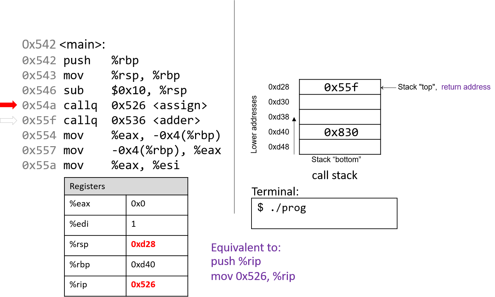
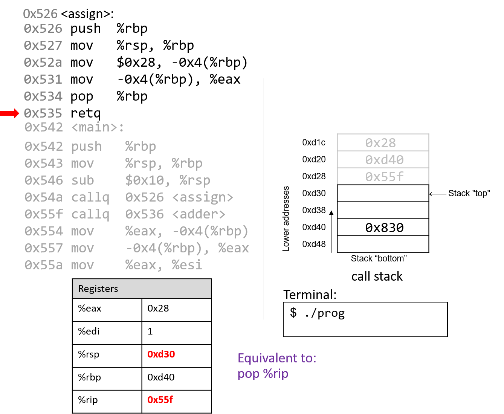
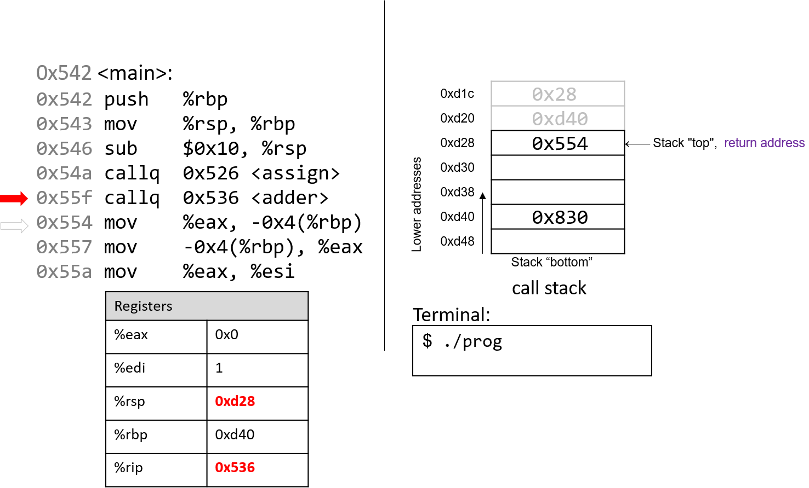

## 7.5. Functions in Assembly

Trong phần trước, chúng ta đã lần theo các hàm đơn giản trong assembly.  
Trong phần này, chúng ta sẽ thảo luận về sự tương tác giữa nhiều hàm trong assembly trong bối cảnh của một chương trình lớn hơn. Chúng ta cũng sẽ giới thiệu một số lệnh mới liên quan đến việc quản lý hàm.

Hãy bắt đầu bằng việc ôn lại cách **call stack** được quản lý. Hãy nhớ rằng `%rsp` là **stack pointer** và luôn trỏ tới đỉnh của stack. Thanh ghi `%rbp` đại diện cho **base pointer** (còn gọi là **frame pointer**) và trỏ tới đáy của **stack frame** hiện tại. **Stack frame** (còn gọi là **activation frame** hoặc **activation record**) là phần của stack được cấp phát cho một lần gọi hàm. Hàm đang thực thi luôn nằm ở đỉnh stack, và stack frame của nó được gọi là **active frame**. Active frame được giới hạn bởi stack pointer (ở đỉnh stack) và frame pointer (ở đáy frame). **Activation record** thường chứa các biến cục bộ của hàm.

Hình 1 minh họa các stack frame của `main` và một hàm mà nó gọi tên là `fname`. Chúng ta sẽ gọi hàm `main` là hàm *caller* và `fname` là hàm *callee*.


**Hình 1.** Quản lý stack frame

Trong Hình 1, active frame hiện tại thuộc về hàm callee (`fname`). Vùng nhớ giữa stack pointer và frame pointer được dùng cho các biến cục bộ. Stack pointer thay đổi khi các giá trị cục bộ được **push** và **pop** khỏi stack. Ngược lại, frame pointer hầu như không thay đổi, luôn trỏ tới phần bắt đầu (đáy) của stack frame hiện tại. Vì vậy, các compiler như GCC thường tham chiếu các giá trị trên stack tương đối so với frame pointer. Trong Hình 1, active frame được giới hạn phía dưới bởi base pointer của `fname`, là địa chỉ stack 0x418. Giá trị lưu tại địa chỉ 0x418 là giá trị `%rbp` đã “lưu” (0x42c), bản thân nó là một địa chỉ cho biết đáy của activation frame của hàm `main`. Đỉnh của activation frame của `main` được giới hạn bởi **return address**, cho biết vị trí trong hàm `main` mà chương trình sẽ tiếp tục thực thi khi hàm callee `fname` kết thúc.

> **Return address** trỏ tới bộ nhớ của code segment, không phải stack memory.  
> Hãy nhớ rằng vùng call stack (stack memory) của một chương trình khác với vùng code (code segment memory). Trong khi `%rbp` và `%rsp` trỏ tới địa chỉ trong stack memory, `%rip` trỏ tới một địa chỉ trong *code segment memory*. Nói cách khác, return address là một địa chỉ trong code segment memory, không phải stack memory:
>
>   
> *Hình 2. Các phần của không gian địa chỉ của một chương trình*

**Bảng 1.** Một số lệnh quản lý hàm thông dụng

| Instruction | Translation |
|-------------|-------------|
| `leaveq` | Chuẩn bị stack để thoát khỏi hàm. Tương đương với:<br>`mov %rbp, %rsp`<br>`pop %rbp` |
| `callq addr <fname>` | Chuyển active frame sang hàm callee. Tương đương với:<br>`push %rip`<br>`mov addr, %rip` |
| `retq` | Khôi phục active frame về hàm caller. Tương đương với:<br>`pop %rip` |

Ví dụ, lệnh `leaveq` là một dạng viết tắt mà compiler dùng để khôi phục stack pointer và frame pointer khi chuẩn bị thoát khỏi hàm. Khi hàm callee kết thúc, `leaveq` đảm bảo frame pointer được **khôi phục** về giá trị trước đó.

Các lệnh `callq` và `retq` đóng vai trò quan trọng trong quá trình một hàm gọi hàm khác. Cả hai lệnh này đều thay đổi **instruction pointer** (`%rip`). Khi hàm caller thực thi lệnh `callq`, giá trị hiện tại của `%rip` sẽ được lưu trên stack để làm **return address** — tức địa chỉ trong chương trình mà caller sẽ tiếp tục thực thi khi callee kết thúc. Lệnh `callq` cũng thay thế giá trị `%rip` bằng địa chỉ của hàm callee.

Lệnh `retq` khôi phục giá trị `%rip` từ giá trị đã lưu trên stack, đảm bảo chương trình tiếp tục thực thi tại địa chỉ được chỉ định trong hàm caller. Bất kỳ giá trị trả về nào của callee sẽ được lưu trong `%rax` hoặc một trong các **component register** của nó (ví dụ `%eax`). Lệnh `retq` thường là lệnh cuối cùng được thực thi trong bất kỳ hàm nào.

### 7.5.1. Function Parameters

Không giống IA32, các tham số của hàm trong x86-64 thường được nạp sẵn vào các thanh ghi trước khi gọi hàm. **Bảng 2** liệt kê các tham số của hàm và thanh ghi (nếu có) mà chúng được nạp vào trước khi gọi hàm.

**Bảng 2.** Vị trí lưu trữ tham số hàm

| Parameter  | Location |
|------------|----------|
| Parameter 1 | %rdi |
| Parameter 2 | %rsi |
| Parameter 3 | %rdx |
| Parameter 4 | %rcx |
| Parameter 5 | %r8 |
| Parameter 6 | %r9 |
| Parameter 7+ | trên call stack |

Sáu tham số đầu tiên của hàm lần lượt được nạp vào các thanh ghi `%rdi`, `%rsi`, `%rdx`, `%rcx`, `%r8`, và `%r9`. Bất kỳ tham số bổ sung nào sẽ được nạp lần lượt vào call stack dựa trên kích thước của chúng (dịch 4 byte cho dữ liệu 32-bit, dịch 8 byte cho dữ liệu 64-bit).

### 7.5.2. Tracing Through an Example

Dựa trên kiến thức về quản lý hàm, hãy lần theo ví dụ mã nguồn đã được giới thiệu ở đầu chương này. Lưu ý rằng từ khóa `void` được thêm vào danh sách tham số của mỗi định nghĩa hàm để chỉ rõ rằng các hàm này không nhận đối số nào. Thay đổi này không làm thay đổi kết quả của chương trình; tuy nhiên, nó giúp đơn giản hóa mã assembly tương ứng.


```c
#include <stdio.h>

int assign(void) {
    int y = 40;
    return y;
}

int adder(void) {
    int a;
    return a + 2;
}

int main(void) {
    int x;
    assign();
    x = adder();
    printf("x is: %d\n", x);
    return 0;
}
```


Chúng ta biên dịch đoạn mã này với lệnh:

```
gcc -o prog prog.c
```

và sử dụng:

```
objdump -d
```

để xem mã assembly bên dưới. Lệnh thứ hai sẽ xuất ra một tệp khá lớn chứa nhiều thông tin không cần thiết. Hãy dùng `less` và chức năng tìm kiếm để trích xuất các hàm `adder`, `assign` và `main`:

```assembly
0000000000400526 <assign>:
  400526:       55                      push   %rbp
  400527:       48 89 e5                mov    %rsp,%rbp
  40052a:       c7 45 fc 28 00 00 00    movl   $0x28,-0x4(%rbp)
  400531:       8b 45 fc                mov    -0x4(%rbp),%eax
  400534:       5d                      pop    %rbp
  400535:       c3                      retq

0000000000400536 <adder>:
  400536:       55                      push   %rbp
  400537:       48 89 e5                mov    %rsp,%rbp
  40053a:       8b 45 fc                mov    -0x4(%rbp),%eax
  40053d:       83 c0 02                add    $0x2,%eax
  400540:       5d                      pop    %rbp
  400541:       c3                      retq

0000000000400542 <main>:
  400542:       55                      push   %rbp
  400543:       48 89 e5                mov    %rsp,%rbp
  400546:       48 83 ec 10             sub    $0x10,%rsp
  40054a:       e8 e3 ff ff ff          callq  400526 <assign>
  40054f:       e8 d2 ff ff ff          callq  400536 <adder>
  400554:       89 45 fc                mov    %eax,-0x4(%rbp)
  400557:       8b 45 fc                mov    -0x4(%rbp),%eax
  40055a:       89 c6                   mov    %eax,%esi
  40055c:       bf 04 06 40 00          mov    $0x400604,%edi
  400561:       b8 00 00 00 00          mov    $0x0,%eax
  400566:       e8 95 fe ff ff          callq  400400 <printf@plt>
  40056b:       b8 00 00 00 00          mov    $0x0,%eax
  400570:       c9                      leaveq
  400571:       c3                      retq
```

Mỗi hàm bắt đầu bằng một **symbolic label** (nhãn ký hiệu) tương ứng với tên được khai báo của nó trong chương trình. Ví dụ, `<main>:` là symbolic label cho hàm `main`. Địa chỉ của một nhãn hàm cũng chính là địa chỉ của lệnh đầu tiên trong hàm đó. Để tiết kiệm không gian trong các hình minh họa bên dưới, chúng ta rút gọn địa chỉ xuống 12 bit thấp. Vì vậy, địa chỉ chương trình `0x400542` sẽ được hiển thị thành `0x542`.

### 7.5.3. Tracing Through main

**Hình 3** cho thấy execution stack ngay trước khi thực thi `main`.


**Hình 3.** Trạng thái ban đầu của các thanh ghi CPU và call stack trước khi thực thi hàm `main`

Hãy nhớ rằng stack phát triển về phía các địa chỉ thấp hơn. Trong ví dụ này, `%rbp` ban đầu là địa chỉ stack `0x830`, và `%rsp` ban đầu là địa chỉ stack `0xd48`. Cả hai giá trị này được giả định cho ví dụ.

Vì các hàm trong ví dụ trước sử dụng dữ liệu kiểu số nguyên, chúng ta làm nổi bật các **component register** `%eax` và `%edi`, vốn ban đầu chứa giá trị rác. Mũi tên đỏ (góc trên bên trái) biểu thị lệnh đang được thực thi. Ban đầu, `%rip` chứa địa chỉ `0x542`, là địa chỉ trong bộ nhớ chương trình của dòng đầu tiên trong hàm `main`.


Lệnh đầu tiên lưu giá trị hiện tại của `%rbp` bằng cách **push** `0x830` lên stack. Vì stack phát triển về phía địa chỉ thấp hơn, stack pointer `%rsp` được cập nhật thành `0xd40`, tức nhỏ hơn `0xd48` 8 byte. `%rip` tăng tới lệnh tiếp theo.


Lệnh tiếp theo (`mov %rsp, %rbp`) cập nhật giá trị `%rbp` thành bằng `%rsp`. Frame pointer (`%rbp`) giờ trỏ tới đầu stack frame của hàm `main`. `%rip` tăng tới lệnh tiếp theo.


Lệnh `sub` trừ `0x10` khỏi địa chỉ của stack pointer, về cơ bản làm stack “mở rộng” thêm 16 byte, được biểu diễn bằng hai ô nhớ 8 byte trên stack. `%rsp` giờ có giá trị mới là `0xd30`. `%rip` tăng tới lệnh tiếp theo.



Lệnh `callq <assign>` **push** giá trị trong `%rip` (địa chỉ của lệnh *tiếp theo* sẽ thực thi) lên stack. Vì lệnh tiếp theo sau `callq <assign>` có địa chỉ `0x55f`, giá trị này được push lên stack làm **return address**. Hãy nhớ rằng return address cho biết địa chỉ chương trình sẽ tiếp tục thực thi khi quay lại `main`.

Tiếp đó, lệnh `callq` đưa địa chỉ của hàm `assign` (`0x526`) vào `%rip`, báo hiệu chương trình sẽ tiếp tục thực thi trong hàm callee `assign` thay vì lệnh tiếp theo trong `main`.


Hai lệnh đầu tiên trong hàm `assign` là phần “dọn dẹp sổ sách” (book-keeping) mà mọi hàm đều thực hiện. Lệnh đầu tiên **push** giá trị trong `%rbp` (địa chỉ `0xd40`) lên stack. Hãy nhớ rằng địa chỉ này trỏ tới đầu stack frame của `main`. `%rip` tăng tới lệnh thứ hai trong `assign`.


Lệnh tiếp theo (`mov %rsp, %rbp`) cập nhật `%rbp` để trỏ tới đỉnh stack, đánh dấu đầu stack frame của `assign`. `%rip` tăng tới lệnh tiếp theo trong `assign`.


Lệnh `mov` tại địa chỉ `0x52a` đưa giá trị `$0x28` (tức 40) vào stack tại địa chỉ `-0x4(%rbp)`, tức 4 byte phía trên frame pointer. Frame pointer thường được dùng để tham chiếu các vị trí trên stack. Lưu ý rằng thao tác này **không** thay đổi `%rsp` — stack pointer vẫn trỏ tới `0xd20`. `%rip` tăng tới lệnh tiếp theo trong `assign`.


Lệnh `mov` tại địa chỉ `0x531` đưa giá trị `$0x28` vào `%eax`, thanh ghi chứa giá trị trả về của hàm. `%rip` tăng tới lệnh `pop` trong `assign`.


Lúc này, hàm `assign` gần như đã hoàn tất. Lệnh tiếp theo là `pop %rbp`, khôi phục `%rbp` về giá trị trước đó (`0xd40`). Vì `pop` thay đổi stack pointer, `%rsp` được cập nhật thành `0xd28`.



Lệnh cuối cùng trong `assign` là `retq`. Khi `retq` thực thi, return address được **pop** khỏi stack vào `%rip`. Trong ví dụ này, `%rip` giờ trỏ tới lệnh `callq` trong `main` tại địa chỉ `0x55f`.

Một số điểm quan trọng cần lưu ý:

- Stack pointer và frame pointer đã được khôi phục về giá trị trước khi gọi `assign`, cho thấy stack frame của `main` lại trở thành active frame.
- Các giá trị cũ trên stack từ stack frame trước **không** bị xóa. Chúng vẫn tồn tại trên call stack.



Quay lại `main`, lệnh gọi `adder` **ghi đè** return address cũ trên stack bằng return address mới (`0x554`). Return address này trỏ tới lệnh sẽ thực thi sau khi `adder` trả về, tức `mov %eax, -0x4(%rbp)`. `%rip` được cập nhật trỏ tới lệnh đầu tiên trong `adder` tại địa chỉ `0x536`.


Lệnh đầu tiên trong `adder` lưu frame pointer của caller (`%rbp` của `main`) lên stack.


Lệnh tiếp theo cập nhật `%rbp` bằng giá trị hiện tại của `%rsp` (`0xd20`). Hai lệnh này thiết lập đầu stack frame cho `adder`.


Hãy chú ý tới lệnh tiếp theo. Hãy nhớ rằng `$0x28` đã được đặt trên stack khi gọi `assign`. Lệnh `mov $-0x4(%rbp), %eax` di chuyển **giá trị cũ** trên stack vào `%eax`! Điều này sẽ không xảy ra nếu lập trình viên đã khởi tạo biến `a` trong `adder`.


Lệnh `add` tại địa chỉ `0x53d` cộng 2 vào `%eax`. Hãy nhớ rằng khi trả về một số nguyên 32-bit, x86-64 sử dụng `%eax` thay vì `%rax`. Hai lệnh cuối này tương đương với đoạn mã trong `adder`:

```c
int a;
return a + 2;
```


Sau khi `pop` thực thi, frame pointer lại trỏ tới đầu stack frame của `main` (`0xd40`). Stack pointer lúc này chứa địa chỉ `0xd28`.


Việc thực thi lệnh `retq` sẽ **pop** địa chỉ trả về (return address) ra khỏi stack, khôi phục **instruction pointer** về `0x554`, tức địa chỉ của lệnh tiếp theo sẽ được thực thi trong `main`. Địa chỉ chứa trong `%rsp` lúc này là `0xd30`.


Quay lại `main`, lệnh `mov %eax, -0x4(%rbp)` đặt giá trị trong `%eax` vào vị trí bộ nhớ cách `%rbp` 4 byte, tức địa chỉ `0xd3c`. Lệnh tiếp theo lại đưa giá trị này trở lại vào thanh ghi `%eax`.


Bỏ qua một vài bước, lệnh `mov` tại địa chỉ `0x55a` sao chép giá trị trong `%eax` (tức `0x2A`) vào thanh ghi `%esi`, là **component register** 32-bit của `%rsi` và thường lưu tham số thứ hai của một hàm.


Lệnh tiếp theo (`mov $0x400604, %edi`) sao chép một giá trị hằng (một địa chỉ trong **code segment memory**) vào thanh ghi `%edi`. Hãy nhớ rằng `%edi` là **component register** 32-bit của `%rdi`, thường lưu tham số thứ nhất của một hàm. Địa chỉ `0x400604` trong code segment là địa chỉ bắt đầu của chuỗi `"x is %d\n"`.


Lệnh tiếp theo đặt lại giá trị của `%eax` thành 0. Instruction pointer lúc này trỏ tới lời gọi hàm `printf` (được ký hiệu là `<printf@plt>`).


Lệnh tiếp theo gọi hàm `printf`. Để ngắn gọn, chúng ta sẽ không lần theo chi tiết hàm `printf` (thuộc `stdio.h`). Tuy nhiên, theo trang hướng dẫn (`man -s3 printf`), `printf` có dạng:

```
int printf(const char * format, ...)
```

Nói cách khác, tham số đầu tiên là con trỏ tới chuỗi định dạng, và các tham số tiếp theo là các giá trị sẽ được chèn vào định dạng đó. Các lệnh từ địa chỉ `0x55a` đến `0x566` tương ứng với dòng lệnh trong hàm `main`:

```c
printf("x is %d\n", x);
```

Khi hàm `printf` được gọi:

- Một **return address** chỉ lệnh sẽ thực thi sau khi `printf` kết thúc được **push** lên stack.
- Giá trị của `%rbp` được **push** lên stack, và `%rbp` được cập nhật để trỏ tới đỉnh stack, đánh dấu bắt đầu stack frame của `printf`.

Tại một thời điểm nào đó, `printf` sẽ tham chiếu tới các đối số của nó: chuỗi `"x is %d\n"` và giá trị `0x2A`. Tham số thứ nhất được lưu trong `%edi`, tham số thứ hai được lưu trong `%esi`. Return address nằm ngay bên dưới `%rbp` tại vị trí `%rbp+8`.

Với bất kỳ hàm nào có *n* tham số, GCC sẽ đặt 6 tham số đầu tiên vào các thanh ghi (như trong Bảng 2), và các tham số còn lại sẽ được đặt trên stack *bên dưới* return address.

Sau khi gọi `printf`, giá trị `0x2A` sẽ được in ra cho người dùng ở dạng số nguyên. Do đó, giá trị **42** được in ra màn hình.


Sau khi gọi `printf`, một vài lệnh cuối sẽ dọn dẹp stack và chuẩn bị thoát sạch sẽ khỏi hàm `main`. Đầu tiên, lệnh `mov` tại địa chỉ `0x56b` đảm bảo rằng giá trị 0 nằm trong thanh ghi trả về (vì việc cuối cùng `main` làm là `return 0`).


Lệnh `leaveq` chuẩn bị stack để trả về từ lời gọi hàm. Hãy nhớ rằng `leaveq` tương đương với cặp lệnh:

```
mov %rbp, %rsp
pop %rbp
```

Nói cách khác, CPU ghi đè stack pointer bằng frame pointer. Trong ví dụ này, stack pointer được cập nhật từ `0xd30` thành `0xd40`. Tiếp đó, CPU thực thi `pop %rbp`, lấy giá trị tại `0xd40` (trong ví dụ này là địa chỉ `0x830`) và đặt vào `%rbp`. Sau khi `leaveq` thực thi, stack pointer và frame pointer trở lại giá trị ban đầu trước khi `main` chạy.

Lệnh cuối cùng được thực thi là `retq`. Với giá trị `0x0` trong thanh ghi trả về `%eax`, chương trình trả về 0, báo hiệu kết thúc thành công.

Nếu bạn đã đọc kỹ phần này, bạn sẽ hiểu vì sao chương trình in ra giá trị **42**. Về bản chất, chương trình đã vô tình sử dụng các giá trị cũ trên stack, khiến nó hoạt động theo cách mà ta không ngờ tới. Ví dụ này khá vô hại; tuy nhiên, ở các phần sau, chúng ta sẽ thảo luận cách tin tặc lợi dụng lời gọi hàm để khiến chương trình hoạt động sai lệch theo những cách thực sự nguy hiểm.