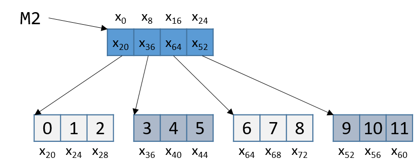

## 7.8. Ma trận (Matrices)

**Ma trận** là một mảng hai chiều. Trong C, một ma trận có thể được cấp phát tĩnh dưới dạng mảng hai chiều (`M[n][m]`), được cấp phát động chỉ với một lần gọi `malloc`, hoặc được cấp phát động dưới dạng **mảng của các mảng**.  
Hãy xét cách triển khai **mảng của các mảng**. Mảng thứ nhất chứa `n` phần tử (`M[n]`), và mỗi phần tử `M[i]` trong ma trận của chúng ta chứa một mảng gồm `m` phần tử. Các đoạn code sau đây lần lượt khai báo các ma trận kích thước 4 × 3:

```c
// ma trận cấp phát tĩnh (trên stack)
int M1[4][3];

// ma trận cấp phát động (dễ lập trình, cấp phát trên heap)
int **M2, i;
M2 = malloc(4 * sizeof(int*));
for (i = 0; i < 4; i++) {
    M2[i] = malloc(3 * sizeof(int));
}
```

Trong trường hợp ma trận được cấp phát động, mảng chính chứa một mảng liên tiếp các con trỏ kiểu `int`. Mỗi con trỏ này trỏ tới một mảng khác trong bộ nhớ. **Hình 1** minh họa cách chúng ta thường hình dung hai loại ma trận này.

  
**Hình 1.** Minh họa ma trận cấp phát tĩnh (M1) và ma trận cấp phát động (M2) kích thước 3×4

Với cả hai khai báo ma trận này, phần tử (*i*, *j*) có thể được truy cập bằng cú pháp chỉ số kép `M[i][j]`, trong đó `M` là `M1` hoặc `M2`. Tuy nhiên, các ma trận này được tổ chức khác nhau trong bộ nhớ.  
Mặc dù cả hai đều lưu các phần tử trong mảng chính một cách liên tiếp trong bộ nhớ, ma trận cấp phát tĩnh còn lưu **toàn bộ các hàng** liên tiếp nhau trong bộ nhớ, như minh họa ở **Hình 2**.

  
**Hình 2.** Cách sắp xếp bộ nhớ của ma trận M1 theo thứ tự hàng (row-major order)

Sự liên tiếp này **không được đảm bảo** đối với `M2`. [Hãy nhớ rằng](../C2-C_depth/arrays.html#_two_dimensional_array_memory_layout) để cấp phát liên tiếp một ma trận *n* × *m* trên heap, chúng ta nên dùng một lần gọi `malloc` để cấp phát *n* × *m* phần tử:

```c
// ma trận động (cấp phát trên heap, cách tiết kiệm bộ nhớ)
#define ROWS 4
#define COLS 3
int *M3;
M3 = malloc(ROWS * COLS * sizeof(int));
```

Với khai báo `M3`, phần tử (*i*, *j*) **không thể** truy cập bằng cú pháp `M[i][j]`. Thay vào đó, chúng ta phải truy cập bằng công thức `M3[i*COLS + j]`.

### 7.8.1. Ma trận hai chiều liên tiếp (Contiguous Two-Dimensional Arrays)

Xét hàm `sumMat` nhận vào một con trỏ tới ma trận được cấp phát liên tiếp (có thể là cấp phát tĩnh hoặc cấp phát động tiết kiệm bộ nhớ) làm tham số đầu tiên, cùng với số hàng và số cột, và trả về tổng tất cả các phần tử trong ma trận.

Chúng ta sử dụng **scaled indexing** (chỉ số có nhân hệ số) trong đoạn code dưới đây vì nó áp dụng cho cả ma trận liên tiếp cấp phát tĩnh và động. Hãy nhớ rằng cú pháp `m[i][j]` **không hoạt động** với cách cấp phát động liên tiếp tiết kiệm bộ nhớ đã nói ở trên.

```c
int sumMat(int *m, int rows, int cols) {
    int i, j, total = 0;
    for (i = 0; i < rows; i++){
        for (j = 0; j < cols; j++){
            total += m[i*cols + j];
        }
    }
    return total;
}
```

Dưới đây là mã assembly tương ứng. Mỗi dòng đều được chú thích bằng tiếng Việt:

```
Dump of assembler code for function sumMat:
0x400686 <+0>:   push %rbp                 # lưu rbp
0x400687 <+1>:   mov  %rsp,%rbp            # cập nhật rbp (stack frame mới)
0x40068a <+4>:   mov  %rdi,-0x18(%rbp)     # copy m vào %rbp-0x18
0x40068e <+8>:   mov  %esi,-0x1c(%rbp)     # copy rows vào %rbp-0x1c
0x400691 <+11>:  mov  %edx,-0x20(%rbp)     # copy cols vào %rbp-0x20
0x400694 <+14>:  movl $0x0,-0x4(%rbp)      # copy 0 vào %rbp-0x4 (total)
0x40069b <+21>:  movl $0x0,-0xc(%rbp)      # copy 0 vào %rbp-0xc (i)
0x4006a2 <+28>:  jmp  0x4006e1 <sumMat+91> # goto <sumMat+91>
0x4006a4 <+30>:  movl $0x0,-0x8(%rbp)      # copy 0 vào %rbp-0x8 (j)
0x4006ab <+37>:  jmp  0x4006d5 <sumMat+79> # goto <sumMat+79>
0x4006ad <+39>:  mov  -0xc(%rbp),%eax      # copy i vào %eax
0x4006b0 <+42>:  imul -0x20(%rbp),%eax     # nhân i với cols, lưu vào %eax
0x4006b4 <+46>:  mov  %eax,%edx            # copy i*cols vào %edx
0x4006b6 <+48>:  mov  -0x8(%rbp),%eax      # copy j vào %eax
0x4006b9 <+51>:  add  %edx,%eax            # cộng i*cols với j, lưu vào %eax
0x4006bb <+53>:  cltq                      # chuyển %eax sang số nguyên 64-bit
0x4006bd <+55>:  lea  0x0(,%rax,4),%rdx    # nhân (i*cols+j) với 4, lưu vào %rdx
0x4006c5 <+63>:  mov  -0x18(%rbp),%rax     # copy m vào %rax
0x4006c9 <+67>:  add  %rdx,%rax            # cộng m với (i*cols+j)*4, lưu vào %rax
0x4006cc <+70>:  mov  (%rax),%eax          # copy m[i*cols+j] vào %eax
0x4006ce <+72>:  add  %eax,-0x4(%rbp)      # cộng m[i*cols+j] vào total
0x4006d1 <+75>:  addl $0x1,-0x8(%rbp)      # cộng 1 vào j (j++)
0x4006d5 <+79>:  mov  -0x8(%rbp),%eax      # copy j vào %eax
0x4006d8 <+82>:  cmp  -0x20(%rbp),%eax     # so sánh j với cols
0x4006db <+85>:  jl   0x4006ad <sumMat+39> # nếu (j < cols) goto <sumMat+39>
0x4006dd <+87>:  addl $0x1,-0xc(%rbp)      # cộng 1 vào i
0x4006e1 <+91>:  mov  -0xc(%rbp),%eax      # copy i vào %eax
0x4006e4 <+94>:  cmp  -0x1c(%rbp),%eax     # so sánh i với rows
0x4006e7 <+97>:  jl   0x4006a4 <sumMat+30> # nếu (i < rows) goto <sumMat+30>
0x4006e9 <+99>:  mov  -0x4(%rbp),%eax      # copy total vào %eax
0x4006ec <+102>: pop  %rbp                 # dọn dẹp stack
```


Các biến cục bộ `i`, `j` và `total` lần lượt được lưu tại các địa chỉ `%rbp-0xc`, `%rbp-0x8` và `%rbp-0x4` trên stack. Các tham số đầu vào `m`, `row` và `cols` lần lượt được lưu tại `%rbp-0x18`, `%rbp-0x1c` và `%rbp-0x20`. Với thông tin này, hãy phóng to vào phần chỉ xử lý việc truy cập phần tử (*i*, *j*) trong ma trận:

```
0x4006ad <+39>: mov  -0xc(%rbp),%eax    # copy i to %eax
0x4006b0 <+42>: imul -0x20(%rbp),%eax   # multiply i with cols, place in %eax
0x4006b4 <+46>: mov  %eax,%edx          # copy i*cols to %edx
```

Bộ lệnh đầu tiên tính giá trị `i*cols` và đặt vào thanh ghi `%edx`. Hãy nhớ rằng với một ma trận tên `matrix`, biểu thức `matrix + (i * cols)` tương đương với `&matrix[i]`.

```
0x4006b6 <+48>: mov  -0x8(%rbp),%eax    # copy j to %eax
0x4006b9 <+51>: add  %edx,%eax          # add i*cols with j, place in %eax
0x4006bb <+53>: cltq                    # convert %eax to a 64-bit int
0x4006bd <+55>: lea  0x0(,%rax,4),%rdx  # multiply (i*cols+j) by 4, put in %rdx
```

Bộ lệnh tiếp theo tính `(i*cols + j) * 4`. Compiler nhân chỉ số `i*cols + j` với 4 vì mỗi phần tử trong ma trận là một số nguyên 4 byte, và phép nhân này giúp tính đúng offset. Lệnh `cltq` ở dòng `<sumMat+53>` được dùng để **sign-extend** nội dung của `%eax` thành số nguyên 64-bit, vì giá trị này sắp được dùng để tính địa chỉ.

Tiếp theo, bộ lệnh sau cộng offset vừa tính vào con trỏ ma trận và dereference để lấy giá trị phần tử (*i*, *j*):

```
0x4006c5 <+63>: mov -0x18(%rbp),%rax   # copy m to %rax
0x4006c9 <+67>: add %rdx,%rax          # add m to (i*cols+j)*4, place in %rax
0x4006cc <+70>: mov (%rax),%eax        # copy m[i*cols+j] to %eax
0x4006ce <+72>: add %eax,-0x4(%rbp)    # add m[i*cols+j] to total
```

- Lệnh đầu tiên nạp địa chỉ của ma trận `m` vào `%rax`.  
- Lệnh `add` cộng `(i*cols + j) * 4` vào địa chỉ `m` để tính đúng offset của phần tử (*i*, *j*).  
- Lệnh thứ ba dereference địa chỉ trong `%rax` và đặt giá trị vào `%eax`. Lưu ý việc dùng `%eax` làm thanh ghi đích: vì ma trận chứa số nguyên (4 byte), nên **component register** `%eax` được dùng thay vì `%rax`.  
- Lệnh cuối cộng giá trị trong `%eax` vào biến tích lũy `total` tại `%rbp-0x4`.

Hãy xét cách truy cập phần tử (1,2) trong **Hình 2** (được lặp lại dưới đây):

  
**Hình 3.** Cách sắp xếp bộ nhớ của ma trận M1 theo thứ tự hàng (row-major order)

Phần tử (1,2) nằm tại địa chỉ `M1 + 1*COLS + 2`. Vì `COLS = 3`, phần tử (1,2) tương ứng với `M1 + 5`. Để truy cập phần tử này, compiler phải nhân 5 với kích thước kiểu dữ liệu `int` (4 byte), thu được offset `M1 + 20`, tương ứng với byte x~20~ trong hình. Dereference vị trí này sẽ lấy được giá trị 5, chính là phần tử (1,2) trong ma trận.

### 7.8.2. Ma trận không liên tiếp (Noncontiguous Matrix)

Cách triển khai ma trận không liên tiếp phức tạp hơn một chút. **Hình 4** minh họa cách `M2` có thể được bố trí trong bộ nhớ.

  
**Hình 4.** Cách bố trí không liên tiếp của ma trận M2 trong bộ nhớ

Lưu ý rằng mảng con trỏ là liên tiếp, và mỗi mảng được trỏ tới bởi một phần tử của `M2` (ví dụ `M2[i]`) cũng liên tiếp. Tuy nhiên, các mảng riêng lẻ này **không** liên tiếp với nhau. Vì `M2` là mảng con trỏ, mỗi phần tử của `M2` chiếm 8 byte. Ngược lại, vì `M2[i]` là mảng `int`, mỗi phần tử của `M2[i]` cách nhau 4 byte.

Hàm `sumMatrix` dưới đây nhận một mảng con trỏ số nguyên (`matrix`) làm tham số đầu tiên, và số hàng cùng số cột làm tham số thứ hai và thứ ba:

```c
int sumMatrix(int **matrix, int rows, int cols) {
    int i, j, total = 0;

    for (i = 0; i < rows; i++) {
        for (j = 0; j < cols; j++) {
            total += matrix[i][j];
        }
    }
    return total;
}
```

Mặc dù hàm này trông gần như giống hệt `sumMat` ở trên, ma trận mà nó nhận vào là một mảng liên tiếp các *con trỏ*. Mỗi con trỏ chứa địa chỉ của một mảng liên tiếp khác, tương ứng với một hàng riêng trong ma trận.

Mã assembly tương ứng của `sumMatrix` (mỗi dòng được chú thích):

```
Dump of assembler code for function sumMatrix:
0x4006ee <+0>:   push   %rbp                    # lưu rbp
0x4006ef <+1>:   mov    %rsp,%rbp               # cập nhật rbp (stack frame mới)
0x4006f2 <+4>:   mov    %rdi,-0x18(%rbp)        # copy matrix vào %rbp-0x18
0x4006f6 <+8>:   mov    %esi,-0x1c(%rbp)        # copy rows vào %rbp-0x1c
0x4006f9 <+11>:  mov    %edx,-0x20(%rbp)        # copy cols vào %rbp-0x20
0x4006fc <+14>:  movl   $0x0,-0x4(%rbp)         # copy 0 vào %rbp-0x4 (total)
0x400703 <+21>:  movl   $0x0,-0xc(%rbp)         # copy 0 vào %rbp-0xc (i)
0x40070a <+28>:  jmp    0x40074e <sumMatrix+96> # goto <sumMatrix+96>
0x40070c <+30>:  movl   $0x0,-0x8(%rbp)         # copy 0 vào %rbp-0x8 (j)
0x400713 <+37>:  jmp    0x400742 <sumMatrix+84> # goto <sumMatrix+84>
0x400715 <+39>:  mov    -0xc(%rbp),%eax         # copy i vào %eax
0x400718 <+42>:  cltq                           # chuyển i sang số nguyên 64-bit
0x40071a <+44>:  lea    0x0(,%rax,8),%rdx       # nhân i với 8, lưu vào %rdx
0x400722 <+52>:  mov    -0x18(%rbp),%rax        # copy matrix vào %rax
0x400726 <+56>:  add    %rdx,%rax               # i*8 + matrix vào %rax
0x400729 <+59>:  mov    (%rax),%rax             # copy matrix[i] vào %rax (ptr)
0x40072c <+62>:  mov    -0x8(%rbp),%edx         # copy j vào %edx
0x40072f <+65>:  movsl
```


Một lần nữa, các biến `i`, `j` và `total` lần lượt nằm tại các địa chỉ stack `%rbp-0xc`, `%rbp-0x8` và `%rbp-0x4`. Các tham số đầu vào `matrix`, `row` và `cols` lần lượt nằm tại các địa chỉ stack `%rbp-0x18`, `%rbp-0x1c` và `%rbp-0x20`.  
Hãy phóng to vào đoạn mã xử lý riêng việc truy cập phần tử (*i*, *j*), hay `matrix[i][j]`:

```
0x400715 <+39>: mov  -0xc(%rbp),%eax       # copy i to %eax
0x400718 <+42>: cltq                       # convert i to 64-bit integer
0x40071a <+44>: lea  0x0(,%rax,8),%rdx     # multiply i by 8, place in %rdx
0x400722 <+52>: mov  -0x18(%rbp),%rax      # copy matrix to %rax
0x400726 <+56>: add  %rdx,%rax             # add i*8 to matrix, place in %rax
0x400729 <+59>: mov  (%rax),%rax           # copy matrix[i] to %rax (pointer)
```

Năm lệnh trên tính toán `matrix[i]`, hay `*(matrix + i)`.  
Vì `matrix[i]` chứa một con trỏ, nên `i` trước tiên được chuyển sang số nguyên 64-bit. Sau đó, compiler nhân `i` với 8 trước khi cộng vào `matrix` để tính đúng offset địa chỉ (hãy nhớ rằng con trỏ có kích thước 8 byte). Lệnh tại `<sumMatrix+59>` sau đó dereference địa chỉ vừa tính để lấy phần tử `matrix[i]`.

Vì `matrix` là một mảng các con trỏ `int`, phần tử tại `matrix[i]` bản thân nó là một con trỏ `int`. Phần tử thứ *j* trong `matrix[i]` nằm tại offset `j × 4` trong mảng `matrix[i]`.

Bộ lệnh tiếp theo trích xuất phần tử thứ *j* trong mảng `matrix[i]`:

```
0x40072c <+62>: mov    -0x8(%rbp),%edx    # copy j to %edx
0x40072f <+65>: movslq %edx,%rdx          # convert j to a 64-bit integer
0x400732 <+68>: shl    $0x2,%rdx          # multiply j by 4, place in %rdx
0x400736 <+72>: add    %rdx,%rax          # add j*4 to matrix[i], put in %rax
0x400739 <+75>: mov    (%rax),%eax        # copy matrix[i][j] to %eax
0x40073b <+77>: add    %eax,-0x4(%rbp)    # add matrix[i][j] to total
```

- Lệnh đầu tiên nạp biến `j` vào thanh ghi `%edx`.  
- Lệnh `movslq` tại `<sumMatrix+65>` chuyển `%edx` thành số nguyên 64-bit, lưu kết quả vào thanh ghi 64-bit `%rdx`.  
- Compiler sau đó dùng lệnh dịch trái (`shl`) để nhân `j` với 4 và lưu kết quả vào `%rdx`.  
- Compiler cuối cùng cộng giá trị này vào địa chỉ trong `matrix[i]` để lấy địa chỉ của phần tử `matrix[i][j]`.  
- Các lệnh tại `<sumMatrix+75>` và `<sumMatrix+77>` lấy giá trị tại `matrix[i][j]` và cộng giá trị này vào `total`.

Hãy quay lại **Hình 4** và xét ví dụ truy cập `M2[1][2]`.  
Để tiện theo dõi, hình được lặp lại dưới đây:


**Hình 5.** Cách bố trí không liên tiếp của ma trận M2 trong bộ nhớ

Lưu ý rằng `M2` bắt đầu tại địa chỉ bộ nhớ x~0~.  
Compiler trước tiên tính địa chỉ của `M2[1]` bằng cách nhân 1 với 8 (`sizeof(int *)`) và cộng vào địa chỉ của `M2` (x~0~), thu được địa chỉ mới x~8~.  
Dereference địa chỉ này sẽ cho ra địa chỉ gắn với `M2[1]`, tức x~36~.  
Tiếp theo, compiler nhân chỉ số 2 với 4 (`sizeof(int)`) và cộng kết quả (8) vào x~36~, thu được địa chỉ cuối cùng x~44~.  
Dereference địa chỉ x~44~ sẽ cho giá trị 5.  
Quả thật, phần tử trong **Hình 4** tương ứng với `M2[1][2]` có giá trị là 5.