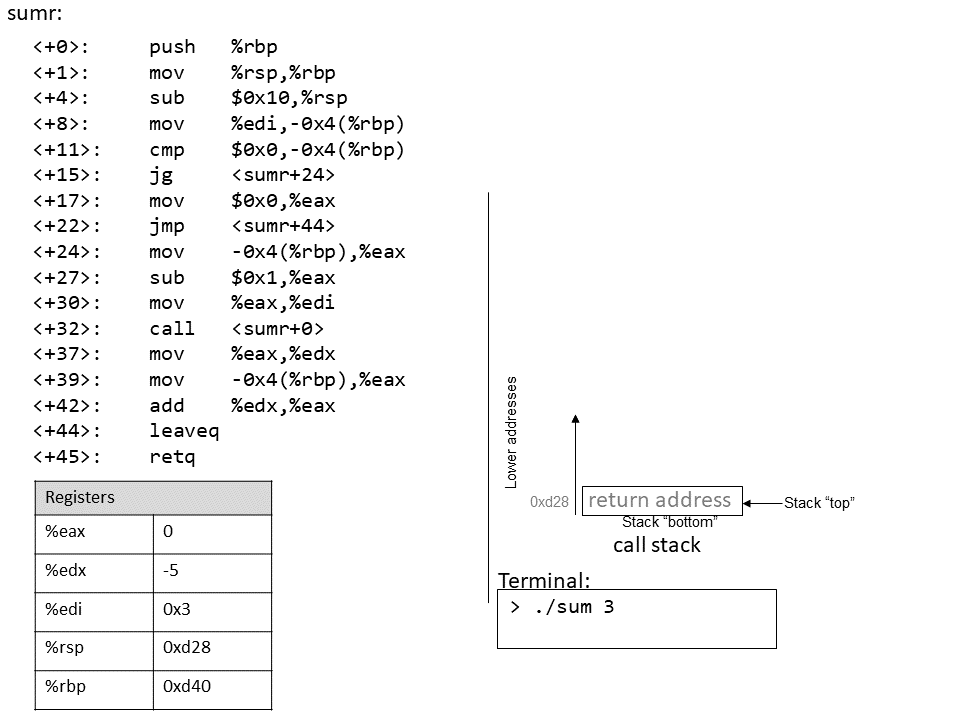

## 7.6. Đệ quy (Recursion)

**Hàm đệ quy** là một lớp đặc biệt của hàm, trong đó hàm tự gọi lại chính nó (còn gọi là **self-referential function**) để tính toán một giá trị. Giống như các hàm không đệ quy, hàm đệ quy tạo ra **stack frame** mới cho mỗi lần gọi hàm. Khác với hàm thông thường, hàm đệ quy chứa lời gọi hàm tới chính nó.

Hãy cùng quay lại bài toán tính tổng các số nguyên dương từ *1* đến *n*. Ở các phần trước, chúng ta đã thảo luận về hàm `sumUp` để thực hiện nhiệm vụ này. **Bảng 1** dưới đây cho thấy một hàm liên quan có tên `sumDown` (cộng các số theo thứ tự ngược từ *n* về *1*) và phiên bản đệ quy tương đương `sumr`:

#### Phiên bản lặp (`sumDown`)
```c
int sumDown(int n) {
    int total = 0;
    int i = n;
    while (i > 0) {
        total += i;
        i--;
    }
    return total;
}
```

#### Phiên bản đệ quy (`sumr`)
```c
int sumr(int n) {
    if (n <= 0) {
        return 0;
    }
    return n + sumr(n-1);
}
```

**Bảng 1.** Phiên bản lặp (sumDown) và phiên bản đệ quy (sumr)

**Base case** (trường hợp cơ sở) trong hàm đệ quy `sumr` xử lý mọi giá trị *n* nhỏ hơn 1. **Bước đệ quy** gọi `sumr` với giá trị *n-1* và cộng kết quả với *n* trước khi trả về. Khi biên dịch `sumr` và dùng GDB để disassemble, ta thu được code assembly sau:

```
Dump of assembler code for function sumr:
0x400551 <+0>:    push  %rbp               # lưu %rbp
0x400552 <+1>:    mov   %rsp,%rbp          # cập nhật %rbp (stack frame mới)
0x400555 <+4>:    sub   $0x10,%rsp         # mở rộng stack frame thêm 16 byte
0x400559 <+8>:    mov   %edi,-0x4(%rbp)    # đưa tham số n vào %rbp-0x4
0x40055c <+11>:   cmp   $0x0,-0x4(%rbp)    # so sánh n với 0
0x400560 <+15>:   jg    0x400569 <sumr+24> # nếu (n > 0) goto <sumr+24> [body]
0x400562 <+17>:   mov   $0x0,%eax          # copy 0 vào %eax
0x400567 <+22>:   jmp   0x40057d <sumr+44> # goto <sumr+44> [done]
0x400569 <+24>:   mov   -0x4(%rbp),%eax    # copy n vào %eax (result = n)
0x40056c <+27>:   sub   $0x1,%eax          # trừ 1 khỏi %eax (result -= 1)
0x40056f <+30>:   mov   %eax,%edi          # copy %eax vào %edi
0x400571 <+32>:   callq 0x400551 <sumr>    # gọi sumr(result)
0x400576 <+37>:   mov   %eax,%edx          # copy giá trị trả về vào %edx
0x400578 <+39>:   mov   -0x4(%rbp),%eax    # copy n vào %eax
0x40057b <+42>:   add   %edx,%eax          # cộng sumr(result) vào n
0x40057d <+44>:   leaveq                   # chuẩn bị thoát hàm
0x40057e <+45>:   retq                     # trả về kết quả
```

Mỗi dòng trong đoạn assembly trên đều đã được chú thích bằng tiếng Việt. **Bảng 2** dưới đây cho thấy dạng `goto` tương ứng và phiên bản C không dùng `goto`:


#### Phiên bản C dùng `goto`
```c
int sumr(int n) {
    int result;
    if (n > 0) {
        goto body;
    }
    result = 0;
    goto done;
body:
    result = n;
    result -= 1;
    result = sumr(result);
    result += n;
done:
    return result;
}
```

#### Phiên bản C không dùng `goto`
```c
int sumr(int n) {
    int result;
    if (n <= 0) {
        return 0;
    }
    result = sumr(n-1);
    result += n;
    return result;
}
```


**Bảng 2.** Dạng C dùng `goto` và bản dịch code assembly của `sumr`

Mặc dù bản dịch này ban đầu có thể trông không giống hệt hàm `sumr` gốc, nhưng khi xem xét kỹ, ta thấy hai hàm này thực sự tương đương.

### 7.6.1. Hoạt hình: Quan sát sự thay đổi của Call Stack

Như một bài tập, bạn nên thử vẽ lại stack và quan sát cách các giá trị thay đổi. Hình động dưới đây minh họa cách stack được cập nhật khi chúng ta chạy hàm này với giá trị 3.

