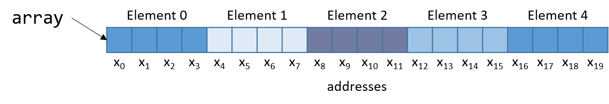

## 8.7. Mảng (Arrays)

Hãy nhớ rằng [mảng](../C1-C_intro/arrays_strings.html#_introduction_to_arrays) là tập hợp có thứ tự của các phần tử dữ liệu cùng kiểu, được lưu trữ liên tiếp trong bộ nhớ.  
Mảng một chiều được cấp phát tĩnh ([single-dimension arrays](../C2-C_depth/arrays.html#_single_dimensional_arrays)) có dạng `Type arr[N]`, trong đó:

- `Type` là kiểu dữ liệu,
- `arr` là tên định danh của mảng,
- `N` là số phần tử dữ liệu.

Khai báo mảng tĩnh như `Type arr[N]` hoặc cấp phát động như `arr = malloc(N*sizeof(Type))` sẽ cấp phát tổng cộng *N* × sizeof(*Type*) byte bộ nhớ, với `arr` trỏ tới vùng nhớ đó.

---

Để truy cập phần tử tại chỉ số *i* trong mảng `arr`, sử dụng cú pháp `arr[i]`.  
Compiler thường chuyển đổi các truy cập mảng thành [pointer arithmetic](../C2-C_depth/pointers.html#_pointer_variables) trước khi dịch sang assembly.  
Do đó:

- `arr + i` tương đương với `&arr[i]`
- `*(arr + i)` tương đương với `arr[i]`

Vì mỗi phần tử trong `arr` có kiểu `Type`, nên `arr + i` ngụ ý rằng phần tử *i* được lưu tại địa chỉ `arr + sizeof(Type) * i`.

---

**Bảng 1** liệt kê một số thao tác mảng phổ biến và lệnh assembly tương ứng.  
Giả sử:

- Thanh ghi `%edx` lưu địa chỉ của `arr`
- Thanh ghi `%ecx` lưu giá trị `i`
- Thanh ghi `%eax` biểu diễn một biến `x`

| Operation        | Type     | Assembly Representation |
|------------------|----------|-------------------------|
| `x = arr`        | `int *`  | `movl %edx, %eax`        |
| `x = arr[0]`     | `int`    | `movl (%edx), %eax`      |
| `x = arr[i]`     | `int`    | `movl (%edx, %ecx,4), %eax` |
| `x = &arr[3]`    | `int *`  | `leal 0xc(%edx), %eax`   |
| `x = arr+3`      | `int *`  | `leal 0xc(%edx), %eax`   |
| `x = *(arr+3)`   | `int`    | `movl 0xc(%edx), %eax`   |

**Bảng 1.** Các thao tác mảng phổ biến và lệnh assembly tương ứng.

---

Hãy chú ý đến **kiểu dữ liệu** của từng biểu thức trong bảng trên.  
Thông thường, compiler dùng lệnh `movl` để dereference con trỏ và lệnh `leal` để tính toán địa chỉ.

Lưu ý: để truy cập phần tử `arr[3]` (hoặc `*(arr+3)` khi dùng pointer arithmetic), compiler sẽ tìm nạp dữ liệu tại địa chỉ `arr + 3*4` thay vì `arr + 3`.  
Nguyên nhân: bất kỳ phần tử nào tại chỉ số *i* trong mảng đều được lưu tại địa chỉ `arr + sizeof(Type) * i`.  
Do đó, compiler phải nhân chỉ số với kích thước kiểu dữ liệu để tính đúng offset.  
Hãy nhớ rằng bộ nhớ được đánh địa chỉ theo byte; việc dịch chuyển đúng số byte tương đương với việc tính toán địa chỉ chính xác.

---

Ví dụ: xét một mảng (`array`) gồm 5 phần tử kiểu `int` (**Hình 1**):

  
**Hình 1.** Cách bố trí một mảng 5 số nguyên trong bộ nhớ. Mỗi ô được gắn nhãn x~i~ biểu diễn một byte, mỗi `int` chiếm 4 byte.

Vì `array` là mảng số nguyên, mỗi phần tử chiếm đúng 4 byte.  
Do đó, một mảng `int` gồm 5 phần tử sẽ tiêu tốn 20 byte bộ nhớ liên tiếp.

Để tính địa chỉ của phần tử thứ 3, compiler nhân chỉ số 3 với kích thước kiểu `int` (4) để được offset 12.  
Quả thật, phần tử thứ 3 trong **Hình 1** nằm tại byte offset x~12~.

---

Hãy xem một hàm C đơn giản `sumArray` tính tổng tất cả các phần tử trong mảng:

```c
int sumArray(int *array, int length) {
    int i, total = 0;
    for (i = 0; i < length; i++) {
        total += array[i];
    }
    return total;
}
```

Hàm `sumArray` nhận địa chỉ của một mảng và độ dài tương ứng, sau đó cộng dồn tất cả các phần tử trong mảng.  
Tiếp theo, chúng ta sẽ xem mã assembly tương ứng của hàm `sumArray`.


```
<sumArray>:
 <+0>:  push %ebp                    # lưu ebp
 <+1>:  mov  %esp,%ebp               # cập nhật ebp (stack frame mới)
 <+3>:  sub  $0x10,%esp              # thêm 16 byte vào stack frame
 <+6>:  movl $0x0,-0x8(%ebp)         # copy 0 vào %ebp-8 (total)
 <+13>: movl $0x0,-0x4(%ebp)         # copy 0 vào %ebp-4 (i)
 <+20>: jmp  0x80484ab <sumArray+46> # goto <sumArray+46> (start)
 <+22>: mov  -0x4(%ebp),%eax         # copy i vào %eax
 <+25>: lea  0x0(,%eax,4),%edx       # copy i*4 vào %edx
 <+32>: mov  0x8(%ebp),%eax          # copy array vào %eax
 <+35>: add  %edx,%eax               # copy array+i*4 vào %eax
 <+37>: mov  (%eax),%eax             # copy *(array+i*4) vào %eax
 <+39>: add  %eax,-0x8(%ebp)         # cộng *(array+i*4) vào total
 <+42>: addl $0x1,-0x4(%ebp)         # cộng 1 vào i
 <+46>: mov  -0x4(%ebp),%eax         # copy i vào %eax
 <+49>: cmp  0xc(%ebp),%eax          # so sánh i với length
 <+52>: jl   0x8048493 <sumArray+22> # nếu i<length goto <sumArray+22> (loop)
 <+54>: mov  -0x8(%ebp),%eax         # copy total vào %eax
 <+57>: leave                        # chuẩn bị thoát hàm
 <+58>: ret                          # trả về total
```

Khi lần theo đoạn mã assembly này, hãy xem xét liệu dữ liệu được truy cập là một **địa chỉ** hay một **giá trị**.  
Ví dụ: lệnh tại `<sumArray+13>` khiến `%ebp-4` chứa một biến kiểu `int`, ban đầu được gán giá trị 0.  
Ngược lại, đối số được lưu tại `%ebp+8` là tham số đầu tiên của hàm (`array`), có kiểu `int *` và tương ứng với địa chỉ cơ sở của mảng.  
Một biến khác (chúng ta gọi là `total`) được lưu tại `%ebp-8`.

---

Hãy xem kỹ hơn 5 lệnh từ `<sumArray+22>` đến `<sumArray+39>`:

```
<+22>: mov  -0x4(%ebp),%eax      # copy i vào %eax
<+25>: lea  0x0(,%eax,4),%edx    # copy i*4 vào %edx
<+32>: mov  0x8(%ebp),%eax       # copy array vào %eax
<+35>: add  %edx,%eax            # copy array+i*4 vào %eax
<+37>: mov  (%eax),%eax          # copy *(array+i*4) vào %eax
<+39>: add  %eax,-0x8(%ebp)      # cộng *(array+i*4) vào total (total += array[i])
```

Hãy nhớ rằng compiler thường dùng `lea` để thực hiện các phép toán số học đơn giản trên toán hạng.  
Toán hạng `0x0(,%eax,4)` tương đương với `%eax*4 + 0x0`.  
Vì `%eax` đang giữ giá trị `i`, phép toán này sẽ copy giá trị `i*4` vào `%edx`.  
Tại thời điểm này, `%edx` chứa số byte cần cộng thêm để tính đúng offset của `array[i]`.

Lệnh tiếp theo (`mov 0x8(%ebp), %eax`) copy tham số đầu tiên (địa chỉ cơ sở của `array`) vào `%eax`.  
Cộng `%edx` vào `%eax` ở lệnh kế tiếp khiến `%eax` chứa `array + i*4`.  
Hãy nhớ rằng phần tử tại chỉ số *i* trong `array` được lưu tại địa chỉ `array + sizeof(T) * i`.  
Do đó, `%eax` lúc này chứa kết quả tính toán ở cấp độ assembly của địa chỉ `&array[i]`.

Lệnh tại `<sumArray+37>` *dereference* giá trị tại `%eax`, đưa giá trị `array[i]` vào `%eax`.  
Cuối cùng, `%eax` được cộng vào giá trị tại `%ebp-8` (tức `total`).  
Vì vậy, 5 lệnh từ `<sumArray+22>` đến `<sumArray+39>` tương ứng với dòng `total += array[i]` trong hàm `sumArray`.