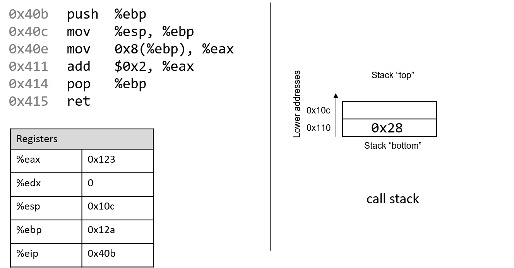

## 8.2. Các lệnh thông dụng (Common Instructions)

Trong phần này, chúng ta sẽ tìm hiểu một số lệnh x86 assembly thường gặp. **Bảng 1** liệt kê các lệnh nền tảng nhất trong x86 assembly.

| Instruction  | Translation |
|--------------|-------------|
| `mov S, D`   | S → D (sao chép giá trị của S vào D) |
| `add S, D`   | S + D → D (cộng S vào D và lưu kết quả vào D) |
| `sub S, D`   | D - S → D (trừ S *khỏi* D và lưu kết quả vào D) |

**Bảng 1.** Các lệnh thông dụng nhất.


Ví dụ, chuỗi lệnh:

```
mov    0x8(%ebp),%eax
add    $0x2,%eax
```

được dịch như sau:

- Sao chép giá trị tại vị trí `%ebp` + 0x8 trong **bộ nhớ** (M[`%ebp` + 0x8]) vào thanh ghi `%eax`.
- Cộng giá trị `0x2` vào thanh ghi `%eax` và lưu kết quả vào `%eax`.

Ba lệnh trong **Bảng 1** cũng là nền tảng để xây dựng các lệnh quản lý tổ chức của **program stack** (ngăn xếp chương trình, hay **call stack**).  
Hãy nhớ rằng thanh ghi `%ebp` và `%esp` lần lượt là **frame pointer** và **stack pointer**, được compiler dành riêng để quản lý call stack.  
Như đã đề cập trong phần [program memory](../C2-C_depth/scope_memory.html#_parts_of_program_memory_and_scope), call stack lưu trữ các biến cục bộ và tham số, đồng thời giúp chương trình theo dõi quá trình thực thi của chính nó (xem **Hình 1**).

  
**Hình 1.** Các phần trong không gian địa chỉ của một chương trình.

Trên hệ thống IA32, execution stack phát triển về phía **địa chỉ thấp hơn**. Giống như mọi cấu trúc dữ liệu stack, các thao tác diễn ra ở “đỉnh” stack.  
x86 ISA cung cấp hai lệnh (**Bảng 2**) để đơn giản hóa việc quản lý call stack.

- `push S`: Đẩy một bản sao của `S` lên đỉnh stack. Tương đương với:  

```
sub $4, %esp
mov S, (%esp)
```

- `pop D`: Lấy phần tử trên đỉnh stack ra và đặt vào `D`. Tương đương với:  

```
mov (%esp), D
add $4, %esp
```

**Bảng 2.** Các lệnh quản lý stack.

Lưu ý: trong khi ba lệnh ở phần **Bảng 1** cần **hai toán hạng**, thì `push` và `pop` trong **Bảng 2** chỉ cần **một toán hạng**.

### 8.2.1. Kết hợp tất cả: Một ví dụ cụ thể hơn

Hãy xem xét kỹ hơn hàm `adder2`:

```c
// cộng thêm 2 vào một số nguyên và trả về kết quả
int adder2(int a) {
    return a + 2;
}
```

và code assembly tương ứng của nó:

```
0804840b <adder2>:
    804840b:       55                      push   %ebp
    804840c:       89 e5                   mov    %esp,%ebp
    804840e:       8b 45 08                mov    0x8(%ebp),%eax
    8048411:       83 c0 02                add    $0x2,%eax
    8048414:       5d                      pop    %ebp
    8048415:       c3                      ret
```


Mã assembly của hàm này bao gồm một lệnh `push`, tiếp theo là một vài lệnh `mov`, một lệnh `add`, một lệnh `pop` và cuối cùng là lệnh `ret`.  
Để hiểu cách CPU thực thi tập lệnh này, chúng ta cần xem lại cấu trúc của [program memory](../C2-C_depth/scope_memory.html#_parts_of_program_memory_and_scope).  
Hãy nhớ rằng mỗi khi một chương trình được thực thi, hệ điều hành sẽ cấp phát **address space** (không gian địa chỉ) mới cho chương trình đó (còn gọi là **virtual memory** – bộ nhớ ảo).  
Khái niệm virtual memory và [processes](../C13-OS/processes.html#_processes) (tiến trình) sẽ được trình bày chi tiết hơn ở Chương 13; hiện tại, bạn chỉ cần hiểu rằng **process** là một sự trừu tượng hóa của một chương trình đang chạy, và virtual memory là vùng bộ nhớ được cấp phát cho một process.  
Mỗi process có một vùng bộ nhớ riêng gọi là **call stack**. Lưu ý rằng call stack nằm trong bộ nhớ của process/virtual memory, khác với các thanh ghi (register) vốn nằm trên CPU.

**Hình 2** minh họa trạng thái mẫu của call stack và các thanh ghi trước khi thực thi hàm `adder2`.

  
**Hình 2.** Execution stack trước khi thực thi

Hãy chú ý rằng stack phát triển về phía **địa chỉ thấp hơn**. Các thanh ghi `%eax` và `%edx` hiện đang chứa giá trị rác.  
Các địa chỉ của lệnh trong code segment của program memory (0x804840b–0x8048415) đã được rút gọn thành (0x40b–0x415) để hình minh họa dễ đọc hơn.  
Tương tự, các địa chỉ trong call stack segment đã được rút gọn thành 0x108–0x110 thay vì 0xffffd108–0xffffd110.  
Trên thực tế, địa chỉ của call stack nằm ở vùng địa chỉ cao hơn so với code segment trong program memory.

Hãy chú ý đến giá trị ban đầu (giả định) của các thanh ghi `%esp` và `%ebp`: lần lượt là `0x10c` và `0x12a`.  
Call stack hiện có giá trị `0x28` (tức 40) tại địa chỉ stack `0x110` (lý do và cách giá trị này xuất hiện sẽ được giải thích trong phần [functions](functions.html#_functions_in_assembly)).  
Mũi tên ở góc trên bên trái trong các hình tiếp theo biểu thị lệnh đang được thực thi.  
Thanh ghi `%eip` (instruction pointer) cho biết lệnh tiếp theo sẽ được thực thi. Ban đầu, `%eip` chứa địa chỉ `0x40b`, tương ứng với lệnh đầu tiên trong hàm `adder2`.


Lệnh đầu tiên (`push %ebp`) đặt một bản sao giá trị trong `%ebp` (0x12a) lên đỉnh stack.  
Sau khi thực thi, `%eip` trỏ tới địa chỉ của lệnh tiếp theo (0x40c).  
Lệnh `push` giảm giá trị stack pointer đi 4 (tức “mở rộng” stack thêm 4 byte), dẫn đến `%esp` mới là `0x108`.  
Hãy nhớ rằng `push %ebp` tương đương với:

```
sub $4, %esp
mov %ebp, (%esp)
```

Nói cách khác, trừ 4 khỏi `%esp` và đặt bản sao nội dung của `%ebp` vào vị trí mà `%esp` trỏ tới.


Hãy nhớ rằng cú pháp của `mov` là `mov S, D`, trong đó `S` là nguồn và `D` là đích.  
Vì vậy, lệnh tiếp theo (`mov %esp, %ebp`) cập nhật `%ebp` thành 0x108.  
`%eip` tăng lên để trỏ tới lệnh kế tiếp (0x40e).


Tiếp theo, lệnh `mov 0x8(%ebp), %eax` được thực thi.  
Lệnh này phức tạp hơn một chút so với lệnh `mov` trước.  
Theo bảng toán hạng ở phần trước, `0x8(%ebp)` tương đương M[`%ebp` + 0x8].  
Vì `%ebp` = 0x108, cộng thêm 8 sẽ được 0x110.  
Tra cứu giá trị trong bộ nhớ stack tại 0x110 cho ra 0x28 (giá trị này được đặt vào stack từ trước).  
Do đó, 0x28 được copy vào `%eax`.  
`%eip` tăng lên 0x411.


Sau đó, lệnh `add $0x2, %eax` được thực thi.  
Lệnh `add S, D` sẽ tính S + D và lưu vào D.  
Vì vậy, `add $0x2, %eax` cộng 0x2 vào giá trị trong `%eax` (0x28), kết quả là 0x2A được lưu vào `%eax`.  
`%eip` tăng lên 0x414.


Lệnh tiếp theo là `pop %ebp`.  
Lệnh này “lấy” giá trị trên đỉnh stack và đặt vào `%ebp`.  
Tương đương với:

```
mov (%esp), %ebp
add $4, %esp
```

Sau khi thực thi, giá trị tại `(%esp)` (M[0x108]) được copy vào `%ebp`, nên `%ebp` = 0x12a.  
Stack pointer tăng thêm 4 (vì stack phát triển xuống địa chỉ thấp, nên khi “thu nhỏ” sẽ tăng địa chỉ).  
`%esp` mới là 0x10c, và `%eip` trỏ tới lệnh cuối cùng (0x415).

Lệnh cuối cùng là `ret`.  
Chúng ta sẽ tìm hiểu chi tiết hơn về `ret` khi bàn về lời gọi hàm, nhưng hiện tại chỉ cần biết rằng nó chuẩn bị call stack để trả về từ một hàm.  
Theo quy ước, `%eax` luôn chứa giá trị trả về (nếu có).  
Trong trường hợp này, hàm trả về 0x2A, tức 42 ở hệ thập phân.

Trước khi tiếp tục, hãy lưu ý rằng giá trị cuối cùng của `%esp` và `%ebp` lần lượt là 0x10c và 0x12a — **giống hệt** khi hàm bắt đầu thực thi.  
Đây là hành vi bình thường của call stack: nó lưu trữ biến tạm và dữ liệu của mỗi hàm khi chạy, và khi hàm kết thúc, stack trở lại trạng thái trước khi hàm được gọi.

Vì vậy, bạn sẽ thường thấy hai lệnh này ở đầu mỗi hàm:

```
push %ebp
mov %esp, %ebp
```

và hai lệnh này ở cuối mỗi hàm:

```
pop %ebp
ret
```