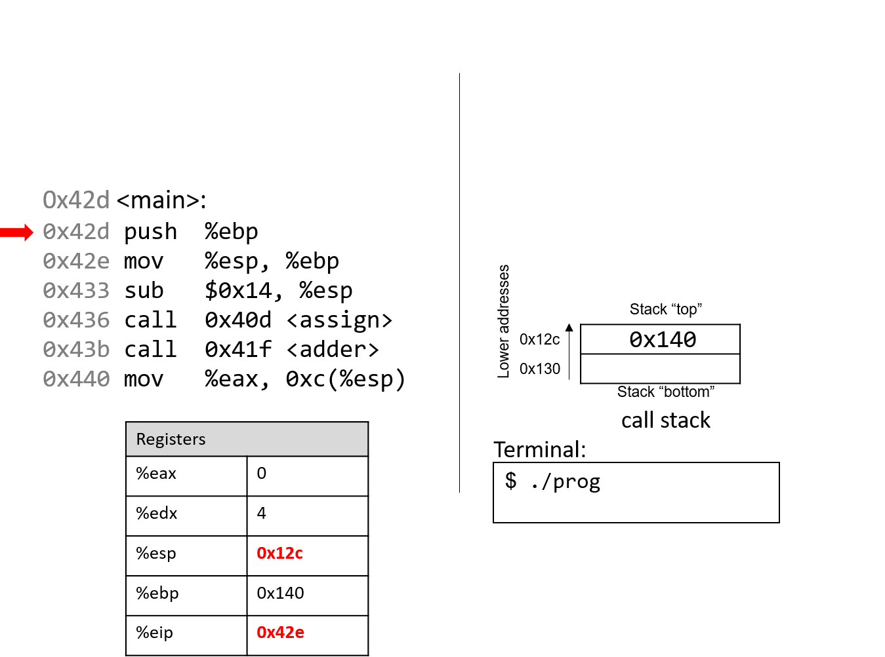

## 8.5. Functions trong Assembly

Ở phần trước, chúng ta đã lần theo quá trình thực thi của các hàm đơn giản trong assembly.  
Trong phần này, chúng ta sẽ tìm hiểu cách nhiều hàm tương tác với nhau trong assembly trong bối cảnh của một chương trình lớn hơn.  
Chúng ta cũng sẽ giới thiệu một số lệnh mới liên quan đến việc quản lý hàm.

Hãy bắt đầu bằng việc ôn lại cách **call stack** được quản lý.  
Hãy nhớ rằng `%esp` là **stack pointer** (con trỏ stack) và luôn trỏ tới đỉnh của stack.  
Thanh ghi `%ebp` là **base pointer** (hay **frame pointer**) và trỏ tới đáy của **stack frame** hiện tại.  

**Stack frame** (còn gọi là **activation frame** hoặc **activation record**) là phần của stack được cấp phát cho một lần gọi hàm.  
Hàm đang thực thi luôn nằm ở đỉnh stack, và stack frame của nó được gọi là **active frame**.  
Active frame được giới hạn bởi stack pointer (ở đỉnh stack) và frame pointer (ở đáy frame).  
Activation record thường chứa các biến cục bộ và tham số của hàm.

Hình 1 cho thấy các stack frame của `main` và một hàm mà nó gọi tên là `fname`.  
Chúng ta sẽ gọi hàm `main` là *caller* (hàm gọi) và `fname` là *callee* (hàm được gọi).

  
*Hình 1. Quản lý stack frame*

Trong Hình 1, **active frame** (stack frame đang hoạt động) thuộc về hàm callee (`fname`).  
Vùng bộ nhớ giữa stack pointer và frame pointer được dùng để lưu các biến cục bộ.  
Stack pointer sẽ thay đổi khi các giá trị cục bộ được push hoặc pop khỏi stack.  
Ngược lại, frame pointer hầu như giữ nguyên, trỏ tới điểm bắt đầu (đáy) của stack frame hiện tại.  
Vì lý do này, các compiler như GCC thường tham chiếu tới các giá trị trên stack dựa theo frame pointer.  

Trong Hình 1, active frame được giới hạn phía dưới bởi base pointer của `fname`, chứa địa chỉ stack `0x418`.  
Giá trị lưu tại địa chỉ này là giá trị `%ebp` đã được “lưu” (`0x42c`), bản thân nó chỉ ra đáy của activation frame của hàm `main`.  
Đỉnh của activation frame của `main` được giới hạn bởi **return address**, cho biết địa chỉ trong chương trình mà `main` sẽ tiếp tục thực thi khi hàm callee kết thúc.

> **Return address trỏ tới bộ nhớ chương trình, không phải bộ nhớ stack**  
> Hãy nhớ rằng vùng call stack (stack memory) của một chương trình khác với vùng code (code memory).  
> `%ebp` và `%esp` trỏ tới các vị trí trong stack memory, còn `%eip` trỏ tới một vị trí trong *code* memory.  
> Nói cách khác, return address là một địa chỉ trong code memory, không phải stack memory:
>
>   
> *Hình 2. Các phần trong không gian địa chỉ của một chương trình*

---

**Bảng 1. Các lệnh quản lý hàm thông dụng**

| Instruction | Translation |
|-------------|-------------|
| `leave` | Chuẩn bị stack để thoát khỏi hàm. Tương đương:  
`mov %ebp, %esp`  
`pop %ebp` |
| `call addr <fname>` | Chuyển active frame sang hàm callee. Tương đương:  
`push %eip`  
`mov addr, %eip` |
| `ret` | Khôi phục active frame về hàm caller. Tương đương:  
`pop %eip` |

Ví dụ, lệnh `leave` là dạng viết tắt mà compiler dùng để khôi phục stack pointer và frame pointer khi chuẩn bị thoát khỏi hàm.  
Khi hàm callee kết thúc, `leave` đảm bảo frame pointer được **khôi phục** về giá trị trước đó.

Hai lệnh `call` và `ret` đóng vai trò quan trọng khi một hàm gọi hàm khác.  
Cả hai đều thay đổi instruction pointer (`%eip`).  
Khi hàm caller thực thi `call`, giá trị hiện tại của `%eip` được lưu trên stack như return address — địa chỉ trong chương trình mà caller sẽ tiếp tục thực thi khi callee kết thúc.  
`call` cũng thay thế giá trị `%eip` bằng địa chỉ của hàm callee.

Lệnh `ret` khôi phục `%eip` từ giá trị lưu trên stack, đảm bảo chương trình tiếp tục tại địa chỉ được chỉ định trong hàm caller.  
Bất kỳ giá trị trả về nào từ callee sẽ được lưu trong `%eax`.  
`ret` thường là lệnh cuối cùng trong mọi hàm.

---

### 8.5.1. Lần theo một ví dụ

Dựa trên kiến thức về quản lý hàm, hãy lần theo ví dụ code đã được giới thiệu ở đầu chương:

```c
#include <stdio.h>

int assign(void) {
    int y = 40;
    return y;
}

int adder(void) {
    int a;
    return a + 2;
}

int main(void) {
    int x;
    assign();
    x = adder();
    printf("x is: %d\n", x);
    return 0;
}
```

Chúng ta biên dịch code với cờ `-m32` và dùng `objdump -d` để xem mã assembly.  
Lệnh này xuất ra một file khá lớn với nhiều thông tin không cần thiết.  
Dùng `less` và chức năng tìm kiếm để trích xuất các hàm `adder`, `assign` và `main`:

```assembly
 804840d <assign>:
 804840d:       55                      push   %ebp
 804840e:       89 e5                   mov    %esp,%ebp
 8048410:       83 ec 10                sub    $0x10,%esp
 8048413:       c7 45 fc 28 00 00 00    movl   $0x28,-0x4(%ebp)
 804841a:       8b 45 fc                mov    -0x4(%ebp),%eax
 804841d:       c9                      leave
 804841e:       c3                      ret

 0804841f <adder>:
 804841f:       55                      push   %ebp
 8048420:       89 e5                   mov    %esp,%ebp
 8048422:       83 ec 10                sub    $0x10,%esp
 8048425:       8b 45 fc                mov    -0x4(%ebp),%eax
 8048428:       83 c0 02                add    $0x2,%eax
 804842b:       c9                      leave
 804842c:       c3                      ret

 0804842d <main>:
 804842d:       55                      push   %ebp
 804842e:       89 e5                   mov    %esp,%ebp
 8048433:       83 ec 20                sub    $0x14,%esp
 8048436:       e8 d2 ff ff ff          call   804840d <assign>
 804843b:       e8 df ff ff ff          call   804841f <adder>
 8048440:       89 44 24 1c             mov    %eax,0xc(%esp)
 8048444:       8b 44 24 1c             mov    0xc(%esp),%eax
 8048448:       89 44 24 04             mov    %eax,0x4(%esp)
 804844c:       c7 04 24 f4 84 04 08    movl   $0x80484f4,(%esp)
 8048453:       e8 88 fe ff ff          call   80482e0 <printf@plt>
 8048458:       b8 00 00 00 00          mov    $0x0,%eax
 804845d:       c9                      leave
 804845e:       c3                      ret
```

Mỗi hàm bắt đầu bằng một **nhãn ký hiệu** (symbolic label) tương ứng với tên hàm trong chương trình.  
Ví dụ, `<main>:` là nhãn ký hiệu cho hàm `main`.  
Địa chỉ của nhãn hàm cũng là địa chỉ của lệnh đầu tiên trong hàm đó.  
Để tiết kiệm không gian trong các hình minh họa tiếp theo, chúng ta rút gọn địa chỉ xuống 12 bit thấp.  
Ví dụ, địa chỉ chương trình `0x804842d` sẽ được hiển thị là `0x42d`.

---

### 8.5.2. Lần theo hàm main

**Hình 3** cho thấy execution stack ngay trước khi thực thi `main`.


**Hình 3** minh họa trạng thái ban đầu của các thanh ghi CPU và call stack trước khi thực thi hàm `main`.

Hãy nhớ rằng stack phát triển về phía **địa chỉ thấp hơn**.  
Trong ví dụ này, `%ebp` có giá trị địa chỉ `0x140` và `%esp` là `0x130` (cả hai giá trị này chỉ là giả định).  
Các thanh ghi `%eax` và `%edx` ban đầu chứa giá trị rác.  
Mũi tên đỏ (góc trên bên trái) chỉ ra lệnh đang được thực thi.  
Ban đầu, `%eip` chứa địa chỉ `0x42d`, là địa chỉ trong bộ nhớ chương trình của dòng đầu tiên trong hàm `main`.  
Hãy cùng lần theo quá trình thực thi của chương trình.

---



Lệnh đầu tiên **push** giá trị của `%ebp` lên stack, lưu địa chỉ `0x140`.  
Vì stack phát triển về phía địa chỉ thấp hơn, stack pointer `%esp` được cập nhật thành `0x12c` (giảm 4 byte so với `0x130`).  
Thanh ghi `%eip` tăng lên để trỏ tới lệnh tiếp theo.

---


Lệnh tiếp theo (`mov %esp, %ebp`) cập nhật giá trị của `%ebp` thành giá trị của `%esp`.  
Frame pointer (`%ebp`) giờ trỏ tới đầu stack frame của hàm `main`.  
`%eip` tiếp tục trỏ tới lệnh kế tiếp.

---


Lệnh `sub` trừ `0x14` khỏi địa chỉ trong stack pointer, “mở rộng” stack thêm 20 byte.  
`%eip` trỏ tới lệnh tiếp theo, đây là lệnh `call` đầu tiên.

---


Lệnh `call <assign>` sẽ **push** giá trị trong `%eip` (địa chỉ của lệnh *tiếp theo* sẽ thực thi) lên stack.  
Vì lệnh tiếp theo sau `call <assign>` có địa chỉ `0x43b`, giá trị này được đẩy lên stack làm **return address**.  
Hãy nhớ rằng return address cho biết chương trình sẽ tiếp tục thực thi ở đâu khi hàm kết thúc và quay lại `main`.

Sau đó, lệnh `call` sẽ đưa địa chỉ của hàm `assign` (`0x40d`) vào `%eip`, báo hiệu rằng chương trình sẽ tiếp tục thực thi trong hàm được gọi (`assign`) thay vì lệnh tiếp theo trong `main`.

---


Hai lệnh đầu tiên trong hàm `assign` là các thao tác khởi tạo mà mọi hàm đều thực hiện.  
Lệnh đầu tiên **push** giá trị trong `%ebp` (địa chỉ `0x12c`) lên stack.  
Hãy nhớ rằng địa chỉ này trỏ tới đầu stack frame của `main`.  
`%eip` trỏ tới lệnh thứ hai trong `assign`.

---


Lệnh tiếp theo (`mov %esp, %ebp`) cập nhật `%ebp` để trỏ tới đỉnh stack, đánh dấu bắt đầu stack frame của `assign`.  
Instruction pointer (`%eip`) trỏ tới lệnh kế tiếp trong `assign`.

---


Lệnh `sub` tại địa chỉ `0x410` mở rộng stack thêm 16 byte, tạo không gian lưu trữ giá trị cục bộ và cập nhật `%esp`.  
Instruction pointer tiếp tục trỏ tới lệnh kế tiếp trong `assign`.

---


Lệnh `mov` tại địa chỉ `0x413` đưa giá trị `$0x28` (tức 40) vào vị trí `-0x4(%ebp)` trên stack, tức là 4 byte phía trên frame pointer.  
Hãy nhớ rằng frame pointer thường được dùng để tham chiếu tới các vị trí trên stack.  
`%eip` trỏ tới lệnh kế tiếp trong `assign`.

---


Lệnh `mov` tại địa chỉ `0x41a` đưa giá trị `$0x28` vào thanh ghi `%eax`, là nơi lưu giá trị trả về của hàm.  
`%eip` trỏ tới lệnh `leave` trong `assign`.

---


Tại thời điểm này, hàm `assign` gần như đã thực thi xong.  
Lệnh tiếp theo được thực thi là lệnh `leave`, lệnh này chuẩn bị stack để trả về từ lời gọi hàm.  
Hãy nhớ rằng `leave` tương đương với cặp lệnh sau:

```
mov %ebp, %esp
pop %ebp
```

Nói cách khác, CPU ghi đè giá trị của stack pointer bằng giá trị của frame pointer.  
Trong ví dụ này, stack pointer ban đầu được cập nhật từ `0x100` thành `0x110`.  
Tiếp theo, CPU thực thi `pop %ebp`, lấy giá trị tại địa chỉ `0x110` (trong ví dụ này là `0x12c`) và đặt vào `%ebp`.  
Hãy nhớ rằng `0x12c` là điểm bắt đầu của stack frame dành cho `main`.  
`%esp` trở thành `0x114` và `%eip` trỏ tới lệnh `ret` trong hàm `assign`.

---


Lệnh cuối cùng trong `assign` là `ret`. Khi `ret` được thực thi, địa chỉ trả về sẽ được lấy ra khỏi stack và đưa vào thanh ghi `%eip`.  
Trong ví dụ này, `%eip` được cập nhật để trỏ tới lời gọi hàm `adder`.

---

Một số điểm quan trọng cần lưu ý tại thời điểm này:

- Stack pointer và frame pointer đã được khôi phục về giá trị trước khi gọi `assign`, phản ánh rằng stack frame của `main` lại trở thành active frame.
- Các giá trị cũ trên stack từ stack frame trước đó **không** bị xóa. Chúng vẫn tồn tại trên call stack.

---


Lời gọi hàm `adder` **ghi đè** địa chỉ trả về cũ trên stack bằng một địa chỉ trả về mới (`0x440`).  
Địa chỉ này trỏ tới lệnh sẽ được thực thi tiếp theo sau khi `adder` trả về, đó là `mov %eax, 0xc(%ebp)`.  
`%eip` lúc này trỏ tới lệnh đầu tiên trong `adder` tại địa chỉ `0x41f`.

---


Lệnh đầu tiên trong hàm `adder` lưu frame pointer của hàm gọi (`%ebp` của `main`) lên stack.

---


Lệnh tiếp theo cập nhật `%ebp` bằng giá trị hiện tại của `%esp` (địa chỉ `0x110`).  
Hai lệnh này cùng nhau thiết lập điểm bắt đầu của stack frame cho `adder`.

---


Lệnh `sub` tại địa chỉ `0x422` “mở rộng” stack thêm 16 byte.  
Lưu ý rằng việc mở rộng stack không ảnh hưởng tới các giá trị đã tồn tại trước đó trên stack.  
Những giá trị cũ sẽ vẫn nằm trên stack cho tới khi bị ghi đè.

---


Hãy chú ý tới lệnh tiếp theo:  
`mov $-0x4(%ebp), %eax`.  
Lệnh này di chuyển **một giá trị cũ** đang nằm trên stack vào thanh ghi `%eax`!  
Điều này xảy ra trực tiếp do lập trình viên quên khởi tạo biến `a` trong hàm `adder`.

---


Lệnh `add` tại địa chỉ `0x428` cộng 2 vào giá trị trong `%eax`.  
Hãy nhớ rằng IA32 truyền giá trị trả về qua `%eax`.  
Hai lệnh cuối này tương đương với đoạn code trong `adder`:

```c
int a;
return a + 2;
```

---


Sau khi `leave` được thực thi, frame pointer lại trỏ tới đầu stack frame của `main` (`0x12c`).  
Stack pointer lúc này chứa địa chỉ `0x114`.

---


Lệnh `ret` lấy địa chỉ trả về ra khỏi stack, khôi phục `%eip` về `0x440` — địa chỉ của lệnh tiếp theo trong `main`.  
`%esp` lúc này là `0x118`.

---


Lệnh `mov %eax, 0xc(%esp)` đặt giá trị trong `%eax` vào vị trí cách `%esp` 12 byte (tức ba ô nhớ).

---


Bỏ qua một vài bước, các lệnh `mov` tại địa chỉ `0x444` và `0x448` gán `%eax` bằng giá trị lưu tại `%esp+12` (`0x2A`) và đặt `0x2A` vào vị trí ngay dưới đỉnh stack (`%esp + 4`, tức `0x11c`).

---


Lệnh tiếp theo (`mov $0x80484f4, (%esp)`) sao chép một hằng số là địa chỉ bộ nhớ lên đỉnh stack.  
Địa chỉ này (`0x80484f4`) chứa chuỗi `"x is %d\n"`.  
`%eip` trỏ tới lời gọi hàm `printf` (`<printf@plt>`).

---


Để ngắn gọn, chúng ta sẽ không lần theo hàm `printf` (thuộc `stdio.h`).  
Tuy nhiên, theo trang hướng dẫn (`man -s3 printf`), `printf` có dạng:

```c
int printf(const char * format, ...);
```

Nói cách khác, tham số đầu tiên là con trỏ tới chuỗi định dạng, các tham số tiếp theo là các giá trị được chèn vào định dạng đó.  
Các lệnh từ `0x444` đến `0x45c` tương ứng với dòng code trong `main`:

```c
printf("x is %d\n", x);
```

---

Khi `printf` được gọi:

- Địa chỉ trả về (lệnh sẽ thực thi sau `printf`) được đẩy lên stack.
- Giá trị `%ebp` được đẩy lên stack, và `%ebp` được cập nhật để trỏ tới đỉnh stack, đánh dấu bắt đầu stack frame của `printf`.

Tại một thời điểm nào đó, `printf` sẽ truy cập các tham số của nó: chuỗi `"x is %d\n"` và giá trị `0x2A`.  
Hãy nhớ rằng địa chỉ trả về nằm ngay dưới `%ebp` tại `%ebp+4`.  
Tham số đầu tiên nằm tại `%ebp+8` (ngay dưới địa chỉ trả về), tham số thứ hai tại `%ebp+12`.

Với một hàm có *n* tham số, GCC đặt tham số thứ nhất tại `%ebp+8`, tham số thứ hai tại `%ebp+12`, và tham số thứ *n* tại `(%ebp+8) + (4*(n-1))`.

---

Sau khi `printf` được gọi, giá trị `0x2A` được in ra màn hình ở dạng số nguyên, tức là in ra **42**.

---


Sau khi gọi `printf`, một vài lệnh cuối sẽ dọn dẹp stack và chuẩn bị thoát khỏi `main`.  
Đầu tiên, giá trị `0x0` được đặt vào `%eax`, báo hiệu rằng `main` trả về 0.  
Hãy nhớ rằng chương trình trả về 0 để biểu thị kết thúc thành công.

---


Sau khi `leave` và `ret` được thực thi, stack pointer và frame pointer trở về giá trị ban đầu trước khi `main` chạy.  
Với `0x0` trong `%eax`, chương trình trả về 0.

---

Nếu bạn đã đọc kỹ phần này, bạn sẽ hiểu vì sao chương trình in ra giá trị **42**.  
Về bản chất, chương trình đã vô tình sử dụng các giá trị cũ trên stack, khiến nó hoạt động theo cách không mong đợi.  
Ví dụ này khá vô hại, nhưng ở các phần sau, chúng ta sẽ thấy cách hacker lợi dụng lời gọi hàm để khiến chương trình hoạt động sai lệch theo hướng thực sự nguy hiểm.