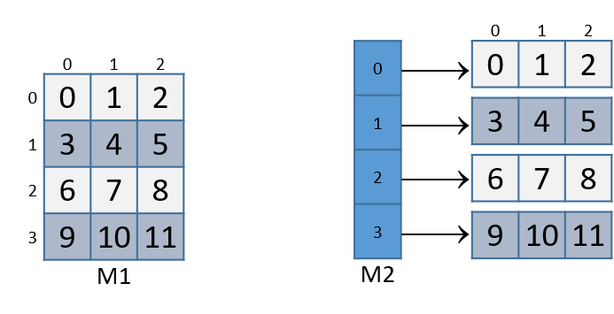

 


## 8.8. Matrices 

A matrix is a two-dimensional (2D) array. A matrix in the C language can
be statically allocated as a 2D array (`M[n][m]`), dynamically allocated
with a single call to `malloc`, or dynamically allocated as an array of
arrays. Let's consider the array of arrays implementation. The first
array contains `n` elements (`M[n]`), and each element `M[i]` in our
matrix contains an array of `m` elements. The following code snippets
each declare matrices of size 4 × 3:


```
//statically allocated matrix (allocated on stack)
int M1[4][3];

//dynamically allocated matrix (programmer friendly, allocated on heap)
int **M2, i;
M2 = malloc(4 * sizeof(int*));
for (i = 0; i < 4; i++) {
    M2[i] = malloc(3 * sizeof(int));
}
```


In the case of the dynamically allocated matrix, the main array contains
a contiguous array of `int` pointers. Each integer pointer points to a
different array in memory. Figure 1 illustrates how we
would normally visualize each of these matrices.





Figure 1. Illustration of a statically allocated (M1) and a dynamically
allocated (M2) 3x4 matrix


For both of these matrix declarations, element (*i*,*j*) can be accessed
using the double-indexing syntax `M[i][j]`, where `M` is either `M1` or
`M2`. However, these matrices are organized differently in memory. Even
though both store the elements in their primary array contiguously in
memory, our statically allocated matrix also stores all the rows
contiguously in memory, as shown in Figure 2.


Figure 2. Matrix M1's memory layout in row-major order


This contiguous ordering is not guaranteed for `M2`. [Recall
that](../C2-C_depth/arrays.html#_two_dimensional_array_memory_layout)
to contiguously allocate an *n* × *m* matrix on the heap, we should use
a single call to `malloc` that allocates *n* × *m* elements:


```
//dynamic matrix (allocated on heap, memory efficient way)
#define ROWS 4
#define COLS 3
int *M3;
M3  = malloc(ROWS * COLS * sizeof(int));
```


Recall that with the declaration of `M3`, element (*i*,*j*) *cannot* be
accessed using the `M[i][j]` notation. Instead, we must index the
element using the format `M3[i*cols + j]`.


### 8.8.1. Contiguous Two-Dimensional Arrays 

Consider a function `sumMat` that takes a pointer to a contiguously
allocated (either statically allocated or memory-efficiently dynamically
allocated) matrix as its first parameter, along with the numbers of rows
and columns, and returns the sum of all the elements inside the matrix.


We use scaled indexing in the code snippet that follows because it
applies to both statically and dynamically allocated contiguous
matrices. Recall that the syntax `m[i][j]` does not work with the
memory-efficient contiguous dynamic allocation previously discussed.


```
int sumMat(int *m, int rows, int cols) {
    int i, j, total = 0;
    for (i = 0; i < rows; i++){
        for (j = 0; j < cols; j++){
            total += m[i*cols + j];
        }
    }
    return total;
}
```


Here is the corresponding assembly. Each line is annotated with its
English translation:


    <sumMat>:
    0x08048507 <+0>:  push %ebp                  #save ebp
    0x08048508 <+1>:  mov  %esp,%ebp             #update ebp (new stack frame)
    0x0804850a <+3>:  sub  $0x10,%esp            #add 4 more spaces to stack frame
    0x0804850d <+6>:  movl $0x0,-0xc(%ebp)       #copy 0 to ebp-12 (total)
    0x08048514 <+13>: movl $0x0,-0x4(%ebp)       #copy 0 to ebp-4 (i)
    0x0804851b <+20>: jmp  0x8048555 <sumMat+78> #goto <sumMat+78>
    0x0804851d <+22>: movl $0x0,-0x8(%ebp)       #copy 0 to ebp-8 (j)
    0x08048524 <+29>: jmp  0x8048549 <sumMat+66> #goto <sumMat+66>
    0x08048526 <+31>: mov  -0x4(%ebp),%eax       #copy i to eax
    0x08048529 <+34>: imul 0x10(%ebp),%eax       #multiply i * cols, place in eax
    0x0804852d <+38>: mov  %eax,%edx             #copy i*cols to edx
    0x0804852f <+40>: mov  -0x8(%ebp),%eax       #copy j to %eax
    0x08048532 <+43>: add  %edx,%eax             #add i*cols with j, place in eax
    0x08048534 <+45>: lea  0x0(,%eax,4),%edx     #mult (i*cols+j) by 4,put in edx
    0x0804853b <+52>: mov  0x8(%ebp),%eax        #copy m pointer to eax
    0x0804853e <+55>: add  %edx,%eax             #add m to (i*cols+j)*4,put in eax
    0x08048540 <+57>: mov  (%eax),%eax           #copy m[i*cols+j] to eax
    0x08048542 <+59>: add  %eax,-0xc(%ebp)       #add eax to total
    0x08048545 <+62>: addl $0x1,-0x8(%ebp)       #increment j by 1 (j+=1)
    0x08048549 <+66>: mov  -0x8(%ebp),%eax       #copy j to eax
    0x0804854c <+69>: cmp  0x10(%ebp),%eax       #compare j with cols
    0x0804854f <+72>: jl   0x8048526 <sumMat+31> #if (j < cols) goto <sumMat+31>
    0x08048551 <+74>: addl $0x1,-0x4(%ebp)       #add 1 to i (i+=1)
    0x08048555 <+78>: mov  -0x4(%ebp),%eax       #copy i to eax
    0x08048558 <+81>: cmp  0xc(%ebp),%eax        #compare i with rows
    0x0804855b <+84>: jl   0x804851d <sumMat+22> #if (i < rows) goto sumMat+22
    0x0804855d <+86>: mov  -0xc(%ebp),%eax       #copy total to eax
    0x08048560 <+89>: leave                      #prepare to leave the function
    0x08048561 <+90>: ret                        #return total


The local variables `i`, `j`, and `total` are loaded at addresses
`%ebp-4`, `%ebp-8`, and `%ebp-12` on the stack, respectively. The input
parameters `m`, `row`, and `cols` are located at locations `%ebp+8`,
`%ebp+12`, and `%ebp+16`, respectively. Using this knowledge, let's zoom
in on the component that just deals with the access of element (*i*,*j*)
in our matrix:


    0x08048526 <+31>: mov  -0x4(%ebp),%eax    # copy i to eax
    0x08048529 <+34>: imul 0x10(%ebp),%eax    # multiply i with cols, place in eax
    0x0804852d <+38>: mov  %eax,%edx          # copy i*cols to edx


The first set of instructions computes `i * cols` and places the result
in register `%edx`. Recall that for a matrix named `matrix`,
`matrix + (i * cols)` is equivalent to `&matrix[i]`.


------------------------------------------------------------------------


    0x0804852f <+40>: mov -0x8(%ebp),%eax   # copy j to eax
    0x08048532 <+43>: add %edx,%eax         # add i*cols with j, place in eax
    0x08048534 <+45>: lea 0x0(,%eax,4),%edx # multiply (i*cols+j) by 4, put in edx


The next set of instructions computes `(i * cols + j) * 4`. The compiler
multiplies the index `(i * cols) + j` by four because each element in
the matrix is a four-byte integer, and this multiplication enables the
compiler to calculate the correct offset.


------------------------------------------------------------------------

The last set of instructions adds the calculated offset to the matrix
pointer and dereferences it to yield the value of element (*i*,*j*):


    0x0804853b <+52>: mov 0x8(%ebp),%eax    # copy m pointer to eax
    0x0804853e <+55>: add %edx,%eax         # add m to (i*cols+j)*4, place in eax
    0x08048540 <+57>: mov (%eax),%eax       # copy m[i*cols+j] to eax
    0x08048542 <+59>: add %eax,-0xc(%ebp)   # add eax to total


The first instruction loads the address of matrix `m` into register
`%eax`. The `add` instruction adds the offset `(i*cols + j)*4` to the
address of `m` to correctly calculate the address of element (*i*,*j*),
and then places this address in register `%eax`. The third instruction
dereferences `%eax` and places the resulting value in register `%eax`.
The last instruction adds the value in `%eax` to the accumulator
`total`, which is located at stack address `%ebp-0xc`.


Let's consider how element (1,2) is accessed in [Figure
2](#Matrices732).


Figure 3. Matrix M1's memory layout in row-major order


Element (1,2) is located at address `M1 + (1 * COLS) + 2`. Since `COLS`
= 3, element (1,2) corresponds to `M1+5`. To access the element at this
location, the compiler must multiply `5` by the size of the `int` data
type (four bytes), yielding the offset `M1 + 20`, which corresponds to
byte x~20~ in the figure. Dereferencing this location yields element 5,
which is indeed element (1,2) in the matrix.


### 8.8.2. Noncontiguous Matrix 

The noncontiguous matrix implementation is a bit more complicated.
Figure 4 visualizes how `M2` may be laid out in
memory.


Figure 4. Matrix M2's noncontiguous layout in memory


Notice that the array of pointers is contiguous, and that each array
pointed to by an element of `M2` (e.g., `M2[i]`) is contiguous. However,
the individual arrays are not contiguous with one another.


The `sumMatrix` function in the following example takes an array of
integer pointers (called `matrix`) as its first parameter, and a number
of rows and columns as its second and third parameters:


```
int sumMatrix(int **matrix, int rows, int cols) {

    int i, j, total=0;

    for (i = 0; i < rows; i++) {
        for (j = 0; j < cols; j++) {
            total += matrix[i][j];
        }
    }
    return total;
}
```


Even though this function looks nearly identical to the `sumMat`
function shown earlier, the matrix accepted by this function consists of
a contiguous array of *pointers*. Each pointer contains the address of a
separate contiguous array, which corresponds to a separate row in the
matrix.


The corresponding assembly for `sumMatrix` follows. Each line is
annotated with its English translation.


    0x080484ad <+0>:  push %ebp                     # save ebp
    0x080484ae <+1>:  mov  %esp,%ebp                # update ebp (new stack frame)
    0x080484b0 <+3>:  sub  $0x10,%esp               # add 4 spaces to stack frame
    0x080484b3 <+6>:  movl $0x0,-0xc(%ebp)          # copy 0 to %ebp-12 (total)
    0x080484ba <+13>: movl $0x0,-0x4(%ebp)          # copy 0 to %ebp-4 (i)
    0x080484c1 <+20>: jmp  0x80484fa <sumMatrix+77> # goto <sumMatrix+77>
    0x080484c3 <+22>: movl $0x0,-0x8(%ebp)          # copy 0 to %ebp-8 (j)
    0x080484ca <+29>: jmp  0x80484ee <sumMatrix+65> # goto <sumMatrix+65>
    0x080484cc <+31>: mov  -0x4(%ebp),%eax          # copy i to %eax
    0x080484cf <+34>: lea  0x0(,%eax,4),%edx        # mult i by 4, place in %edx
    0x080484d6 <+41>: mov  0x8(%ebp),%eax           # copy matrix to %eax
    0x080484d9 <+44>: add  %edx,%eax                # put (i * 4) + matrix in %eax
    0x080484db <+46>: mov  (%eax),%eax              # copy matrix[i] to %eax
    0x080484dd <+48>: mov  -0x8(%ebp),%edx          # copy j to %edx
    0x080484e0 <+51>: shl  $0x2,%edx                # mult j by 4, place in %edx
    0x080484e3 <+54>: add  %edx,%eax                # put (j*4)+matrix[i] in %eax
    0x080484e5 <+56>: mov  (%eax),%eax              # copy matrix[i][j] to %eax
    0x080484e7 <+58>: add  %eax,-0xc(%ebp)          # add matrix[i][j] to total
    0x080484ea <+61>: addl $0x1,-0x8(%ebp)          # add 1 to j (j+=1)
    0x080484ee <+65>: mov  -0x8(%ebp),%eax          # copy j to %eax
    0x080484f1 <+68>: cmp  0x10(%ebp),%eax          # compare j with cols
    0x080484f4 <+71>: jl   0x80484cc <sumMatrix+31> # if j<cols goto<sumMatrix+31>
    0x080484f6 <+73>: addl $0x1,-0x4(%ebp)          # add 1 to i (i+=1)
    0x080484fa <+77>: mov  -0x4(%ebp),%eax          # copy i to %eax
    0x080484fd <+80>: cmp  0xc(%ebp),%eax           # compare i with rows
    0x08048500 <+83>: jl   0x80484c3 <sumMatrix+22> # if i<rows goto<sumMatrix+22>
    0x08048502 <+85>: mov  -0xc(%ebp),%eax          # copy total to %eax
    0x08048505 <+88>: leave                         # prepare to leave function
    0x08048506 <+89>: ret                           # return total


Again, the variables `i`, `j`, and `total` are at stack addresses
`%ebp-4`, `%ebp-8`, and `%ebp-12`, respectively. The input parameters
`m`, `row`, and `cols` are located at stack addresses `%ebp+8`,
`%ebp+12`, and `%ebp+16`, respectively.


Let's zoom in on the section that deals specifically with an access to
element (*i*,*j*), or `matrix[i][j]`:


    0x080484cc <+31>: mov -0x4(%ebp),%eax      # copy i to %eax
    0x080484cf <+34>: lea 0x0(,%eax,4),%edx    # multiply i by 4, place in %edx
    0x080484d6 <+41>: mov 0x8(%ebp),%eax       # copy matrix to %eax
    0x080484d9 <+44>: add %edx,%eax            # add i*4 to matrix, place in %eax
    0x080484db <+46>: mov (%eax),%eax          # copy matrix[i] to %eax


The five instructions between `<sumMatrix+31>` and `<sumMatrix+46>`
compute `matrix[i]`, or `*(matrix+i)`. Note that the compiler needs to
multiply `i` by four prior to adding it to `matrix` to calculate the
correct offset (recall that pointers are four bytes in size). The
instruction at `<sumMatrix+46>` then dereferences the calculated address
to get the element `matrix[i]`.


Since `matrix` is an array of `int` pointers, the element located at
`matrix[i]` is itself an `int` pointer. The *j*^th^ element in
`matrix[i]` is located at offset `j×4` in the `matrix[i]` array.


------------------------------------------------------------------------

The next set of instructions extract the *j*^th^ element in array
`matrix[i]`:


    0x080484dd <+48>: mov -0x8(%ebp),%edx    # copy j to %edx
    0x080484e0 <+51>: shl $0x2,%edx          # multiply j by 4, place in %edx
    0x080484e3 <+54>: add %edx,%eax          # add j*4 to matrix[i], place in %eax
    0x080484e5 <+56>: mov (%eax),%eax        # copy matrix[i][j] to %eax
    0x080484e7 <+58>: add %eax,-0xc(%ebp)    # add matrix[i][j] to total


The first instruction in this snippet loads variable `j` into register
`%edx`. The compiler uses the left shift (`shl`) instruction to multiply
`j` by four and stores the result in register `%edx`. The compiler then
adds the resulting value to the address located in `matrix[i]` to get
the address of `matrix[i][j]`.


Let's revisit Figure 4 and consider an example
access to `M2[1][2]`. For convenience, we reproduce the figure in
Figure 5.


Figure 5. Matrix M2's noncontiguous layout in memory


Note that `M2` starts at memory location x~0~. The compiler first
computes the address of `M2[1]` by multiplying 1 by 4 (`sizeof(int *)`)
and adding it to the address of `M2` (x~0~), yielding the new address
x~4~. A dereference of this address yields the address associated with
`M2[1]`, or x~36~. The compiler then multiplies index 2 by 4
(`sizeof(int)`), and adds the result (8) to x~36~, yielding a final
address of x~44~. The address x~44~ is dereferenced, yielding the value
5. Sure enough, the element in Figure 5 that
corresponds to `M2[1][2]` has the value 5.


