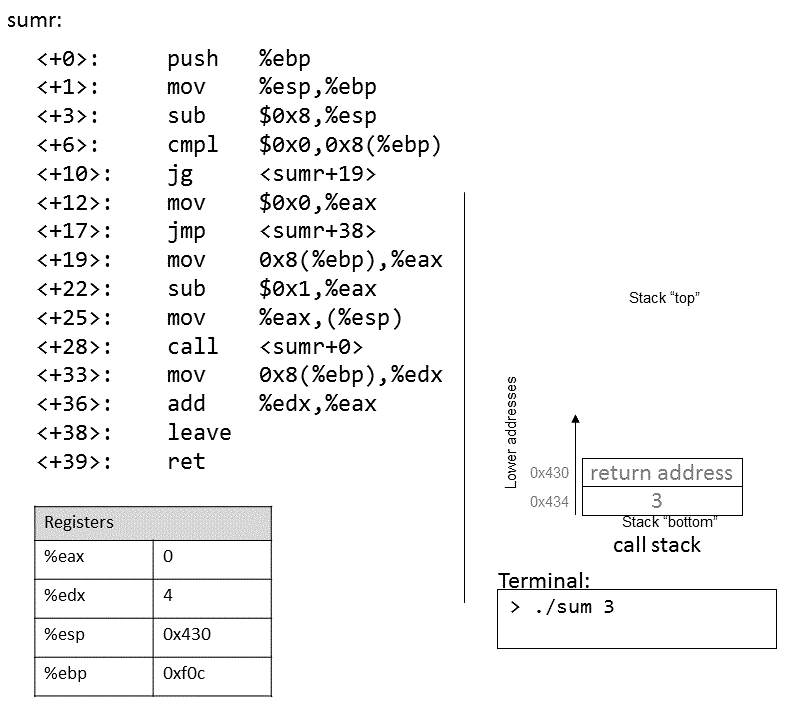

## 8.6. Đệ quy (Recursion) 

Các **recursive function** (hàm đệ quy) là một lớp đặc biệt của hàm, trong đó hàm tự gọi lại chính nó (còn được gọi là **self-referential** function — “hàm tự tham chiếu”) để tính toán một giá trị. Giống như các hàm không đệ quy, **recursive function** tạo ra các *stack frame* mới cho mỗi lần gọi hàm. Tuy nhiên, khác với các hàm thông thường, **recursive function** chứa các lời gọi hàm tới chính nó.

Hãy cùng xem lại bài toán tính tổng các số nguyên dương từ *1* đến *n*. Ở các phần trước, chúng ta đã thảo luận về hàm `sumUp` để thực hiện nhiệm vụ này. Bảng 1 dưới đây cho thấy một hàm liên quan có tên `sumDown`, hàm này cộng các số theo thứ tự ngược (*n* về *1*), và phiên bản đệ quy tương đương của nó là `sumr`:

#### Iterative (lặp): `sumDown`

```c
int sumDown(int n) {
    int total = 0;
    int i = n;
    while (i > 0) {
        total += i;
        i--;
    }
    return total;
}
```

#### Recursive (đệ quy): `sumr`

```c
int sumr(int n) {
    if (n <= 0) {
        return 0;
    }
    return n + sumr(n-1);
}
```

**Bảng 1.** Phiên bản lặp (`sumDown`) và phiên bản đệ quy (`sumr`)

Trường hợp cơ sở (*base case*) trong **recursive function** `sumr` xử lý mọi giá trị *n* nhỏ hơn 1, và bước đệ quy (*recursive step*) sẽ cộng giá trị hiện tại của *n* với kết quả của lời gọi hàm `sumr` với giá trị *n-1*. Khi biên dịch `sumr` với cờ `-m32` và dịch ngược (disassemble) bằng GDB, ta thu được đoạn mã Assembly sau:

```
0x0804841d <+0>:  push  %ebp                  # lưu ebp
0x0804841e <+1>:  mov   %esp,%ebp             # cập nhật ebp (tạo stack frame mới)
0x08048420 <+3>:  sub   $0x8,%esp             # cấp thêm 8 byte cho stack frame
0x08048423 <+6>:  cmp   $0x0,0x8(%ebp)        # so sánh ebp+8 (n) với 0
0x08048427 <+10>: jg    0x8048430 <sumr+19>   # nếu (n > 0) thì nhảy tới <sumr+19>
0x08048429 <+12>: mov   $0x0,%eax             # gán 0 vào eax (result)
0x0804842e <+17>: jmp   0x8048443 <sumr+38>   # nhảy tới <sumr+38>
0x08048430 <+19>: mov   0x8(%ebp),%eax        # gán n vào eax (result)
0x08048433 <+22>: sub   $0x1,%eax             # trừ 1 từ n (result--)
0x08048436 <+25>: mov   %eax,(%esp)           # đưa n-1 lên đỉnh stack
0x08048439 <+28>: call  0x804841d <sumr>      # gọi hàm sumr()
0x0804843e <+33>: mov   0x8(%ebp),%edx        # gán n vào edx
0x08048441 <+36>: add   %edx,%eax             # cộng n vào kết quả (result += n)
0x08048443 <+38>: leave                       # chuẩn bị thoát hàm
0x08048444 <+39>: ret                         # trả về kết quả
```

Mỗi dòng trong đoạn mã Assembly trên đều được chú thích bằng tiếng Anh. Bảng 2 dưới đây cho thấy dạng tương ứng sử dụng `goto` và chương trình C không dùng `goto`:

#### C dạng goto
```c
int sumr(int n) {
    int result;
    if (n > 0) {
        goto body;
    }
    result = 0;
    goto done;
        body:
            result = n;
            result -= 1;
            result = sumr(result);
            result += n;
        done:
    return result;
}
```

#### C không dùng goto
```c
int sumr(int n) {
    int result;
    if (n <= 0) {
        return 0;
    }
    result = sumr(n-1);
    result += n;
    return result;
}
```

**Bảng 2.** Dạng C dùng `goto` và bản dịch từ mã Assembly của `sumr`

Mặc dù bản dịch này ban đầu có thể trông không hoàn toàn giống với hàm `sumr` gốc, nhưng khi xem xét kỹ, ta thấy hai hàm này thực sự tương đương nhau.

### 8.6.1. Quan sát sự thay đổi của Call Stack 

Như một bài tập, chúng tôi khuyến khích bạn tự vẽ ra *stack* và quan sát cách các giá trị thay đổi. Ảnh dưới đây minh họa cách *stack* được cập nhật khi chúng ta chạy hàm này với giá trị 3.




