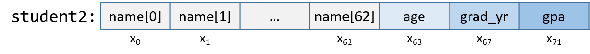

 


-   -  
        -  
        -  
        -   [8.3. Additional Arithmetic
            Instructions]()
        -   [8.4. Conditional Control and
            Loops]()
            -  
            -  
            -  
        -  
        -  
        -  
        -  
        -  
        -  
        -  


## 8.9. structs in Assembly 

A struct is another way
to create a collection of data types in C. Unlike arrays, structs enable
different data types to be grouped together. C stores a `struct` like a
single-dimension array, where the data elements (fields) are stored
contiguously.


Let's revisit `struct studentT` from Chapter 1:


```
struct studentT {
    char name[64];
    int  age;
    int  grad_yr;
    float gpa;
};

struct studentT student;
```


Figure 1 shows how `student` is laid out in memory.
For the sake of example, assume that `student` starts at address x~0~.
Each x~i~ denotes the address of a field.


Figure 1. The memory layout of the student struct


The fields are stored contiguously next to one another in memory in the
order in which they are declared. In Figure 1, the
`age` field is allocated at the memory location directly after the
`name` field (at byte offset x~64~) and is followed by the `grad_yr`
(byte offset x~68~) and `gpa` (byte offset x~72~) fields. This
organization enables memory-efficient access to the fields.


To understand how the compiler generates assembly code to work a
`struct`, consider the function `initStudent`:


```
void initStudent(struct studentT *s, char *nm, int ag, int gr, float g) {
    strncpy(s->name, nm, 64);
    s->grad_yr = gr;
    s->age = ag;
    s->gpa = g;
}
```


The `initStudent` function uses the base address of a `struct studentT`
as its first parameter, and the desired values for each field as its
remaining parameters. The listing that follows depicts this function in
assembly. In general, parameter *i* to function `initStudent` is located
at stack address `(ebp+8)` + 4 × *i*.


    <initStudent>:
     <+0>:   push  %ebp                     # save ebp
     <+1>:   mov   %esp,%ebp                # update ebp (new stack frame)
     <+3>:   sub   $0x18,%esp               # add 24 bytes to stack frame
     <+6>:   mov   0x8(%ebp),%eax           # copy first parameter (s) to eax
     <+9>:   mov   0xc(%ebp),%edx           # copy second parameter (nm) to edx
     <+12>   mov   $0x40,0x8(%esp)          # copy 0x40 (or 64) to esp+8
     <+16>:  mov   %edx,0x4(%esp)           # copy nm to esp+4
     <+20>:  mov   %eax,(%esp)              # copy s to top of stack (esp)
     <+23>:  call  0x8048320 <strncpy@plt>  # call strncpy(s->name, nm, 64)
     <+28>:  mov   0x8(%ebp),%eax           # copy s to eax
     <+32>:  mov   0x14(%ebp),%edx          # copy fourth parameter (gr) to edx
     <+35>:  mov   %edx,0x44(%eax)          # copy gr to offset eax+68 (s->grad_yr)
     <+38>:  mov   0x8(%ebp),%eax           # copy s to eax
     <+41>:  mov   0x10(%ebp),%edx          # copy third parameter (ag) to edx
     <+44>:  mov   %edx,0x40(%eax)          # copy ag to offset eax+64 (s->age)
     <+47>:  mov   0x8(%ebp),%edx           # copy s to edx
     <+50>:  mov   0x18(%ebp),%eax          # copy g to eax
     <+53>:  mov   %eax,0x48(%edx)          # copy g to offset edx+72 (s->gpa)
     <+56>:  leave                          # prepare to leave the function
     <+57>:  ret                            # return


Being mindful of the byte offsets of each field is key to understanding
this code. Here are a few things to keep in mind.


-   The `strncpy` call takes the base address of the `name` field of
    `s`, the address of array `nm`, and a length specifier as its three
    arguments. Recall that because `name` is the first field in
    `struct studentT`, the address of `s` is synonymous with the address
    of `s→name`.


     <+6>:   mov   0x8(%ebp),%eax           # copy first parameter (s) to eax
     <+9>:   mov   0xc(%ebp),%edx           # copy second parameter (nm) to edx
     <+12>   mov   $0x40,0x8(%esp)          # copy 0x40 (or 64) to esp+8
     <+16>:  mov   %edx,0x4(%esp)           # copy nm to esp+4
     <+20>:  mov   %eax,(%esp)              # copy s to top of stack (esp)
     <+23>:  call  0x8048320 <strncpy@plt>  # call strncpy(s->name, nm, 64)


-   The next part of the code (instructions `<initStudent+28>` thru
    `<initStudent+35>`) places the value of the `gr` parameter at an
    offset of 68 from the start of `s`. Revisiting the memory layout in
    Figure 1 shows that this address corresponds to
    `s→grad_yr`.


     <+28>:  mov   0x8(%ebp),%eax           # copy s to eax
     <+32>:  mov   0x14(%ebp),%edx          # copy fourth parameter (gr) to edx
     <+35>:  mov   %edx,0x44(%eax)          # copy gr to offset eax+68 (s->grad_yr)


-   The next section of code (instructions `<initStudent+38>` thru
    `<initStudent+53>`) copies the `ag` parameter to the `s→age` field.
    Afterward, the `g` parameter value is copied to the `s→gpa` field
    (byte offset 72):


     <+38>:  mov   0x8(%ebp),%eax           # copy s to eax
     <+41>:  mov   0x10(%ebp),%edx          # copy third parameter (ag) to edx
     <+44>:  mov   %edx,0x40(%eax)          # copy ag to offset eax+64 (s->age)
     <+47>:  mov   0x8(%ebp),%edx           # copy s to edx
     <+50>:  mov   0x18(%ebp),%eax          # copy g to eax
     <+53>:  mov   %eax,0x48(%edx)          # copy g to offset edx+72 (s->gpa)


### 8.9.1. Data Alignment and structs 

Consider the following modified declaration of `struct studentT`:


```
struct studentTM {
    char name[63]; //updated to 63 instead of 64
    int  age;
    int  grad_yr;
    float gpa;
};

struct studentTM student2;
```


The size of the `name` field is modified to be 63 bytes, instead of the
original 64. Consider how this affects the way the `struct` is laid out
in memory. It may be tempting to visualize it as in [Figure
2](#wrongLayout32).





Figure 2. An incorrect memory layout for the updated struct studentTM.
Note that the struct's \"name\" field is reduced from 64 to 63 bytes.


In this depiction, the `age` field occupies the byte immediately
following the `name` field. But this is incorrect. [Figure
3](#correctLayout32) depicts the actual layout in memory.


Figure 3. The correct memory layout for the updated struct studentTM.
Byte x~63~ is added by the compiler to satisfy memory alignment
constraints, but it doesn't correspond to any of the fields.


IA32's alignment policy requires that two-byte data types (i.e.,
`short`) reside at a two-byte-aligned address whereas four-byte data
types (`int`, `float`, `long`, and pointer types) reside at
four-byte-aligned addresses, and eight-byte data types (`double`,
`long long`) reside at eight-byte-aligned addresses. For a `struct`, the
compiler adds empty bytes as **padding** between fields to ensure that
each field satisfies its alignment requirements. For example, in the
`struct` declared in the previous code snippet, the compiler adds a byte
of empty space (or padding) at byte x~63~ to ensure that the `age` field
starts at an address that is at a multiple of four. Values aligned
properly in memory can be read or written in a single operation,
enabling greater efficiency.


Consider what happens when a `struct` is defined as follows:


```
struct studentTM {
    int  age;
    int  grad_yr;
    float gpa;
    char name[63];
};

struct studentTM student3;
```


Moving the `name` array to the end moves the byte of padding to the end
of the struct, ensuring that `age`, `grad_yr`, and `gpa` are four-byte
aligned.


