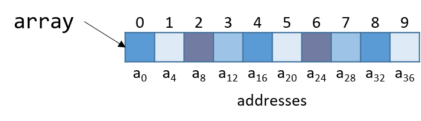

## 9.7. Mảng (Arrays) 

Hãy nhớ rằng [array](../C1-C_intro/arrays_strings.html#_introduction_to_arrays) là tập hợp có thứ tự của các phần tử dữ liệu cùng kiểu, được lưu trữ liên tiếp nhau trong bộ nhớ. **Single-dimension array** (mảng một chiều) được cấp phát tĩnh có dạng `Type arr[N]`, trong đó `Type` là kiểu dữ liệu, `arr` là tên định danh của mảng, và `N` là số phần tử dữ liệu. Khai báo mảng tĩnh như `Type arr[N]` hoặc cấp phát động như `arr = malloc(N*sizeof(Type))` sẽ chiếm tổng cộng *N* × `sizeof`(*Type*) byte bộ nhớ.

Để truy cập phần tử tại chỉ số `i` trong mảng `arr`, sử dụng cú pháp `arr[i]`. **Compiler** (trình biên dịch) thường chuyển đổi các truy cập mảng thành [pointer arithmetic](../C2-C_depth/pointers.html#_pointer_variables) trước khi dịch sang code assembly. Do đó, `arr+i` tương đương với `&arr[i]`, và `*(arr+i)` tương đương với `arr[i]`. Vì mỗi phần tử dữ liệu trong `arr` có kiểu `Type`, nên `arr+i` ngụ ý rằng phần tử `i` được lưu tại địa chỉ `arr + sizeof(Type) * i`.

Bảng 1 dưới đây tóm tắt một số thao tác mảng thường gặp và lệnh assembly tương ứng. Trong các ví dụ, giả sử ta khai báo một mảng `int` có độ dài 10 (ví dụ: `int arr[10]`). Giả sử thanh ghi `x1` lưu địa chỉ của `arr`, thanh ghi `x2` lưu giá trị `i` kiểu `int`, và thanh ghi `x0` biểu diễn một biến `x` (cũng kiểu `int`). Hãy nhớ rằng biến `int` chiếm 4 byte, trong khi biến `int *` chiếm 8 byte.

| Operation | Type | Assembly Representation |
| --- | --- | --- |
| `x = arr` | `int *` | `mov x0, x1` |
| `x = arr[0]` | `int` | `ldr w0, [x1]` |
| `x = arr[i]` | `int` | `ldr w0, [x1, x2, LSL, #2]` |
| `x = &arr[3]` | `int *` | `add x0, x1, #12` |
| `x = arr+3` | `int *` | `add x0, x1, #12` |
| `x = *(arr+5)` | `int` | `ldr w0, [x1, #20]` |

**Bảng 1.** Các thao tác mảng thường gặp và lệnh assembly tương ứng

Lưu ý rằng để truy cập phần tử `arr[5]` (hoặc `*(arr+5)` khi dùng pointer arithmetic), compiler thực hiện truy xuất bộ nhớ tại địa chỉ `arr + 5*4` thay vì `arr+5`. Để hiểu tại sao, hãy nhớ rằng bất kỳ phần tử nào tại chỉ số `i` trong mảng đều được lưu tại địa chỉ `arr + sizeof(Type) * i`. Do đó, compiler phải nhân chỉ số với kích thước kiểu dữ liệu (trong trường hợp này là 4, vì `sizeof(int) = 4`) để tính toán đúng offset. Cũng cần nhớ rằng bộ nhớ được đánh địa chỉ theo byte; việc dịch đúng số byte tương đương với việc tính toán đúng địa chỉ.

Ví dụ, xét một mảng (`array`) gồm 10 phần tử kiểu `int` ([FigArray6]).



**Hình 1.** Sơ đồ bố trí bộ nhớ của mảng gồm 10 số nguyên. Mỗi ô được gắn nhãn a~i~ biểu thị một offset 4 byte, vì mỗi số nguyên cần 4 byte để lưu trữ.

Lưu ý rằng vì `array` là mảng số nguyên, mỗi phần tử chiếm đúng 4 byte. Do đó, một mảng `int` gồm 10 phần tử sẽ chiếm 40 byte bộ nhớ liên tiếp.

Để tính địa chỉ của phần tử thứ 3, compiler nhân chỉ số 3 với kích thước dữ liệu của kiểu `int` (4) để được offset 12 (hay 0xc). Quả thật, phần tử thứ 3 trong Hình 1 nằm tại byte offset a~12~.

Hãy xem một hàm C đơn giản có tên `sumArray` dùng để tính tổng tất cả các phần tử trong mảng:

```c
int sumArray(int *array, int length) {
    int i, total = 0;
    for (i = 0; i < length; i++) {
        total += array[i];
    }
    return total;
}
```

Hàm `sumArray` nhận địa chỉ của một mảng và độ dài tương ứng, sau đó cộng dồn tất cả các phần tử trong mảng. Bây giờ, hãy xem code assembly tương ứng của hàm `sumArray`:


```
Dump of assembler code for function sumArray:
0x874 <+0>:   sub    sp, sp, #0x20       // tăng stack thêm 32 byte (tạo frame mới)
0x878 <+4>:   str    x0, [sp, #8]        // lưu x0 tại sp + 8 (địa chỉ mảng)
0x87c <+8>:   str    w1, [sp, #4]        // lưu w1 tại sp + 4 (length)
0x880 <+12>:  str    wzr, [sp, #28]      // lưu 0 tại sp + 28 (total)
0x884 <+16>:  str    wzr, [sp, #24]      // lưu 0 tại sp + 24 (i)
0x888 <+20>:  b      0x8b8 <sumArray+68> // nhảy tới <sumArray+68>
0x88c <+24>:  ldrsw  x0, [sp, #24]       // x0 = i
0x890 <+28>:  lsl    x0, x0, #2          // dịch trái i 2 bit (i << 2, hay i*4)
0x894 <+32>:  ldr    x1, [sp, #8]        // x1 = array
0x898 <+36>:  add    x0, x1, x0          // x0 = array + i*4
0x89c <+40>:  ldr    w0, [x0]            // w0 = array[i]
0x8a0 <+44>:  ldr    w1, [sp, #28]       // w1 = total
0x8a4 <+48>:  add    w0, w1, w0          // w0 = total + array[i]
0x8a8 <+52>:  str    w0, [sp, #28]       // lưu (total + array[i]) vào total
0x8ac <+56>:  ldr    w0, [sp, #24]       // w0 = i
0x8b0 <+60>:  add    w0, w0, #0x1        // w0 = w0 + 1 (i+1)
0x8b4 <+64>:  str    w0, [sp, #24]       // lưu (i + 1) vào i (i.e. i+=1)
0x8b8 <+68>:  ldr    w1, [sp, #24]       // w1 = i
0x8bc <+72>:  ldr    w0, [sp, #4]        // w0 = length
0x8c0 <+76>:  cmp    w1, w0              // so sánh i và length
0x8c4 <+80>:  b.lt   0x88c <sumArray+24> // nếu (i < length) thì nhảy tới <sumArray+24>
0x8c8 <+84>:  ldr    w0, [sp, #28]       // w0 = total
0x8cc <+88>:  add    sp, sp, #0x20       // khôi phục stack về trạng thái ban đầu
0x8d0 <+92>:  ret                        // trả về (total)
```

Khi lần theo đoạn code assembly này, hãy cân nhắc xem dữ liệu được truy cập là **pointer** (con trỏ) hay **value** (giá trị).  
Ví dụ, lệnh tại `<sumArray+12>` khiến vị trí `sp + 28` trên stack chứa một biến kiểu `int`, ban đầu được gán giá trị `0`. Ngược lại, đối số được lưu tại `sp + 8` là đối số đầu tiên của hàm (`array`), có kiểu `int *` và tương ứng với địa chỉ cơ sở của mảng. Một biến khác (gọi là `i`) được lưu tại `sp + 24` và ban đầu được gán giá trị 0.

Người đọc tinh ý sẽ nhận thấy một lệnh mới chưa gặp trước đây tại dòng `<sumArray+24>` là `ldrsw`. Lệnh `ldrsw` (viết tắt của *load register signed word*) sẽ lấy giá trị `int` 32-bit được lưu tại `sp + 24`, chuyển nó thành số nguyên 64-bit và lưu vào `x0`. Thao tác này là cần thiết vì các lệnh tiếp theo sẽ thực hiện **pointer arithmetic** (tính toán trên con trỏ). Hãy nhớ rằng trên hệ thống 64-bit, con trỏ chiếm 8 byte. Việc compiler sử dụng `ldrsw` giúp đơn giản hóa quá trình bằng cách đảm bảo mọi dữ liệu đều được lưu trong thanh ghi 64-bit đầy đủ thay vì chỉ ở dạng 32-bit.

Hãy xem kỹ hơn bảy lệnh từ `<sumArray+28>` đến `<sumArray+52>`:

```
0x890 <+28>:  lsl    x0, x0, #2             // dịch trái i 2 bit (i << 2, hay i*4)
0x894 <+32>:  ldr    x1, [sp, #8]           // x1 = array
0x898 <+36>:  add    x0, x1, x0             // x0 = array + i*4
0x89c <+40>:  ldr    w0, [x0]               // w0 = array[i]
0x8a0 <+44>:  ldr    w1, [sp, #28]          // w1 = total
0x8a4 <+48>:  add    w0, w1, w0             // w0 = total + array[i]
0x8a8 <+52>:  str    w0, [sp, #28]          // lưu (total + array[i]) vào total
```

- Compiler dùng `lsl` để dịch trái giá trị `i` trong `x0`. Sau khi lệnh này thực thi, `x0` chứa `i << 2` hay `i * 4`. Lúc này, `x0` chính là số byte cần dịch để tính đúng offset của `array[i]` (vì `sizeof(int) = 4`).
- Lệnh tiếp theo `ldr x1, [sp, #8]` nạp đối số đầu tiên của hàm (địa chỉ cơ sở của `array`) vào thanh ghi `x1`.  
- Lệnh `add x0, x1, x0` cộng địa chỉ cơ sở `x1` với offset `i*4` trong `x0`, kết quả `x0` chứa `array + i*4`. Như đã biết, phần tử tại chỉ số `i` trong `array` được lưu tại địa chỉ `array + sizeof(T) * i`, nên `x0` lúc này chính là địa chỉ `&array[i]` ở mức assembly.
- Lệnh tại `<sumArray+40>` *dereference* (giải tham chiếu) giá trị tại địa chỉ `x0`, đưa giá trị `array[i]` vào `w0`. Lưu ý việc dùng thanh ghi thành phần `w0` vì `array[i]` là giá trị `int` 32-bit.  
  Ngược lại, biến `i` trước đó đã được chuyển sang 64-bit tại `<sumArray+24>` vì nó được dùng cho *address computation* (tính toán địa chỉ). Nhắc lại, địa chỉ (pointer) được lưu dưới dạng từ 64-bit.
- Ba lệnh cuối từ `<sumArray+44>` đến `<sumArray+52>` nạp giá trị hiện tại của `total` vào `w1`, cộng `array[i]` vào, lưu kết quả vào `w0`, rồi cập nhật `total` tại `sp + 28` với tổng mới.

Vì vậy, bảy lệnh từ `<sumArray+28>` đến `<sumArray+52>` tương đương với dòng lệnh C:

```c
total += array[i];
```

trong hàm `sumArray`.
