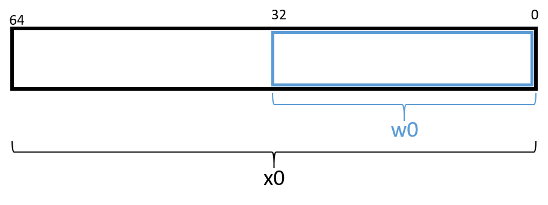

## 9.1. Bắt đầu với Assembly: Những điều cơ bản (Diving into Assembly: Basics) 

Để có cái nhìn đầu tiên về **assembly**, chúng ta sẽ chỉnh sửa hàm `adder` từ [chương giới thiệu về assembly](../C6-asm_intro/index.html#_assembly_chapter) để đơn giản hóa hành vi của nó. Phiên bản đã chỉnh sửa (`adder2`) được thể hiện dưới đây:

```c
#include <stdio.h>

//adds two to an integer and returns the result
int adder2(int a) {
    return a + 2;
}

int main(void) {
    int x = 40;
    x = adder2(x);
    printf("x is: %d\n", x);
    return 0;
}
```

Để biên dịch đoạn code này, sử dụng lệnh sau:

```
$ gcc -o adder adder.c
```

Tiếp theo, hãy xem mã assembly tương ứng của đoạn code này bằng cách sử dụng lệnh `objdump`:

```
$ objdump -d adder > output
$ less output
```

Tìm đoạn mã liên quan đến hàm `adder2` bằng cách gõ `/adder` khi đang xem file `output` với `less`. Phần liên quan đến `adder` sẽ trông tương tự như sau:

**Kết quả assembly cho hàm `adder2`**:

```
0000000000000724 <adder2>:
 724:   d10043ff        sub     sp, sp, #0x10
 728:   b9000fe0        str     w0, [sp, #12]
 72c:   b9400fe0        ldr     w0, [sp, #12]
 730:   11000800        add     w0, w0, #0x2
 734:   910043ff        add     sp, sp, #0x10
 738:   d65f03c0        ret
```

Đừng lo nếu bạn chưa hiểu chuyện gì đang diễn ra. Chúng ta sẽ tìm hiểu chi tiết hơn về assembly trong các phần sau. Hiện tại, hãy nghiên cứu cấu trúc của từng lệnh riêng lẻ.

Mỗi dòng trong ví dụ trên bao gồm: địa chỉ 64-bit của lệnh trong bộ nhớ chương trình (được rút gọn xuống 3 chữ số cuối để tiết kiệm không gian), các byte tương ứng với lệnh, và dạng biểu diễn văn bản của chính lệnh đó.  
Ví dụ: `d10043ff` là dạng mã máy của lệnh `sub sp, sp, #0x10`, và lệnh này nằm tại địa chỉ `0x724` trong bộ nhớ mã lệnh. Lưu ý rằng `0x724` là dạng rút gọn của địa chỉ 64-bit đầy đủ; `objdump` bỏ các số 0 ở đầu để dễ đọc hơn.

Điều quan trọng cần lưu ý là một dòng code C thường được dịch thành nhiều lệnh assembly.  
Ví dụ, phép toán `a + 2` được biểu diễn bởi ba lệnh tại các địa chỉ `0x728` đến `0x730`:  
`str w0, [sp, #12]`, `ldr w0, [sp, #12]`, và `add w0, w0, #0x2`.

> **Mã assembly của bạn có thể khác!**  
>  
> Nếu bạn biên dịch code cùng với chúng tôi, bạn có thể nhận thấy một số ví dụ assembly của mình trông khác. Các lệnh assembly chính xác mà compiler tạo ra phụ thuộc vào phiên bản compiler, kiến trúc phần cứng cụ thể, và hệ điều hành đang sử dụng.  
> Hầu hết các ví dụ assembly trong chương này được tạo trên Raspberry Pi 3B+ chạy hệ điều hành Ubuntu Mate 64-bit và sử dụng GCC. Nếu bạn dùng hệ điều hành khác, compiler khác, hoặc một Raspberry Pi hay máy tính nhúng khác, kết quả assembly của bạn có thể khác.  
>  
> Trong các ví dụ tiếp theo, chúng tôi **không** sử dụng bất kỳ cờ tối ưu hóa nào. Ví dụ, chúng tôi biên dịch bất kỳ file ví dụ nào (ví dụ: `example.c`) bằng lệnh:  
> `gcc -o example example.c`  
>  
> Do đó, sẽ có nhiều lệnh trông như dư thừa trong các ví dụ. Hãy nhớ rằng compiler không “thông minh” — nó chỉ đơn giản tuân theo một loạt quy tắc để dịch code dễ đọc của con người sang ngôn ngữ máy. Trong quá trình dịch này, việc xuất hiện một số lệnh dư thừa là điều bình thường.  
> Các compiler tối ưu hóa sẽ loại bỏ nhiều lệnh dư thừa này trong quá trình tối ưu, nội dung này sẽ được đề cập ở [chương sau](../C12-CodeOpt/index.html#_code_optimization).

### 9.1.1. Thanh ghi (Registers) 

Hãy nhớ rằng **register** (thanh ghi) là một đơn vị lưu trữ có kích thước bằng một từ (word-sized) nằm trực tiếp trên CPU. CPU ARMv8 có tổng cộng 31 thanh ghi dùng để lưu trữ dữ liệu 64-bit đa dụng: từ `x0` đến `x30`. Một chương trình có thể diễn giải nội dung của một thanh ghi như số nguyên hoặc như địa chỉ, nhưng bản thân thanh ghi thì không phân biệt. Chương trình có thể đọc hoặc ghi vào cả 31 thanh ghi này.

**ARMv8-A ISA** (Instruction Set Architecture — “kiến trúc tập lệnh”) cũng định nghĩa các thanh ghi chuyên dụng. Hai thanh ghi đầu tiên đáng chú ý là **stack pointer** (`sp`) và **program counter** (`pc`). Compiler dành thanh ghi `sp` để quản lý bố cục của *program stack* (ngăn xếp chương trình). Thanh ghi `pc` trỏ tới lệnh tiếp theo sẽ được CPU thực thi; khác với các thanh ghi khác, chương trình không thể ghi trực tiếp vào `pc`. Tiếp theo, **zero register** `zr` luôn lưu giá trị 0 và chỉ hữu ích khi dùng làm thanh ghi nguồn.

### 9.1.2. Ký hiệu nâng cao của thanh ghi (Advanced Register Notation) 

Vì ARMv8-A là phần mở rộng của kiến trúc ARMv7-A 32-bit, **A64 ISA** cung cấp cơ chế truy cập 32 bit thấp hơn của mỗi thanh ghi đa dụng, ký hiệu từ `w0` đến `w30`. [Hình 1](#Registera64) minh họa bố cục của thanh ghi `x0`. Nếu dữ liệu 32-bit được lưu trong *component register* `w0`, thì 32 bit cao hơn của thanh ghi sẽ không thể truy cập được và bị đặt về 0.



**Hình 1.** Bố cục *component register* của thanh ghi `%x0`.

> **Compiler có thể chọn *component register* tùy theo kiểu dữ liệu**  
>  
> Khi đọc mã assembly, hãy nhớ rằng compiler thường sử dụng thanh ghi 64-bit khi làm việc với giá trị 64-bit (ví dụ: con trỏ hoặc kiểu `long`) và sử dụng *component register* 32-bit khi làm việc với giá trị 32-bit (ví dụ: kiểu `int`).  
> Trong A64, việc xen kẽ giữa *component register* 32-bit và thanh ghi đầy đủ 64-bit là rất phổ biến. Ví dụ, trong hàm `adder2` đã trình bày trước đó, compiler tham chiếu tới *component register* `w0` thay vì `x0` vì kiểu `int` thường chiếm 32 bit (4 byte) trên hệ thống 64-bit. Nếu hàm `adder2` có tham số kiểu `long` thay vì `int`, compiler sẽ lưu `a` trong thanh ghi `x0` thay vì *component register* `w0`.

Đối với những người đã quen với **A32 ISA**, cần lưu ý rằng các thanh ghi đa dụng 32-bit `r0` đến `r12` trong A32 ISA được ánh xạ sang các *component register* `w0` đến `w12` trong A64. **A64 ISA** tăng hơn gấp đôi số lượng thanh ghi khả dụng so với A32.


### 9.1.3. Cấu trúc lệnh (Instruction Structure) 

Mỗi **instruction** (lệnh) bao gồm một **operation code** hay **opcode** (mã thao tác) xác định lệnh sẽ làm gì, và một hoặc nhiều **operand** (toán hạng) cho biết cách thực hiện.  
Đối với hầu hết các lệnh A64, định dạng thường dùng như sau:

```
opcode D, O1, O2
```

Trong đó:

- `opcode` là mã thao tác.
- `D` là **destination register** (thanh ghi đích).
- `O1` là toán hạng thứ nhất.
- `O2` là toán hạng thứ hai.

Ví dụ, lệnh `add w0, w0, #0x2` có:

- **opcode**: `add`
- **destination register**: `w0`
- Hai toán hạng: `w0` và `#0x2`.

Có nhiều loại toán hạng khác nhau:

- **Constant (literal)**: giá trị hằng, được đặt trước bởi dấu `#`.  
  Ví dụ: trong lệnh `add w0, w0, #0x2`, toán hạng `#0x2` là một giá trị hằng tương ứng với giá trị hexa `0x2`.

- **Register**: tham chiếu tới một thanh ghi cụ thể.  
  Ví dụ: lệnh `add sp, sp, #0x10` sử dụng thanh ghi **stack pointer** `sp` làm thanh ghi đích và cũng là toán hạng thứ nhất cho lệnh `add`.

- **Memory**: tham chiếu tới một giá trị trong bộ nhớ chính (RAM), thường dùng để tra cứu địa chỉ.  
  Dạng địa chỉ bộ nhớ có thể kết hợp thanh ghi và giá trị hằng.  
  Ví dụ: trong lệnh `str w0, [sp, #12]`, toán hạng `[sp, #12]` là một dạng **memory**. Nó có thể hiểu là “cộng 12 vào giá trị trong thanh ghi `sp`, rồi truy xuất giá trị tại địa chỉ đó trong bộ nhớ”. Nếu điều này nghe giống như *pointer dereference* (giải tham chiếu con trỏ), thì đúng là như vậy.

### 9.1.4. Ví dụ với toán hạng (An Example with Operands) 

Cách tốt nhất để giải thích chi tiết về toán hạng là đưa ra một ví dụ nhanh.  
Giả sử bộ nhớ chứa các giá trị sau:

| Address | Value |
| --- | --- |
| 0x804 | 0xCA |
| 0x808 | 0xFD |
| 0x80c | 0x12 |
| 0x810 | 0x1E |

Giả sử thêm rằng các thanh ghi chứa giá trị như sau:

| Register | Value |
| --- | --- |
| `x0` | 0x804 |
| `x1` | 0xC |
| `x2` | 0x2 |
| `w3` | 0x4 |

Khi đó, các toán hạng trong **Bảng 1** sẽ được đánh giá thành các giá trị tương ứng.  
Mỗi dòng trong bảng khớp một toán hạng với dạng của nó (constant, register, memory), cách dịch, và giá trị.

| Operand | Form | Translation | Value |
| --- | --- | --- | --- |
| `x0` | Register | `x0` | 0x804 |
| `[x0]` | Memory | \*(0x804) | 0xCA |
| `#0x804` | Constant | 0x804 | 0x804 |
| `[x0, #8]` | Memory | \*(`x0` + 8) hoặc \*(0x80c) | 0x12 |
| `[x0, x1]` | Memory | \*(`x0` + `x1`) hoặc \*(0x810) | 0x1E |
| `[x0, w3, SXTW]` | Memory (Sign-Extend) | \*(`x0` + SignExtend(`w3`)) hoặc \*(0x808) | 0xFD |
| `[x0, x2, LSL, #2]` | Scaled Memory | \*(`x0` + (`x2` << 2)) hoặc \*(0x80c) | 0x12 |
| `[x0, w3, SXTW, #1]` | Scaled Memory (Sign-Extend) | \*(`x0` + SignExtend(`w3` << 1)) hoặc \*(0x80c) | 0x12 |

**Bảng 1.** Ví dụ về các toán hạng

Trong Bảng 1:

- `x0` biểu thị giá trị lưu trong thanh ghi 64-bit `x0`.
- `w3` biểu thị giá trị 32-bit lưu trong *component register* `w3`.
- `[x0]` nghĩa là giá trị trong `x0` được coi là một địa chỉ, và thực hiện *dereference* (truy xuất giá trị tại địa chỉ đó). Do đó, `[x0]` tương ứng với \*(0x804) hay giá trị `0xCA`.
- Một phép toán trên thanh ghi 32-bit có thể kết hợp với thanh ghi 64-bit bằng lệnh **sign-extend word** (`SXTW`). Ví dụ: `[x0, w3, SXTW]` sẽ *sign-extend* `w3` thành giá trị 64-bit trước khi cộng vào `x0` và truy xuất bộ nhớ.
- Các dạng **scaled memory** cho phép tính toán offset bằng cách dịch trái (left shift).

Một số lưu ý quan trọng:

- Dữ liệu không thể đọc hoặc ghi trực tiếp từ bộ nhớ; ARM tuân theo mô hình **load/store**, yêu cầu dữ liệu phải được nạp vào thanh ghi trước khi thao tác, và ghi trở lại bộ nhớ sau khi hoàn tất.
- Thành phần đích (destination) của một lệnh luôn phải là một thanh ghi.

Bảng 1 được cung cấp như tài liệu tham khảo; tuy nhiên, việc hiểu rõ các dạng toán hạng chính sẽ giúp bạn đọc nhanh hơn và chính xác hơn khi phân tích mã assembly.

