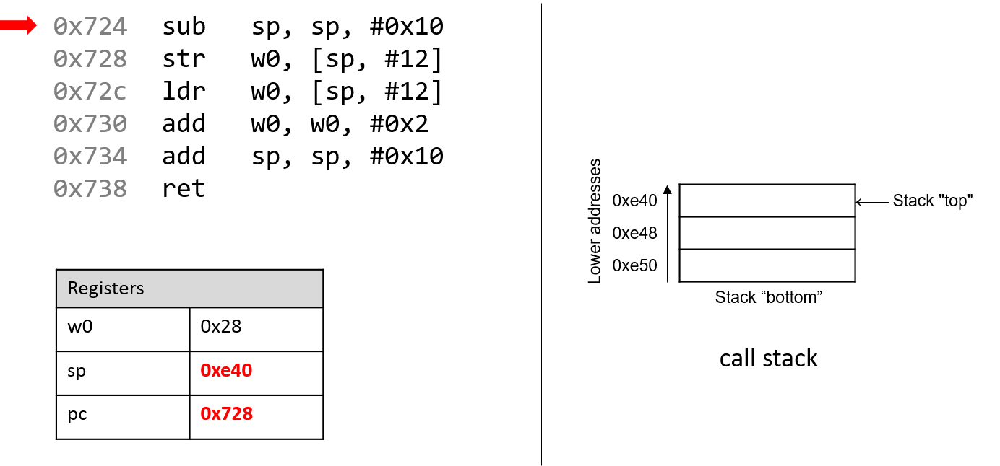
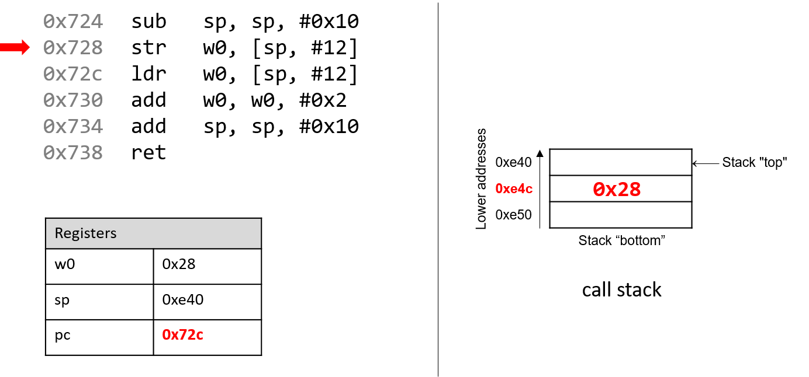
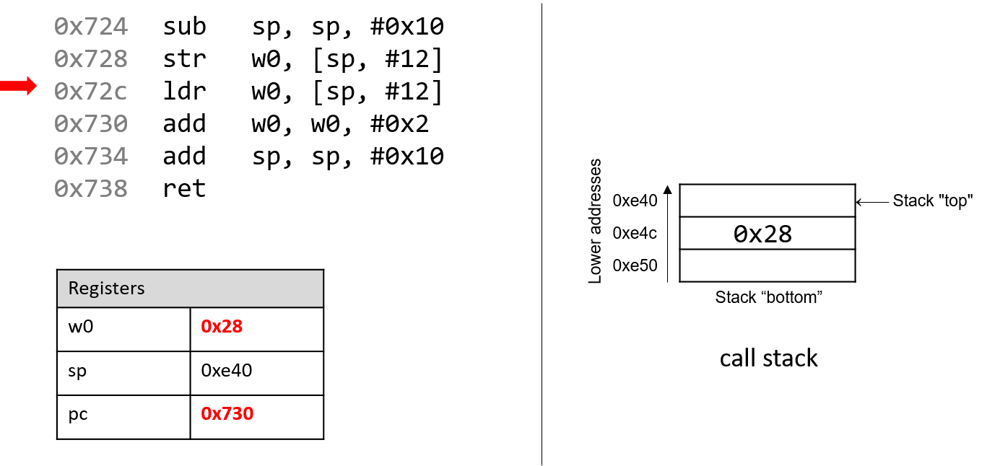
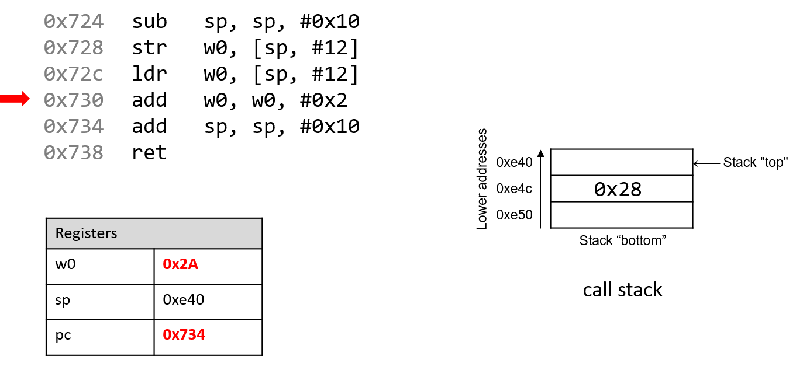
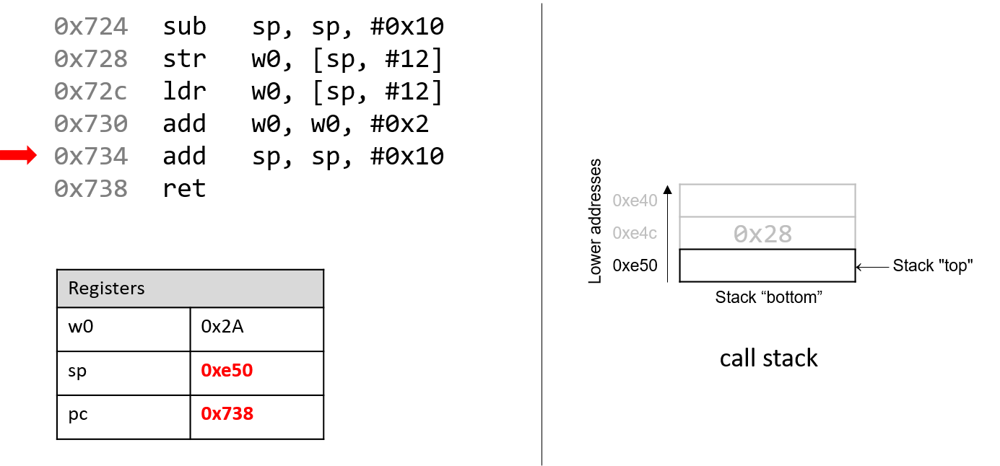
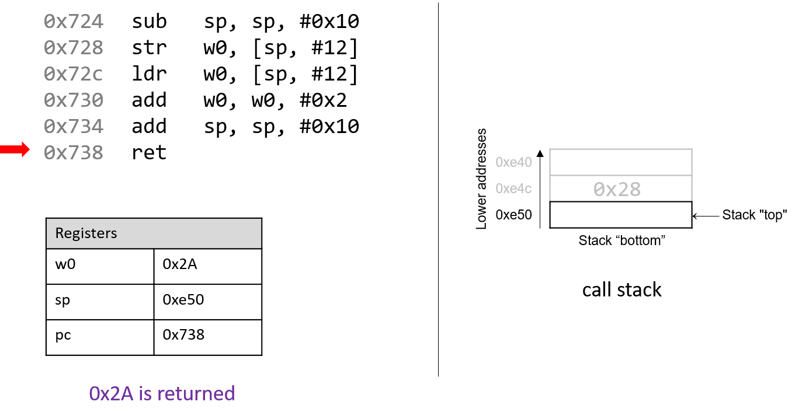

## 9.2. Các lệnh thông dụng (Common Instructions)  

Trong phần này, chúng ta sẽ thảo luận về một số lệnh ARM assembly thường gặp. **Bảng 1** liệt kê các lệnh nền tảng nhất trong ARM assembly.

| Instruction | Translation |
| --- | --- |
| `ldr D, [addr]` | D = \*(addr) (nạp giá trị trong bộ nhớ vào thanh ghi D) |
| `str S, [addr]` | \*(addr) = S (lưu giá trị S vào vị trí bộ nhớ \*(addr)) |
| `mov D, S` | D = S (sao chép giá trị của S vào D) |
| `add D, O1, O2` | D = O1 + O2 (cộng O1 với O2 và lưu kết quả vào D) |
| `sub D, O1, O2` | D = O1 - O2 (lấy O1 trừ O2 và lưu kết quả vào D) |

**Bảng 1.** Các lệnh thông dụng nhất

Vì vậy, chuỗi lệnh:

```
str     w0, [sp, #12]
ldr     w0, [sp, #12]
add     w0, w0, #0x2
```

được dịch như sau:

- Lưu giá trị trong thanh ghi `w0` vào vị trí *bộ nhớ* được chỉ định bởi `sp + 12` (hay `*(sp + 12)`).
- Nạp giá trị *từ* vị trí bộ nhớ `sp + 12` (hay `*(sp + 12)`) vào thanh ghi `w0`.
- Cộng giá trị `0x2` vào thanh ghi `w0` và lưu kết quả vào `w0` (hay `w0 = w0 + 0x2`).

Các lệnh `add` và `sub` trong **Bảng 1** cũng hỗ trợ việc duy trì tổ chức của **program stack** (hay **call stack**). Hãy nhớ rằng **stack pointer** (`sp`) được compiler dành riêng để quản lý call stack. Như đã đề cập trong phần [program memory](../C2-C_depth/scope_memory.html#_parts_of_program_memory_and_scope), call stack thường lưu trữ các biến cục bộ và tham số, đồng thời giúp chương trình theo dõi quá trình thực thi của chính nó (xem **Hình 1**). Trên các hệ thống ARM, execution stack phát triển về phía *địa chỉ thấp hơn*. Giống như mọi cấu trúc dữ liệu stack, các thao tác diễn ra ở “đỉnh” của call stack; do đó `sp` “trỏ” tới đỉnh stack, và giá trị của nó là địa chỉ của đỉnh stack.

  

**Hình 1.** Các phần của không gian địa chỉ của một chương trình

Các lệnh `ldp` và `stp` trong **Bảng 2** hỗ trợ di chuyển nhiều vị trí bộ nhớ cùng lúc, thường là đưa dữ liệu vào hoặc ra khỏi program stack. Trong **Bảng 2**, thanh ghi `x0` chứa một địa chỉ bộ nhớ.

| Instruction | Translation |
| --- | --- |
| `ldp D1, D2, [x0]` | D1 = \*(x0), D2 = \*(x0+8) (nạp giá trị tại x0 và x0+8 vào các thanh ghi D1 và D2) |
| `ldp D1, D2, [x0, #0x10]!` | x0 = x0 + 0x10, *sau đó* D1 = \*(x0), D2 = \*(x0+8) |
| `ldp D1, D2, [x0], #0x10` | D1 = \*(x0), D2 = \*(x0+8), *sau đó* x0 = x0 + 0x10 |
| `stp S1, S2, [x0]` | \*(x0) = S1, \*(x0+8) = S2 (lưu S1 và S2 vào các vị trí \*(x0) và \*(x0+8)) |
| `stp S1, S2, [x0, #-16]!` | x0 = x0 - 16, *sau đó* \*(x0) = S1, \*(x0+8) = S2 |
| `stp S1, S2, [x0], #-16` | \*(x0) = S1, \*(x0+8) = S2, *sau đó* x0 = x0 - 16 |

**Bảng 2.** Một số lệnh truy cập nhiều vị trí bộ nhớ

Tóm lại, lệnh `ldp` nạp một cặp giá trị từ địa chỉ trong thanh ghi `x0` và từ địa chỉ `x0 + 0x8` vào các thanh ghi đích D1 và D2. Ngược lại, lệnh `stp` lưu cặp giá trị từ các thanh ghi nguồn S1 và S2 vào địa chỉ trong `x0` và `x0 + 0x8`. Giả định ở đây là các giá trị trong thanh ghi có kích thước 64-bit. Nếu dùng thanh ghi 32-bit, các offset bộ nhớ sẽ là `x0` và `x0 + 0x4`.

Ngoài ra, `ldp` và `stp` còn có hai dạng đặc biệt cho phép cập nhật `x0` đồng thời. Ví dụ, lệnh `stp S1, S2, [x0, #-16]!` nghĩa là trước tiên trừ `x0` đi 16 byte, sau đó lưu S1 và S2 vào `[x0]` và `[x0+0x8]`. Ngược lại, lệnh `ldp D1, D2, [x0], #0x10` nghĩa là trước tiên nạp giá trị tại `[x0]` và `[x0+8]` vào D1 và D2, rồi cộng thêm 16 byte vào `x0`. Các dạng đặc biệt này thường được dùng ở phần đầu và cuối của các hàm có nhiều lời gọi hàm khác, như chúng ta sẽ thấy [sau này](functions.html#_tracing_through_an_example).

### 9.2.1. Kết hợp tất cả: Một ví dụ cụ thể hơn  

Hãy xem xét kỹ hơn hàm `adder2`:

```c
//adds two to an integer and returns the result
int adder2(int a) {
    return a + 2;
}
```

Và mã assembly tương ứng:

```
0000000000000724 <adder2>:
 724:   d10043ff        sub     sp, sp, #0x10
 728:   b9000fe0        str     w0, [sp, #12]
 72c:   b9400fe0        ldr     w0, [sp, #12]
 730:   11000800        add     w0, w0, #0x2
 734:   910043ff        add     sp, sp, #0x10
 738:   d65f03c0        ret
```


Mã assembly bao gồm một lệnh `sub`, tiếp theo là các lệnh `str` và `ldr`, hai lệnh `add`, và cuối cùng là một lệnh `ret`.  
Để hiểu cách CPU thực thi tập lệnh này, chúng ta cần xem lại cấu trúc của [program memory](../C2-C_depth/scope_memory.html#_parts_of_program_memory_and_scope).  
Hãy nhớ rằng mỗi khi một chương trình được thực thi, hệ điều hành sẽ cấp phát **address space** (không gian địa chỉ) mới cho chương trình đó (còn gọi là **virtual memory** — bộ nhớ ảo). Khái niệm virtual memory và khái niệm liên quan là [process](../C13-OS/processes.html#_processes) sẽ được trình bày chi tiết hơn ở Chương 13; hiện tại, bạn chỉ cần hiểu rằng **process** là sự trừu tượng hóa của một chương trình đang chạy, và virtual memory là vùng bộ nhớ được cấp phát cho một process.  

Mỗi process có một vùng bộ nhớ riêng gọi là **call stack**. Lưu ý rằng call stack nằm trong vùng process/virtual memory, khác với các thanh ghi (register) vốn nằm trong CPU.

**Hình 2** mô tả trạng thái mẫu của call stack và các thanh ghi trước khi thực thi hàm `adder2`.

  

**Hình 2.** Execution stack trước khi thực thi

Hãy chú ý rằng stack phát triển về phía *địa chỉ thấp hơn*. Tham số truyền vào hàm `adder2` (hay `a`) theo quy ước được lưu trong thanh ghi `x0`. Vì `a` có kiểu `int`, nó được lưu trong *component register* `w0`, như thể hiện trong Hình 2. Tương tự, vì hàm `adder2` trả về một giá trị kiểu `int`, nên *component register* `w0` cũng được dùng để chứa giá trị trả về thay vì `x0`.

Các địa chỉ gắn với các lệnh trong **code segment** của program memory đã được rút gọn thành 0x724–0x738 để hình minh họa dễ đọc hơn. Tương tự, các địa chỉ gắn với **call stack segment** đã được rút gọn thành 0xe40–0xe50 từ dải địa chỉ thực tế 0xffffffffee40 đến 0xffffffffee50. Thực tế, địa chỉ của call stack nằm ở vùng địa chỉ cao hơn nhiều so với địa chỉ của code segment.

Hãy chú ý đến giá trị ban đầu của các thanh ghi `sp` và `pc`: lần lượt là 0xe50 và 0x724. Thanh ghi `pc` (**program counter**) cho biết lệnh tiếp theo sẽ được thực thi, và địa chỉ 0x724 tương ứng với lệnh đầu tiên trong hàm `adder2`. Mũi tên đỏ (góc trên bên trái) trong các hình tiếp theo biểu thị trực quan lệnh đang được thực thi.

  

Lệnh đầu tiên (`sub sp, sp, #0x10`) trừ hằng số 0x10 khỏi giá trị của stack pointer, và cập nhật `sp` với kết quả mới. Vì `sp` chứa địa chỉ đỉnh stack, thao tác này sẽ *mở rộng* stack thêm 16 byte. Lúc này `sp` chứa địa chỉ 0xe40, trong khi thanh ghi `pc` chứa địa chỉ của lệnh tiếp theo sẽ thực thi, tức 0x728.

  

Hãy nhớ rằng lệnh `str` *lưu trữ* giá trị từ một thanh ghi vào bộ nhớ. Do đó, lệnh tiếp theo (`str w0, [sp, #12]`) sẽ đặt giá trị trong `w0` (giá trị của `a`, tức 0x28) vào vị trí trên call stack tại `sp + 12`, tức 0xe4c. Lưu ý rằng lệnh này không thay đổi nội dung của thanh ghi `sp`; nó chỉ lưu một giá trị lên call stack. Sau khi lệnh này thực thi, `pc` tăng lên địa chỉ của lệnh tiếp theo, tức 0x72c.

  

Tiếp theo, lệnh `ldr w0, [sp, #12]` được thực thi. Hãy nhớ rằng `ldr` *nạp* giá trị từ bộ nhớ vào một thanh ghi. Khi thực thi lệnh này, CPU thay thế giá trị trong `w0` bằng giá trị tại địa chỉ `sp + 12` trên stack. Mặc dù thao tác này có vẻ dư thừa (0x28 được thay bằng 0x28), nhưng nó thể hiện một quy ước: compiler thường lưu tham số hàm vào call stack để dùng sau, rồi nạp lại vào thanh ghi khi cần. Một lần nữa, giá trị trong `sp` không bị ảnh hưởng bởi thao tác `str`. Với chương trình, “đỉnh” stack vẫn là 0xe40. Sau khi lệnh `ldr` thực thi, `pc` tăng lên 0x730.

  

Sau đó, lệnh `add w0, w0, #0x2` được thực thi. Hãy nhớ rằng lệnh `add` có dạng `add D, O1, O2` và đặt kết quả O1 + O2 vào thanh ghi đích D. Vì vậy, `add w0, w0, #0x2` cộng hằng số 0x2 vào giá trị trong `w0` (0x28), kết quả là 0x2A được lưu vào `w0`. Thanh ghi `pc` tăng lên địa chỉ lệnh tiếp theo, tức 0x734.

  

Lệnh tiếp theo là `add sp, sp, #0x10`. Lệnh này cộng 16 byte vào địa chỉ trong `sp`. Vì stack phát triển về phía địa chỉ thấp, việc cộng 16 byte vào `sp` sẽ *thu nhỏ* stack, đưa `sp` trở lại giá trị ban đầu là 0xe50. Thanh ghi `pc` sau đó tăng lên 0x738.

Hãy nhớ rằng mục đích của call stack là lưu trữ dữ liệu tạm thời mà mỗi hàm sử dụng khi thực thi trong ngữ cảnh của một chương trình lớn hơn. Theo quy ước, stack sẽ “mở rộng” ở đầu hàm và trở lại trạng thái ban đầu khi hàm kết thúc. Do đó, thường thấy cặp lệnh `sub sp, sp, #v` (v là hằng số) ở đầu hàm và `add sp, sp, #v` ở cuối hàm.

  

Lệnh cuối cùng là `ret`. Chúng ta sẽ nói kỹ hơn về `ret` trong các phần sau khi bàn về lời gọi hàm, nhưng hiện tại chỉ cần biết rằng `ret` chuẩn bị call stack để trả về từ một hàm. Theo quy ước, thanh ghi `x0` luôn chứa giá trị trả về (nếu có). Trong trường hợp này, vì `adder2` có kiểu trả về `int`, giá trị trả về được lưu trong *component register* `w0`, và hàm trả về giá trị 0x2A, tức 42.


