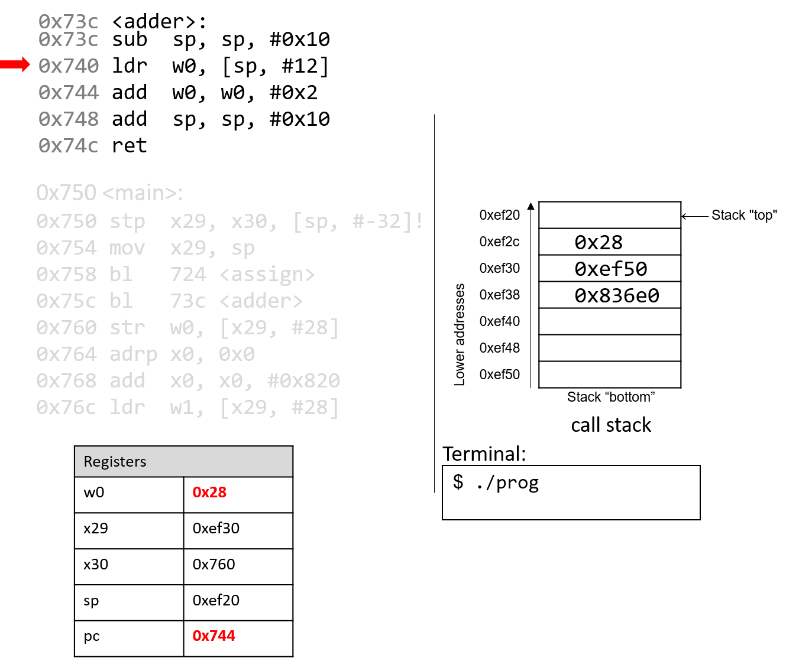

## 9.5. Functions trong Assembly  

Trong phần trước, chúng ta đã lần theo quá trình thực thi của các hàm đơn giản trong assembly.  
Trong phần này, chúng ta sẽ thảo luận về sự tương tác giữa nhiều hàm trong assembly trong bối cảnh của một chương trình lớn hơn. Chúng ta cũng sẽ giới thiệu một số lệnh mới liên quan đến việc quản lý hàm.

Hãy bắt đầu bằng việc ôn lại cách **call stack** được quản lý.  
Hãy nhớ rằng `sp` là **stack pointer** (thanh ghi con trỏ stack) và luôn trỏ tới đỉnh của stack. Thanh ghi `x29` đại diện cho **base pointer** (còn gọi là **frame pointer** hoặc `FP`) và trỏ tới đáy của *stack frame* hiện tại.  

**Stack frame** (còn gọi là **activation frame** hoặc **activation record**) là phần của stack được cấp phát cho một lần gọi hàm. Hàm đang thực thi luôn nằm ở đỉnh stack, và stack frame của nó được gọi là **active frame**. Active frame được giới hạn bởi stack pointer (ở đỉnh stack, địa chỉ thấp hơn) và frame pointer (ở đáy frame, địa chỉ cao hơn). Activation record thường chứa các biến cục bộ của hàm.  

Cuối cùng, **return address** là địa chỉ trong chương trình mà hàm gọi (ví dụ `main`) sẽ tiếp tục thực thi sau khi hàm được gọi (callee) kết thúc. Trên hệ thống A64, return address được lưu trong thanh ghi `x30` (còn gọi là `LR` — Link Register).


Hình 1 cho thấy các *stack frame* của `main` và một hàm mà nó gọi tên là `fname`. Chúng ta sẽ gọi hàm `main` là hàm *caller* (hàm gọi) và `fname` là hàm *callee* (hàm được gọi).

  
**Hình 1.** Quản lý stack frame

Trong Hình 1, *active frame* hiện tại thuộc về hàm callee (`fname`). Vùng của call stack nằm giữa **stack pointer** và **frame pointer** được dùng cho các biến cục bộ. Stack pointer sẽ thay đổi khi các giá trị cục bộ được *push* (đẩy) lên hoặc *pop* (lấy ra) khỏi stack. Frame pointer thường không được sử dụng trong code đã tối ưu hóa, và thường là tùy chọn. Do đó, các compiler như GCC thường tham chiếu các giá trị trên stack tương đối so với stack pointer.  

Trong Hình 1, *active frame* được giới hạn phía dưới bởi **base pointer** của `fname`, tức `x29`, chứa địa chỉ stack `0xef30`. Giá trị lưu tại địa chỉ `0xef30` là giá trị frame pointer đã “lưu” (0xef50), vốn chỉ ra đáy của *activation frame* cho hàm `main`. Ngay bên dưới frame pointer là **return address** đã lưu (lưu trong `x30`), cho biết địa chỉ mà chương trình sẽ tiếp tục thực thi khi `main` thoát.

> #### Return address trỏ tới *code memory*, không phải *stack memory*
>
> Hãy nhớ rằng vùng call stack (*stack memory*) của một chương trình khác với vùng code (*code memory*). Trong khi `sp` và `x29` trỏ tới địa chỉ trong stack memory, `pc` trỏ tới một địa chỉ trong *code memory*. Nói cách khác, return address là một địa chỉ trong *code memory*, không phải stack memory:
>
>   
> **Hình 2.** Các phần của không gian địa chỉ chương trình

**Bảng 1** liệt kê một số lệnh bổ sung mà compiler sử dụng để quản lý hàm cơ bản.

| Instruction | Translation |
| :--- | :--- |
| `bl addr <fname>` | Đặt `x30 = pc + 4` và đặt `pc = addr` |
| `blr R <fname>` | Đặt `x30 = pc + 4` và đặt `pc = R` |
| `ret` | Trả về giá trị trong `x0` và đặt `pc = x30` |

**Bảng 1.** Các lệnh quản lý hàm thông dụng

Các lệnh `bl` và `ret` đóng vai trò quan trọng trong quá trình một hàm gọi hàm khác. Cả hai lệnh này đều thay đổi **instruction pointer** (thanh ghi `pc`). Khi hàm caller thực thi lệnh `bl`, giá trị `pc + 4` được lưu vào thanh ghi `x30` để biểu diễn return address — tức địa chỉ chương trình mà caller sẽ tiếp tục thực thi khi hàm callee kết thúc. Lệnh `bl` cũng thay thế giá trị của `pc` bằng địa chỉ của hàm callee.

Lệnh `ret` khôi phục giá trị của `pc` từ giá trị đã lưu trong `x30`, đảm bảo chương trình tiếp tục thực thi tại địa chỉ chương trình được chỉ định trong hàm caller. Bất kỳ giá trị nào được hàm callee trả về sẽ được lưu trong thanh ghi `x0` hoặc *component register* `w0`. Lệnh `ret` thường là lệnh cuối cùng được thực thi trong bất kỳ hàm nào.

### 9.5.1. Function Parameters  

Các tham số hàm thường được nạp sẵn vào các thanh ghi trước khi gọi hàm. Tám tham số đầu tiên của một hàm được lưu trong các thanh ghi `x0`...`x7`. Nếu một hàm cần nhiều hơn bảy tham số, các tham số còn lại sẽ lần lượt được lưu vào call stack dựa trên kích thước của chúng (offset 4 byte cho dữ liệu 32-bit, offset 8 byte cho dữ liệu 64-bit).

### 9.5.2. Tracing Through an Example  

Vận dụng kiến thức về quản lý hàm, hãy lần theo ví dụ mã nguồn đã được giới thiệu ở đầu chương này:

```c
#include <stdio.h>

int assign() {
    int y = 40;
    return y;
}

int adder() {
    int a;
    return a + 2;
}

int main(void) {
    int x;
    assign();
    x = adder();
    printf("x is: %d\n", x);
    return 0;
}
```

Chúng ta biên dịch code này với lệnh:

```
gcc -o prog prog.c
```

và dùng `objdump -d` để xem code assembly tương ứng. Lệnh sau sẽ xuất ra một tệp khá lớn chứa nhiều thông tin không cần thiết. Hãy dùng `less` và chức năng tìm kiếm để trích xuất các hàm `adder`, `assign` và `main`:

```assembly
0000000000000724 <assign>:
 724:   d10043ff        sub     sp, sp, #0x10
 728:   52800500        mov     w0, #0x28                       // #40
 72c:   b9000fe0        str     w0, [sp, #12]
 730:   b9400fe0        ldr     w0, [sp, #12]
 734:   910043ff        add     sp, sp, #0x10
 738:   d65f03c0        ret

000000000000073c <adder>:
 73c:   d10043ff        sub     sp, sp, #0x10
 740:   b9400fe0        ldr     w0, [sp, #12]
 744:   11000800        add     w0, w0, #0x2
 748:   910043ff        add     sp, sp, #0x10
 74c:   d65f03c0        ret

0000000000000750 <main>:
 750:   a9be7bfd        stp     x29, x30, [sp, #-32]!
 754:   910003fd        mov     x29, sp
 758:   97fffff3        bl      724 <assign>
 75c:   97fffff8        bl      73c <adder>
 760:   b9001fa0        str     w0, [x29, #28]
 764:   90000000        adrp    x0, 0 <_init-0x598>
 768:   91208000        add     x0, x0, #0x820
 76c:   b9401fa1        ldr     w1, [x29, #28]
 770:   97ffffa8        bl      610 <printf@plt>
 774:   52800000        mov     w0, #0x0                        // #0
 778:   a8c27bfd        ldp     x29, x30, [sp], #32
 77c:   d65f03c0        ret
```

Mỗi hàm bắt đầu bằng một **symbolic label** (nhãn ký hiệu) tương ứng với tên được khai báo trong chương trình. Ví dụ, `<main>:` là nhãn ký hiệu cho hàm `main`. Địa chỉ của nhãn hàm cũng là địa chỉ của lệnh đầu tiên trong hàm đó.  

Để tiết kiệm không gian trong các hình minh họa tiếp theo, chúng ta sẽ rút gọn địa chỉ code lệnh xuống 12 bit thấp, và địa chỉ stack xuống 16 bit thấp. Ví dụ, địa chỉ stack `0xffffffffef50` sẽ được hiển thị là `0xef50`.

### 9.5.3. Tracing Through main  

Hình 3 cho thấy execution stack ngay trước khi thực thi hàm `main`.

  

**Hình 3.** Trạng thái ban đầu của các thanh ghi CPU và call stack trước khi thực thi hàm `main`

Hãy nhớ rằng stack phát triển về phía *địa chỉ thấp hơn*. Trong ví dụ này, cả frame pointer và stack pointer (`x29` và `sp`) đều chứa địa chỉ `0xef50`. Ban đầu, `pc` là địa chỉ của lệnh đầu tiên trong hàm `main`, tức `0x750`. Các thanh ghi `x30` và `w0` cũng được đánh dấu trong ví dụ này, và cả hai đều chứa các giá trị rác ban đầu.


Lệnh đầu tiên (`stp`) là một lệnh hợp thành gồm hai phần:  
- Đầu tiên, toán hạng thứ hai (`[sp, #-32]!`) giảm giá trị stack pointer đi 32 byte, từ đó cấp phát không gian cho stack frame hiện tại. Sau khi toán hạng này được đánh giá, stack pointer được cập nhật thành `0xef30`.  
- Tiếp theo, lệnh `stp` lưu giá trị hiện tại của `x29` và `x30` vào các vị trí `sp` và `sp+8` tương ứng. Thanh ghi `pc` (program counter) tăng lên để trỏ tới lệnh tiếp theo.


Lệnh tiếp theo (`mov x29, sp`) cập nhật giá trị của `x29` thành bằng `sp`. Như vậy, frame pointer (`x29`) giờ đây trỏ tới đầu của stack frame dành cho hàm `main`. Thanh ghi `pc` tăng lên để trỏ tới lệnh tiếp theo.


Lệnh `bl` đầu tiên lưu giá trị `pc+4` (tức `0x75c`) vào thanh ghi `x30`. Đây là địa chỉ trong `main` mà chương trình sẽ tiếp tục thực thi sau khi hàm `assign` trả về. Tiếp theo, thanh ghi `pc` được cập nhật thành địa chỉ `0x724`, là địa chỉ của lệnh đầu tiên trong hàm `assign`.


Lệnh tiếp theo được thực thi là lệnh đầu tiên trong `assign`. Lệnh `sub` giảm giá trị stack pointer đi 16 byte. Lúc này, `x29` và `sp` xác định ranh giới của active stack frame dành cho hàm `assign`. Thanh ghi `pc` tăng lên để trỏ tới lệnh tiếp theo.


Lệnh `mov` lưu giá trị hằng `0x28` vào thanh ghi `w0`. Thanh ghi `pc` tăng lên để trỏ tới lệnh tiếp theo.


Lệnh `str` lưu giá trị `0x28` vào vị trí cách stack pointer 12 byte, tức địa chỉ `0xef2c`. Thanh ghi `pc` tăng lên để trỏ tới lệnh tiếp theo.


Lệnh `ldr` nạp giá trị `0x28` từ địa chỉ stack `0xef2c` vào thanh ghi `w0`. Thanh ghi `pc` tăng lên để trỏ tới lệnh tiếp theo.


Lệnh `add` giải phóng stack frame hiện tại và đưa `sp` trở lại giá trị trước đó, tức `0xef30`.

  

Lệnh `ret` thay thế giá trị trong `pc` bằng giá trị trong `x30`, tức `0x75c`. Kết quả là chương trình quay trở lại thực thi lệnh đầu tiên trong hàm `main` ngay sau lời gọi hàm `assign`.

  

Lệnh tiếp theo được thực thi là một lời gọi hàm tới `adder` (hay `bl 73c <adder>`). Do đó, thanh ghi `x30` được cập nhật với giá trị `pc+4`, tức `0x760`. Thanh ghi `pc` được thay bằng địa chỉ `0x73c`, cho biết chương trình sẽ tiếp tục thực thi bên trong hàm `adder`.

  

Lệnh đầu tiên trong hàm `adder` giảm giá trị stack pointer đi 16 byte, cấp phát stack frame mới cho hàm `adder`. Lưu ý rằng ranh giới của *active stack frame* cho hàm `adder` được xác định bởi các thanh ghi `sp` và `x29`. Thanh ghi `pc` tăng lên để trỏ tới lệnh tiếp theo.

  

Điều xảy ra tiếp theo là rất quan trọng. Lệnh `ldr` nạp một giá trị *cũ* từ stack (tại `sp+12`) vào thanh ghi `w0`. Đây là hệ quả trực tiếp của việc lập trình viên quên khởi tạo biến `a` trong hàm `adder`. Thanh ghi `pc` tăng lên để trỏ tới lệnh tiếp theo.

  

Lệnh `add` sau đó cộng `0x2` vào giá trị trong `w0` và lưu kết quả (`0x2A`) vào thanh ghi `w0`. Thanh ghi `pc` tăng lên để trỏ tới lệnh tiếp theo.

  

Lệnh `add` tiếp theo cộng thêm 16 byte vào stack pointer, qua đó hủy bỏ *active frame* của `adder` và khôi phục `sp` về giá trị trước đó. Thanh ghi `pc` tăng lên để trỏ tới lệnh tiếp theo.

  

Cuối cùng, lệnh `ret` ghi đè `pc` bằng địa chỉ trong thanh ghi `x30`, cho biết chương trình sẽ tiếp tục thực thi trong hàm `main` tại địa chỉ `0x760` trong code segment.

  

Quay lại hàm `main()`, lệnh `str` tại địa chỉ chương trình `0x760` lưu nội dung của thanh ghi `w0` (`0x2A`) vào vị trí trên call stack cách frame pointer (`x29`) 28 byte. Do đó, `0x2A` được lưu tại địa chỉ stack `0xef4c`.

  

Hai lệnh tiếp theo cùng nhau nạp một địa chỉ của một trang bộ nhớ vào thanh ghi `x0`. Vì địa chỉ dài 8 byte, thanh ghi 64-bit `x0` được sử dụng thay vì *component register* 32-bit `w0`. Lệnh `adrp` nạp địa chỉ (`0x0`) vào `x0`, trong khi lệnh `add` tại địa chỉ `0x768` cộng thêm giá trị `0x820` vào đó. Sau khi hai lệnh này thực thi, thanh ghi `x0` chứa địa chỉ bộ nhớ `0x820`. Lưu ý rằng giá trị lưu tại địa chỉ `0x820` là chuỗi `"x is %d\n"`.

  

Tiếp theo, lệnh `ldr` tại địa chỉ chương trình `0x76c` nạp giá trị `0x2A` (nằm tại offset 28 byte từ frame pointer) vào thanh ghi `w1`.

  

Lệnh tiếp theo gọi hàm `printf`. Để ngắn gọn, chúng ta sẽ không lần theo hàm `printf` (thuộc thư viện `stdio.h`). Tuy nhiên, theo trang hướng dẫn (`man -s3 printf`), `printf` có định dạng như sau:

```
int printf(const char * format, ...)
```


Nói cách khác, đối số thứ nhất là một **con trỏ** trỏ tới một chuỗi xác định định dạng (*format*), và các đối số từ thứ hai trở đi chỉ định các giá trị sẽ được sử dụng trong định dạng đó. Các lệnh tại địa chỉ từ `0x764` đến `0x770` tương ứng với dòng lệnh trong hàm `main`:

```c
printf("x is %d\n", x);
```

Khi hàm `printf` được gọi:

- **Return address** (`pc+4` hay `0x774`) được lưu vào thanh ghi `x30`.
- Thanh ghi `pc` được thay bằng địa chỉ `0x610`, là điểm bắt đầu của hàm `printf`.
- Thanh ghi `sp` được cập nhật để phản ánh stack frame mới dành cho hàm `printf`.

Tại một thời điểm nào đó, `printf` sẽ truy cập các đối số của nó, đó là chuỗi `"x is %d\n"` và giá trị `0x2A`. Hãy nhớ rằng, với bất kỳ hàm nào có *n* đối số, **gcc** sẽ đặt 8 đối số đầu tiên vào các thanh ghi `x0`–`x7`, và các đối số còn lại sẽ được đặt lên stack *bên dưới* frame pointer. Trong trường hợp này, tham số thứ nhất được lưu trong thanh ghi `x0` (vì nó là địa chỉ của một chuỗi), và tham số thứ hai được lưu trong *component register* `w1`.

Sau khi gọi `printf`, giá trị `0x2A` sẽ được xuất ra cho người dùng ở dạng số nguyên. Do đó, giá trị **42** được in ra màn hình. Stack pointer trở về giá trị trước đó, và `pc` được cập nhật bằng giá trị lưu trong thanh ghi `x30`, tức `0x774`.

  

Lệnh `mov` tại địa chỉ `0x774` nạp giá trị hằng `#0x0` vào *component register* `w0`. Đây là giá trị sẽ được trả về khi `main` kết thúc thực thi. Thanh ghi `pc` tăng lên để trỏ tới lệnh tiếp theo.

  

Lệnh `ldp` tại địa chỉ chương trình `0x778` trước tiên sao chép các giá trị tại `sp` và `sp+8` vào các thanh ghi `x29` và `x30`, khôi phục chúng về giá trị ban đầu trước khi `main` bắt đầu thực thi. Phần cuối của lệnh `ldp` (được chỉ định bởi toán hạng `[sp], #32`) tăng stack pointer thêm 32 byte, khôi phục `sp` về giá trị ban đầu trước khi `main` chạy. Do đó, khi lệnh `ldp` hoàn tất, stack pointer (`sp`), frame pointer (`x29`) và thanh ghi trả về (`x30`) đều đã trở lại giá trị ban đầu. Thanh ghi `pc` tăng lên để trỏ tới lệnh cuối cùng trong hàm `main`.

  

Lệnh cuối cùng được thực thi là `ret`. Với `0x0` trong thanh ghi trả về `w0`, chương trình trả về giá trị **0**, biểu thị việc kết thúc thành công.

Nếu bạn đã đọc kỹ phần này, bạn sẽ hiểu tại sao chương trình của chúng ta in ra giá trị **42**. Về bản chất, chương trình đã vô tình sử dụng các giá trị cũ trên stack, khiến nó hoạt động theo cách mà chúng ta không lường trước. Ví dụ này khá vô hại; tuy nhiên, ở các phần sau, chúng ta sẽ thảo luận cách tin tặc lợi dụng lời gọi hàm để khiến chương trình hoạt động sai lệch theo những cách thực sự nguy hiểm.


