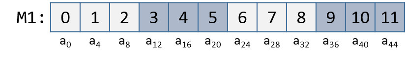

## 9.8. Ma trận (Matrices)  

**Ma trận** là một mảng hai chiều (2D array).  
Trong C, một ma trận có thể được:  

- **Cấp phát tĩnh** dưới dạng mảng 2D (`M[n][m]`) — nằm trên stack.  
- **Cấp phát động** bằng một lần gọi `malloc`.  
- **Cấp phát động** dưới dạng mảng của các mảng (*array of arrays*).  

Hãy xét cách triển khai **mảng của các mảng**:  
Mảng đầu tiên chứa `n` phần tử (`M[n]`), và mỗi phần tử `M[i]` lại chứa một mảng gồm `m` phần tử.  

Ví dụ dưới đây khai báo các ma trận kích thước 4 × 3:

```c
// ma trận cấp phát tĩnh (trên stack)
int M1[4][3];

// ma trận cấp phát động (dễ lập trình, trên heap)
int **M2, i;
M2 = malloc(4 * sizeof(int*));
for (i = 0; i < 4; i++) {
    M2[i] = malloc(3 * sizeof(int));
}
```

Với ma trận cấp phát động, mảng chính chứa một mảng liên tiếp các con trỏ `int`.  
Mỗi con trỏ này trỏ tới một mảng khác trong bộ nhớ.  

**Hình 1** minh họa cách chúng ta thường hình dung hai loại ma trận này:

  

**Hình 1.** Minh họa ma trận cấp phát tĩnh (M1) và ma trận cấp phát động (M2) kích thước 3×4.

Với cả hai cách khai báo trên, phần tử *(i, j)* có thể được truy cập bằng cú pháp `M[i][j]`, với `M` là `M1` hoặc `M2`.  
Tuy nhiên, cách tổ chức dữ liệu trong bộ nhớ là khác nhau:  

- Cả hai đều lưu các phần tử của mảng chính liên tiếp trong bộ nhớ.  
- Ma trận cấp phát tĩnh (`M1`) **cũng lưu toàn bộ các hàng liên tiếp nhau** trong bộ nhớ:

  

**Hình 2.** Bố trí bộ nhớ của M1 theo thứ tự hàng (*row-major order*).

Điều này **không được đảm bảo** với `M2`.  
[Nhớ rằng](../C2-C_depth/arrays.html#_two_dimensional_array_memory_layout), để cấp phát liên tiếp một ma trận *n × m* trên heap, ta nên dùng **một lần gọi `malloc`** để cấp phát *n × m* phần tử:

```c
// ma trận động (trên heap, cách hiệu quả về bộ nhớ)
#define ROWS 4
#define COLS 3
int *M3;
M3 = malloc(ROWS * COLS * sizeof(int));
```

Với khai báo `M3`, phần tử *(i, j)* **không thể** truy cập bằng cú pháp `M[i][j]`.  
Thay vào đó, phải truy cập bằng:  

```c
M3[i * cols + j]
```

### 9.8.1. Mảng hai chiều liên tiếp (Contiguous Two-Dimensional Arrays)  

Xét hàm `sumMat` nhận:  

- Con trỏ tới một ma trận được cấp phát liên tiếp (tĩnh hoặc động hiệu quả bộ nhớ) làm tham số đầu tiên.  
- Số hàng và số cột.  

Hàm trả về tổng tất cả các phần tử trong ma trận.

Ta dùng **scaled indexing** (chỉ số có nhân hệ số) vì nó áp dụng cho cả ma trận tĩnh và động liên tiếp.  
Nhớ rằng cú pháp `m[i][j]` **không hoạt động** với cách cấp phát động liên tiếp hiệu quả bộ nhớ đã nói ở trên.

```c
int sumMat(int *m, int rows, int cols) {
    int i, j, total = 0;
    for (i = 0; i < rows; i++) {
        for (j = 0; j < cols; j++) {
            total += m[i * cols + j];
        }
    }
    return total;
}
```

Dưới đây là code assembly tương ứng, với chú thích từng dòng:

```
Dump of assembler code for function sumMat:
0x884 <+0>:   sub   sp, sp, #0x20      // mở rộng stack thêm 32 byte (frame mới)
0x888 <+4>:   str   x0, [sp, #8]       // lưu m tại sp + 8
0x88c <+8>:   str   w1, [sp, #4]       // lưu rows tại sp + 4
0x890 <+12>:  str   w2, [sp]           // lưu cols tại đỉnh stack
0x894 <+16>:  str   wzr, [sp, #28]     // total = 0 tại sp + 28
0x898 <+20>:  str   wzr, [sp, #20]     // i = 0 tại sp + 20
0x89c <+24>:  b     0x904 <sumMat+128> // nhảy tới <sumMat+128>
0x8a0 <+28>:  str   wzr, [sp, #24]     // j = 0 tại sp + 24
0x8a4 <+32>:  b     0x8e8 <sumMat+100> // nhảy tới <sumMat+100>
0x8a8 <+36>:  ldr   w1, [sp, #20]      // w1 = i
0x8ac <+40>:  ldr   w0, [sp]           // w0 = cols
0x8b0 <+44>:  mul   w1, w1, w0         // w1 = cols * i
0x8b4 <+48>:  ldr   w0, [sp, #24]      // w0 = j
0x8b8 <+52>:  add   w0, w1, w0         // w0 = (cols * i) + j
0x8bc <+56>:  sxtw  x0, w0             // x0 = signExtend(cols * i + j)
0x8c0 <+60>:  lsl   x0, x0, #2         // x0 = (cols * i + j) * 4
0x8c4 <+64>:  ldr   x1, [sp, #8]       // x1 = m
0x8c8 <+68>:  add   x0, x1, x0         // x0 = &m[i*cols + j]
0x8cc <+72>:  ldr   w0, [x0]           // w0 = m[i*cols + j]
0x8d0 <+76>:  ldr   w1, [sp, #28]      // w1 = total
0x8d4 <+80>:  add   w0, w1, w0         // w0 = total + m[i*cols + j]
0x8d8 <+84>:  str   w0, [sp, #28]      // total = total + m[i*cols + j]
0x8dc <+88>:  ldr   w0, [sp, #24]      // w0 = j
0x8e0 <+92>:  add   w0, w0, #0x1       // w0 = j + 1
0x8e4 <+96>:  str   w0, [sp, #24]      // j = j + 1
0x8e8 <+100>: ldr   w1, [sp, #24]      // w1 = j
0x8ec <+104>: ldr   w0, [sp]           // w0 = cols
0x8f0 <+108>: cmp   w1, w0             // so sánh j và cols
0x8f4 <+112>: b.lt  0x8a8 <sumMat+36>  // nếu (j < cols) quay lại <sumMat+36>
0x8f8 <+116>: ldr   w0, [sp, #20]      // w0 = i
0x8fc <+120>: add   w0, w0, #0x1       // w0 = i + 1
0x900 <+124>: str   w0, [sp, #20]      // i = i + 1
0x904 <+128>: ldr   w1, [sp, #20]      // w1 = i
0x908 <+132>: ldr   w0, [sp, #4]       // w0 = rows
0x90c <+136>: cmp   w1, w0             // so sánh i và rows
0x910 <+140>: b.lt  0x8a0 <sumMat+28>  // nếu (i < rows) goto <sumMat+28> 
0x914 <+144>: ldr w0, [sp, #28] // w0 = total
0x918 <+148>: add sp, sp, #0x20 // revert stack to prior state
0x91c <+152>: ret // return (total)
```


Các biến cục bộ `i`, `j` và `total` lần lượt được lưu tại các vị trí trên stack là `sp + 20`, `sp + 24` và `sp + 28`.  
Các tham số đầu vào `m`, `row` và `cols` lần lượt được lưu tại `sp + 8`, `sp + 4` và `sp` (đỉnh stack).  

Với thông tin này, hãy tập trung vào đoạn code chỉ xử lý việc truy cập phần tử (*i*, *j*) trong ma trận (từ địa chỉ 0x8a8 đến 0x8d8):

```
0x8a8 <+36>:   ldr   w1, [sp, #20]       // w1 = i
0x8ac <+40>:   ldr   w0, [sp]            // w0 = cols
0x8b0 <+44>:   mul   w1, w1, w0          // w1 = cols * i
```

Bộ lệnh đầu tiên này tính giá trị `cols * i` và lưu vào thanh ghi `w1`.  
Hãy nhớ rằng, với một ma trận tên `matrix`, biểu thức `matrix + i * cols` tương đương với `&matrix[i]`.

```
0x8b4 <+48>:   ldr   w0, [sp, #24]       // w0 = j
0x8b8 <+52>:   add   w0, w1, w0          // w0 = (cols * i) + j
0x8bc <+56>:   sxtw  x0, w0              // x0 = signExtend(cols * i + j)
0x8c0 <+60>:   lsl   x0, x0, #2          // x0 = (cols * i + j) * 4
```

Bộ lệnh tiếp theo tính `(cols * i + j) * 4`.  
Compiler nhân chỉ số `(cols * i + j)` với 4 vì mỗi phần tử trong ma trận là một số nguyên 4 byte.  
Phép nhân này giúp tính đúng **offset** trong bộ nhớ.  
Lệnh `sxtw` tại `<sumMat+56>` mở rộng dấu (sign-extend) giá trị trong `w0` thành số nguyên 64-bit, vì giá trị này sẽ được dùng để tính địa chỉ.

Bộ lệnh tiếp theo cộng offset vừa tính vào con trỏ ma trận và dereference để lấy giá trị phần tử (*i*, *j*):

```
0x8c4 <+64>: ldr   x1, [sp, #8]  // x1 = m
0x8c8 <+68>: add   x0, x1, x0    // x0 = m + (cols*i + j)*4 (hay &m[i*cols + j])
0x8cc <+72>: ldr   w0, [x0]      // w0 = m[i*cols + j]
0x8d0 <+76>: ldr   w1, [sp, #28] // w1 = total
0x8d4 <+80>: add   w0, w1, w0    // w0 = total + m[i*cols + j]
0x8d8 <+84>: str   w0, [sp, #28] // total = total + m[i*cols + j]
```

- Lệnh đầu tiên nạp địa chỉ của ma trận `m` vào thanh ghi `x1`.  
- Lệnh `add` cộng `(cols * i + j) * 4` vào địa chỉ `m` để tính đúng vị trí phần tử (*i*, *j*), kết quả lưu vào `x0`.  
- Lệnh `ldr` tiếp theo dereference địa chỉ trong `x0` và lưu giá trị `m[i * cols + j]` vào `w0`.  
  Lưu ý: sử dụng `w0` (thanh ghi 32-bit) vì phần tử là `int` (4 byte).  

Ba lệnh cuối nạp giá trị hiện tại của `total` vào `w1`, cộng với `m[i * cols + j]`, rồi lưu kết quả mới vào `total`.

**Ví dụ truy cập phần tử (1,2) trong ma trận M1** (Hình 3):

  

**Hình 3.** Bố trí bộ nhớ của M1 theo thứ tự hàng (*row-major order*).

Phần tử (1,2) nằm tại địa chỉ `M1 + 1 * cols + 2`.  
Vì `cols = 3`, nên (1,2) tương ứng với `M1 + 5`.  
Để truy cập phần tử này, compiler nhân 5 với kích thước kiểu `int` (4 byte), thu được offset `M1 + 20`, tương ứng với byte a~20~ trong hình.  
Dereference vị trí này sẽ lấy được giá trị 5 — đúng là phần tử (1,2) của ma trận.

### 9.8.2. Ma trận không liên tiếp (Noncontiguous Matrix)  

Cách triển khai ma trận **không liên tiếp** phức tạp hơn một chút.  
**Hình 4** minh họa cách `M2` có thể được bố trí trong bộ nhớ:

  

**Hình 4.** Bố trí bộ nhớ không liên tiếp của M2.

- Mảng con trỏ trong `M2` là **liên tiếp**.  
- Mỗi mảng mà `M2[i]` trỏ tới cũng **liên tiếp**.  
- Tuy nhiên, các mảng con này **không liên tiếp với nhau** trong bộ nhớ.  

Vì `M2` là mảng con trỏ, mỗi phần tử của `M2` chiếm 8 byte.  
Ngược lại, mỗi `M2[i]` là mảng `int`, nên các phần tử trong mỗi mảng con cách nhau 4 byte.

Hàm `sumMatrix` trong ví dụ sau nhận:  

- Tham số đầu tiên: mảng con trỏ tới `int` (gọi là `matrix`).  
- Tham số thứ hai và thứ ba: số hàng và số cột.  

```c
int sumMatrix(int **matrix, int rows, int cols) {
    int i, j, total=0;
    for (i = 0; i < rows; i++) {
        for (j = 0; j < cols; j++) {
            total += matrix[i][j];
        }
    }
    return total;
}
```

Mặc dù hàm này trông gần như giống hệt với hàm `sumMat` đã trình bày trước đó, nhưng ma trận mà hàm này nhận vào lại bao gồm **một mảng liên tiếp các *con trỏ***.  
Mỗi con trỏ chứa địa chỉ của một mảng liên tiếp riêng biệt, tương ứng với một hàng riêng trong ma trận.

Dưới đây là code assembly tương ứng của `sumMatrix`. Mỗi dòng đều được chú thích bằng tiếng Anh trong bản gốc:

```
Dump of assembler code for function sumMatrix:
0x920 <+0>:   sub   sp, sp, #0x20         // mở rộng stack thêm 32 byte (frame mới)
0x924 <+4>:   str   x0, [sp, #8]          // lưu matrix tại sp + 8
0x928 <+8>:   str   w1, [sp, #4]          // lưu rows tại sp + 4
0x92c <+12>:  str   w2, [sp]              // lưu cols tại sp (đỉnh stack)
0x930 <+16>:  str   wzr, [sp, #28]        // total = 0 tại sp + 28
0x934 <+20>:  str   wzr, [sp, #20]        // i = 0 tại sp + 20
0x938 <+24>:  b     0x99c <sumMatrix+124> // nhảy tới <sumMatrix+124>
0x93c <+28>:  str   wzr, [sp, #24]        // j = 0 tại sp + 24
0x940 <+32>:  b     0x980 <sumMatrix+96>  // nhảy tới <sumMatrix+96>
0x944 <+36>:  ldrsw x0, [sp, #20]         // x0 = signExtend(i)
0x948 <+40>:  lsl   x0, x0, #3            // x0 = i << 3 (hay i * 8)
0x94c <+44>:  ldr   x1, [sp, #8]          // x1 = matrix
0x950 <+48>:  add   x0, x1, x0            // x0 = matrix + i * 8
0x954 <+52>:  ldr   x1, [x0]              // x1 = matrix[i]
0x958 <+56>:  ldrsw x0, [sp, #24]         // x0 = signExtend(j)
0x95c <+60>:  lsl   x0, x0, #2            // x0 = j << 2 (hay j * 4)
0x960 <+64>:  add   x0, x1, x0            // x0 = matrix[i] + j * 4
0x964 <+68>:  ldr   w0, [x0]              // w0 = matrix[i][j]
0x968 <+72>:  ldr   w1, [sp, #28]         // w1 = total
0x96c <+76>:  add   w0, w1, w0            // w0 = total + matrix[i][j]
0x970 <+80>:  str   w0, [sp, #28]         // total = total + matrix[i][j]
0x974 <+84>:  ldr   w0, [sp, #24]         // w0 = j
0x978 <+88>:  add   w0, w0, #0x1          // w0 = j + 1
0x97c <+92>:  str   w0, [sp, #24]         // j = j + 1
0x980 <+96>:  ldr   w1, [sp, #24]         // w1 = j
0x984 <+100>: ldr   w0, [sp]              // w0 = cols
0x988 <+104>: cmp   w1, w0                // so sánh j với cols
0x98c <+108>: b.lt  0x944 <sumMatrix+36>  // nếu (j < cols) quay lại <sumMatrix+36>
0x990 <+112>: ldr   w0, [sp, #20]         // w0 = i
0x994 <+116>: add   w0, w0, #0x1          // w0 = i + 1
0x998 <+120>: str   w0, [sp, #20]         // i = i + 1
0x99c <+124>: ldr   w1, [sp, #20]         // w1 = i
0x9a0 <+128>: ldr   w0, [sp, #4]          // w0 = rows
0x9a4 <+132>: cmp   w1, w0                // so sánh i với rows
0x9a8 <+136>: b.lt  0x93c <sumMatrix+28>  // nếu (i < rows) quay lại <sumMatrix+28>
0x9ac <+140>: ldr   w0, [sp, #28]         // w0 = total
0x9b0 <+144>: add   sp, sp, #0x20         // khôi phục stack
0x9b4 <+148>: ret                         // trả về total
```

Tương tự như trước, các biến `i`, `j` và `total` lần lượt nằm tại `sp + 20`, `sp + 24` và `sp + 28`.  
Các tham số đầu vào `matrix`, `row` và `cols` lần lượt nằm tại `sp + 8`, `sp + 4` và `sp` (đỉnh stack).  

Hãy tập trung vào đoạn code xử lý việc truy cập phần tử (*i*, *j*) — tức `matrix[i][j]` — từ địa chỉ 0x944 đến 0x970:

```
0x944 <+36>:   ldrsw  x0, [sp, #20]          // x0 = signExtend(i)
0x948 <+40>:   lsl    x0, x0, #3             // x0 = i << 3 (hay i * 8)
0x94c <+44>:   ldr    x1, [sp, #8]           // x1 = matrix
0x950 <+48>:   add    x0, x1, x0             // x0 = matrix + i * 8
0x954 <+52>:   ldr    x1, [x0]               // x1 = matrix[i]
```

Năm lệnh trên tính toán `matrix[i]` hay `*(matrix + i)`.  
Vì `matrix[i]` chứa một con trỏ, `i` trước tiên được chuyển thành số nguyên 64-bit.  
Sau đó, compiler nhân `i` với 8 bằng phép dịch trái (`lsl`), rồi cộng kết quả vào địa chỉ `matrix` để tính offset chính xác (nhớ rằng con trỏ chiếm 8 byte).  
Lệnh tại `<sumMatrix+52>` dereference địa chỉ vừa tính để lấy giá trị `matrix[i]`.

Vì `matrix` là mảng các con trỏ `int`, phần tử tại `matrix[i]` bản thân nó là một con trỏ `int`.  
Phần tử thứ *j* trong `matrix[i]` nằm tại offset `j × 4` trong mảng `matrix[i]`.

Bộ lệnh tiếp theo trích xuất phần tử thứ *j* trong mảng `matrix[i]`:

```
0x958 <+56>:   ldrsw  x0, [sp, #24]     // x0 = signExtend(j)
0x95c <+60>:   lsl    x0, x0, #2        // x0 = j << 2 (hay j * 4)
0x960 <+64>:   add    x0, x1, x0        // x0 = matrix[i] + j * 4
0x964 <+68>:   ldr    w0, [x0]          // w0 = matrix[i][j]
0x968 <+72>:   ldr    w1, [sp, #28]     // w1 = total
0x96c <+76>:   add    w0, w1, w0        // w0 = total + matrix[i][j]
0x970 <+80>:   str    w0, [sp, #28]     // total = total + matrix[i][j]
```

- Lệnh đầu tiên nạp `j` vào `x0` và sign-extend.  
- Lệnh `lsl` nhân `j` với 4 và lưu vào `x0`.  
- Lệnh `add` cộng giá trị này vào địa chỉ `matrix[i]` để lấy địa chỉ `&matrix[i][j]`.  
- Lệnh tại `<sumMatrix+68>` dereference địa chỉ này để lấy giá trị `matrix[i][j]` và lưu vào `w0`.  
-  Cuối cùng, các lệnh từ `<sumMatrix+72>` đến `<sumMatrix+80>` sẽ cộng giá trị `total` với `matrix[i][j]` và cập nhật biến `total` bằng tổng vừa tính được.


**Ví dụ truy cập `M2[1][2]`** (hình minh họa bên dưới):

  

Giả sử `M2` bắt đầu tại địa chỉ bộ nhớ a~0~.  
Compiler trước tiên tính địa chỉ của `M2[1]` bằng cách nhân 1 với 8 (`sizeof(int *)`) và cộng vào địa chỉ của `M2` (a~0~), thu được địa chỉ mới a~8~.  
Dereference địa chỉ này sẽ cho ra địa chỉ mà `M2[1]` trỏ tới, tức a~36~.  

Tiếp theo, compiler nhân chỉ số 2 với 4 (`sizeof(int)`) và cộng kết quả (8) vào a~36~, thu được địa chỉ cuối cùng là a~44~.  
Dereference địa chỉ a~44~ này sẽ cho giá trị 5.  
Quả thật, phần tử trong \[DynamicMatrix6a64repro\] tương ứng với `M2[1][2]` có giá trị là 5.
