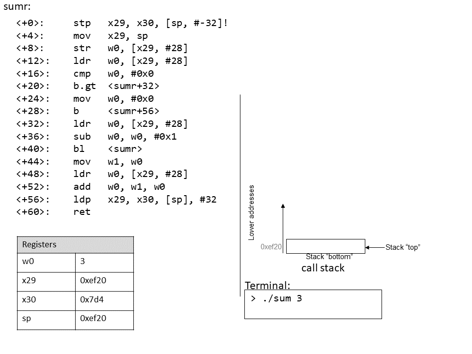

## 9.6. Đệ quy (Recursion)  

**Hàm đệ quy** là một lớp đặc biệt của hàm, trong đó hàm **tự gọi lại chính nó** (còn gọi là **self-referential function**) để tính toán một giá trị.  
Giống như các hàm không đệ quy, hàm đệ quy tạo ra **stack frame** mới cho mỗi lần gọi hàm.  
Điểm khác biệt là trong hàm đệ quy, phần thân hàm có chứa lời gọi đến chính nó.

Hãy cùng xem lại bài toán tính tổng các số nguyên dương từ 1 đến *n*.  
Ở các phần trước, chúng ta đã thảo luận về hàm `sumUp` để thực hiện nhiệm vụ này.  
**Bảng 1** dưới đây cho thấy một hàm liên quan có tên `sumDown`, cộng các số theo thứ tự ngược (*n* về 1), và phiên bản đệ quy tương đương của nó:

#### Phiên bản lặp (Iterative)

```c
int sumDown(int n) {
    int total = 0;
    int i = n;
    while (i > 0) {
        total += i;
        i--;
    }
    return total;
}
```

#### Phiên bản đệ quy (Recursive)

```c
int sumr(int n) {
    if (n <= 0) {
        return 0;
    }
    return n + sumr(n-1);
}
```

**Bảng 1.** Phiên bản lặp và phiên bản đệ quy của hàm `sumDown`.

Trong hàm đệ quy `sumr`, **trường hợp cơ sở** (base case) xử lý mọi giá trị *n* nhỏ hơn hoặc bằng 0.  
**Bước đệ quy** cộng giá trị hiện tại của *n* với kết quả của lời gọi `sumr(n - 1)`.

Khi biên dịch `sumr` và dùng GDB để disassemble, ta thu được mã assembly sau:

```
Dump of assembler code for function sumr:
0x770 <+0>:  stp   x29, x30, [sp, #-32]! // sp = sp - 32; lưu x29, x30 vào stack
0x774 <+4>:  mov   x29, sp               // x29 = sp (đỉnh stack)
0x778 <+8>:  str   w0, [x29, #28]        // lưu n vào x29+28
0x77c <+12>: ldr   w0, [x29, #28]        // w0 = n
0x780 <+16>: cmp   w0, #0x0              // so sánh n với 0
0x784 <+20>: b.gt  0x790 <sumr+32>       // nếu (n > 0) nhảy tới <sumr+32>
0x788 <+24>: mov   w0, #0x0              // w0 = 0
0x78c <+28>: b     0x7a8 <sumr+56>       // nhảy tới <sumr+56>
0x790 <+32>: ldr   w0, [x29, #28]        // w0 = n
0x794 <+36>: sub   w0, w0, #0x1          // w0 = n - 1
0x798 <+40>: bl    0x770 <sumr>          // gọi sumr(n-1), lưu kết quả vào w0
0x79c <+44>: mov   w1, w0                // sao chép kết quả sang w1
0x7a0 <+48>: ldr   w0, [x29, #28]        // w0 = n
0x7a4 <+52>: add   w0, w1, w0            // w0 = w1 + n
0x7a8 <+56>: ldp   x29, x30, [sp], #32   // khôi phục x29, x30 và sp
0x7ac <+60>: ret                         // trả về w0 (kết quả)
```

Mỗi dòng trong đoạn assembly trên đều đã được chú thích bằng tiếng Anh trong sách gốc.  
**Bảng 2** dưới đây cho thấy dạng `goto` tương ứng (trái) và chương trình C không dùng `goto` (phải):

#### Dạng C với goto

```c
int sumr(int n) {
    int result;
    if (n > 0) {
        goto body;
    }
    result = 0;
    goto done;
body:
    result = n;
    result--;
    result = sumr(result);
    result += n;
done:
    return result;
}
```

#### Dạng C không dùng goto

```c
int sumr(int n) {
    int result;
    if (n <= 0) {
        return 0;
    }
    result = sumr(n-1);
    result += n;
    return result;
}
```

**Bảng 2.** Dạng C với goto và bản dịch từ assembly của `sumr()`.

Mặc dù bản dịch này ban đầu có vẻ không giống hệt hàm `sumr` gốc, nhưng khi xem xét kỹ, ta thấy hai hàm này thực sự tương đương.

### 9.6.1. Quan sát sự thay đổi của Call Stack  

Như một bài tập, bạn hãy thử vẽ lại stack và quan sát sự thay đổi giá trị.  
Hình động dưới đây minh họa cách stack được cập nhật khi chạy hàm này với giá trị `3`:




