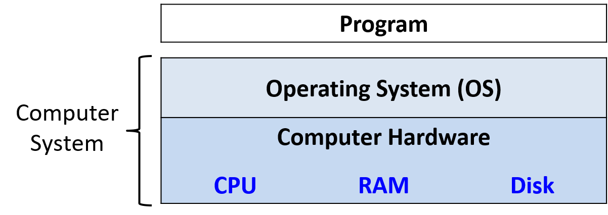
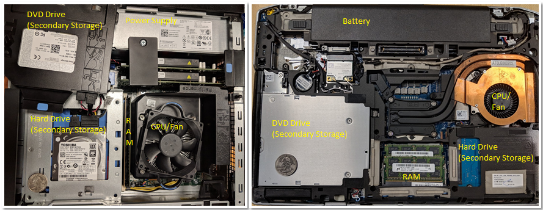

## 0. Giới thiệu

Hãy cùng lặn vào thế giới kỳ thú của hệ thống máy tính! Việc hiểu một `computer system` ("hệ thống máy tính") là gì và cách nó chạy các chương trình của bạn có thể giúp bạn thiết kế những đoạn code chạy hiệu quả và tận dụng tốt nhất sức mạnh của hệ thống nền tảng. Trong cuốn sách này, chúng tôi sẽ đưa bạn vào một cuộc hành trình xuyên suốt các `computer systems`. Bạn sẽ học được cách một chương trình được viết bằng ngôn ngữ lập trình bậc cao (chúng tôi dùng C) thực thi trên máy tính. Bạn sẽ học cách các chỉ thị của chương trình được dịch sang `binary` ("hệ nhị phân") và cách các mạch điện tử thực thi đoạn code `binary` đó. Bạn sẽ học cách một `operating system` ("hệ điều hành") quản lý các chương trình đang chạy trên hệ thống. Bạn sẽ học cách viết những chương trình có thể tận dụng các máy tính `multicore` ("đa lõi"). Xuyên suốt quá trình đó, bạn sẽ học cách đánh giá các chi phí hệ thống liên quan đến code chương trình và cách thiết kế chương trình để chạy một cách hiệu quả.

## Hệ thống máy tính là gì?

Một **computer system** là sự kết hợp giữa phần cứng máy tính và phần mềm hệ thống đặc biệt, chúng cùng nhau giúp người dùng và các chương trình có thể sử dụng được máy tính. Cụ thể, một `computer system` có các thành phần sau (xem Hình 1):

-   **Input/output (IO) ports** ("cổng vào/ra") cho phép máy tính nhận thông tin từ môi trường bên ngoài và hiển thị lại cho người dùng theo một cách có ý nghĩa.
-   Một **central processing unit (CPU)** ("đơn vị xử lý trung tâm") chạy các chỉ thị và tính toán dữ liệu cũng như địa chỉ bộ nhớ.
-   **Random access memory (RAM)** ("bộ nhớ truy cập ngẫu nhiên") lưu trữ dữ liệu và chỉ thị của các chương trình đang chạy. Dữ liệu và chỉ thị trong `RAM` thường sẽ mất khi `computer system` bị ngắt điện.
-   **Secondary storage devices** ("thiết bị lưu trữ thứ cấp") như ổ đĩa cứng lưu trữ chương trình và dữ liệu ngay cả khi máy tính không được cấp điện.
-   Một lớp phần mềm **operating system (OS)** nằm giữa phần cứng của máy tính và phần mềm mà người dùng chạy trên máy tính. `OS` thực thi các giao diện và trừu tượng hóa lập trình cho phép người dùng dễ dàng chạy và tương tác với các chương trình trên hệ thống. Nó cũng quản lý các tài nguyên phần cứng bên dưới và kiểm soát cách thức cũng như thời điểm các chương trình thực thi. `OS` thực thi các cơ chế, chính sách và trừu tượng hóa để đảm bảo nhiều chương trình có thể chạy đồng thời trên hệ thống một cách hiệu quả, được bảo vệ và liền mạch.

Bốn thành phần đầu tiên trong số này định nghĩa nên thành phần **computer hardware** ("phần cứng máy tính") của một `computer system`. Mục cuối cùng (`operating system`) đại diện cho phần mềm chính của `computer system`. Có thể có các lớp phần mềm bổ sung nằm trên `OS` để cung cấp các giao diện khác cho người dùng hệ thống (ví dụ: thư viện). Tuy nhiên, `OS` là phần mềm hệ thống cốt lõi mà chúng tôi tập trung vào trong cuốn sách này.



Hình 1. Các thành phần phân lớp của một hệ thống máy tính

Chúng tôi đặc biệt tập trung vào các `computer systems` có những phẩm chất sau:

-   Chúng là **general purpose** ("đa dụng"), nghĩa là chức năng của chúng không được thiết kế riêng cho bất kỳ ứng dụng cụ thể nào.
-   Chúng là **reprogrammable** ("có thể lập trình lại"), nghĩa là chúng hỗ trợ việc chạy một chương trình khác mà không cần sửa đổi `computer hardware` hay phần mềm hệ thống.

Vì vậy, nhiều thiết bị có thể "tính toán" dưới một hình thức nào đó không thuộc danh mục `computer system`. Ví dụ, máy tính bỏ túi thường có một bộ xử lý, một lượng bộ nhớ hạn chế và khả năng I/O. Tuy nhiên, máy tính bỏ túi thường không có `operating system` (các máy tính đồ họa cao cấp như TI-89 là một ngoại lệ đáng chú ý), không có `secondary storage`, và không phải là `general purpose`.

Một ví dụ khác đáng nói là `microcontroller` (vi điều khiển), một loại mạch tích hợp có nhiều khả năng tương tự như một máy tính. Các `microcontrollers` thường được nhúng vào các thiết bị khác (như đồ chơi, thiết bị y tế, ô tô, và đồ gia dụng), nơi chúng điều khiển một chức năng tự động cụ thể. Mặc dù các `microcontrollers` là `general purpose`, `reprogrammable`, chứa một bộ xử lý, bộ nhớ trong, `secondary storage`, và có khả năng I/O, chúng lại thiếu một `operating system`. Một `microcontroller` được thiết kế để khởi động và chạy một chương trình cụ thể duy nhất cho đến khi mất điện. Vì lý do này, một `microcontroller` không phù hợp với định nghĩa của chúng ta về một `computer system`.

## Các hệ thống máy tính hiện đại trông như thế nào?

Bây giờ chúng ta đã xác định được một `computer system` là gì (và không phải là gì), hãy thảo luận xem các `computer systems` thường trông như thế nào. [Hình 2](#FigDesktopLaptop) mô tả hai loại hệ thống `computer hardware` (không bao gồm các thiết bị ngoại vi): một máy tính để bàn (bên trái) và một máy tính xách tay (bên phải). Một đồng 25 xu của Mỹ trên mỗi thiết bị giúp người đọc hình dung về kích thước của mỗi bộ phận.



Hình 2. Các hệ thống máy tính phổ biến: một máy tính để bàn (trái) và một máy tính xách tay (phải)

Lưu ý rằng cả hai đều chứa các thành phần phần cứng giống nhau, mặc dù một số thành phần có thể có kích thước nhỏ hơn hoặc gọn hơn. Khay DVD/CD của máy tính để bàn đã được dời sang một bên để thấy ổ cứng bên dưới — hai bộ phận này được xếp chồng lên nhau. Một bộ nguồn chuyên dụng giúp cung cấp điện cho máy tính để bàn.

Ngược lại, máy tính xách tay phẳng hơn và gọn hơn (lưu ý rằng đồng xu trong ảnh này trông lớn hơn một chút). Máy tính xách tay có pin và các thành phần của nó có xu hướng nhỏ hơn. Trong cả máy tính để bàn và máy tính xách tay, `CPU` bị che khuất bởi một chiếc quạt `CPU` hạng nặng, giúp giữ `CPU` ở nhiệt độ hoạt động hợp lý. Nếu các thành phần quá nóng, chúng có thể bị hỏng vĩnh viễn. Cả hai thiết bị đều có các mô-đun bộ nhớ trong hàng kép (DIMM) cho các đơn vị `RAM` của chúng. Lưu ý rằng các mô-đun bộ nhớ của máy tính xách tay nhỏ hơn đáng kể so với các mô-đun của máy tính để bàn.

Về trọng lượng và mức tiêu thụ điện, máy tính để bàn thường tiêu thụ 100 - 400 W điện và thường nặng từ 5 đến 20 pound. Một máy tính xách tay thường tiêu thụ 50 - 100 W điện và sử dụng bộ sạc ngoài để bổ sung cho pin khi cần thiết.

Xu hướng trong thiết kế `computer hardware` là hướng tới các thiết bị nhỏ hơn và gọn hơn. Hình 3 mô tả một máy tính đơn bo mạch (single-board computer) Raspberry Pi. Một máy tính đơn bo mạch (SBC) là một thiết bị trong đó toàn bộ máy tính được in trên một bảng mạch duy nhất.


Hình 3. Một máy tính đơn bo mạch Raspberry Pi

Raspberry Pi SBC chứa một bộ xử lý **system-on-a-chip (SoC)** ("hệ thống trên một vi mạch") với `RAM` và `CPU` tích hợp, bao gồm phần lớn phần cứng của máy tính xách tay và máy tính để bàn được hiển thị trong Hình 2. Không giống như các hệ thống máy tính xách tay và máy tính để bàn, Raspberry Pi có kích thước gần bằng một chiếc thẻ tín dụng, nặng 1.5 ounce (khoảng một lát bánh mì), và tiêu thụ khoảng 5 W điện. Công nghệ `SoC` có trên Raspberry Pi cũng thường được tìm thấy trong điện thoại thông minh. Trên thực tế, điện thoại thông minh là một ví dụ khác về `computer system`!

Cuối cùng, tất cả các `computer systems` đã đề cập ở trên (bao gồm cả Raspberry Pi và điện thoại thông minh) đều có bộ xử lý **multicore**. Nói cách khác, các `CPU` của chúng có khả năng thực thi nhiều chương trình đồng thời. Chúng ta gọi sự thực thi đồng thời này là **parallel execution** ("thực thi song song"). Lập trình `multicore` cơ bản được đề cập trong Chương 14 của cuốn sách này.

Tất cả các loại hệ thống `computer hardware` khác nhau này có thể chạy một hoặc nhiều `operating systems` đa dụng, chẳng hạn như macOS, Windows, hoặc Unix. Một `operating system` đa dụng quản lý `computer hardware` bên dưới và cung cấp một giao diện để người dùng chạy bất kỳ chương trình nào trên máy tính. Cùng với nhau, các loại `computer hardware` khác nhau chạy các `operating systems` đa dụng khác nhau này tạo nên một `computer system`.

## Bạn sẽ học được gì trong cuốn sách này

Đến cuối cuốn sách này, bạn sẽ biết những điều sau:

**Cách một máy tính chạy một chương trình**: Bạn sẽ có thể mô tả chi tiết cách một chương trình được thể hiện bằng ngôn ngữ lập trình bậc cao được thực thi bởi các mạch cấp thấp của `computer hardware`. Cụ thể, bạn sẽ biết:

-   cách dữ liệu chương trình được code hóa thành `binary` và cách phần cứng thực hiện các phép toán số học trên đó
-   cách một `compiler` ("trình biên dịch") dịch các chương trình C thành code máy `assembly` và `binary` (`assembly` là dạng con người có thể đọc được của code máy `binary`)
-   cách một `CPU` thực thi các chỉ thị `binary` trên dữ liệu chương trình `binary`, từ các `logic gates` ("cổng logic") cơ bản đến các mạch phức tạp lưu trữ giá trị, thực hiện phép toán và kiểm soát việc thực thi chương trình
-   cách `OS` thực thi giao diện để người dùng chạy các chương trình trên hệ thống và cách nó kiểm soát việc thực thi chương trình trên hệ thống trong khi quản lý tài nguyên của hệ thống.

**Cách đánh giá các chi phí hệ thống liên quan đến hiệu suất của một chương trình**: Một chương trình chạy chậm vì nhiều lý do. Đó có thể là do lựa chọn thuật toán tồi hoặc đơn giản là những lựa chọn không tốt về cách chương trình của bạn sử dụng tài nguyên hệ thống. Bạn sẽ hiểu về [Memory Hierarchy](C11-MemHierarchy/mem_hierarchy.html#_the_memory_hierarchy) ("Hệ thống phân cấp bộ nhớ") và ảnh hưởng của nó đến hiệu suất chương trình, cũng như các chi phí `operating systems` liên quan đến hiệu suất chương trình. Bạn cũng sẽ học được một số mẹo quý giá để tối ưu hóa code. Cuối cùng, bạn sẽ có thể thiết kế các chương trình sử dụng tài nguyên hệ thống một cách hiệu quả, và bạn sẽ biết cách đánh giá các chi phí hệ thống liên quan đến việc thực thi chương trình.

**Cách tận dụng sức mạnh của máy tính song song với lập trình song song**: Tận dụng tính toán song song là điều quan trọng trong thế giới `multicore` ngày nay. Bạn sẽ học cách khai thác nhiều lõi trên `CPU` của mình để làm cho chương trình chạy nhanh hơn. Bạn sẽ biết những kiến thức cơ bản về phần cứng `multicore`, khái niệm trừu tượng `thread` ("luồng") của `OS`, và các vấn đề liên quan đến việc thực thi chương trình song song đa luồng. Bạn sẽ có kinh nghiệm thiết kế chương trình song song và viết các chương trình song song đa luồng bằng thư viện luồng POSIX (`Pthreads`). Bạn cũng sẽ được giới thiệu về các loại hệ thống song song và mô hình lập trình song song khác.

Trong quá trình học, bạn cũng sẽ tìm hiểu nhiều chi tiết quan trọng khác về `computer systems`, bao gồm cách chúng được thiết kế và cách chúng hoạt động. Bạn sẽ học được những chủ đề quan trọng trong thiết kế hệ thống và các kỹ thuật để đánh giá hiệu suất của hệ thống và chương trình. Bạn cũng sẽ thành thạo các kỹ năng quan trọng, bao gồm lập trình và gỡ lỗi C và `assembly`.

## Bắt đầu với cuốn sách này

Một vài lưu ý về ngôn ngữ, ký hiệu trong sách, và các khuyến nghị để bắt đầu đọc cuốn sách này:

### Linux, C, và Trình biên dịch GNU

Chúng tôi sử dụng ngôn ngữ lập trình C trong các ví dụ xuyên suốt cuốn sách. C là một ngôn ngữ lập trình bậc cao như Java và Python, nhưng nó ít trừu tượng hóa khỏi `computer system` nền tảng hơn so với nhiều ngôn ngữ bậc cao khác. Do đó, C là ngôn ngữ được lựa chọn cho các lập trình viên muốn kiểm soát nhiều hơn cách chương trình của họ thực thi trên `computer system`.

Mã và các ví dụ trong cuốn sách này được biên dịch bằng Trình biên dịch C của GNU (`GCC`) và chạy trên `operating system` Linux. Mặc dù không phải là `OS` phổ thông phổ biến nhất, Linux là `OS` thống trị trên các hệ thống siêu máy tính và được cho là `OS` được các nhà khoa học máy tính sử dụng phổ biến nhất.

Linux cũng miễn phí và có mã nguồn mở, điều này góp phần vào việc sử dụng phổ biến của nó trong các môi trường này. Kiến thức làm việc với Linux là một tài sản quý giá cho tất cả sinh viên ngành máy tính. Tương tự, `GCC` được cho là trình biên dịch C phổ biến nhất hiện nay. Do đó, chúng tôi sử dụng Linux và `GCC` trong các ví dụ của mình. Tuy nhiên, các hệ thống và trình biên dịch Unix khác cũng có các giao diện và chức năng tương tự.

Trong cuốn sách này, chúng tôi khuyến khích bạn gõ theo các ví dụ được liệt kê. Các lệnh Linux xuất hiện trong các khối như sau:

```
$
```

Dấu `$` đại diện cho dấu nhắc lệnh (command prompt). Nếu bạn thấy một hộp trông như thế này:

```
$ uname -a
```

đây là dấu hiệu để bạn gõ `uname -a` trên dòng lệnh. Hãy chắc chắn rằng bạn không gõ dấu `$`!

Đầu ra của một lệnh thường được hiển thị ngay sau lệnh đó trong danh sách dòng lệnh. Ví dụ, hãy thử gõ `uname -a`. Đầu ra của lệnh này thay đổi tùy theo hệ thống. Đầu ra mẫu cho một hệ thống 64-bit được hiển thị ở đây.

```
$ uname -a
Linux Fawkes 4.4.0-171-generic #200-Ubuntu SMP Tue Dec 3 11:04:55 UTC 2019
x86_64 x86_64 x86_64 GNU/Linux
```

Lệnh `uname` in ra thông tin về một hệ thống cụ thể. Cờ `-a` in ra tất cả thông tin liên quan đến hệ thống theo thứ tự sau:

-   Tên kernel của hệ thống (trong trường hợp này là Linux)
-   Tên máy chủ (hostname) của máy (ví dụ: Fawkes)
-   Phiên bản kernel (ví dụ: 4.4.0-171-generic)
-   Bản dựng kernel (ví dụ: #200-Ubuntu SMP Tue Dec 3 11:04:55 UTC 2019)
-   Phần cứng máy (ví dụ: x86_64)
-   Loại bộ xử lý (ví dụ: x86_64)
-   Nền tảng phần cứng (ví dụ: x86_64)
-   Tên `operating system` (ví dụ: GNU/Linux)

Bạn có thể tìm hiểu thêm về lệnh `uname` hoặc bất kỳ lệnh Linux nào khác bằng cách đặt `man` trước lệnh đó, như được hiển thị ở đây:

```
$ man uname
```

Lệnh này sẽ hiển thị trang hướng dẫn (manual page) liên quan đến lệnh `uname`. Để thoát khỏi giao diện này, hãy nhấn phím `q`.

Mặc dù việc trình bày chi tiết về Linux nằm ngoài phạm vi của cuốn sách này, độc giả có thể có một phần giới thiệu tốt trong [Phụ lục 2 - Sử dụng UNIX](Appendix2/index.html) trực tuyến. Cũng có một số tài nguyên trực tuyến có thể cung cấp cho độc giả một cái nhìn tổng quan tốt. Một gợi ý là "The Linux Command Line"^1^.

### Các loại Ký hiệu và Chú thích khác

Ngoài các đoạn code và dòng lệnh, chúng tôi sử dụng một số loại "chú thích" khác để trình bày nội dung trong cuốn sách này.

Loại đầu tiên là **chuyện bên lề**. Các câu chuyện bên lề nhằm cung cấp thêm bối cảnh cho văn bản, thường là về lịch sử. Đây là một ví dụ:

>> **Nguồn gốc của Linux, GNU, và phong trào Phần mềm Nguồn mở Miễn phí (FOSS)**
>
> Năm 1969, AT&T Bell Labs đã phát triển `operating system` UNIX để sử dụng nội bộ. Mặc dù ban đầu nó được viết bằng `assembly`, nó đã được viết lại bằng C vào năm 1973. Do một vụ kiện chống độc quyền cấm AT&T Bell Labs tham gia vào ngành công nghiệp máy tính, AT&T Bell Labs đã cấp phép miễn phí `operating system` UNIX cho các trường đại học, dẫn đến việc nó được áp dụng rộng rãi. Tuy nhiên, đến năm 1984, AT&T tách khỏi Bell Labs, và (giờ đã thoát khỏi những ràng buộc trước đó) bắt đầu bán UNIX như một sản phẩm thương mại, trước sự tức giận và thất vọng của nhiều cá nhân trong giới học thuật.
>
> Để phản ứng trực tiếp, Richard Stallman (khi đó là sinh viên tại MIT) đã phát triển Dự án GNU ("GNU is not UNIX" - GNU không phải là UNIX) vào năm 1984, với mục tiêu tạo ra một hệ thống giống UNIX hoàn toàn bằng phần mềm miễn phí. Dự án GNU đã tạo ra một số sản phẩm phần mềm miễn phí thành công, bao gồm Trình biên dịch C của GNU (`GCC`), GNU Emacs (một môi trường phát triển phổ biến), và Giấy phép Công cộng GNU (GPL, nguồn gốc của nguyên tắc "copyleft").
>
> Năm 1992, Linus Torvalds, khi đó là sinh viên tại Đại học Helsinki, đã phát hành một `operating system` giống UNIX mà ông viết dưới giấy phép GPL. `Operating system` Linux (phát âm là "Lin-nux" hoặc "Lee-nux" vì tên của Linus Torvald được phát âm là "Lee-nus") được phát triển bằng các công cụ GNU. Ngày nay, các công cụ GNU thường được đóng gói cùng với các bản phân phối Linux. Linh vật của `operating system` Linux là Tux, một chú chim cánh cụt. Torvalds dường như đã bị một con chim cánh cụt cắn khi đến thăm sở thú, và đã chọn chim cánh cụt làm linh vật cho `operating system` của mình sau khi nảy sinh tình cảm với loài sinh vật này, điều mà ông gọi là mắc phải "bệnh viêm cánh cụt" (penguinitis).

Loại chú thích thứ hai chúng tôi sử dụng trong văn bản này là **lưu ý**. Các lưu ý được sử dụng để làm nổi bật thông tin quan trọng, chẳng hạn như việc sử dụng một số loại ký hiệu nhất định hoặc gợi ý về cách tiếp thu thông tin nào đó. Một lưu ý mẫu được hiển thị bên dưới:

> **Lưu ý: Cách đọc tài liệu trong cuốn sách này**
>
> Với tư cách là một sinh viên, việc đọc tài liệu trong sách giáo khoa là rất quan trọng. Lưu ý rằng chúng tôi nói "thực hành" việc đọc, chứ không chỉ đơn giản là "đọc" tài liệu. "Đọc" một văn bản thường ngụ ý việc tiếp thu một cách thụ động các từ ngữ trên trang giấy. Chúng tôi khuyến khích sinh viên áp dụng một cách tiếp cận chủ động hơn. Nếu bạn thấy một ví dụ về code, hãy thử gõ nó vào! Sẽ không sao nếu bạn gõ sai hoặc gặp lỗi; đó là cách tốt nhất để học! Trong ngành máy tính, lỗi không phải là thất bại — chúng đơn giản là kinh nghiệm.

Loại chú thích cuối cùng mà sinh viên nên đặc biệt chú ý là **cảnh báo**. Các tác giả sử dụng cảnh báo để làm nổi bật những điều là "cú lừa" phổ biến hoặc nguyên nhân gây bực bội thường gặp trong số các sinh viên của chúng tôi. Mặc dù không phải tất cả các cảnh báo đều có giá trị như nhau đối với tất cả sinh viên, chúng tôi khuyên bạn nên xem lại các cảnh báo để tránh những cạm bẫy phổ biến bất cứ khi nào có thể. Một cảnh báo mẫu được hiển thị ở đây:

> **Cảnh báo: Cuốn sách này có chứa những câu nói đùa**
>
> Các tác giả (đặc biệt là tác giả đầu tiên) rất thích những câu nói đùa và các bản nhạc chế liên quan đến máy tính (và không nhất thiết phải là những câu đùa hay). Các phản ứng bất lợi đối với khiếu hài hước của các tác giả có thể bao gồm (nhưng không giới hạn ở) đảo mắt, thở dài bực bội, và vỗ trán.

Nếu bạn đã sẵn sàng bắt đầu, vui lòng tiếp tục với chương đầu tiên khi chúng ta lặn vào thế giới tuyệt vời của C. Nếu bạn đã biết một chút về lập trình C, bạn có thể muốn bắt đầu với Chương 4 về biểu diễn `binary`, hoặc tiếp tục với lập trình C nâng cao hơn trong Chương 2.

Chúng tôi hy vọng bạn sẽ tận hưởng cuộc hành trình này cùng chúng tôi!

## Tài liệu tham khảo

1.  William Shotts. "The Linux Command Line", LinuxCommand.org, [https://linuxcommand.org/](https://linuxcommand.org/)