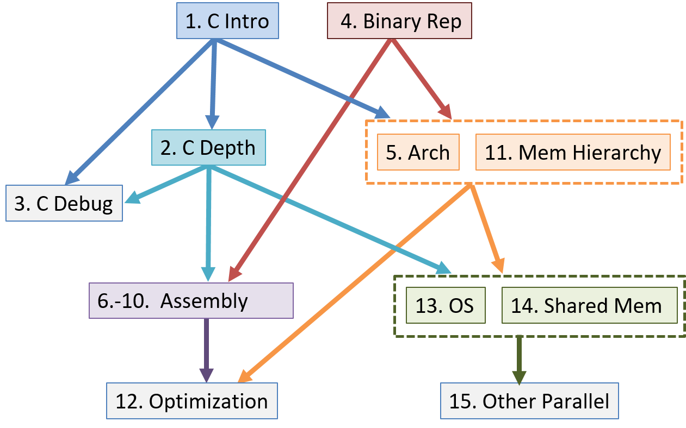

# Preface {#preface .page}

In today's world, much emphasis is placed on learning to code, and
programming is touted as a golden ticket to a successful life. Despite
all the code boot camps and programming being taught in elementary
schools, the computer itself is often treated as an
afterthought --- it's increasingly becoming invisible in the discussions
of raising the next generations of computer scientists.

The purpose of this book is to give readers a gentle yet accessible
introduction to computer systems. To write effective programs,
programmers must understand a computer's underlying subsystems and
architecture. However, the expense of modern textbooks often limits
their availability to the set of students that can afford them. This
free online textbook seeks to make computer systems concepts accessible
to everyone. It is targeted toward students with an introductory
knowledge of computer science who have some familiarity with Python. If
you're looking for a free book to introduce you to basic computing
principles in Python, we encourage you to read [*How To Think Like a
Computer Scientist with
Python*](https://runestone.academy/ns/books/published/thinkcspy/index.html)
first.

If you're ready to proceed, please come in --- the water is warm!

## What This Book Is About {#_what_this_book_is_about .discrete}

Our book is titled *Dive into Systems* and is meant to be a gentle
introduction to topics in computer systems, including C programming,
architecture fundamentals, assembly language, and multithreading. The
ocean metaphor is very fitting for computer systems. As modern life is
thought to have risen from the depths of the primordial ocean, so has
modern programming risen from the design and construction of early
computer architecture. The first programmers studied the hardware
diagrams of the first computers to create the first programs.

Yet as life (and computing) began to wander away from the oceans from
which they emerged, the ocean began to be perceived as a foreboding and
dangerous place, inhabited by monsters. Ancient navigators used to place
pictures of sea monsters and other mythical creatures in the uncharted
waters. *Here be dragons*, the text would warn. Likewise, as computing
has wandered ever further away from its machine-level origins, computer
systems topics have often emerged as personal dragons for many computing
students.

In writing this book, we hope to encourage students to take a gentle
dive into computer systems topics. Even though the sea may look like a
dark and dangerous place from above, there is a beautiful and remarkable
world to be discovered for those who choose to peer just below the
surface. So too can a student gain a greater appreciation for computing
by looking below the code and examining the architectural reef below.

We are not trying to throw you into the open ocean here. Our book
assumes only a CS1 knowledge and is designed to be a first exposure to
many computer systems topics. We cover topics such as C programming,
logic gates, binary, assembly, the memory hierarchy, threading, and
parallelism. Our chapters are written to be as independent as possible,
with the goal of being widely applicable to a broad range of courses.

Lastly, a major goal for us writing this book is for it to be freely
available. We want our book to be a living document, peer reviewed by
the computing community, and evolving as our field continues to evolve.
If you have feedback for us, please drop us a line. We would love to
hear from you!

## Ways to Use This Book {#_ways_to_use_this_book .discrete}

Our textbook covers a broad range of topics related to computer systems,
specifically targeting intermediate-level courses such as introduction
to computer systems or computer organization. It can also be used to
provide background reading for upper-level courses such as operating
systems, compilers, parallel and distributed computing, and computer
architecture.

This textbook is not designed to provide complete coverage of all
systems topics. It does not include advanced or full coverage of
operating systems, computer architecture, or parallel and distributed
computing topics, nor is it designed to be used in place of textbooks
devoted to advanced coverage of these topics in upper-level courses.
Instead, it focuses on introducing computer systems, common themes in
systems in the context of understanding how a computer runs a program,
and how to design programs to run efficiently on systems. The topic
coverage provides a common knowledge base and skill set for more
advanced study in systems topics.

Our book's topics can be viewed as a vertical slice through a computer.
At the lowest layer we discuss binary representation of programs and
circuits designed to store and execute programs, building up a simple
CPU from basic gates that can execute program instructions. At the next
layer we introduce the operating system, focusing on its support for
running programs and for managing computer hardware, particularly on the
mechanisms of implementing multiprogramming and virtual memory support.
At the highest layer, we present the C programming language and how it
maps to low-level code, how to design efficient code, compiler
optimizations, and parallel computing. A reader of the entire book will
gain a basic understanding of how a program written in C (and Pthreads)
executes on a computer and, based on this understanding, will know some
ways in which they can change the structure of their program to improve
its performance.

Although as a whole the book provides a vertical slice through the
computer, the book chapters are written as independently as possible so
that an instructor can mix and match chapters for their particular
needs. The chapter dependency graph is shown below, though individual
sections within chapters may not have as deep a dependency hierarchy as
the entire chapter.

### Summary of Chapter Topics {#_summary_of_chapter_topics .discrete}

-   Chapter 0, *Introduction*: Introduction to computer systems and some
    tips for reading this book.

-   Chapter 1, *Introduction to C Programming*: Covers C programming
    basics, including compiling and running C programs. We assume
    readers of this book have had an introduction to programming in some
    programming language. We compare example C syntax to Python syntax
    so that readers familiar with Python can see how they may translate.
    However, Python programming experience is not necessary for reading
    or understanding this chapter.

-   Chapter 2, *A Deeper Dive into C*: Covers most of the C language,
    notably pointers and dynamic memory. We also elaborate on topics
    from Chapter 1 in more detail and discuss some advanced C features.

-   Chapter 3, *C Debugging Tools*: Covers common C debugging tools (GDB
    and Valgrind) and illustrates how they can be used to debug a
    variety of applications.

-   Chapter 4, *Binary and Data Representation*: Covers encoding data
    into binary, binary representation of C types, arithmetic operations
    on binary data, and arithmetic overflow.

-   Chapter 5, *Gates, Circuits, and Computer Architecture*: Covers the
    von Neumann architecture from logic gates to the construction of a
    basic CPU. We characterize clock-driven execution and the stages of
    instruction execution though arithmetic, storage, and control
    circuits. We also briefly introduce pipelining, some modern
    architecture features, and a short history of computer architecture.

-   Chapters 6-10, *Assembly Programming*: Covers translating C into
    assembly code from basic arithmetic expressions to functions, the
    stack, and array and `struct` access. In three separate chapters we
    cover assembly from three different instruction set architectures:
    32-bit x86, 64-bit x86, and 64-bit ARM.

-   Chapter 11, *Storage and the Memory Hierarchy*: Covers storage
    devices, the memory hierarchy and its effects on program
    performance, locality, caching, and the Cachegrind profiling tool.

-   Chapter 12, *Code Optimization*: Covers compiler optimizations,
    designing programs with performance in mind, tips for code
    optimization, and quantitatively measuring a program's performance.

-   Chapter 13, *Operating Systems*: Covers core operating system
    abstractions and the mechanisms behind them. We primarily focus on
    processes, virtual memory, and interprocess communication (IPC).

-   Chapter 14, *Shared Memory Parallelism*: Covers multicore
    processors, threads and Pthreads programming, synchronization, race
    conditions, and deadlock. This chapter includes some advanced topics
    on measuring parallel performance (speed-up, efficiency, Amdahl's
    law), thread safety, and cache coherence.

-   Chapter 15, *Advanced Parallel Systems and Programming Models*:
    Introduces the basics of distributed memory systems and the Message
    Passing Interface (MPI), hardware accelerators and CUDA, and cloud
    computing and MapReduce.

### Example Uses of This Book {#_example_uses_of_this_book .discrete}

*Dive into Systems* can be used as a primary textbook for courses that
introduce computer systems topics, or individual chapters can be used to
provide background information in courses that cover topics in more
depth.

As examples from the authors\' two institutions, we have been using it
as the primary textbook for two different intermediate-level courses:

-   *Introduction To Computer Systems* at Swarthmore College. Chapter
    ordering: 4, 1 (some 3), 5, 6, 7, 10, 2 (more 3), 11, 13, 14.

-   *Computer Organization* at West Point. Chapter ordering: 1, 4, 2
    (some 3), 6, 7, 10, 11, 12, 13, 14, 15.

Additionally, we use individual chapters as background reading in many
of our upper-level courses, including:

+-----------------------------------+-----------------------------------+
| Upper-level Course Topic          | Chapters for Background Readings  |
+===================================+===================================+
| Architecture                      | 5, 11                             |
+-----------------------------------+-----------------------------------+
| Compilers                         | 6, 7, 8, 9, 10, 11, 12            |
+-----------------------------------+-----------------------------------+
| Database Systems                  | 11, 14, 15                        |
+-----------------------------------+-----------------------------------+
| Networking                        | 4, 13, 14                         |
+-----------------------------------+-----------------------------------+
| Operating Systems                 | 11, 13, 14                        |
+-----------------------------------+-----------------------------------+
| Parallel and Distributed Systems  | 11, 13, 14, 15                    |
+-----------------------------------+-----------------------------------+

Finally, Chapters 2 and 3 are used as C programming and debugging
references in many of our courses.

### Available Online {#_available_online .discrete}

The free online version of our textbook is available at
[https://diveintosystems.org/](https://diveintosystems.org/){.bare}.

